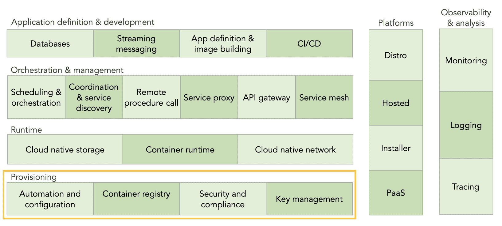
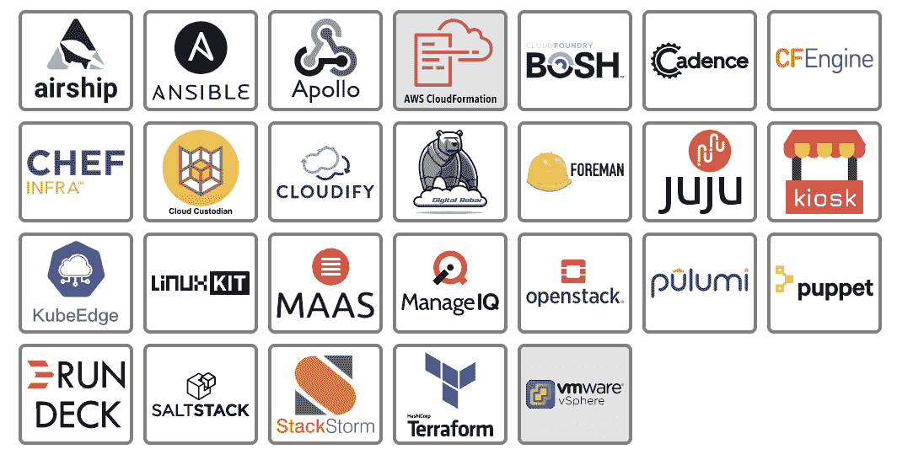
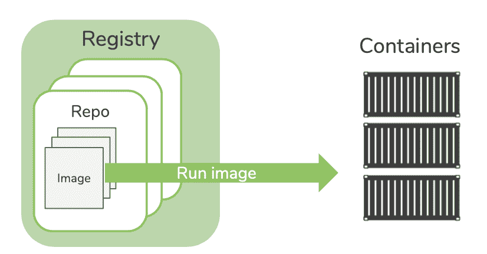
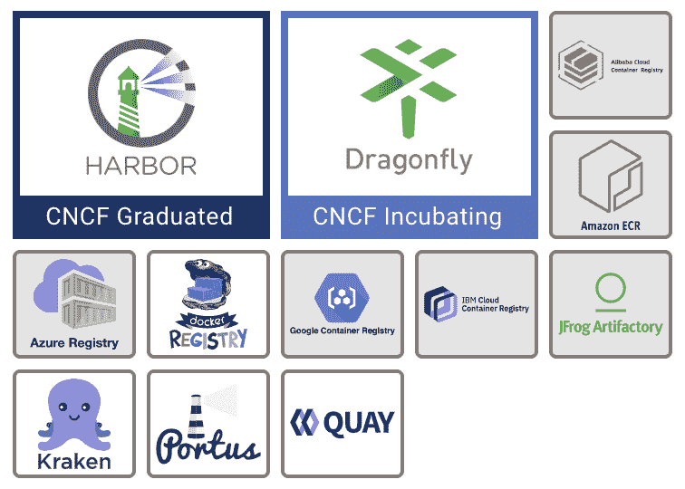
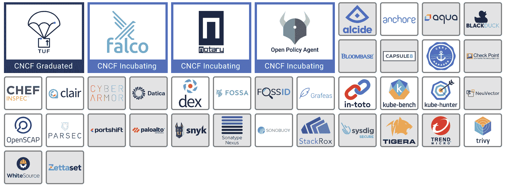
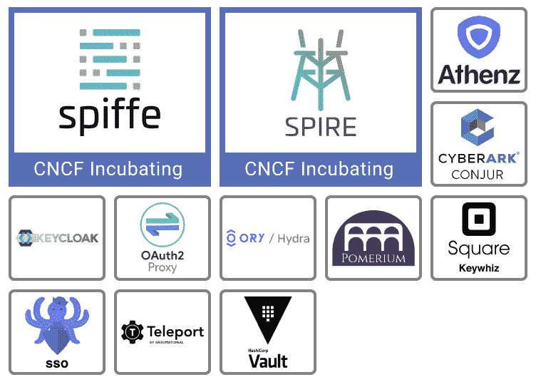

# 云原生环境:供应层解释

> 原文：<https://thenewstack.io/cloud-native/the-cloud-native-landscape-the-provisioning-layer-explained/>

*这篇文章是由[凯瑟琳·帕格尼尼](https://thenewstack.io/author/catherine-paganini/)和杰森·摩根正在进行的系列文章的一部分，重点解释云原生景观的每一个类别。他们都是 DC 库伯内特社区日和 DC 库伯内特聚会小组的共同组织者。*

 [凯瑟琳·帕格尼尼

凯瑟琳是 Linkerd 的创建者 buppy 的营销主管。作为一名营销领导者，Catherine 热衷于向业务领导者介绍新堆栈及其提供的关键灵活性。](https://www.linkedin.com/in/catherinepaganini/en/) 

在我们的[云原生环境](https://thenewstack.io/an-introduction-to-the-cloud-native-landscape/)介绍中，我们提供了[云原生计算基金会](https://www.cncf.io/)云原生生态系统的高级概述。本文是当时研究每一层的系列文章的第一篇。非技术读者将了解每个类别中的工具是什么，它们解决什么问题，以及它们如何解决问题。我们还为那些刚刚开始使用原生云的工程师增加了一个简短的技术 101 部分。

云原生环境的第一层是资源调配。这包括用于创建和强化构建云原生应用的基础的工具，包括如何自动创建、管理和配置基础架构，以及扫描、签名和存储容器映像。该层还通过工具扩展到安全性，这些工具可以设置和执行策略，将身份验证和授权内置到应用和平台中，以及处理机密分发。

### 边注

 [杰森·摩根

Jason Morgan 是 VMware 的解决方案工程师，专注于帮助客户构建和完善微服务平台。Jason 热衷于帮助其他人进行云原生之旅，他喜欢与更广泛的开发人员社区分享经验教训。](https://blog.59s.io/) 

当查看[云原生景观](https://landscape.cncf.io)时，您会注意到一些区别:

*   大框中的项目是 CNCF 主持的开源项目。有的还在孵化阶段(浅蓝色/紫色框)，有的是毕业项目(深蓝色框)。
*   小白框中的项目是开源项目。
*   灰色方框中的产品是专有产品。

请注意，即使在撰写本文期间，我们也看到新的项目成为 CNCF 的一部分，所以总是参考实际的景观——事情发展得很快！

好了，让我们来看看配置层的每个类别、它所扮演的角色，以及这些技术如何帮助应用适应新的云原生现实。

## 自动化和配置

### 事实真相

自动化和配置工具加快了计算资源(虚拟机、网络、防火墙规则、负载平衡器等)的创建和配置。).这些工具可以处理供应过程的不同部分，或者尝试端到端地控制一切。大多数都提供了与该领域其他项目和产品集成的能力。

### 它解决的问题

传统上，IT 流程依赖于冗长且劳动密集型的手动发布周期，通常在三到六个月之间。这些周期伴随着大量的人工流程和控制，减缓了生产环境的变化。这些缓慢的发布周期和静态环境与云原生开发不兼容。为了实现快速开发周期，基础设施必须在没有人工干预的情况下动态供应。

### 它有什么帮助

这类工具允许工程师在没有人工干预的情况下构建计算环境。通过对环境设置进行编码，只需点击一个按钮就可以再现。虽然手动设置容易出错，但是一旦被编码，环境创建就与期望的状态完全匹配——这是一个巨大的优势。

虽然工具可能采用不同的方法，但它们都旨在通过自动化减少资源调配所需的工作。

### 技术 101

随着我们从旧式的人工驱动的配置转向云所需的新的按需扩展模式，我们发现我们以前使用的模式和工具不再满足我们的需求。您的组织无法负担维护大量 24×7 员工的费用，他们的工作是创建、配置和管理服务器。Terraform 等自动化工具减少了扩展数十台服务器和相关网络以及数百条防火墙规则所需的工作量。Puppet、Chef 和 Ansible 等工具在这些新服务器和应用程序启动时以编程方式提供和/或配置它们，并允许开发人员使用它们。

一些工具直接与 AWS 或 vSphere 等平台提供的基础设施 API 进行交互，而其他工具则专注于配置单个机器，使它们成为 Kubernetes 集群的一部分。许多工具，如 Chef 和 Terraform，可以通过互操作来提供和配置环境。其他工具，如 OpenStack，提供其他工具可以使用的基础设施即服务(IaaS)环境。从根本上说，在为 Kubernetes 集群奠定计算环境、CPU、内存、存储和网络的过程中，您需要一个或多个工具。您还需要其中的一部分来创建和管理 Kubernetes 集群本身。

在撰写本文时，这个领域有三个 CNCF 项目:KubeEdge，一个沙盒 CNCF 项目，以及 Kubespray 和 Kops(后两个是 Kubernetes 的子项目，因此属于 CNCF，尽管它们尚未在景观中列出)。这一类别中的大多数工具都提供开源和付费版本。

## 集装箱登记处

### 事实真相

在定义容器注册中心之前，让我们首先讨论三个紧密相关的概念:

1.  容器是一组用于执行流程的计算约束。容器中启动的进程被欺骗，以为它们运行在自己的专用计算机上，而不是与其他进程共享的机器上(类似于虚拟机)。简而言之，无论代码在哪里，容器都允许您以受控的方式运行代码。
2.  映像是运行容器及其流程所需的一组归档文件。你可以把它看作是一种模板，你可以在上面创建无限数量的容器。
3.  存储库，或简称为 repo，是一个存储图像的空间。

回到集装箱登记处。容器注册中心是专门用于分类和存储存储库的 web 应用程序。

总之，图像包含执行程序(在容器中)所需的信息，并存储在存储库中，存储库又在注册表中进行分类和分组。构建、运行和管理容器的工具需要访问这些映像。通过引用注册表(访问映像的路径)来提供访问。

### 它解决的问题

云原生应用被打包并作为容器运行。容器注册表存储并提供这些容器映像。

### 它有什么帮助

通过将所有容器图像集中存储在一个地方，任何开发该应用程序的开发人员都可以轻松访问它们。

### 技术 101

容器注册工具既可以存储和分发图像，也可以以某种方式增强现有的注册。从根本上说，注册表是一种 web API，它允许容器引擎存储和检索图像。许多提供了允许容器扫描或签名工具的接口，以增强它们存储的图像的安全性。有些专门以特别有效的方式分发或复制图像。任何使用容器的环境都需要使用一个或多个注册中心。

这一领域的工具可以提供扫描、签名和检查它们存储的图像的集成。在撰写本文时，蜻蜓和港湾是 CNCF 的项目，港湾最近获得了第一个符合 OCI 标准的注册地的荣誉。每个主要的云提供商都提供自己的托管注册中心，许多其他注册中心可以独立部署，或者通过 Helm 等工具直接部署到您的 Kubernetes 集群中。

## 安全性和合规性

### 事实真相

云原生应用程序旨在快速迭代。想想你的 iPhone 应用程序不断得到更新——它们每天都在发展，可能会变得更好。为了定期发布代码，我们必须确保我们的代码和操作环境是安全的，并且只有授权的工程师才能访问。本节中的工具和项目代表了以安全的方式创建和运行现代应用程序所需的一些东西。

### 它解决的问题

这些工具和项目帮助您强化、监控和实施平台和应用程序的安全性。从容器到您的 Kubernetes 环境，它们使您能够设置策略(用于合规性)，深入了解现有漏洞，捕捉错误配置，并强化容器和集群。

### 它有什么帮助

为了安全地运行容器，必须对它们进行已知漏洞的扫描和签名，以确保它们没有被篡改。Kubernetes 本身默认了非常宽松的访问控制设置，这些设置不适合生产使用。此外，Kubernetes 集群对任何想要攻击您的系统的人来说都是一个有吸引力的目标。这个领域中的工具和项目有助于强化集群，并提供工具来检测系统何时表现异常。

### 技术 101

为了在动态和快速发展的环境中安全运行，我们必须将安全性视为平台和应用程序开发生命周期的一部分。这一领域的工具种类繁多，试图解决问题的不同部分。大多数工具属于以下类别之一:

*   审计和合规
*   生产强化工具之路
    *   代码扫描
    *   漏洞扫描
    *   图像签名
*   策略创建和实施
*   网络层安全

其中一些工具和项目很少被直接使用，比如 Trivy、Claire 和公证人，它们被注册中心或其他扫描工具所利用。其他是现代应用平台的关键加固组件，如 Falco 或开放策略代理(OPA)。

有许多成熟的供应商在这个领域提供解决方案，也有创业公司明确地将 Kubernetes 原生框架推向市场。在撰写本文时，Falco、公证人/TUF 和 OPA 是该领域仅有的 CNCF 项目。

## 密钥(和身份)管理

### 事实真相

在我们进入密钥管理之前，让我们首先定义加密密钥。密钥是用于加密或签名数据的字符串。像物理密钥一样，它锁定(加密)数据，因此只有拥有正确密钥的人才能解锁(解密)。

随着应用程序和操作适应新的云原生世界，安全工具也在不断发展以满足新的安全需求。这一类别中的工具和项目涵盖了从如何安全地存储密码和其他秘密(敏感数据，如 API 密钥、加密密钥等)的所有内容。)如何从您的微服务环境中安全地消除密码和秘密。

### 它解决的问题

云原生环境是高度动态的，需要按需、完全程序化(无人参与)和自动化的秘密分发。应用程序还必须知道给定的请求是否来自有效的来源(身份验证)，以及该请求是否有权做它试图做的任何事情(授权)。这通常被称为 AuthN 和 AuthZ。

### 它有什么帮助

每个工具或项目采用不同的方法，但它们都提供了一种安全地分发秘密和密钥的方法，或者它们提供了一种与身份验证、授权或两者相关的服务或规范。

### 技术 101

这一类别的工具可以分为两组:一些工具侧重于密钥生成、存储、管理和轮换，另一组侧重于单点登录和身份管理。例如，Vault 是一个相当通用的密钥管理工具，允许您管理不同类型的密钥。另一方面，Keycloak 是一个身份代理，可用于管理不同服务的访问密钥。

在撰写本文时，SPIFFE/SPIRE 是这个领域中唯一的 CNCF 项目，大多数工具都提供开源和付费版本。

正如我们所见，供应层侧重于构建您的云原生平台和应用的基础，使用工具处理从基础架构供应到容器注册再到安全性的一切。这篇文章旨在成为详细介绍云原生环境的系列文章的第一篇。在下一篇文章中，我们将关注运行时层，并探索云原生存储、容器运行时和网络。

非常感谢来自 CNCF 的 Ihor Dvoretskyi 审阅了这篇文章，确保了它的准确性。此外，非常感谢[奥列格·楚尼金](https://www.linkedin.com/in/olegch/)在这个项目早期的所有投入。

云计算原生计算基金会是新堆栈的赞助商。

来自 Pixabay 的 torstensimon 的特征图像。

<svg xmlns:xlink="http://www.w3.org/1999/xlink" viewBox="0 0 68 31" version="1.1"><title>Group</title> <desc>Created with Sketch.</desc></svg>