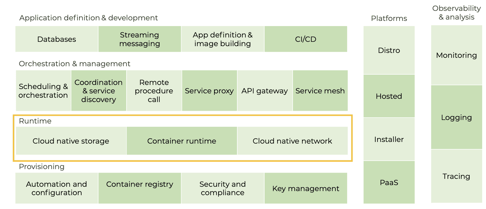
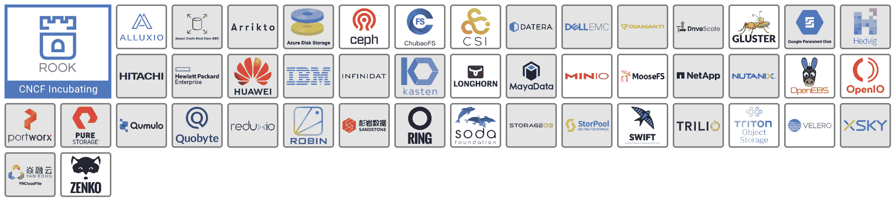
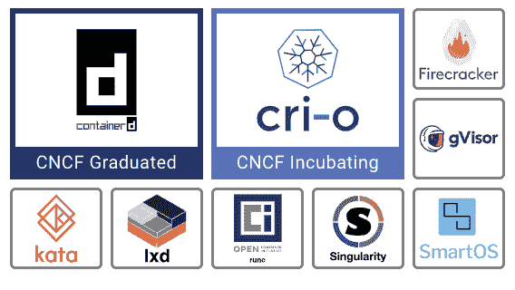
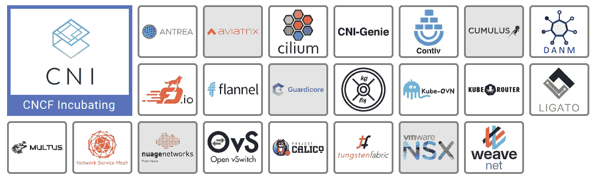

# 云原生景观:运行时层解释

> 原文：<https://thenewstack.io/cloud-native/the-cloud-native-landscape-the-runtime-layer-explained/>

*这篇文章是正在进行的系列文章的一部分，该系列文章来自**Catherine Paganini**和*[*Jason mor gan*](https://thenewstack.io/author/jason-morgan/)*，重点向非技术观众以及刚刚开始使用云原生技术的工程师解释云原生环境的每个类别。*

 [杰森·摩根

Jason Morgan 是 VMware 的解决方案工程师，专注于帮助客户构建和完善微服务平台。Jason 热衷于帮助其他人进行云原生之旅，他喜欢与更广泛的开发人员社区分享经验教训。](https://blog.59s.io/) 

在我们的上一篇文章中，我们探讨了云原生计算基金会的云原生环境 的 [供应层，它侧重于构建您的云原生平台和应用的基础。本文聚焦于运行时层，它包含了容器在云本地环境中运行所需的一切。这意味着用于启动容器的代码，称为运行时引擎；使持久存储对容器可用的工具；以及管理容器环境网络的那些。](https://thenewstack.io/the-cloud-native-landscape-the-provisioning-layer-explained/)

但是请注意，这些资源不应该与基础设施和配置层处理的网络和存储工作相混淆，后者负责让容器平台运行起来。容器直接使用这一类别的工具来启动/停止、存储数据和相互通信。

**边注**

 [凯瑟琳·帕格尼尼

凯瑟琳是 Linkerd 的创建者 buppy 的营销主管。作为一名营销领导者，Catherine 热衷于向业务领导者介绍新堆栈及其提供的关键灵活性。](https://www.linkedin.com/in/catherinepaganini/en/) 

当看着 [C 喧闹的本土景观时，你会注意到几个区别:](https://landscape.cncf.io)

*   大框中的项目是 CNCF 主持的开源项目。有的还在孵化阶段(浅蓝色/紫色框)，有的是毕业项目(深蓝色框)。
*   小白框中的项目是开源项目。
*   **灰色方框中的产品/项目**是专有的。

请注意，即使在撰写本文期间，我们也看到新的项目成为 CNCF 的一部分，所以总是参考实际的景观——事情发展得很快！

## 云原生存储

### 事实真相

存储是存储应用程序的永久数据的地方，通常称为永久卷。轻松访问对于应用程序的可靠运行至关重要。一般来说，当我们说持久数据时，我们指的是存储数据库、消息或任何其他我们希望确保在应用程序重启时不会消失的信息。

### 它解决的问题

云原生架构是流动的、灵活的和有弹性的，使得在重启之间持久存储数据具有挑战性。为了扩大和缩小规模或自我修复，不断创建和删除容器化的应用程序，并随着时间的推移改变物理位置。因此，必须以独立于节点的方式提供云原生存储。然而，要存储数据，你需要硬件——具体来说是磁盘——而磁盘就像任何其他硬件一样，是受基础设施限制的。这是第一个大挑战。

此外，数据中心之间的实际存储接口可能会发生显著变化(在旧世界中，每个基础架构都有自己的存储解决方案和自己的接口)，这使得可移植性变得非常困难。最后，要从云的弹性中获益，必须以自动化方式调配存储，因为手动调配和自动扩展不兼容。

云原生存储是为这种新的云原生现实量身定制的。

### 它有什么帮助

此类别的工具有助于 a)为容器提供云本地存储选项，b)标准化容器和存储提供商之间的接口，或者 c)通过备份和恢复操作提供数据保护。前者是指使用云原生兼容容器存储接口(即第二类工具)的存储，可以自动供应，通过消除人力瓶颈实现自动扩展和自我修复。

### 技术 101

容器存储接口(CSI)在很大程度上使云原生存储成为可能，CSI 允许标准 API 向容器提供文件和块存储。这一领域有许多工具，包括开源工具和供应商提供的工具，它们利用 CSI 为容器提供按需存储。除了这一极其重要的功能，我们还有许多其他工具和技术，旨在解决云原生空间中的存储问题。Minio 是一个受欢迎的项目，它为对象存储提供了一个 S3 兼容的 API。Velero 等工具有助于简化备份和恢复 Kubernetes 集群本身以及应用程序使用的持久数据的过程。

## 容器运行时

### 事实真相

正如在 [供应层文章](https://thenewstack.io/the-cloud-native-landscape-the-provisioning-layer-explained/) 中所讨论的，容器是一组**计算约束**，用于执行(这是启动的技术术语)应用。容器化的应用程序认为它们运行在自己的专用计算机上，并不知道它们正在与其他进程共享资源(类似于虚拟机)。

容器*运行时*是执行容器化(或“受限”)应用的软件。没有运行时，您只有容器映像，即指定容器化的应用程序应该是什么样子的文件。运行时将在容器中启动一个应用程序，并为它提供所需的资源。

### 它解决的问题

容器映像(包含应用程序规范的文件)必须以标准化、安全和隔离的方式启动。**标准化**因为无论在哪里运行，你都需要标准的操作规则。**安全**，嗯，因为你不希望任何不应该访问它的人这样做。而**隔离**是因为你不希望这个应用程序影响其他应用程序或者被其他应用程序影响(例如，如果一个位于同一位置的应用程序崩溃)。隔离的基本功能是保护。此外，必须为应用程序提供资源，从 CPU 到存储再到内存。

### 它有什么帮助

容器运行时完成所有这些工作。它以标准化的方式在所有环境中启动应用程序，并设置安全边界。后者是这些工具的不同之处。像 CRI-O 或 gVisor 这样的运行时强化了它们的安全边界。运行时还为容器设置资源限制。如果没有它，应用程序可能会根据需要消耗资源，可能会从其他应用程序那里夺走资源，因此您总是需要设置限制。

### 技术 101

并非所有这类工具都生来平等。Containerd(著名的 Docker 产品的一部分)和 CRI-O 是标准的容器运行时实现。还有一些工具可以将容器的使用扩展到其他技术，比如 Kata，它允许您将容器作为虚拟机运行。其他的目标是解决一个特定的容器相关的问题，比如 gVisor，它在容器和操作系统之间提供了一个额外的安全层。

## 云本地网络

### 事实真相

容器通过云本地网络相互通信，并与基础设施层通信。 [分布式应用](https://thenewstack.io/primer-distributed-systems-and-cloud-native-computing/) 有多个组件，这些组件将网络用于不同的目的。  此类工具在现有网络之上覆盖一个虚拟网络，专门用于应用程序通信，称为*覆盖*网络。

### 它解决的问题

虽然通常将运行在容器中的代码称为应用程序，但事实是大多数容器只拥有大型应用程序的一小部分特定功能。现代应用程序，如网飞或 Gmail，实际上是由许多这样的小组件组成的，每个组件都运行在自己的容器中。为了让所有这些独立的部分作为一个内聚的应用程序发挥作用，容器需要彼此私下通信。此类工具提供了专用的通信网络。

此外，在这些容器之间交换的消息可能是私人的、敏感的或极其重要的。这导致了额外的需求，例如为各种组件提供隔离，以及检查流量以识别网络问题的能力。在某些使用案例中，您可能希望扩展这些网络和网络策略(例如防火墙和访问规则)，以便您的应用程序可以连接到在我们的容器网络外部运行的虚拟机或服务。

### 它有什么帮助

此类别的项目和产品使用 CNCF 项目-集装箱网络接口(CNI)为集装箱化的应用程序提供网络功能。有些工具，比如法兰绒，非常简洁，只提供了到容器的基本连接。其他产品，如 NSX-T，提供了一个完整的软件定义的网络层，为每个 Kubernetes 命名空间创建一个隔离的虚拟网络。

至少，容器网络需要为 pods 分配 IP 地址(Kubernetes 中容器化的应用程序就是在 pods 中运行的)，这允许其他进程访问它。

### 技术 101

与存储类似，这一领域的多样性和创新在很大程度上是由 CNCF 项目 CNI(容器网络接口)实现的，该项目标准化了网络层如何向 pod 提供功能。  为您的 Kubernetes 环境选择合适的容器网络至关重要，您已经有了许多工具可供选择。Weave Net、Antrea、Calico 和法兰绒都提供了有效的开源网络层。它们的功能千差万别，您的选择最终应取决于您的具体需求。

此外，  许多供应商已经准备好使用软件定义的网络(SDN)工具来支持和扩展您的 Kubernetes 网络，这些工具允许您获得对网络流量的更多见解，实施网络策略，甚至将您的容器网络和策略扩展到您更广泛的数据中心。

我们对运行时层的概述到此结束，运行时层提供了在云本地环境中运行所需的所有工具容器。从让应用程序能够轻松快速地访问可靠运行所需数据的存储，到执行应用程序代码的容器运行时，再到容器化应用程序进行通信的网络。在我们的下一篇文章中，我们将关注编排和管理层，它处理如何将所有这些容器化的应用作为一个组来管理。

*一如既往，非常特别地感谢来自 CNCF 的 [Ihor Dvoretskyi](https://www.linkedin.com/in/idvoretskyi/) ，他审核了这篇文章，确保了它的准确性。*

云计算原生计算基金会和 VMware 是新体系的赞助商。

来自 Pixabay 的 Candid _ Shots 的特写图像。

<svg xmlns:xlink="http://www.w3.org/1999/xlink" viewBox="0 0 68 31" version="1.1"><title>Group</title> <desc>Created with Sketch.</desc></svg>