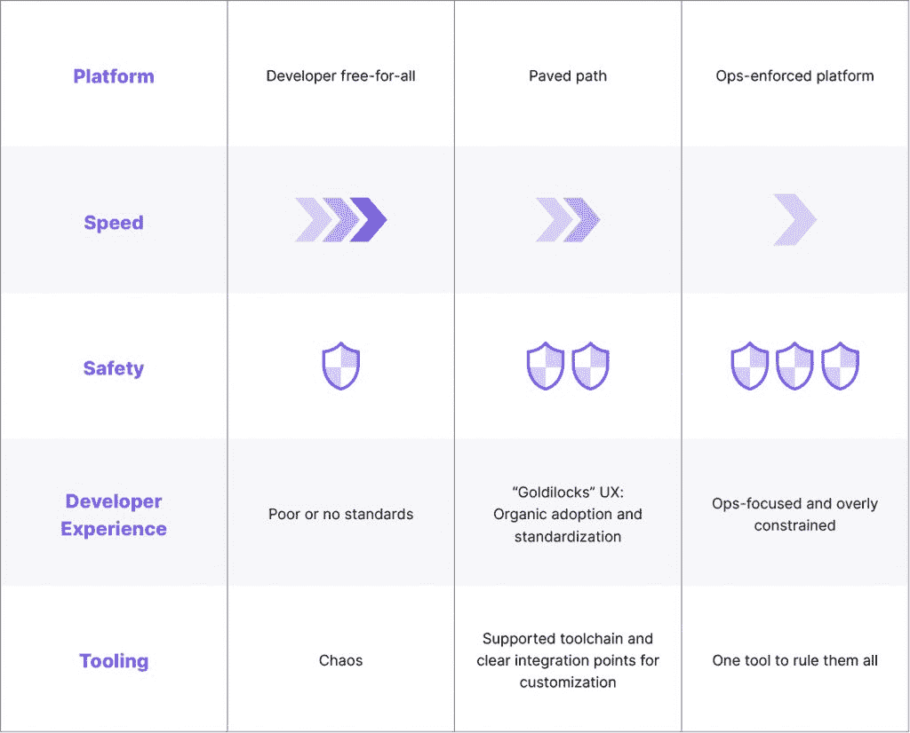

# 云原生“铺路”开发人员体验

> 原文：<https://thenewstack.io/the-cloud-native-paved-path-developer-experience/>

 [丹尼尔·布莱恩特

丹尼尔是大使实验室(前身为 Datawire)的开发者关系总监。Daniel 是一名 Java 拥护者，是 TechBeacon DevOps 100 的影响者，并为几个开源项目做出了贡献。](https://www.linkedin.com/in/danielbryantuk/) 

这是三部分系列的第一部分。

我们认为，云原生软件开发已经永远改变了开发者的体验。尽管值得注意的是:新的开发者体验并不是铁板一块。有多少云原生工具就有多少不同的开发者体验。

我们假设影响开发者体验的更广泛趋势是“[左移](https://www.getambassador.io/developer-control-planes/developer-control-planes-a-platform-architects-point-of-view/)”方法。这就把更多的所有权和责任直接交给了开发人员。随着越来越多的组织转向云本地，现实比开发人员责任的全有或全无更加微妙，需要承认所有权有等级之分。

本文是由三部分组成的系列文章的第一部分，该系列文章介绍了与云原生思想领袖的讨论。它深入探讨了云原生技术在不同组织中的独特发展路径，并研究了每个组织如何在完全的开发人员所有权和在云原生生态系统中提供一条自以为是的“铺设”路径之间找到“最佳平衡点”。

## 平衡自由和责任:甜蜜点在哪里？

云原生环境充满了数量惊人且不断增长的工具、平台和方法来实现开发目标。虽然 Kubernetes 作为默认的编排系统似乎占主导地位，但对于工具来说却不是这样。因此，每个组织中的开发人员能够或者应该承担整个生命周期责任的想法，如果不是不负责任的话，也是不切实际的。

现实更加模糊，很大程度上取决于组织文化、业务目标和公司的云成熟度。这些不太技术性的因素影响了开发人员在工作中体验到的不同层次的自由和责任。

技术咨询公司 OpenCredo 的首席执行官/首席技术官 Nicki Watt 解释说:“一些组织的成立是为了让开发者能够承担他们想要的一切；其他人是孤立的，更喜欢“包含”开发人员，确保没有偏差，没有偏离轨道。无论开发人员拥有完全的自由来拥有整个软件生命周期，还是受到组织或平台限制的更多约束，开发人员能够承担越来越多的责任，这将有助于开发更好的软件和更好的团队。”

云原生领域的领导者，如 [Lunar 的 Kasper Nissen](https://www.getambassador.io/developer-control-planes/developer-control-planes-a-platform-architects-point-of-view/) 、 [CartaX 的 Mario Loria](https://www.getambassador.io/developer-control-plane/dcp-insights-mario-loria-from-cartax/) 和 [Apple 的 Cheryl Hung](https://www.getambassador.io/developer-control-plane/dcp-insights-cheryl-hung/) 反映了这些想法，基于他们自己在生产中使用云技术的经验。提供清晰的护栏，或者一条固执己见的“铺平的道路”，促进了责任和自由。也就是说，一个开发人员明白走这条铺好的路将帮助他们交付组织期望的东西，并且可以提供一个稳定的[控制平面](https://thenewstack.io/from-kubernetes-to-paas-to-developer-control-planes/)，他们可以随时返回。与此同时，许多组织提供这个抽象层作为起点，鼓励开发人员拥抱探索铺设路径之外的自由，只要他们也对结果承担责任。

开发人员的职责范围

## 依赖性和结果:开发人员最了解吗？

术语“开发者责任”在实践中真正意味着什么？即使如我们所争论的那样，向左移动使开发人员成为编码、运输和运行软件的驱动者，这实际上并不意味着开发人员在生命周期的每个阶段都“按下按钮”。相反，它更多的是定义谁对每一步负责，以及采取的每一步会产生什么后果？(提示:无论开发人员承担多少所有权，都不会总是开发人员。)

Cloud luminary， [Kelsey Hightower](https://www.getambassador.io/developer-control-plane/developer-control-planes-a-cloud-leaders-point-of-view/) ，在被问及开发者的责任时澄清了这一想法。他解释说，有时候只有开发人员才知道他们需要什么依赖。可能只有开发人员能够解决这些依赖性，因为他们对可能的结果有更清晰的认识。但是这并没有把所有的责任都推给开发者。

“如果你是开发者，你将对你添加到混合物中的‘成分’承担一些责任。你将被要求理解和回答你所做的一些选择，”凯尔西说。"但是除了开发者，每个人都需要意识到他们在管道中的责任."

开发人员负责的范围总是有限制的。凯尔西继续强调依赖性，例如安全问题或违反公司政策的问题。也就是说，这些问题超出了软件开发人员的权限，但这并不能免除开发人员的责任。这仅仅意味着他们应该能够解释他们编码的软件中实际存在的东西。这也正以[软件材料清单(sbom)](https://en.wikipedia.org/wiki/Software_bill_of_materials)的形式走向一条自己铺设好的道路。

## 总结:铺好的路是成熟的标志

在没有工作流和工具标准化的情况下，云原生开发人员不需要特立独行，自己解决所有问题。如果更快地交付软件的云原生承诺完全实现，开发人员的体验需要松散地成形，以减少摩擦，并实现对代码、其依赖性、源代码控制、服务所有权等的清晰可见性。以通用平台的形式为开发人员铺平道路，创造了一致性、可预测性和透明性，将开发人员体验和组织提升到云原生成熟度的下一个级别。最终，这一新水平为在不断变化的云原生生态系统中茁壮成长的更具生产力的工程团队创造了条件。

<svg xmlns:xlink="http://www.w3.org/1999/xlink" viewBox="0 0 68 31" version="1.1"><title>Group</title> <desc>Created with Sketch.</desc></svg>