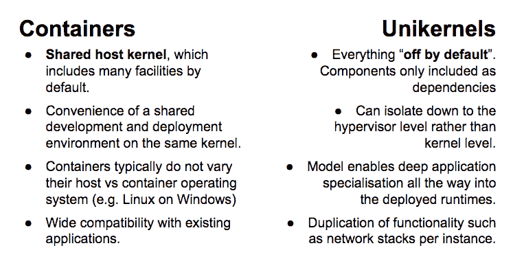

# TNS 制造商:单核和容器的比较和背景

> 原文：<https://thenewstack.io/the-comparison-and-context-of-unikernels-and-containers/>

关于单核的讨论开始有了势头。尽管如此，对于这种实现了传统操作系统最少功能的技术来说，现在还为时尚早。它的功能是我们上个月在 Citrix 的 Russell Pavlicek 的文章中讨论的一个话题。正如 Pavlicek 所写的，单核实现了传统操作系统功能的最少部分——仅够支持它所支持的应用程序。

它们去掉了标准操作系统的大部分功能。它们还减少了攻击面，因为它们可以随时打开和关闭，并且与操作系统本身分离，除了与应用程序代码一起编译成单个可执行文件的功能。该可执行文件包含工作负载在虚拟机管理程序上运行所需的内容。

> 结果是更小的有效载荷，可以快速、高密度地部署，并且大大改善了安全性。

在 ContainerCon 上，我们在由 New Stack 的创始人 Alex Williams 主持的一次会议上讨论了与容器相关的单内核主题。在小组中发言的有 Docker 的杰罗姆·佩塔佐尼；亚当·威克，研发公司 Galois 研究主管；思杰 XenServer 技术主管詹姆斯·布尔平(James Bulpin)；剑桥大学教授 Anil Madhavapeddy 和 Rump Kernels 的 Martin Lucina。

[ContainerCon 面板:单核和容器如何关联、区分和重叠](https://thenewstack.simplecast.com/episodes/containercon-panel-how-unikernels-and-containers-relate-differentiate-and-overlap)

小组讨论了几个问题，例如:

*   单核是相关的、独立的还是重叠的？
*   它们各自为开发者提供了什么独特的价值？
*   unikernels 在容器故事中处于什么位置？
*   部署 unikernels 需要什么编程语言？

下面我们来看看讨论过的相似之处和不同之处:

该小组研究了单核生态系统中的不同选择:

小组成员在小组讨论之前的讨论中确定了一些挑战:

*   调试/记录与操作工具的集成。
*   对易于使用的 Docker 式构建前端的需求。
*   持续部署和流程编排引擎。

随着容器技术随着 Docker 1.8 的发布而继续向前发展，unikernels 脱颖而出，成为构建轻量级应用程序的一种方式，这些应用程序具有依赖关系，可以根据项目的需要进行分解、重组或拆分成更多的独立进程。

伽罗瓦从一个核心操作系统设计的客户那里带来了一个 R&D 项目，该项目将单核作为一种快速重构程序同时避免瓶颈的方法。Wick 谈到了另一个例子，在这个例子中，unikernels 是一个解决方案，它允许客户在笔记本电脑上使用 [Xen](http://www.xenproject.org/) ，通过在一个轻量级和安全的应用程序中将网络流量重新路由到 IPsec 隧道，在他们的安全设施中运行 Windows。

基于开发人员创建应用程序的需要，单核还允许混合和匹配的灵活性。Rump 内核的构建是为了在尽可能重用现有代码的同时完成最大量的工作。Unikernels 解决了当前围绕容器发生的安全问题，它能够使应用程序健壮，同时还具有管理程序的安全性，而不会消耗系统资源。

## 比较单核和容器

容器和 uni kernel 是类似的技术，uni kernel 被描述为“节食中的 Docker 容器”。通过将 uni kernel 引入 Docker，这将允许更多的开发团队使用它们，并更加熟悉这项技术，正如 Docker 和使用 uni kernel 所发生的那样。Rump 内核被用作测试和 QA 框架，维护和生产质量，KVM 支持以及裸机支持。容器和单核实现了同样的目标，隔离进程和代码来单独运行它。小组成员 Martin Lucina 在小组讨论中强调了 Rump kernels 与其他人之间的一个主要差异，他说:

> “关于 Rump 内核，我们需要知道的是，要用最少的 ucode 完成最多的工作，并尽可能多地重用现有代码。”

如果您正在构建任务关键型系统，那么单核让开发人员可以明确控制他们应用程序的核心安全领域。开发人员可以在使用 unikernels 时选择输出结果。相比之下，Docker 容器默认启用了运行所需的一切。在 unikernels 中，许多特性在默认情况下是关闭的，这意味着项目团队有更多的初始设置和选择。一旦做出这些选择，结果就是有弹性的新堆栈，它们是安全的，同时还可以根据项目的需要进行定制。

## 现代开发环境中的单核

第一代云侧重于编排:如何利用现有的工作负载并使其敏捷。这很有道理。在云出现之前，我们已经拥有了功能齐全的复杂应用程序堆栈；我们只需要让这些应用适应新的云世界。专题小组成员 Adam Wick 提供了一个例子，说明了在现代开发环境中，uni kernel 将在何处大放异彩，这是为了帮助那些正在努力寻找在管道中应用 uni kernel 的人:

> “网络保护服务、网络路由或软件定义的网络是单核的绝佳选择。如果你问自己一个是不是很棒，100 个会不会更好，那么单核可能是一个很好的选择，因为你可以很容易地运行 100 个。”

然而，下一代云需要创建高效、快速和安全的工作负载。当前的工作负载使用完整的机器映像，从具有支持库和实用程序的通用操作系统到应用层。它们占用大量内存，仅在操作系统级别上就可以使用千兆字节的磁盘空间，并且启动可能需要几分钟。它们也遭受潜在的大面积攻击，因为带有实用程序的完整操作系统层可能是恶意黑客在您的 IT 花园中种植杂草的沃土。

<svg xmlns:xlink="http://www.w3.org/1999/xlink" viewBox="0 0 68 31" version="1.1"><title>Group</title> <desc>Created with Sketch.</desc></svg>