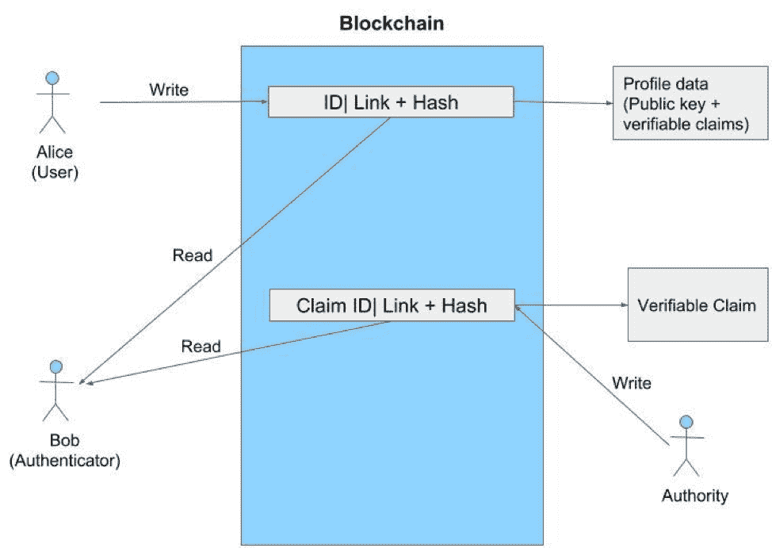

# 区块链应用开发的核心运营

> 原文：<https://thenewstack.io/the-core-operations-underlying-blockchain-app-development/>

[WSO2](https://wso2.com/) 赞助本帖。

 [米尤鲁·达亚拉特纳

Miyuru 是 WSO2 的高级技术主管。他是一名计算机科学家，在流处理、图形数据管理和挖掘、云计算、性能工程和物联网方面有着多个研究兴趣和贡献。他还是斯里兰卡 Moratuwa 大学计算机科学与工程系的顾问。他在著名的国际期刊和会议上发表了技术论文，并组织了几次关于高性能图形数据管理和处理的国际研讨会。](https://wso2.com/about/team/miyuru-dayarathna/) 

区块链是区块的链接列表(即链)，提供不可变的、仅附加的和共享的数据存储。除此之外，区块链[支持去中心化](https://dl.acm.org/citation.cfm?id=3282312)和[分布式共识协议](https://medium.com/s/story/lets-take-a-crack-at-understanding-distributed-consensus-dad23d0dc95)，用于事务数据共享的共享状态的历史日志。区块链还支持需要[篡改证据](https://malcoded.com/posts/storing-data-blockchain/)和透明性的应用。

在本文中，我们介绍了一组强调区块链架构模式实现的基本操作(即核心操作)。我们的概述和分析基于 30 多个不同的使用案例。我们还将分散式应用程序分为四种关键架构模式[称为身份和访问管理(IAM)、可审计历史或工作空间、注册或市场；和管理事物。](https://github.com/wso2/ETAC/blob/master/outlooks/blockchain4integration_outlook.md)

我们首先描述支持设计和开发区块链架构模式的核心操作。然后我们列出一系列区块链架构模式，并详细展示这些核心操作是如何组成那些区块链架构模式的。

### 这篇文章的要点是:

*   随着区块链技术的普及，去中心化应用越来越受到关注；
*   许多区块链的分散式应用程序可以使用四种架构模式创建；
*   每个架构模式都可以使用四个核心操作组成:添加记录、登录、共享密钥和智能契约；
*   核心操作不需要在区块链内部实现，而是可以在应用程序逻辑和区块链之间混合实现；
*   区块链应用程序的非功能性应用程序要求，如系统性能、安全性等。取决于这些核心操作是如何实现的。

## 区块链的核心业务

首先，我们将描述开发区块链应用程序的四个核心操作。我们按复杂程度递增的顺序列出这些操作。

## 1.向区块链添加记录

最简单的核心操作，“向区块链添加记录”向区块链添加了一个新条目。在区块链中，每个块都包含数据、数据的哈希和前一个块的哈希。一旦创建了一个块，就会生成一个散列。向区块链中添加记录只是意味着向分布式分类帐中添加一条新记录。这涉及到做两件事。首先，我们需要收集和验证存储在块中的信息(例如，事务)。这可以通过检查是否有足够的资金用于将记录添加到区块链来容易地完成。其次，我们需要解决一个被称为工作证明的加密难题，它将新创建的(即挖掘的)区块链接到现有区块链的尾部。

## 2.登录(质询-响应协议)

登录是分布式应用程序的第二个核心操作。登录要求试图进入系统的人证明他们是他们所声称的那个人。这是通过一种称为零知识证明(也称为挑战-响应协议)的技术实现的。当在一个区块链中实现[零知识证明](http://people.csail.mit.edu/silvio/Selected%20Scientific%20Papers/Proof%20Systems/The_Knowledge_Complexity_Of_Interactive_Proof_Systems.pdf)时，这个人的[分散标识符(DID)](https://w3c-ccg.github.io/did-spec/) 被保存在区块链中。此人通过从 DID 向区块链提供信息(如电子邮件地址)来声称他或她是 DID 列出的人。例如，在区块链的一个[安全](https://medium.com/@miyurud/challenge-response-protocol-based-authentication-with-blockchains-2935bf6c53d4) [聊天应用](https://medium.com/@miyurud/challenge-response-protocol-based-authentication-with-blockchains-2935bf6c53d4)中，用户通过他们的电子邮件地址和一个他们必须选择以完成该过程的私钥来识别。但是，请注意，在执行质询-响应协议期间，应用程序从不将私钥发送到浏览器之外。


图 1:基于区块链的聊天应用(a)登录界面(b)聊天界面。

一旦用户单击提交按钮，就会发生下图所示的过程。如果用户在浏览器中选择的私钥能够解密通过芭蕾舞演员 API 传送的随机密钥[，那么用户将可以访问图 1 (b)所示的群聊界面。如果没有，用户将被定向到错误页面。](https://ballerina.io/)


图 2:零知识隐私的过程

## 3.共享一把钥匙

与登录用例相比，共享密钥是一种更高级的操作。这也可以通过扩展登录用例来构建。例如，在上述登录场景中，生成的随机值可以用作密钥，该密钥也可以用作浏览器和芭蕾舞演员 API 之间通信的共享密钥。这意味着浏览器和芭蕾舞演员服务之间交换的聊天消息是用密钥加密的。

## 4.智能合同

智能合同由内置于节点执行的区块链网络中的计算机代码组成。一旦代码被执行，区块链网络的节点更新分类帐。

[代管](https://www.investopedia.com/terms/e/escrow.asp)是一个法律概念，指的是由第三方代表进行交易的另外两方持有有价值的东西。当参与交易的双方不确定一方或另一方是否能够履行义务时，就需要进行托管。托管账户消除了交易完成时对中介的需求。托管合同也是一种特殊类型的智能联系人。下面是一个托管的例子。

**清单 1:用 Solidity 编程语言编写的托管合同:**

```
pragma solidity  ^0.4.11;

contract  Escrow  {
    uint balance;
    address public buyer;
    address public seller;
    address private escrow;
    uint private start;
    bool buyerOk;
    bool sellerOk;

function Escrow(address buyer_address,  address seller_address)  public  {
        buyer  =  buyer_address;
        seller  =  seller_address;
        escrow  =  msg.sender;
        start  =  now;
    }

    function accept()  public  {
        if  (msg.sender  ==  buyer){
            buyerOk  =  true;
        }  else if  (msg.sender  ==  seller){
            sellerOk  =  true;
        }
        if  (buyerOk  &amp;;  &amp;;  sellerOk){
            payBalance();
        }  else if  (buyerOk  &amp;;&amp;;  !sellerOk  &amp;;&amp;;  now  &gt;  start  +  30  days)  {
            selfdestruct(buyer);
        }

```

```
  }

    function payBalance()  private  {
        escrow.transfer(this.balance  /  100);

        if  (seller.send(this.balance))  {
            balance  =  0;
        }  else  {
            throw;
        }
    }

    function deposit()  public  payable  {
        if  (msg.sender  ==  buyer)  {
            balance  +=  msg.value;
        }
    }

    function cancel()  public  {
        if  (msg.sender  ==  buyer){
            buyerOk  =  false;
        }  else if  (msg.sender  ==  seller){
            sellerOk  =  false;
        }

        if  (!buyerOk  &amp;;&amp;;  !sellerOk){
            selfdestruct(buyer);
        }
    }

    function kill()  public  constant  {
        if  (msg.sender  ==  escrow)  {
            selfdestruct(buyer);
        }
    }

    function getBalance()  public view returns  (uint)  {
        return balance;
    }

    function getSender()  public view returns  (address)  {
        return msg.sender;
    }
}

```

## 区块链核心业务的应用

 [斯里纳斯·佩雷拉

Srinath 是一名科学家、软件架构师和致力于分布式系统的程序员。作为 Apache 软件基金会的成员，他是几个广泛使用的项目(如 Apache Axis2 和 WSO2 流处理器)背后的关键架构师。Srinath 已经写了两本关于 MapReduce 的书，并且经常在在线技术新闻网站和杂志上发表技术文章。他于 2009 年获得印第安纳大学的博士学位，并从 2002 年开始参与 Apache Web 服务项目。](https://twitter.com/srinath_perera) 

我们现在描述[区块链架构模式](https://medium.freecodecamp.org/https-medium-com-srinathperera-blockchain-patterns-6cf58fdc2d9b)是如何使用上述核心操作实现的。

目前，行业中存在多种分散式应用。例如， [Barclays 和 Wave](https://www.barclayscorporate.com/insights/innovation/blockchain-revolution-in-trade-finance/) 已经建立了一个使用区块链技术执行全球交易的平台。像[这样的在线平台创造了全球分散的预测市场。](https://www.augur.net/) [IBM 和沃尔玛](https://techcrunch.com/2018/09/24/walmart-is-betting-on-the-blockchain-to-improve-food-safety/)携手合作，利用区块链将食品供应链流程数字化。优势之一是，区块链允许组织在与第三方达成协议时拥有多个数据副本和智能合同。

区块链应用遵循几个值得注意的[架构模式](https://medium.freecodecamp.org/https-medium-com-srinathperera-blockchain-patterns-6cf58fdc2d9b):

1.  身份和访问管理(IAM)；
2.  可审计的历史记录或工作区；
3.  注册中心或市场；
4.  管理的东西。

我们现在将描述这些架构模式是如何通过核心操作实现的。

## 身份和访问管理(IAM)

[分散标识符](https://w3c-ccg.github.io/did-spec/) (DIDs)作为一种验证数字身份的新方法。它们也是完全自治的，因为它们完全在 DID 主体的控制之下，而不依赖于任何集中的注册中心、认证机构或身份提供者。

身份和访问管理(IAM)区块链架构模式支持大多数身份和访问管理用例。它基于 W3C [DID 规范](https://w3c-ccg.github.io/did-spec/)和万维网联盟的[可验证声明](https://www.w3.org/2017/05/vc-data-model/CGFR/2017-05-01/)规范。如果某人(例如，爱丽丝)需要一个身份，区块链可以创建一个随机生成的标识符，并将其用作 DID。

### 实施身份和访问管理(IAM)

区块链核心操作如何帮助实现 IAM 模式可以解释如下:让我们假设 Alice 需要一个身份(I..e，DID)。Alice 首先在区块链中创建一个条目，该条目包括一个随机生成的标识符、一个到存储库的链接，包括用户的简档数据和简档数据的散列。用户配置文件包含一个公钥和一组可验证的声明。基于可验证的声明，生成的随机标识符成为 Alice 的 DID。



图 3:身份和访问管理架构模式。

Alice 使用核心操作登录(即零知识证明)来证明她对帐户的所有权。例如，如上所述，想要识别 Alice 的组织可以生成随机种子，用在 Alice 的简档数据下面列出的 Alice 的公钥对其进行加密，然后要求 Alice 通过解密加密的种子来证明她具有私钥。

## 可审计的历史或工作区

此类应用程序提供了可审核的历史记录或可审核的共享工作区。这里，区块链被用作记录活动并在区块链中为这些记录创建条目的系统。由于区块链不能被篡改，这些记录以后也不会有争议。

### 历史或工作空间的实现

在这个特定的架构模式中，系统提供了可审计的历史或者可审计的共享工作空间。系统记录活动并为这些记录创建区块链条目。因为每个条目都包含了活动记录的散列，所以以后不会有争议。例如，让我们以区块链开发的新闻聚合服务场景为例。


图 4:基于历史模式的新闻提要聚合器服务场景。

在这种情况下，当新闻记者(Alice)将她的新闻报道的散列关键字输入到区块链中时，她可以使用零知识证明使用可验证声明来证明她在区块链中的身份。可核实的声明可以由政府和非政府实体发布。由于区块链的不可更改性，新闻消费者可以确保他或她收到的信息最初来自 Alice，并且没有被第三方更改。

## 注册或市场

注册表是用户可以查找的数据集合。注册处也可以作为支持以某种形式购买项目的市场。例如，注册表可能包含可用的 API。如果要存储的数据变得很大，区块链记录可能包含指向该数据的链接，并为其提供一个哈希值。区块链也可以作为一个“服务市场”,在这里相同的服务被多次出售。由于性能限制，区块链的市场不适合只能销售一次的商品。

### 注册管理机构或市场的实施

当用户调用添加/更新注册中心操作时，区块链用该信息更新。更新操作是通过添加区块链记录的核心操作来实现的。执行添加/更新注册管理机构操作的用户的身份也可通过[挑战响应协议](https://medium.com/@miyurud/challenge-response-protocol-based-authentication-with-blockchains-2935bf6c53d4)进行验证。


图 5:注册中心架构模式。

如图 5 所示，注册中心客户机可以维护一个数据库来存储数据和索引数据。在这种情况下，注册中心客户端需要定期检查区块链，并应该更新注册中心。

## 管理的事情

“区块链管理的事物”的概念将由区块链管理的行为合并到管理的事物中。例如，下面是一个例子，我们可以如何实现一个购买汽车的区块链。

### “被管理事物”的实现

区块链管理的事物使得工件的行为能够被区块链控制。让我们把被管理的“东西”看作一辆汽车(见图 6)。在这种情况下，制造商记录 DID 和公钥，并将它们与汽车的所有者进行比较。当汽车的所有权从当前所有者变更为新所有者时，当前所有者会在区块链中添加一条新记录来指定新所有者。

例如，当汽车所有者的身份被验证时，区块链的所有相关记录都被验证，以检查每个记录都是由当前所有者添加的。这可以通过对照先前所有权记录中包含的公钥来检查写该记录的用户的公钥来完成。该有效链中的最后一条记录是汽车的当前所有者。一旦汽车确定了当前车主(爱丽丝)的公钥，汽车的验证系统就会基于用爱丽丝的手机登录来做一个[挑战响应协议](https://medium.com/@miyurud/challenge-response-protocol-based-authentication-with-blockchains-2935bf6c53d4)，其中有爱丽丝的私钥信息。


图 6:“被管理的事物”模式。

## 结论

我们已经列出并描述了四个核心操作，它们可以用来用区块链开发最分散的应用程序。我们将区块链架构模式分为四个领域，即身份和访问管理、可审计的历史或工作区、注册中心或市场以及管理的事物。我们还描述了如何将这些核心操作应用到区块链架构模式中。

此外，我们已经创建了[，一个群聊应用](https://medium.com/@miyurud/challenge-response-protocol-based-authentication-with-blockchains-2935bf6c53d4)，它提供了更多关于区块链的信息，并描述了这些核心操作如何帮助构建这些区块链应用。

区块链应用程序的非功能性特征(如系统性能和信息安全)在很大程度上取决于这些核心操作的实施方式。因此，我们强调在未来调查与这些核心操作相关的这些非功能特征的更多细节的重要性。

通过 Pixabay 的特征图像。

<svg xmlns:xlink="http://www.w3.org/1999/xlink" viewBox="0 0 68 31" version="1.1"><title>Group</title> <desc>Created with Sketch.</desc></svg>