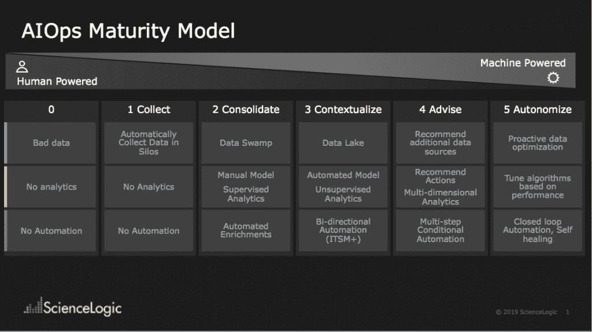
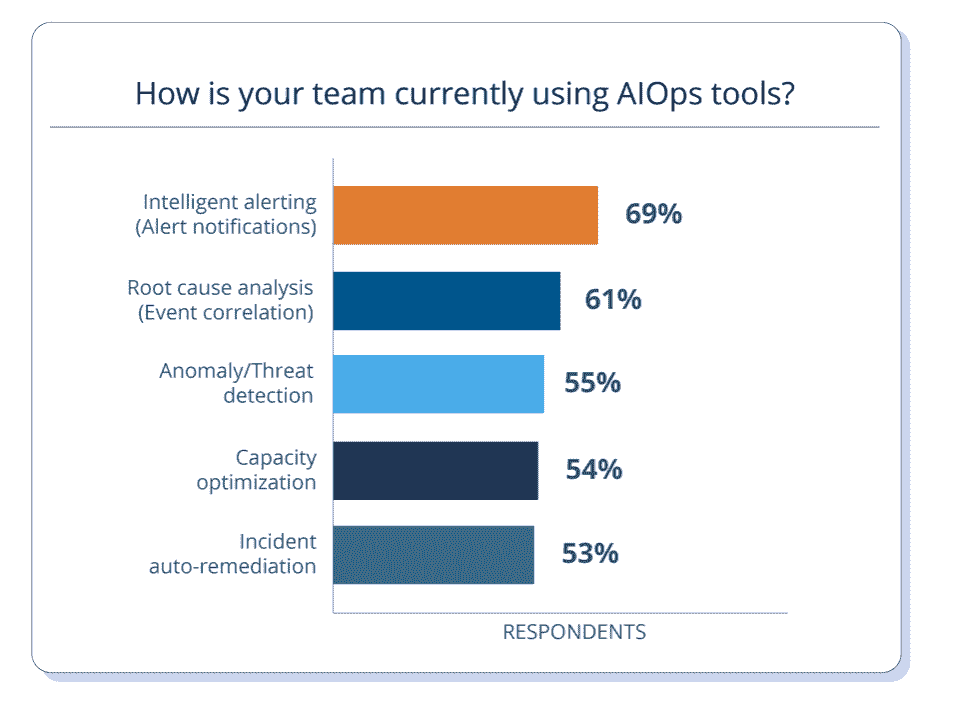
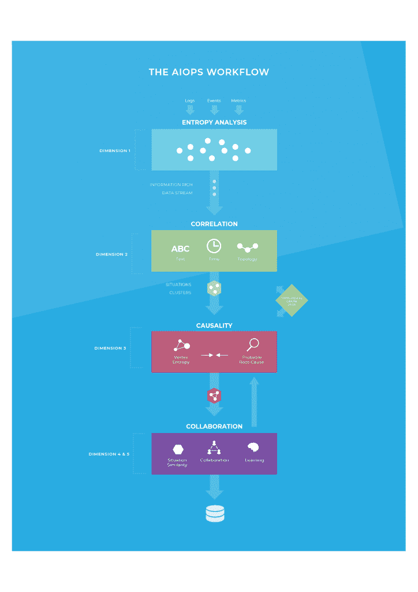

# AIOps 的现状

> 原文：<https://thenewstack.io/the-current-state-of-aiops/>

这可能是一个相对较新的术语，但是警报的泛滥和现代应用程序堆栈的复杂性正在推动许多 It 团队采用 AIOps。

来自 AIOps Exchange 的最近一项调查显示了 AIOps 想要解决的问题的规模以及解决这些问题的兴趣程度，调查中 91%的人都在寻找机器学习工具来提高 Ops 团队的工作效率。这甚至高于 [Forrester 的数字](https://reprints.forrester.com/#/assets/2/601/RES144386/reports)，即采用其所谓的“智能应用和服务监控”，51%的人已经在使用，另有 21%的人计划在一年内采用。

关注度如此之高，是因为在 AIOps Exchange 报告中，约 40%的 IT 组织每天会收到 100 多万条事件警报，11%的组织每天会收到 1000 多万条警报。四分之一的组织在其企业中拥有 50 个或更多监控工具这一事实可能是数量庞大的原因，但正在使用的不同服务和平台的数量也是如此，许多企业同时处理传统应用程序和新的微服务。

AIOps 工具承诺通过将这些警报与相关事件相关联，通过收集时序数据，建立机器学习模型来汇总这些数据，以及在某些情况下自动收集进一步的相关遥测数据，来降低噪音。拓扑映射发现设备之间或应用程序和资源之间的关系，统计分析范围从简单的异常值和异常检测到一个节点的行为是否不同于其他节点，或者受监控资源的性能是否异常，即使它在正常范围内？—更强大的多元分析和动态基线。仪表板和事件可视化一起显示性能指标和事件时间表。

他们还能够检测可能的根本原因，找到解决问题的合适人员，建议补救措施或自动修复，并预测未来的问题。

## **筒仓和沼泽**

科学逻辑公司首席执行官兼创始人戴夫·林克所说的“警戒沼泽”只是它正在处理的问题的一部分。“当你有几十个工具时，你最终会陷入一个数据沼泽，而不是一个真正干净的数据湖，因为你需要的真实数据适合许多不同的数据存储，”Link 警告说。这意味着 AIOps 工具需要清理和结构化数据，以便为分析做好准备。

就其本质而言，AIOps 工具需要通过现有的 IT 运营工具收集数据并自动执行补救措施，无论是数据库日志、基础设施监控(网络、存储和计算)、APM 和应用层、云监控、云服务、Kubernetes(以及在容器中运行的微服务)等协调器，还是配置管理系统。

但是现有的操作和监控工具也在增加集成或它们自己的 AIOps 工具。AWS Systems Manager OpsCenter 有一个 Moogsoft AIOps 插件，您可以将 VirtualWisdowm 连接到 AppDynamics，以便对受监控的应用程序进行问题检测和补救。 [New Relic 最近收购了 significal](https://blog.newrelic.com/product-news/signifai/)，并将其自动化问题关联和丰富的事件上下文信息添加到 New Relic One 平台，集成到通用 devops 工具中。

这将有助于软件团队预测和解决性能问题，SignifAI 联合创始人[盖伊·菲格尔](https://github.com/guyfig)告诉我们(他现在是 AIOps 的总经理和 New Relic 的产品工程副总裁)。

“随着生产系统越来越复杂，待命团队需要更快、更简单的方法来解决事故。他们需要帮助和自动化来增强(而不是取代)他们现有的事件管理团队和工作流，以便他们能够更快地检测、诊断和解决问题，并在问题发生前加以预防，”他说。

组织中不同层次的 AIOps 成熟度[来自 ScienceLogic]

对于 DevOps 和站点可靠性工程师来说，他声称这意味着能够“更早地发现问题，减少警报噪音，并大规模交付高度可用和可靠的软件。”

SignifAI 既可以是 SaaS，也可以是 OpsGenie 和 PagerDuty 等事件响应系统的插件，它集成了大约 60 种监控、事件管理和警报工具。它自动关联来自这些工具的信息，但也允许用户微调关联引擎。

## **AIOps 的采用和成熟**

在其 2019 年[的 AIOps 状态报告](https://info.opsramp.com/state-of-AIOps) , [OpsRamp](https://www.opsramp.com/) 发现 AIOps 工具正被普遍用于智能警报、根本原因分析、异常检测、容量优化和事件的自动补救。OpsRamp 高级副总裁 [Bhanu Singh](https://www.linkedin.com/in/bhanu-singh-ab888810) 告诉我们:“80%的 IT 领导者都在寻求自动化事故中的繁琐任务。他们还想降低成本。“我们的大多数客户都希望大幅削减一级支持的成本，将警报成本削减 30%或 40%。”

林克告诉我们，这些可能意义重大。“服务中断和停机成本平均每小时 30 万美元，最高每小时 54 万美元。”

但他指出，组织对 AIOps 的要求会因你与 IT 团队还是开发人员交谈而异。IT 组织需要上下文。运营人员希望全面了解他们的系统，以便更好地了解整个生产环境的根本原因。开发人员正在寻找一种更快的实时工具:他们希望从最终用户的角度实时了解应用程序的运行情况。

ScienceLogic 首席技术官 Antonio Piraino 解释说，ScienceLogic 使用五阶段成熟度模型来帮助客户了解他们在监控和自动化之旅中所处的位置——仅从数据开始。“零阶段完全由人力驱动:通常是十年之久的系统，具有孤立的数据片段，我并不真正了解它的上下文，我没有很好的分析能力来应对这一点:我只是对没有自动化的硬策略发出普通的警报。”

许多企业多年来一直在进行他称为第一阶段的自动化数据收集，但它通常是孤立的，使用单独的供应商工具来收集有关存储和虚拟化的数据。由于成本原因，通常只有 10%的企业环境会使用代理来收集应用程序性能管理数据，这通常由跟踪客户应用程序体验的 DevOps 团队来完成。“(在第一阶段)没有太多真正的分析；只是大量的数据传入和许多反对强硬政策的事件，当然没有补救措施，”皮雷诺解释说。

绝大多数企业都处于第二阶段，他们开始整合来自不同孤岛的数据。这通常包括监督分析、使用单一指标的机器学习、通过收集有关相关设备或组件的更多数据来丰富警报，以及运行手册自动化。Piraino 将此描述为“我已经有了更多的数据来做出决策，但很多时候实际的决策或配置更改编排本质上仍然是手动的。”

越来越多的先进企业开始跨越到第三阶段，将数据融入环境并整合工具生态系统。“这是企业说好吧，我们有数据沼泽，让我们把它变成一个更结构化的数据湖，这样我们就有了上下文。因此，我们了解依赖关系映射，我们对业务服务进行了分类，对应用程序服务、IT 服务进行了分类，我们已经将所有不同的依赖关系放入其中。我们知道什么是外部 SLA，我们也知道我们内部 KPI 的目标是什么。我们可以开始自动化更多的建模，并且会有更多的无监督分析发生。”

他指出，这可能不需要像深度学习这样的强大算法。“很多时候，人们只是想要实时即时的[信息]；告诉我现在出了什么问题，告诉我根本原因，并给我一组关于问题的丰富数据，这样我们就可以开始采取自动化措施，结合事件管理工具和第三方 ITSM 工具，如变更管理系统。”

只有少数企业已经进入第四阶段，在这一阶段，AIOps 更多地成为顾问。“对于未来潜在的健康风险，你实际上如何让系统对(要考虑的)额外数据源提出建议，以及它可以采取什么样的建议措施。”皮雷诺说，这是基于多元分析、多维分析和条件自动化。这个系统“可以开始说，‘如果这个那么这个’，‘如果那个那么这个’，在我进入下一阶段之前，我还能学到什么？”

哪些 AIOps 工具用于[来自 AIOps 的 OpsRamp 状态报告]

“第五阶段是完全自主的认知行为网络，它可以完成校正数据优化，所有算法都可以根据性能和自我学习进行自我调整。这是一个完整的闭环自动自我修复系统，任何人都不必接触任何东西。”这是每个人都认为 AIOps 将带给他们的，但没有人实施，他坚持说；“如果有人说他们有这个，那可能是针对非常封闭的环境中的单个应用程序。”要实现这一目标，甚至进入第四阶段，需要的不仅仅是技术变革。

## **准备流程变更**

Singh 说，成功的 AIOps 需要比 DevOps 更大的文化变革，因为它需要超越 it 运营，覆盖所有面向客户的系统。“您的 CRM 应用程序必须发挥作用，在某些时候，甚至可能是您的组织正在与您的客户和潜在受众进行的社交互动，以真正了解客户的情绪和体验。"

这意味着 AIOps 将跨越更多的流程和组织界限，远远超出网络、存储、安全和应用程序团队等明显的界限，这些团队可能都参与了解问题并推动必要的变革。“有时候，很多时间都浪费在团队之间的来回交流和互动上。因为我们不了解具体情况，”皮雷诺说。明显的好处是减少了检测和修复问题的时间，从而提高了可用性并减少了 SLA 惩罚。更长期的改进是降低事故率，增加平均故障间隔时间，提高工程师的工作效率，并将他们从可以部分或完全自动化的平凡、低价值的任务转移到更具吸引力和令人满意的工作上，这可能涉及更根本的变化。

“AIOps 将推动人们如何操作以及组织如何理解数据流和数据影响的文化转变。将会有更少的争论，也许会有更多的信息流动，让人们采取行动。”

从长远来看，AIOps 可能会改变公司的流程，而不是提高已经完成的事情的自动化程度。Link 看到，当组织在采用 AIOps 的过程中演练如何处理事件时，就会发生这种情况。“他们从应用程序的角度，或者从存储团队、架构团队或云团队的角度来看待 it，他们立即意识到他们彼此不同步，他们不一定相互提供正确的细节和信息，”Piraino 说。

Piraino 说，这对于使用微服务构建的现代应用程序来说更加重要。“你必须真正重新考虑如何看待整个堆栈。开发人员开始意识到，应用程序必须了解底层基础设施在应用程序层做什么，但应用程序不一定有那个数据集。它需要重组运营能力，为应用程序开发人员提供这些见解，以便应用程序能够感知基础架构，这就是推动 AIOps 的原因。”

AIOps 平台的典型工作流程(摘自 AIExchange 宣言)

新遗迹是新堆栈的赞助商。

Pixabay 的 skeeze 的专题图片。

<svg xmlns:xlink="http://www.w3.org/1999/xlink" viewBox="0 0 68 31" version="1.1"><title>Group</title> <desc>Created with Sketch.</desc></svg>