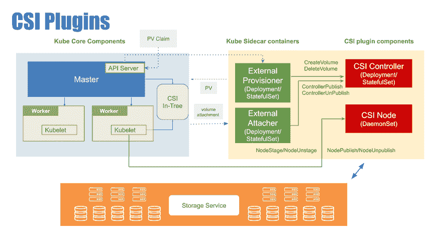

# 云本机存储的当前状态

> 原文：<https://thenewstack.io/the-current-state-of-the-state-for-cloud-native-storage/>

Portworx 赞助了 New Stack 对 KubeCon+CloudNativeCon 北美 2019 的报道。

上周在 KubeCon+CloudNativeCon 北美 2019 上，联合主办的[云原生存储日](https://www.cloudnativestorageday.com/)提供了云原生存储生态系统的最新状态。我有幸发表了主题演讲，涵盖了 Kubernetes 的状态演变、[集装箱存储接口](https://github.com/container-storage-interface/spec/blob/master/spec.md)的角色以及路线图。

以下是我在 CNS 日展示的内容摘要。

### 国家总是事后的想法

对于平台架构师来说，持久性和状态总是事后才想到的。Amazon EC2 在 2006 年推出了测试版，它没有支持持久性和持久性。亚马逊花了整整两年时间才推出弹性块存储(EBS)作为 EC2 的存储层。业内首个平台即服务产品 Google App Engine 也是如此。即使是微软公共云的最初化身 Windows Azure 也缺乏对持久性的支持。Azure Disks 是在 Azure 最初的 web 角色和 worker 角色可用四年后推出的。

云原生宇宙也不例外。基于 union 文件系统的 Docker 容器是作为短暂的部署单元开始的。几年后，在集装箱开始获得牵引力后，对数量的支持出现了。Apache Mesos 和 Kubernetes 的情况也是如此。

但是生产系统需要两个关键的能力——可伸缩性和可靠性。这迫使生态系统把有状态和无状态同等重要。在基于超大规模的传统云环境中，虚拟机的自动扩展处理可扩展性。Amazon EC2 的启动配置和自动伸缩组处理无状态工作负载的可伸缩性和可用性。Google Compute Engine 和 Azure VMS 分别通过实例组和 VM 规模集实现了类似的功能。持久性通常委托给对象存储、块存储、文件系统、键/值存储和托管数据库。

Kubernetes 通过部署和有状态集等控制器来处理应用程序的可伸缩性和可用性。实施就绪性探测、活动探测和运行状况检查可确保工作负载可用，而水平 pod 自动扩展等功能可确保应用的可扩展性。Kubernetes 中的持久性是通过作为状态基础的持久卷和持久卷声明的概念来管理的。

从这个讨论中得出的结论是，状态总是平台架构师事后才想到的，而它是客户最关键的需求。

### **库伯内特的状态演变**

Kubernetes 的早期采用者不得不依靠存储原语(如 emptyDir、hostPath)来增加应用程序的持久性。但是在 Kubernetes 中运行传统数据库需要超越原语的高级功能。

客户转向分布式文件系统，如 NFS、GlusterFS 和 Ceph，以添加跨越节点的持久层。管理这些文件系统没有与 Kubernetes 工具和工作流集成。在部署工作负载之前，存储管理员必须在每个节点上手动安装和配置这些文件系统。

随着托管 Kubernetes 的兴起，云提供商通过存储类和动态配置公开了块存储。客户可以将 EBS 卷、GCE 持久磁盘、Azure 磁盘连接到运行在 AWS、GCP 和 Azure 上的 Kubernetes 工作节点。

在过去两年中，云原生生态系统为容器原生存储创造了一个新的类别。Portworx、Red Hat、Robin、Diamanti、StorageOS、Kasten 等供应商开始提供利基存储解决方案，这些解决方案对通过块存储、SAN、NAS 和直连存储公开的底层存储进行了抽象。

如今，企业客户在为云本机状态工作负载选择合适的存储解决方案时有广泛的选择。

### **CSI 为转折点**

最初。上游的 Kubernetes 为各种存储后端集成了卷插件。它包含了从原始插件到特定于供应商的插件的所有内容。虽然这简化了集群管理员的工作，但也带来了许多副作用。

上游 Kubernetes 发行版的规模因十几个存储插件而变得臃肿。插件的任何微小更新或改变都意味着重新构建和编译整个代码。这减缓了存储生态系统的潜在增长。

【T2

集装箱存储接口(CSI)就是为解决这些挑战而设计的。首先，CSI 提供了一种与编制者无关的方法来处理存储。Docker、Mesos、Kubernetes、Cloud Foundry 可以使用相同的 CSI 驱动程序来管理存储卷的生命周期。其次，它将存储驱动程序和编排引擎的实现解耦。这意味着每个供应商都可以独立地创建和管理他们的驱动程序，而不必重新构建整个源代码树。第三，CSI 通过使客户能够以最少的配置更改轻松地从一种存储实施切换到另一种存储实施，提高了可移植性。

Kubernetes 的 CSI 于 2019 年 1 月随着 Kubernetes v1.13 版本正式推出。

NetApp、HPE、VMware 等传统存储供应商，Azure、AWS、GCP、IBM、Oracle 等纯存储和云提供商，以及 Portworx 和 Robin 等纯容器存储公司正在转向 CSI。

CSI 是在 Kubernetes 上运行有状态工作负载的过程中的一个重要里程碑。它让客户对将传统应用移植到 Kubernetes 充满信心，同时保持可移植性。

### **前方的路**

云本地计算基金会的存储特别兴趣小组(SIG)正致力于引入更多功能，如卷快照、卷绑定、卷克隆和本地卷。这些功能使得通过使用现有的工具链和工作流，以本机云本机形式执行存储操作变得很容易。

生态系统中的商业供应商正在通过提供工作负载迁移、策略驱动的安全性、应用感知型备份和恢复、业务连续性以及灾难恢复等高级功能来拓展业务。

集装箱附加存储市场正在快速增长。未来几年，它将成为云原生生态系统中最大的细分市场之一。

云原生计算基金会和 KubeCon+CloudNativeCon 北美 2019、Red Hat、Diamanti、Cloud Foundry、VMware、NetApp 和 Oracle 是新堆栈的赞助商。

从像素提升的特征图像。

<svg xmlns:xlink="http://www.w3.org/1999/xlink" viewBox="0 0 68 31" version="1.1"><title>Group</title> <desc>Created with Sketch.</desc></svg>