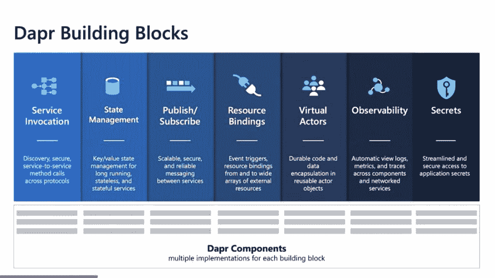
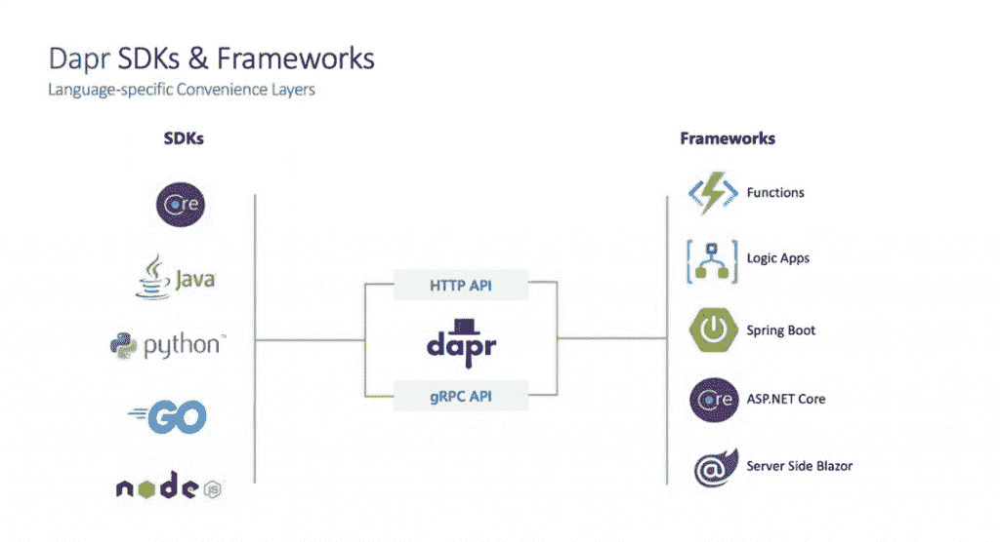
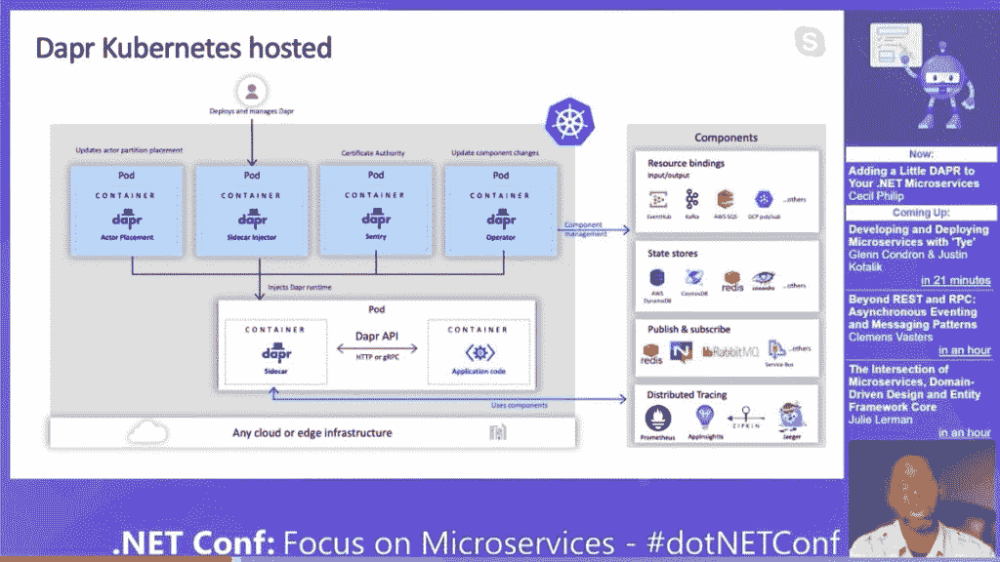

# Dapr 分布式运行时接近生产就绪

> 原文：<https://thenewstack.io/the-dapr-distributed-runtime-nears-production-readiness/>

Azure 首席技术官办公室的微软首席项目经理 Mark Chmarny 在本月早些时候举行的云计算原生计算基金会[网络研讨会](https://www.youtube.com/watch?v=qntLqifOl7A)上指出， [Dapr](https://dapr.io) 开源分布式运行时即将发布 1.0 版本，可能在[年底](https://blog.dapr.io/posts/2020/10/20/the-path-to-v.1.0-production-ready-dapr/)发布。

这将是云原生社区急需的技术的及时发布。一年前[由微软](https://thenewstack.io/microsofts-open-source-dapr-could-help-developers-build-agnostic-microservice-applications/)推出的 [Dapr](https://github.com/dapr/) (分布式应用运行时)解决了分布式计算最棘手的问题之一，即如何让开发人员使用起来足够简单，而不会让他们陷入配置微服务组件在动态环境中相互交互所需的所有支持基础设施的困境。它为备受期待的[多云操作](https://thenewstack.io/the-pros-and-cons-of-multicloud/)奠定了基础，在那里它为开发者提供了一个单一的界面来构建可以移动甚至跨越多个商业云服务的应用。也许最重要的是，它为开发人员提供了使用 Kubernetes 的简单抽象。

Dapr [允许开发者通过标准化的 API 编写](https://thenewstack.io/how-microsofts-dapr-simplifies-developing-and-deploying-microservices/)一个可以在多个平台上运行的应用——无论是云、裸机还是内部 Kubernetes 部署。API 提供了分布式应用程序最常见的使用模式，比如服务调用、资源绑定、状态管理、发布/订阅、虚拟角色、可观察性等等。这些可以作为应用程序的基本构件。

“一旦在 Dapr 中注册，组件就可以通过 API 自动访问，”Chmarny 说。

可以使用任何语言，跨组件的调用通过 http 或 gRPC 进行，并提供跨不同组件的遥测，没有跨度。

“Dapr 真的试图满足他们的开发者，”Chmarny 说。

考虑到让开发人员理解如何使用 Kubernetes 的挑战，这最后一点尤其有价值。

“当有人为 Kubernetes 创建部署时，他们会将应用程序开发人员的顾虑与运营商的顾虑、基础设施运营商的顾虑混合在一起。因此，作为一名编写清单的开发人员，你必须知道所有这些与基础设施相关的不同概念，这些概念会分散你的核心目标，即定义应用程序，”微软 Azure 首席技术官[马克·鲁西诺维奇](https://twitter.com/markrussinovich)在今年早些时候的一次[演讲中说道。](https://www.youtube.com/watch?v=LAUDVk8PaCY&feature=youtu.be)

在他的演讲中，Russinovich 演示了如何在三个不同的平台上运行一个应用程序，只需进行少量的配置调整:Azure、亚马逊 Web 服务和一群运行在 stage 上的 Raspberry Pis。

在幕后，K8s 通过两个客户资源定义和四个系统 pods 管理 Dapr，用于 sidecar 注入、演员安置和证书管理等职责。Dapr 是一个事件驱动的架构，这意味着一个事件必须触发一个应用程序，从卡夫卡或 SQS，以及通过外部 API，如 Twitter 或 Twilio。

整个应用程序中的每个微服务都只与一个专用的 Dapr 边车通信。“Dapr 代表应用程序执行功能，”Chmarny 说。应用程序甚至不需要了解 Dapr。使用 Kubernetes，将 sidecar 链接到应用程序非常简单，只需将注释添加到 YAML 部署文件中。Chmarny 演示说，开发人员可以在两条服务总线之间切换，比如 RabbitMQ 和 Redis，而不需要修改实际代码。

[https://www.youtube.com/embed/qntLqifOl7A?feature=oembed](https://www.youtube.com/embed/qntLqifOl7A?feature=oembed)

视频

[https://www.youtube.com/embed/LAUDVk8PaCY?start=4&feature=oembed](https://www.youtube.com/embed/LAUDVk8PaCY?start=4&feature=oembed)

视频

<svg xmlns:xlink="http://www.w3.org/1999/xlink" viewBox="0 0 68 31" version="1.1"><title>Group</title> <desc>Created with Sketch.</desc></svg>