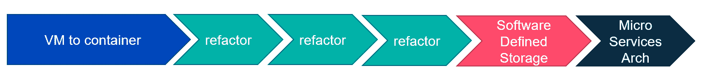
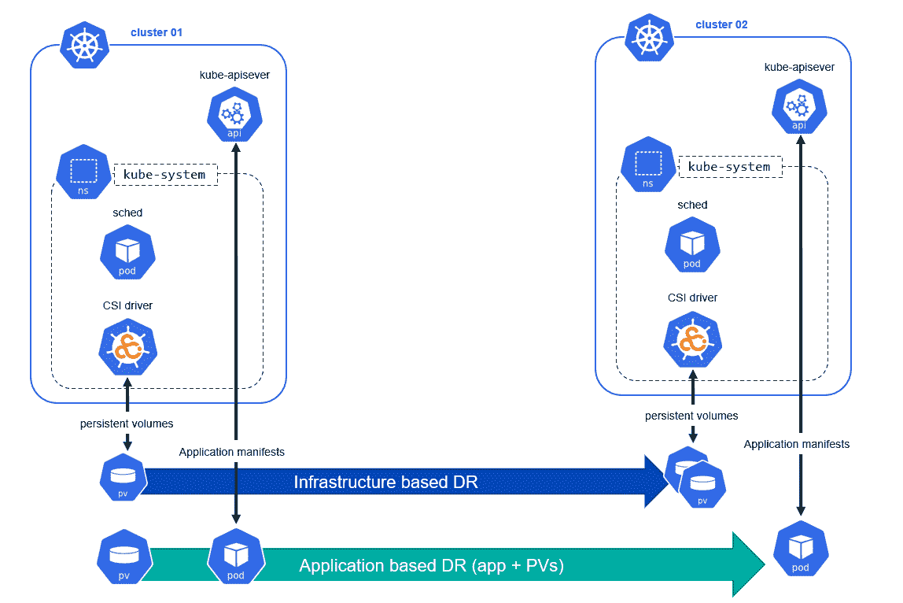

# Kubernetes 的数据保护挑战

> 原文：<https://thenewstack.io/the-data-protection-challenges-of-kubernetes/>

[Cloud Native Computing Foundation](http://cncf.io/)赞助了这篇文章，期待虚拟 [KubeCon + CloudNativeCon 北美 2020–虚拟](https://events.linuxfoundation.org/kubecon-cloudnativecon-north-america/)，11 月 17-20 日。

 [马修·埃里克森

Mathew Ericson 是 Commvault 的高级产品经理。他目前在产品管理团队的云和虚拟化领域工作，负责亚马逊 Web 服务和 Kubernetes 产品集成。他在 Commvault 工作了 4 年，在技术行业工作了 23 年。他曾在全球 500 强企业的开发、存储和数据管理部门任职。在 Twitter 上关注他，地址是@mericsonAU。](https://www.linkedin.com/in/mericson23/) 

采用 Kubernetes 作为容器编排的事实上的标准将加速您的数据中心编排和现代化工作。从中小型企业到大型企业，所有垂直行业和细分市场的公司都采用容器作为开发基于云原生基础的差异化产品的方式。但这种加速采用并非没有挑战。

在向企业交付 Kubernetes 的过程中，DevOps 工程师将容器作为新的虚拟机，并开始将有状态应用程序(即使用数据库和中间件层)迁移到容器。凭借随时随地按需调配存储的自助式访问，DevOps 工程师不再受到传统 it 服务台请求延迟的束缚，因此容器部署大幅增加。由此产生的容器蔓延和现在的集群蔓延给人手不足的 IT 团队带来了下一个挑战。

## 集装箱化之旅

为什么 DevOps 工程师要采用专为无状态应用程序设计的技术，并将有状态应用程序与持久卷管理的所有复杂性进行分层？简单:敏捷。Kubernetes 允许开发人员根据业务需要或需求提供、测试、QA 甚至扩展他们的应用程序。从传统整体式应用程序转型的过程是多阶段的，第一步是从虚拟机到容器的迁移。

企业正在重新学习如何构建利用云原生技术的按需特性和弹性功能的应用程序，以响应移动世界中永不停机的客户需求。我们看到了虚拟机**到**容器空间的快速采用，随后是多个重构阶段，随后是灵活的软件定义存储的采用，以大规模简化存储管理。理想的状态是微服务架构，这是很多业务都在努力实现的。

## 当前的挑战

这种方法缺少提供端到端数据管理的底层工具和自动化。有一些最初的项目试图超越基本脚本(以前的 Heptio Ark，以前的 Velero，现在的 [VMware Tanzu](https://github.com/vmware-tanzu/velero) )。还有 Kubernetes [存储 SIG](https://github.com/kubernetes/community/tree/master/sig-storage) ，以及最近成立的[数据保护工作组](https://www.youtube.com/watch?v=6lVJcskauTU) (WG)。但是从根本上说，仍然存在一些需要解决的基本挑战:

*   Kubernetes 中应用的定义是什么(见 v1beta1 [应用 CRD](https://github.com/kubernetes-sigs/application) )？
*   开发人员如何记录对应用程序的依赖性(例如，客户资源定义或资源)？
*   保护和恢复如何在安全的多租户 Kubernetes 集群中工作(参见[分层名称空间](https://kubernetes.io/blog/2020/08/14/introducing-hierarchical-namespaces/)概念)？

事实上，如果我们看看正在积极迁移到 Kubernetes 应用程序的传统单片应用程序，我们会发现另一个挑战列表。必须实现应用程序一致性，而不需要在容器中插入非应用程序二进制文件或代理。应用程序一致性是协调应用程序状态和保护操作(备份、存储快照等)的行为。).

## 存储注意事项

必须使用快照机制实现存储一致性，以便在不影响正在运行的应用程序的情况下实现在线或“实时”保护。事实上，随着企业采用各种各样的存储解决方案，采用云原生方法进行存储管理(API 驱动、开放接口、无缝可扩展性)的能力是必需的。

目前，[容器存储接口(CSI)](https://kubernetes.io/blog/2019/01/15/container-storage-interface-ga/) 提供了这种云原生方法，尽管动态配置、连接/分离和装载功能是稳定的，[快照功能](https://kubernetes.io/blog/2019/12/09/kubernetes-1-17-feature-cis-volume-snapshot-beta/)尚未普遍提供。大型企业已经开始了解并喜爱基于快照的保护及其传统的企业存储阵列技术。快照、克隆和一致性组(CG)备份被视为允许将传统应用程序大规模迁移到容器的核心功能。一个例子是能够向生产环境调配全闪存存储，但利用这些快照的 CSI 克隆拷贝到更经济高效的层(即开发/测试播种)。这些功能仍在 CSI 规范的开发中。

应该注意的是，虽然 CSI 标准提供了一种提供存储级时间点卷快照的方法，但是它并没有*而不是*将该快照移动到替代存储介质。快照被视为“恢复点”，需要拷贝到云、磁盘或磁带介质，才能被视为真正的“备份拷贝”数据保护工作组目前正在应对这一挑战。

## 应用弹性

我们已经看到了应用程序架构和弹性的两种方法。根据企业可用的开发资源，他们可能会采用两种灾难恢复方法之一:

*   以应用程序为中心的恢复侧重于捕获整个 Kubernetes 应用程序(清单、持久数据、相关资源),并在远程集群中重新调度它们。这种方法可以完全自动化，不依赖于应用程序所有者。
*   以基础架构为中心的恢复侧重于利用下一代软件定义存储(SDS)，可通过自定义资源定义(CRD)紧密集成到 Kubernetes 中，以从 Kubernetes 命令行(即 kubectl)提供计划、复制、克隆和恢复。

这两种方法都是有效的，但是会导致不同级别的 IT 运营资源、应用程序开发资源和相关的自动化。由于恢复事件通常是对意外事件的响应，因此需要智能自动化来推动一致的恢复结果并满足业务恢复时间目标(RTO)。

## 在库本内特斯星团之外

基于 Kubernetes 或基于容器的应用程序由分布在整个组织中的许多新数据类型组成。在最近的 KubeCon Europe 上，经验丰富的 Kubernetes 老手表达了不要"*绕过 CI/CD、代码审查和正式发布过程的愿望。*“最重要的是，为了使容器化成为下一代应用前景的稳定组成部分，需要数据保护最佳实践。

例如:

*   您是否在保护大多数开发工作开始的开发人员工作站？
*   您是否在保护您的源代码控制系统和 CI/CD 系统？
*   如果您的 CI/CD 系统不可用，会对您的客户产生什么影响？
*   您是否在保护本地集群的 etcd ( [etcd.io](https://etcd.io/) )数据？
*   你是否有自己的私人图像注册中心，如果有，它们是否受到保护( [goharbor.io](https://goharbor.io/) )？
*   您将如何保护像云对象存储这样的现代持久性存储？

## 考虑到端到端的挑战

当我们回过头来审视这些挑战时，我们必须思考我们为什么要执行数据保护和数据管理。

*   我们需要将失败的应用程序恢复到生产状态。
*   我们需要将故障应用程序或容器恢复到备用位置(灾难恢复)。
*   我们需要为基础设施生命周期或开发迁移应用程序(例如，播种新的集群)。
*   我们需要通过整合和减少基础架构蔓延来优化我们的部署。
*   我们需要根据定义的 SLA 保护应用程序。
*   我们需要提供与工作负载位置无关的功能(内部、云)。

这些挑战需要企业已经具备的数据管理能力，包括:

*   跨所有 Kubernetes 部署的基于策略的集中式保护。
*   所有受保护数据的整体报告、控制面板、趋势和警报。
*   面向授权个人的自助式备份、恢复和洞察。
*   集成到单点登录(SSO)系统中，以提供基于角色的精细访问控制。
*   访问和使用受保护数据的基于策略的控制。
*   针对报告、审核、日志和持久性数据的治理和法规遵从能力，以满足法规要求。

如今，许多数据保护解决方案依赖于捕获应用程序清单和持久数据。保护计划是逐个群集进行的，跨多个实施的可见性很低。此外，安全的多租户最佳实践，甚至与[开放策略安捷伦(OPA)](https://www.openpolicyagent.org/) 等技术的集成也尚未成熟。

Kubernetes 确实提供了应用程序移动性，现在可以将应用程序从一个集群编排到另一个集群。未来的挑战将需要策略控制、报告、警报甚至 Kubernetes 清单转换，以支持不同集群版本和技术之间的迁移。迫切需要一个由社区**–**开发的标准保护方法，以及允许第三方保护供应商开发的解决方案。

*要了解更多关于 Kubernetes 和其他云原生技术的信息，请考虑参加 11 月 17 日至 20 日在 T4 举行的 [KubeCon + CloudNativeCon 北美 2020 大会。](https://events.linuxfoundation.org/kubecon-cloudnativecon-north-america/)*

云计算原生计算基金会是新堆栈的赞助商。

通过 Pixabay 的特征图像。

<svg xmlns:xlink="http://www.w3.org/1999/xlink" viewBox="0 0 68 31" version="1.1"><title>Group</title> <desc>Created with Sketch.</desc></svg>