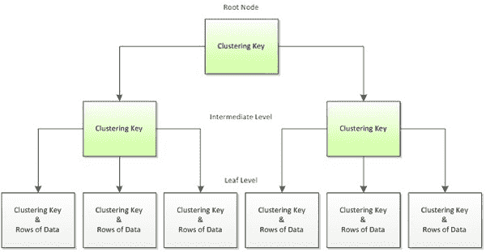
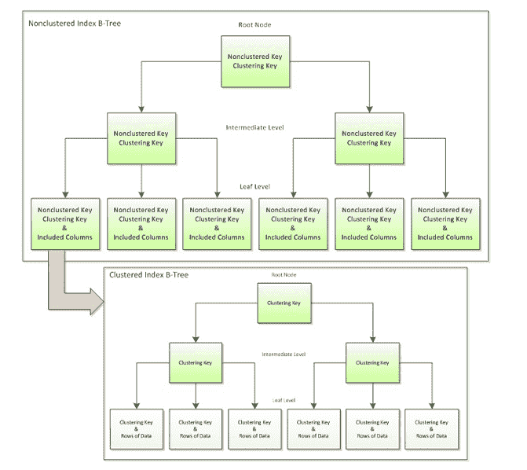

# 聚集和非聚集 SQL 索引之间的区别

> 原文：<https://thenewstack.io/the-difference-between-clustered-and-non-clustered-sql-indexes/>

维卡什·库马尔

维卡什·库马尔在 Tatvasoft.com 的一家软件开发公司工作时，撰写关于技术主题的文章。你可以在 Twitter 和 LinkedIn 上关注他。

索引用于加速 SQL 中的查询过程，从而提高性能。它们类似于教科书索引，你需要转到特定的章节，找到该章节的页码并直接访问该页。在没有索引的情况下查找想要的章节可能会很麻烦，并且该过程可能会慢得多。如果没有索引，关系数据库管理系统(RDBMS)必须遍历表中的所有记录才能得到想要的结果。这种方法称为表格扫描。

索引是一个键，可以帮助 MySQL、Oracle 和 SQL Server 等数据库实时找到具有准确键值的相关行。基本上，SQL servers 中使用了两种不同类型的索引，集群索引和非集群索引。

在本文中，我们将看看关系数据库中这两个索引之间的区别。

## 什么是聚集索引？

聚集索引是一种根据表中信息的关键质量对其进行排序的文件。数据库中的每个表只有一个聚集列表。因此，每个表只有一个单独的分组记录。以下是聚集索引的一些特征:

*   默认和排序的数据存储
*   有助于同时存储数据和索引
*   聚集索引扫描和索引查找
*   键查找

下面添加了说明聚集索引如何工作的 B 树结构:

图片来源:红门

优势:

*   聚集索引是获取 min、max 或 count 类型查询的范围或组的理想选项。
*   任何相关的搜索都会直接进入信息中的某个特定点，目的是让您可以继续从表中连续阅读。
*   它利用定位机制在范围的开始处查找文件部分。
*   当提到狩猎的关键品质时，这是一种引人注目的范围搜索技术。
*   最小化页面传输，最大化缓存命中率。

缺点:

*   限制页面移动并增加保留搜索。
*   非连续请求的不同方法
*   将包括信息页面在内的许多一致的页面部分制作成列表页面。
*   SQL 中插入、更新和删除的附加工作。
*   留出更长的时间刷新记录。
*   几乎所有的数据都包含在索引的前导节点中。

## 什么是非聚集索引？

非聚集索引在一个区域存储元信息，在另一个区域存储文件。该文件由指向该信息位置的指针组成。一个单独的表可以将大量非聚集的记录作为一个文件。非聚集索引是在表的非排序字段中定义的，这种类型的方法提高了查询的性能，因为它们使用没有被指定为主键的键。以下是聚集索引的一些特征:

*   仅存储键值
*   指向堆/聚集索引行的指针
*   允许访问辅助数据
*   桥接数据
*   索引扫描和索引查找操作
*   为表或视图创建非聚集索引

优势:

*   它有助于从数据库表中快速检索数据。
*   与聚集索引相比，可以避免开销成本。
*   它可用于创建多个索引，因为 RDBMS 中有多个非聚集索引。

缺点:

*   以最符合逻辑的顺序存储数据，但不允许对数据行进行物理排序。
*   非聚集索引的查找过程有点昂贵。
*   每次更新聚集键时都需要相应的更新，以便将其存储在非聚集索引上。

下面添加了说明非聚集索引如何工作的 B 树结构:

非聚集索引存储聚集索引中用于数据查找的聚集键。

## 这些指标有什么区别？

通过 Pixabay 的特征图像。

<svg xmlns:xlink="http://www.w3.org/1999/xlink" viewBox="0 0 68 31" version="1.1"><title>Group</title> <desc>Created with Sketch.</desc></svg>