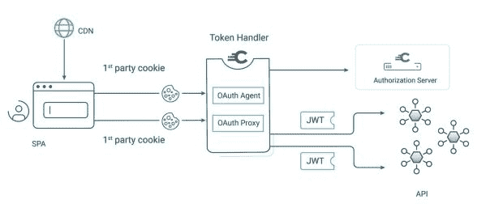

# 解释了不同的令牌类型和格式

> 原文：<https://thenewstack.io/the-different-token-types-and-formats-explained/>

乔纳斯·伊格博姆

乔纳斯是 Curity 公司的销售工程总监。他的专长是身份和访问管理，以及特权用户、数据库和应用程序的访问控制解决方案。

当使用 OAuth 和 OpenID Connect (OIDC)构建安全解决方案时，我们经常讨论令牌。有时，这些系统甚至被称为基于令牌的体系结构。

令牌在授权访问应用程序、服务和 API 方面发挥着核心作用。它们还支持安全、灵活和可扩展的访问管理。使用令牌意味着应用程序不必维护静态 API 密钥，或者更糟的是，不必持有用户名和密码。

给定场景中使用的令牌类型通常没有明确列出，但或多或少是假定的。不同的令牌有不同的用途，应该针对每个用例适当使用。

让我们看看一些不同的令牌格式和令牌类型。

## 令牌的类型

### 访问令牌

接入令牌(AT)可能是最常见的令牌类型。用户或服务以某种方式进行身份验证，授权服务器(AS)发布访问令牌。根据 AS 的配置，该令牌通常是不透明的令牌。或者，它可以是一个 JSON Web 令牌(JWT)。

应用程序通常使用访问令牌来标识用户或服务。出于安全原因，这些令牌的生命周期通常非常短。如果攻击者获得了访问令牌，就可以使用该令牌以用户或服务的身份获得访问权限。这可能会给特定架构带来挑战，例如无法充分保护令牌的单页应用程序(SPA)。解决这个问题的一个方法是[令牌处理模式](https://curity.io/resources/learn/token-handler-overview)。

### 不记名代币

访问令牌最常见的使用方式是作为不记名令牌。这意味着令牌持有者将被授权访问。对于这种类型，接收令牌的应用程序或 API 不会检查正确的发送者是否提供了令牌。因此，令牌可能会被攻击者劫持并用于获取对应用程序的访问权限。使用不记名令牌对应用程序提出了更多的要求，以适当地保护令牌。

### 发送方受限令牌

授权服务器可以在发布令牌时使用加密信息来将令牌绑定到应用程序。这就在只有应用程序知道的东西(加密密钥)和给定的令牌之间产生了耦合。由于令牌被约束到发送方，因此这些令牌被称为发送方约束令牌，也称为拥有证明令牌。文章“[Mutual TLS Sender Constrained access tokens](https://curity.io/resources/learn/oauth-certificate-bound-access-token)”概述了这些令牌是如何发布的。

例如，当应用程序将令牌发送给 API 时，它还会发送加密密钥信息。然后，API 可以验证所提供的令牌是否绑定到了同样给定的加密密钥。这可以保护令牌不被窃取和重复使用。尽管受发送方限制的令牌需要围绕加密密钥进行额外的配置，但它们确实值得一试。

### 刷新令牌

当向用户颁发访问令牌时，它们需要一个身份验证步骤。但是，短期令牌可能会给用户带来很大的不便，因为他们必须不断地重新认证才能获得新的活动令牌。这就是[刷新令牌](https://curity.io/resources/learn/refresh-tokens)可以帮忙的地方。

在发布访问令牌时，授权服务器也可以发布刷新令牌。当 AT 已经到期并且需要新的 AT 时，应用可以调用刷新令牌流，并且呈现刷新令牌以获得新的、刷新的 AT。在这个流程中，用户不需要重新认证。

### ID 令牌

与访问令牌和刷新令牌不同，ID 令牌总是 JSON Web 令牌(JWT)。ID 令牌代表用户身份或用户的身份验证信息。当请求`openid`范围时，它作为 OIDC 流的一部分被发布。

ID 令牌可以包含与为其颁发令牌的用户相关联的几个属性。这些属性及其值是在授权服务器中定义和配置的，可以由接收 API 使用。

除了特定于用户的属性之外，ID 标记还包含一组标准属性或声明。这些可以标识例如谁发布了令牌、令牌到期时是给谁的以及其他属性。

## 令牌格式

在许多情况下，标准并没有规定确切的令牌格式，而是由授权服务器规定格式。有时，这可以根据哪个应用程序请求令牌来配置。

如前所述，ID 令牌格式是由 OIDC 标准定义的 JWT。

### 不透明代币

不透明令牌也称为引用令牌，是由授权服务器生成的唯一随机字符串。通常，访问和刷新令牌都是不透明的，因此不向应用程序或 API 传递任何数据。这有助于防止公共应用程序泄漏令牌中包含的信息。不透明令牌可以被传递，而没有泄露用户个人可识别信息(PII)的风险。

然而，系统可能需要更详细的信息来从 API 发布数据或通知应用程序行为。在这种情况下，必须对不透明令牌执行自省。自省是一个流程，其中令牌被发送到授权服务器的自省 API。然后，API 的响应指示令牌是否仍然有效，并确定令牌何时发出的附加数据。

不透明令牌的示例:087258 a5-DD B2-487 e-a38e-071698896 ff9

### JSON Web 令牌(JWT)

JSON Web 令牌(JWT)是一种广泛使用的令牌格式。它由头部、主体和有效载荷以及签名组成。base64 编码的 JWT 格式用句点分隔三个片段。这里有一个例子:


标头包含有关令牌及其加密算法的元数据。

有效载荷是实际的数据，包含关于发行者、用户和用户授权的信息。

```
{
  iss https://idsvr.example.com
  sub  11223344
  name Jane Doe
  iat  1660000022
  exp  1660080022
}

```

最后，签名用于验证令牌的完整性，并确保令牌未被篡改。

jwt 非常适合保存数据，因此非常适合 ID 令牌。访问令牌也可以作为 jwt 发布，但是这取决于这样做是否合适的用例。请记住，不透明的令牌不会暴露任何信息，必须进行自省才能揭示其内容。另一方面，jwt 可以保存大量没有隐藏的数据。

缺点是 jwt 可能包含易于阅读的 PII。这适用于 jwt 的最基本用法，在这种情况下，jwt 没有加密，只是简单地防止篡改。例如，您可能能够确定 JWT 中的信息是否被更改。但是为了防止数据被读取，JWT 必须被加密。无论在哪里使用 jwt，都应该遵循保护 jwt 的最佳实践。

## 两全其美

不同的令牌格式各有利弊。jwt 之所以伟大，是因为它们有可能保存所有需要的数据，但是它们有数据泄漏的风险。另一方面，不透明的令牌隐藏了数据，授权服务器必须自省令牌来显示数据。[幻影代币模式](https://curity.io/resources/learn/phantom-token-pattern)和[分割代币模式](https://curity.io/resources/learn/split-token-pattern)结合了这些代币格式，提供了两者的最佳效果。

### **幽灵令牌**

幻影令牌模式结合了 JWT 和颁发给(公共)应用程序的不透明令牌。通过使用 API 网关或反向代理，不透明令牌然后被自省(交换)为 JWT，该可以被传递给上游 API 以供消费。使用这种方法，API 接收一个 JWT，其中包含授权调用者所需的所有数据以及要发布的信息。但是公共应用程序没有得到可能意外泄漏的 PII。

这个过程涉及对不透明令牌的自省，但是响应中的 JWT 可以缓存在网关中以备将来使用。这有助于优化性能，尤其是在调用多个 API 的情况下。


### **分割代币**

拆分令牌类似于幻影令牌，因为它们阻止公共客户端使用 JWT。然而，该模式采用了不同的过程。授权服务器将 JWT 的签名发送给公共客户端，而不是颁发不透明令牌。这满足了幻影令牌方法中不透明令牌的目的，并且客户端使用它作为其访问令牌。

当向客户端发送签名时，授权服务器同时对签名进行哈希处理，并将其与完整 JWT 的头部和主体一起发送到 API 网关缓存。散列签名被存储为检索令牌的其余部分、头部和主体的关键信息。

当 API 网关接收到一个传入的请求，其中签名被表示为令牌时，API 网关散列该签名。它使用哈希签名作为密钥，在其缓存中查找令牌的其余部分。然后，它组装完整的令牌并将其传递给 API。

在这种情况下，不需要自省。然而，授权服务器必须相当快地将令牌的部分推送到缓存中，以便 API 网关在获得请求时不会遇到缓存缺失。


### 令牌处理程序

Token handler 不是一种特定的令牌类型，但是值得一提，因为它与单页应用程序中保护令牌的一些更普遍的问题密切相关。由于防止跟踪，浏览器越来越难以处理第三方 cookies。spa 也不能以类似于安全 cookies 的方式安全地保护令牌。

令牌不是直接发给 SPA，而是发给安装在网关/代理上的令牌处理器。然后，令牌处理程序向 SPA 发送一个安全 cookie，它可以用来代替令牌。当 SPA 需要进行 API 调用时，它发送安全 cookie，当请求被转发到 API 时，令牌处理程序用实际的令牌替换它。

请参考此“[令牌处理程序概述](https://curity.io/resources/learn/token-handler-overview/)”了解有关此方法的更多详细信息。



<svg xmlns:xlink="http://www.w3.org/1999/xlink" viewBox="0 0 68 31" version="1.1"><title>Group</title> <desc>Created with Sketch.</desc></svg>