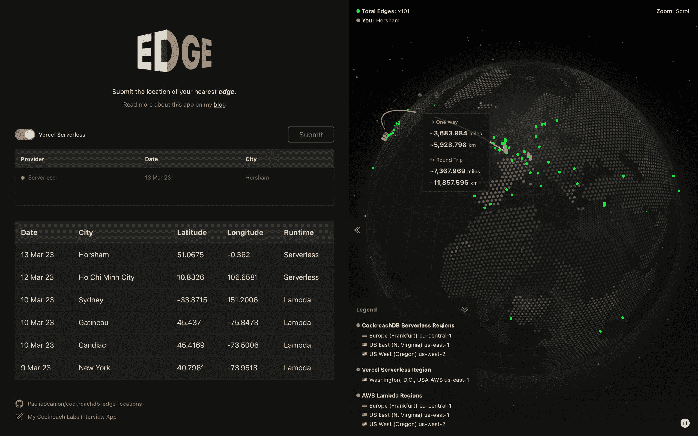
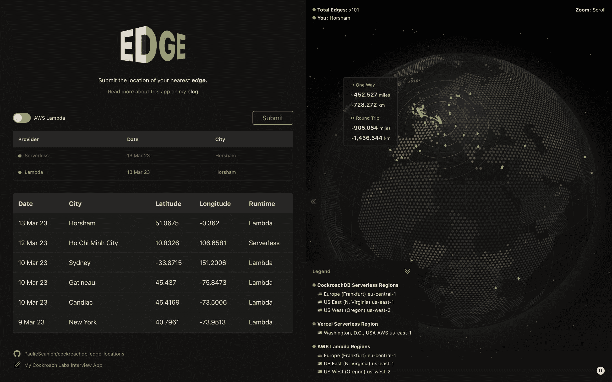
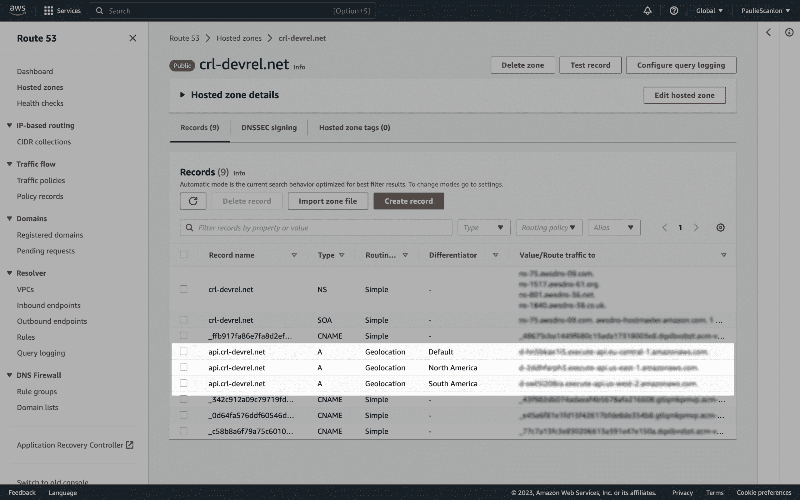
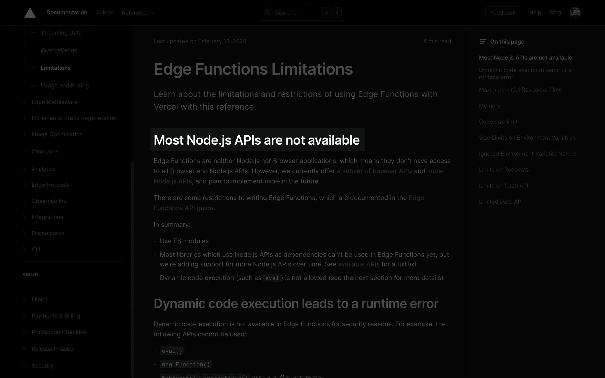

# 边缘计算中从数据到你的距离

> 原文：<https://thenewstack.io/the-distance-from-data-to-you-in-edge-computing/>

最近几个月，我一直在仔细研究浏览器、服务器和数据库之间的数据传输，并使用 Next.js 构建了一个原型应用程序，并将其部署到 Vercel，以帮助可视化和计算数据在它们之间传输的距离。

我一直在 Twitter 上要求人们“提交他们的优势”，这样我就可以更好地了解进出我的数据库的请求来自哪里。如果你愿意，请继续吧**匿名**提交你的边缘。

你可以使用下面的链接在 GitHub 上预览应用程序并查看代码。

这里有一个简短的解释，说明地球上的点代表什么。

*   **绿点**:提交边缘的人的大概位置。
*   **红点**:单区域 Vercel 无服务器功能的位置。
*   **橙色圆点**:x3 多区域 AWS Lambda 功能的位置。
*   **蓝点**:x3 cocroach db 多区域无服务器数据库的位置。

## 边缘解释道

你在全球看到的绿点是点击了“提交”按钮的用户的大概位置。在应用程序中，我使用 [request-ip](https://www.npmjs.com/package/request-ip) 和 [fastgeo-ip](https://www.npmjs.com/package/fast-geoip) 将函数的 req 对象上的 ip 地址转换为真实的地理位置。然后，使用 [node-postgres](https://node-postgres.com/) 我在最近的[cocroach db 多区域数据库](https://www.cockroachlabs.com/docs/stable/multiregion-overview.html)中创建新行。CockroachDB 处理跨其他数据库的复制，以便所有三个区域保持同步。(完全披露:我为蟑螂实验室工作。)

您可以在下面的链接中看到“创建”功能的`src`代码:

单独使用 Vercel 文档，我无法确定这些位置(绿点)到底是什么。例如，当我提交时，显示的位置(西萨塞克斯郡霍舍姆)距离我实际所在的地方大约 28 英里。

为了更清楚的了解，我直接问了 Vercel。他们很友好地回复了我的邮件，以下是他们的回答:

*我对此的理解是，我们使用 MaxMind 作为数据库来交叉引用 IP 信息，并获得请求的纬度/经度，然后我们输出它。也许描述这一点的最佳方式就是使用通过 Vercel 访问的地理定位服务，根据 IP 信息估计用户的位置——Vercel 销售工程师*

现在我对起点有了更好的理解，我可以开始绘制数据之旅了。

## 对请求的分析

您可能已经知道，您(您的浏览器)不能(在大多数情况下)直接与数据库通信。

原因有很多，很多都与安全性有关(浏览器不安全)。相反，你从浏览器发出的任何请求都必须通过服务器；或者，在这种情况下，无服务器函数或 Lambda 函数。然后，服务器可以在请求访问数据库之前执行必要的安全检查。

如果一切顺利的话！数据库可以根据请求作出响应，例如用一些数据。

这让我想到了数据之旅的下一部分。服务器在哪里？

## 服务器在哪里？

将应用程序部署到 Vercel 时，静态部分(HTML、CSS、图像)会在内容交付网络(CDN)中进行部署和全球分发。

这个想法是，这些资产离用户越近，传播的距离就越短，网站“加载”的速度就越快。

然而，这并不适用于 JavaScript 可执行文件。

无服务器功能或 Lambda 功能不能围绕 CDN 全局部署；取而代之的是，将被部署到一个地区。Vercel 基于 AWS 构建，Vercel 无服务器功能只能部署到可用的 [AWS 区域](https://docs.aws.amazon.com/AmazonRDS/latest/UserGuide/Concepts.RegionsAndAvailabilityZones.html)的[子集](https://vercel.com/docs/concepts/edge-network/regions#routing)。

根据你使用的计划(我使用的是业余爱好计划，但同样适用于职业计划)，你只能[在一个地区](https://vercel.com/docs/concepts/functions/serverless-functions/regions#set-multiple-serverless-regions)部署无服务器功能。可以部署到多个地区，但是您需要升级到 Vercel 企业计划——哎呀！

出于我的目的，我不想升级到 Vercel 企业计划，所以我使用 AWS 构建了一个 [Route 53](https://aws.amazon.com/route53/) API 网关，然后部署了多个 Lambda 函数来匹配 CockroachDB 多区域无服务器数据库的区域，这些数据库是免费的，并且有 [5GB 的存储限制](https://www.cockroachlabs.com/pricing/)。CockroachDB 是云原生的，可以部署到 AWS 或 GCP，对于我已经部署到 AWS 的这个应用程序。这种设置目前每月花费我 2.30 美元。

因为我在蟑螂实验室工作，所以我被授权访问私有的多区域无服务器测试版(它将在今年晚些时候公开发布)，这允许我将数据库部署到多个区域。同样的想法是，旅行的距离越短，网站“加载”越快。

### Vercel 单区域无服务器功能

由于 Vercel (Hobby 和 Pro plans)上的单区域无服务器功能的限制，无论您在世界的哪个地方(包括地理上靠近数据库区域)，您的请求都必须经过无服务器功能的区域。

使用 Vercel 单区域无服务器功能的数据之旅截图

从我在英国的位置，请求必须穿过大西洋到达位于 us-east-1 某处的 Vercel 无服务器功能。在这里，我的特定 CockroachDB 配置优化了请求，并确定最近的数据库也位于 us-east-1，接受请求并将数据发送回无服务器函数，该函数穿过大西洋返回到我在英国的位置。

这段旅程的大致行程如下:

*   一种方式:
    *   大约 3683 英里
    *   约 5928 公里
*   往返行程:
    *   大约 7367 英里
    *   约 11857 公里

### AWS 多区域 Lambda 函数

通过 AWS 多区域 Lambda 函数和地理感知 API 网关，请求通过最近的 Lambda 函数进行路由。

使用 AWS 多区域 Lambda 函数的数据之旅屏幕截图

这一次，从我在英国的位置开始，请求只需到达 eu-central-1(法兰克福),然后，我的特定 CockroachDB 配置再次优化请求，并确定最近的数据库也在 eu-central-1 中。它接受请求并将数据发送回 Lambda 函数，该函数返回到我在英国的位置。

这段旅程的大致行程如下:

*   一种方式:
    *   大约 452 英里
    *   约 728 公里
*   往返行程:
    *   大约 905 英里
    *   约 1456 公里

这导致 AWS 多区域路线比 Vercel 单区域路线短 **~87%** 。

如果你想自己尝试一下，点击“提交”，然后使用切换开关通过 Vercel 无服务器功能或 AWS Lambda 功能提交，看看你的数据旅程有多远。

## 基础设施管理

老实说，在 AWS 上设置 API 网关和 Lambda 函数并不容易。这是我第一次使用 AWS，为了决定我需要使用 AWS 服务中的哪一个，我做了大量的阅读。

### AWS API

如果你想做类似的事情，下面的一些细节可能会帮助你找到正确的方向。

#### 无服务器(框架)

我使用[无服务器](https://www.serverless.com/framework/docs)来创建 Lambda 函数，并使用 GitHub 动作将它们部署到多个地区。您可以在下面的链接中看到我的 API 的回购:

#### API 网关

Lambda 函数部署在具有自定义域的 API 网关之后。您可以在下面的链接中看到默认路由；根据您在世界上的位置，您会看到一个合适的区域。对我来说，在英国显示的地区是 eu-central-1，但是你的可能不同。

#### 53 号公路

我用的是 53 号公路托管区。我添加了三个带有地理定位路由的 A 记录，并定义了一个区分器，将来自不同地区的流量路由到三个 Lambda 函数。

53 号公路托管的 A 区记录的屏幕截图

### Vercel 基础设施

Vercel 的优势是几乎不需要基础设施设置。然而，对我来说，与其说是帮助，不如说是阻碍。我开发的应用程序和我的需求不太符合定价模型——诅咒我的运气！

### AWS 基础设施

这不是最容易做到的事，但也不是最难的。我还想补充一点，不要让看门人阻止你自己尝试这一点——管理基础架构可以提供一定程度的灵活性，这是使用像 Vercel 这样的托管服务可能无法实现的。如果你有时间和好奇心，值得一看。同样值得注意的是，掌握 AWS 知识是一项很有价值的技能。

## 边缘函数

我已经在 Twitter 上公开讨论了这个项目，很多人提到我应该使用 Edge 函数。我确实需要对此进行更深入的研究，但现在我将逐字引用 Vercel 文档:[大多数 Node.js APIs 不可用](https://vercel.com/docs/concepts/functions/edge-functions/limitations#most-node.js-apis-are-not-available)。

Edge 函数 Node.js 限制截图

Edge 函数还具有与[代码大小限制](https://vercel.com/docs/concepts/functions/edge-functions/limitations#code-size-limit)相关的额外限制。这些是:

*   爱好 1MB
*   专业–2MB
*   企业 4MB

我使用 [node-postgres](https://node-postgres.com/) 的要求会超过 Vercel Enterprise 计划的 4MB 限制，所以至少现在，Edge 函数不太适合这个项目。

如果你发现自己处于类似的情况，我认为这是值得考虑的选择。AWS 有一系列奇妙的服务，虽然开始有点棘手，但我个人觉得(以我有限的知识)限制更少。

我计划继续学习 AWS 和公共建筑，如果你也在做同样的事情，让我们谈谈吧！你可以在 Twitter 这里找到我: [@PaulieScanlon](https://twitter.com/PaulieScanlon) 。

同时，继续提交，让我看看你的[边缘](https://cockroachdb-edge-locations.vercel.app/)。

## 进一步阅读

<svg xmlns:xlink="http://www.w3.org/1999/xlink" viewBox="0 0 68 31" version="1.1"><title>Group</title> <desc>Created with Sketch.</desc></svg>