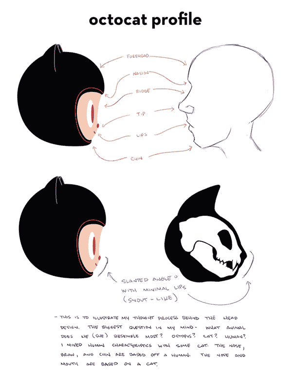
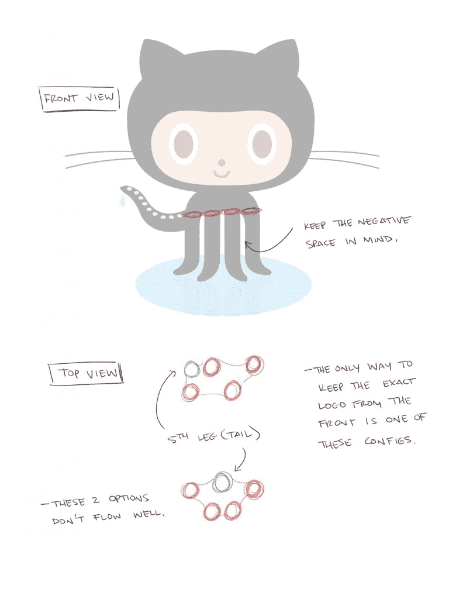
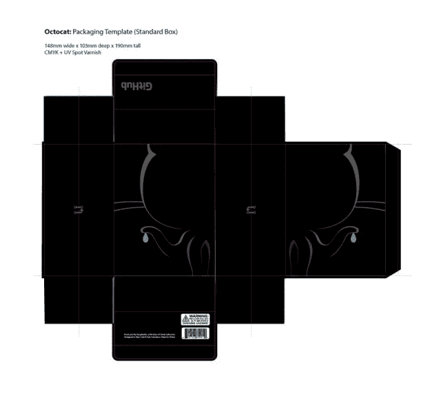

# 令人哭笑不得的 GitHub Octocat 雕像制作

> 原文：<https://thenewstack.io/the-dumbfounding-making-of-the-github-octocat-figurine/>

制作新的 GitHub Octocat 小雕像所花费的时间、精力和金钱令人惊讶。完整的细节在今天早上发布的一篇博客文章中。它详细描述了他们对猫的头骨进行的研究，以匹配雕像的脸。

它解释了他们是如何解决触手问题的。

以及他们是如何制作包装的。

上周，他们在一个视频中公布了这个塑料人的配乐，也许我们会在未来的 Octocat 超级英雄电影中看到。

[Vimeo](https://vimeo.com) 上 [GitHub](https://vimeo.com/github) 中的章鱼公仔。

我确信这个小雕像放在愿意支付 40 美元的开发商的桌子上看起来会很棒。

对细节的关注是惊人的。但是这种对代表一个品牌的数字的关注说明了 GitHub 可以花费多少现金来让这样一个生物看起来如此之好。更重要的是，它如何反映了公司选择的花钱方式。毫无疑问，这很无聊。但对我来说，这仍然有点令人哭笑不得，或许更能反映出这类资金雄厚的公司的文化。但是如果有人有不同的看法，我很想听听。

<svg xmlns:xlink="http://www.w3.org/1999/xlink" viewBox="0 0 68 31" version="1.1"><title>Group</title> <desc>Created with Sketch.</desc></svg>