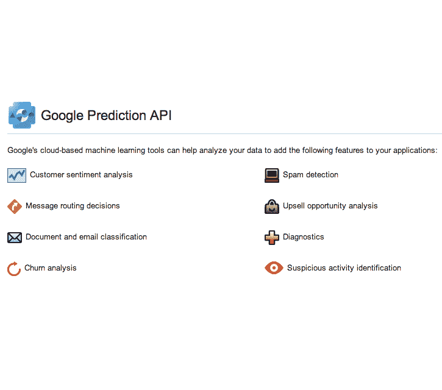

# 机器学习的出现

> 原文：<https://thenewstack.io/the-emergence-of-machine-learning/>

微软希望通过新的预测分析云服务 Microsoft Azure Machine Learning 来提高机器学习技术的可访问性。这项服务是一场运动的一部分，这场运动包括一种新的商业智能供应商，旨在帮助企业利用他们收集的越来越多的数据。

这项新服务是过去几年出现的几种机器学习技术之一。它显示了管理数据和预测性分析技术的需要，这些技术越来越需要用来分析复杂的数据结构。

微软表示，它利用为 Xbox 和 Bing 等其他产品开发的技术建立了这项新服务。这项服务将包括“可视化工作流程和启动模板”，旨在让用户轻松设置机器学习任务，微软机器学习公司副总裁 Joseph Sirosh 在一篇关于开发的博客文章中写道。

当他说建立[机器学习过程是艰难的](http://www.computerworld.com/s/article/9248891/Predictive_data_the_real_workhorse_behind_the_Internet_of_Things?pageNumber=1 "Computerworld")时，他是对的。在数据科学家需求量很大的今天，尤其如此。

一些企业正在尝试使用 BI 产品来组合他们从许多不同来源收集的数据，并进行预测性分析，以便更好地预测产品维修或客户行为等。市场上有许多新的 BI 产品，旨在使数据分析更易于使用，以便企业内更多的人可以使用它们。Birst、Good Data 和 Tableau 等公司就是这种新型商业智能供应商的一部分。

但是很少有商业智能产品做预测分析，或者即使做了，也不是很好。在大多数情况下，工程师必须做大量定制工作来开发进行预测分析的项目。这意味着他们不能非常敏捷，快速设置新的场景来学习新事物。

微软没有透露太多关于其服务的信息，它说一些客户正在使用这项服务的早期预览版，并计划在 7 月份发布公共预览版。西罗什[告诉纽约时报](https://bits.blogs.nytimes.com/2014/06/16/microsoft-unveils-machine-learning-for-the-masses/?_php=true&_type=blogs&_r=0 "The New York Times")这项服务将允许开发者使用 R，一种流行的开源编程语言来进行机器学习。他还告诉该报，大约有 100 家公司和大学已经在使用这项服务。

ZDNet 的 Mary Jo Foley 得到了一些展示这项服务的截图。

如果新的 Azure 机器学习服务能够做到微软所希望的，企业肯定会欢迎它。

也就是说，微软并不是唯一一个试图超越基于商业智能的定制实现的公司。今年早些时候，IBM 开始提供一项服务，让用户[访问云中的沃森超级计算机](http://www.wired.com/2014/01/watson-cloud/ "Wired")，这种方式旨在使企业更容易运行机器学习应用程序。

亚马逊网络服务的 [Kinesis](http://aws.amazon.com/kinesis/ "Amazon Web Services") 服务也可以用于机器学习。Kinesis 旨在允许处理实时流数据。

New Stack 创始人亚历克斯·威廉姆斯(Alex Williams)在为 TechCrunch[撰写文章时，将 kine sis](http://techcrunch.com/2013/11/14/amazon-kinesis-a-new-aws-service-to-process-real-data-streams/)描述为一项服务，旨在为实时应用程序设计，允许开发人员从任何数量的来源提取任何数量的数据，并根据需要进行缩放。

他写道“Kinesis 可以创建任意数量的跨多个可用区域的流。这些流没有“固有的”容量或速率限制。所有传入数据都跨可用性区域进行复制，以实现高可用性。

鉴于对能够帮助企业理解其数据的工具的需求，谷歌很可能也在研究类似的产品。它目前提供了一个预测分析 API。

 此外，还出现了一些开源项目，包括 [Apache Mahout](https://mahout.apache.org/) 和 [Predictionio](http://prediction.io/) ，这是一个用于构建智能应用程序的预测服务器，在 GitHub 上有超过 4600 颗星。

通过知识共享的特色图片[。](https://www.flickr.com/photos/schill/13309455373/in/photolist-58Y5dy-6i7qAL-4Npo8P-2u1gmi-eKApQ-oYpFk-6TVGG-cS7EZW-4w9tXh-5XWf3A-agnLeM-7Gc6C3-6bSkwi-5cwAAc-8JoDpy-6grD38-4mkPs9-899mPg-iKbrQg-Wrud8-WqNo4-mh7rov-b8x2si-aR7use-3pj9Tz-9bExpb-8Pdgzz-GmcL-8s31H-8TY2mL-nurWN-55JRqT-bHqqg8-JHogt-8vDn1-cS7vFA-iXjaN-4wDTPS-muL8V-3JFu8-7XpFw3-Vp3gB-7XmrNr-tPoB-7XmrQt-7XmrPP-7XmrRe-7XmrNR-7XmrQP-7XmrMT)

<svg xmlns:xlink="http://www.w3.org/1999/xlink" viewBox="0 0 68 31" version="1.1"><title>Group</title> <desc>Created with Sketch.</desc></svg>