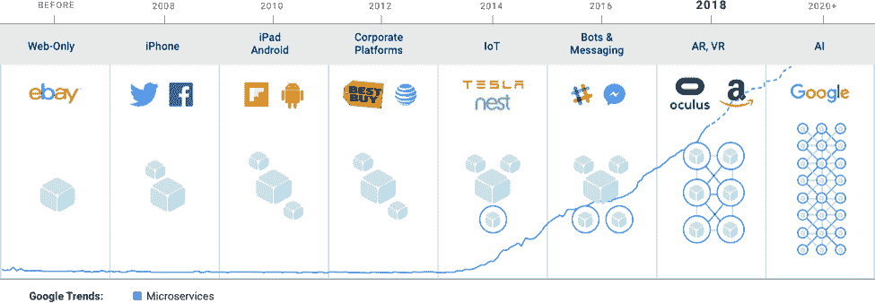
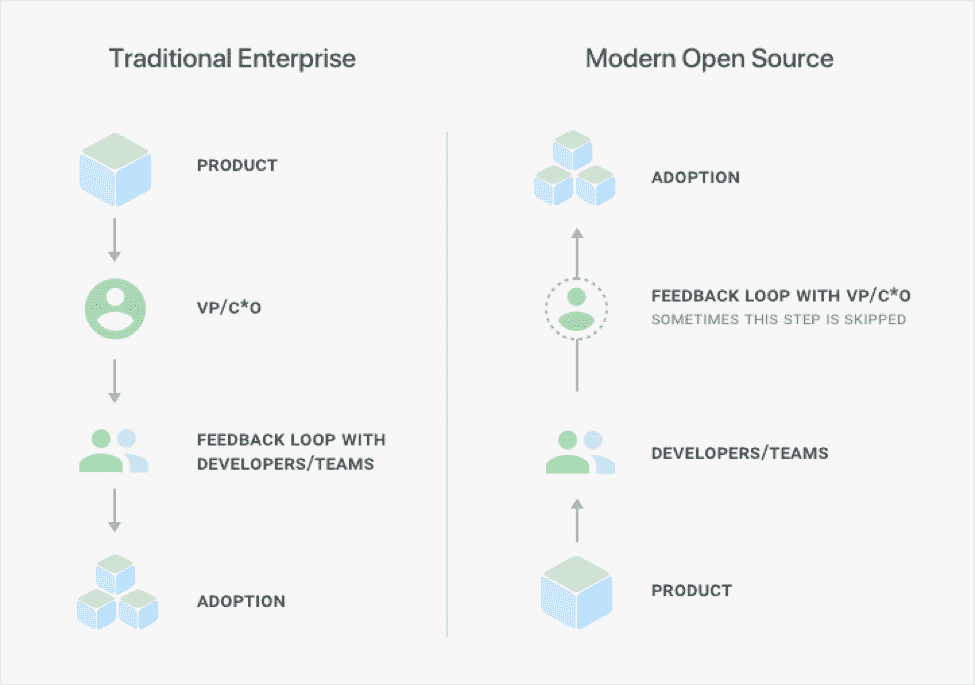
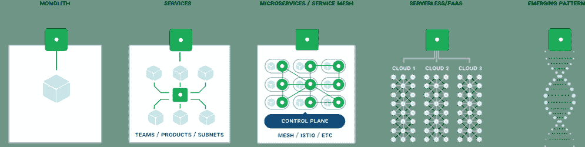
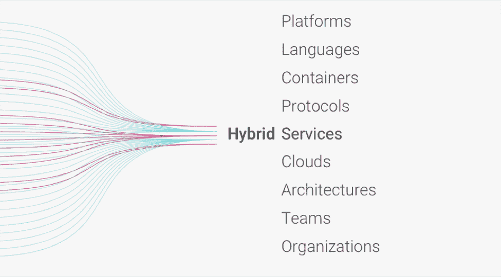
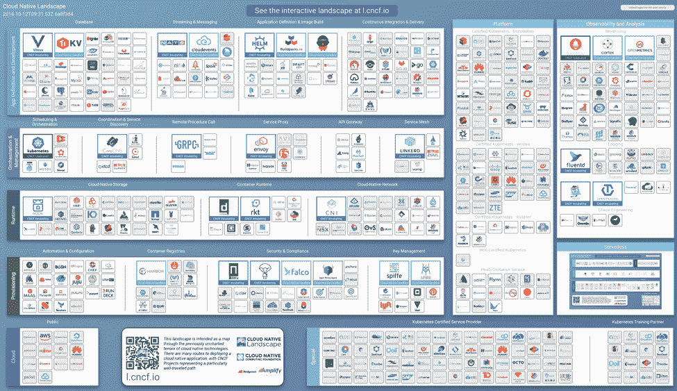
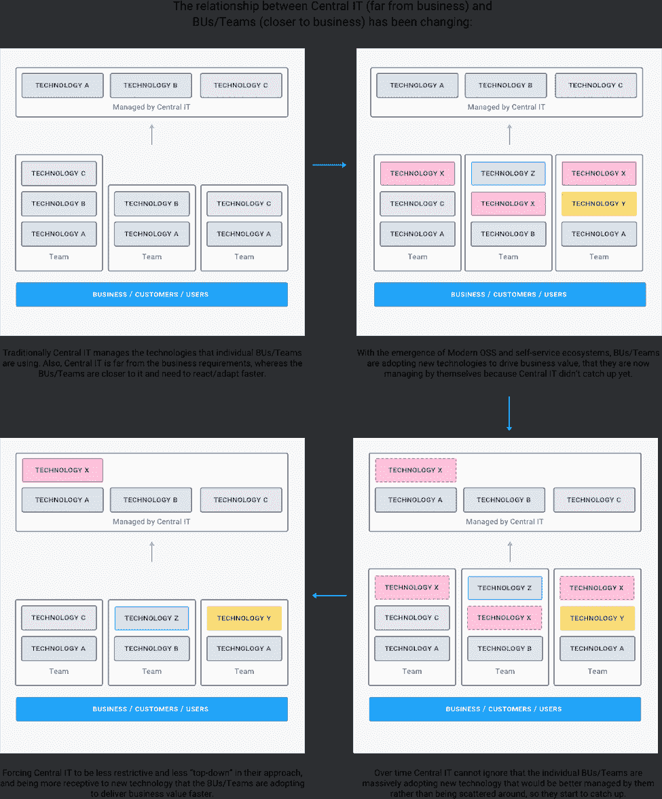

# 软件部落主义的终结

> 原文：<https://thenewstack.io/the-end-of-tribalism-in-software/>

 [马可·帕拉迪诺

马可·帕拉迪诺是一位发明家、软件开发者和互联网企业家，住在三藩市。作为 Kong 的首席技术官和联合创始人，他是 Kong 的合著者，负责公司产品的设计和交付，同时还在 Kong 和外部软件社区内提供围绕 API 和微服务的技术思想领导。在孔之前，Marco 于 2010 年共同创立了 Mashape，该公司成为最大的 API 市场，并于 2017 年被 RapidAPI 收购。](https://konghq.com/) 

在软件行业，你听过多少次开发人员为哪种编程语言更好而争吵？你听说过多少次*一种模式*可以解决我们前进中的所有问题？

当谈到我们的技术、编程语言和架构模式时，我们作为一个行业是非常部落化的——要么是我们的模式，要么是他们的模式；不是我的语言就是你的语言。很长一段时间以来，总是我们对他们。终于，这要结束了。

软件部落主义的终结和一个被广泛接受的混合世界的开始是一个在过去 30 年中一直在进行的转变，但它只是在五年前随着新软件生态系统的爆炸和企业开源采用的文化革命而以最新的形式成为现实。这个混合世界是一个新的时代，在这里，多种生态系统的实用性和可用性最终给了我们多种多样的选择，以一种前所未有的方式来构建我们的软件和设计我们的架构。这是一个多道程序语言，多平台和多架构的世界。这是一场革命——不仅是技术上的，也是组织上的。这是部落主义的终结。

## 一个全新的混合世界

接口比实现更重要的混合世界的愿景并不新奇。回顾软件架构的历史，我们可以发现它的根源是在 20 世纪 90 年代，当时 CORBA(公共对象请求代理架构)首次在企业中广泛采用。今天的许多现代架构都借鉴了那个世界的理念——主要是分布式、解耦、远程对象的理念。这听起来很像微服务，这正是触发软件部落主义终结的真正原因，这是由一个更大的潜在趋势驱动的:现代开源。

Docker (2013)和 Kubernetes (2014)开创了分布式和解耦系统的新时代，因此也开创了 API 的新时代。然而，微服务的基本原则有着深厚的历史渊源。

我们所知的传统开源由三个主要支柱决定:社区、生态系统和用户采用。更进一步，现代开源有第四个支柱:企业采用。现代开源产品的例子有 Docker、Kubernetes、Elasticsearch、Kafka、Kong 等等。

与传统的自上而下的企业软件相反，现代开源软件采用自下而上的方式

现代开源技术正在推动行业的技术、文化和组织革命，导致部落主义的终结和新的混合世界的开始。

> “开源对于生态系统的不同参与者来说扮演着不同的角色，但最好的角色是赋予开发者权力。在一个典型的公司中，开发人员不会做出很多软件决策，但这已经发生了很大的变化。”— Neha Narkhede，卡夫卡的共同创作人。

这种变化反映在三个主要趋势上:

### 1)不同的编程语言会共存。

重要的是接口 API。gRPC、Apache Thrift 和传统 HTTP APIs 等技术一直引领着这一趋势。我们正越来越多地进入一个世界，在这个世界中，不同的编程语言将在同一架构中共存，并通过网络上的 API(或事件)进行通信。微服务通过将开发人员从选择的编程语言中解放出来，并允许他们进行试验，帮助了这一概念。因此，更多的开发人员将精通更多的编程语言，他们的生态系统采用率也将随之增长。

### 2)不同的架构会共存。

每一个架构趋势，包括微服务和无服务器，都声称是世界上每一个问题的最佳解决方案。当你只有一把锤子时，一切看起来都像钉子。同样，对于编程语言，业界正在回归更实用的方法。我们理解我们的系统需要混合架构模式，其中整体式、微服务和无服务器系统将共存，以应对特定的技术或业务挑战。

这不会是一种或另一种架构，而是所有架构。更重要的是，我们要以一种方式来构建软件，这种方式允许我们在需求出现时相对容易地从一种架构模式转移到另一种架构模式。

### 3)不同的基础设施将共存。

对在最新、最好的基础设施上运行软件的追求将会一直存在，将多个基础设施整合为一个的需求也将一直存在。实际上，将大型系统迁移到较新的基础设施所花费的时间总是比发现更好的做事方法所花费的创新时间要慢。因此，对于大多数运行在混合平台上的大型组织来说，这将是事实上的现实。

它将是容器和虚拟机，甚至可能运行在多个云上。随着时间的推移，当转换成本降低而不是整合时，我们可能会看到相反的情况发生——同样，对于编程语言来说，云成为一种商品，只要我们有合适的跨云通信接口，部门和团队就会使用合适的云，为他们的用例提供最合适的服务集。

### 云战争

如果不把它与亚马逊、微软和谷歌之间的“云战争”联系起来，我们就不能谈论部落主义的终结。部落主义的终结与云战争并非巧合。事实上，他们是主要的驱动力。

为了获得更大的云客户群，并防止现有的参与者在云基础设施中占据准垄断地位，谷歌一直在为开源社区做出贡献，并通过大量投资于 CNCF 赞助的新的新兴生态系统，推动开放的 Kubernetes 平台基础设施的商品化。基础设施的商品化和开发人员思维中的思想领导力——在这个世界上，开发人员在决定生产工作负载应该在哪里运行方面拥有更大的权力——反过来，允许像谷歌这样的云挑战者从更成熟的云供应商那里吸引更多的客户。

开发人员和他们的心态对任何现代开源玩家来说都变得越来越重要，因为最终这是推动企业采用的因素。就像[阿尔赖兹和杰克·特劳特](https://adage.com/article/al-ries/a-words-jack-trout-positioning/309341/)会说的，这是“为你的思想而战”

CNCF 风景(来源:CNCF)。点击“embiggen”

进入现代开源新世界(由大型新兴技术和生态系统构成)的企业组织将不得不调整其流程和组织结构，以反映业务单位和团队正在做出关键技术决策的现实，这些决策并不总是得到“中央 IT”的支持，由于开销的原因，中央 IT 传统上不看好混合组织。他们需要为所有这些移动部件、混合架构和技术找到技术解决方案，以帮助管理这种新的复杂性。

我们看到了一种自下而上的集中式 IT 方法，在这种方法中，技术采用不再由“卓越中心”决定(自上而下)，而是由集中式 IT 优化和集中底层业务单位和团队已经做出的技术决策，使它们成为更易于管理的集中式集群。这是从根本上发生的，因为更接近业务和客户的团队必须以比中央 IT 能够适应和接受新技术更快的速度来反应和适应新的业务需求。

因此，控制平面将带来更多的商业价值，有助于了解生产中运行的技术以及所有相关部分之间的组织依赖性，并有助于随着时间的推移将各个团队和业务部门采用的最常见技术整合到集中的集群中。

因此，欢迎来到由现代开源驱动的混合世界，在这里不同的编程语言、架构和平台一起运行，以实现每个团队都在追求的非常具体的业务目标。由于开放和自助服务生态系统的出现，开发人员变得越来越聪明，界面成为跨越不同技术甚至组织边界的主要沟通手段，在这样一个世界中，寻找工作的最佳工具成为一种追求，而不是“我们与他们”的问题

本质上，软件在吃软件——部落主义。

由[克里斯蒂安·威迪格](https://unsplash.com/photos/1XGlbRjt92Q?utm_source=unsplash&utm_medium=referral&utm_content=creditCopyText)在 [Unsplash](https://unsplash.com/search/photos/peace?utm_source=unsplash&utm_medium=referral&utm_content=creditCopyText) 上拍摄的专题图片。

<svg xmlns:xlink="http://www.w3.org/1999/xlink" viewBox="0 0 68 31" version="1.1"><title>Group</title> <desc>Created with Sketch.</desc></svg>