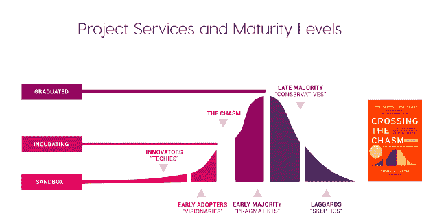

# 特使代理在 CNCF 找到了一个家，亚马逊网络服务

> 原文：<https://thenewstack.io/the-envoy-proxy-finds-a-home-at-the-cncf-amazon-web-services/>

虽然作为服务网的僚机获得了最多的关注，但公司正在基于[特使代理](https://www.envoyproxy.io/)开发专注于安全性、可观察性、UI 管理等的产品。

最近的一个是 [AWS 应用 Mesh](https://aws.amazon.com/de/blogs/compute/introducing-aws-app-mesh-service-mesh-for-microservices-on-aws/) ，这是一个代理的管理控制平面，亚马逊[本月早些时候在 re:Invent 上作为预览](https://www.youtube.com/watch?v=GVni3ruLSe0)推出。这是一个服务网格，允许您轻松地监控和控制在亚马逊 ECS、EKS 和 Kubernetes 上运行的微服务应用程序之间的通信。

Envoy 是一个服务网格基础，它提供常见的实用程序，如服务发现、负载平衡、电路中断、日志记录和跟踪异构应用程序架构。它可以用作服务代理，在服务之间路由请求，或者用作边缘代理，处理外部流量。

这是继 Kubernetes 和 Prometheus 之后，第三个从[云原生计算基金会](https://www.cncf.io/projects/)孵化器毕业的项目。

一个具有可扩展过滤器链机制的 L4 (TCP)代理，它可以用于各种用例，包括透明 TLS 代理、MongoDB 嗅探、Redis 代理和复杂的基于 HTTP 的过滤和路由。它支持传入和传出连接的 HTTP/2 和 gRPC。

六月， [HashiCorp 发布了与 Kubernetes 和 Envoy 的原生集成](https://thenewstack.io/hashicorp-aims-to-lighten-management-of-the-multicloud/)。现在，Kubernetes 内部和外部的服务可以自动配置，通过内置代理或特使代理安全地连接。

与此同时， [Twistlock](https://thenewstack.io/is-istio-the-most-next-gen-next-gen-firewall-ever/) 一直在吹捧 Istio-Envoy 组合的安全能力。

## **多语言环境**

据该项目的主要维护者 Matt Klein 称，拼车服务 Lyft 在 2015 年创建了 Envoy，当时它正从单一架构过渡到用 Python 编写的微服务

“我们看到了微服务的许多技术和人力扩展问题——可观察性，试图了解发生了什么和一般的网络问题，”他说。

“在高度动态的环境中建立网络非常复杂。大多数公司都是通过建立像 Java 的 [Finagle](https://twitter.github.io/finagle/) 或网飞的 [Hystrix](https://github.com/Netflix/Hystrix) 这样的库来解决这个问题。显然，这意味着您必须使用基于 Java 的架构。使用多种不同语言的多语言公司没有这种能力。你只能用一堆不同的语言构建一个库，或者遍历并构建一个代理。”

特使是继 Kubernetes 和 Prometheus 之后，第三个从 CNCF 孵化项目毕业的项目。

Envoy 是用 C++编写的，主要是性能原因，但它可以在用 Go、Java、PHP 和 Python 等语言编写的组件之间形成网格。

Klein 说，Envoy 是为不断变化的动态配置和部署而从头开始构建的。它专注于高级负载平衡，专注于其他代理只有付费版本才有的东西。其他代理通常使用静态配置文件，必须手动部署和重新加载。他说,“特使”是为了有一个集中的配置系统，可以将配置发送给所有的代理，并以一致的方式做到这一点。

“这确实简化了此类系统的操作，因为它允许数据平面或代理与控制平面或配置管理系统分离，”他解释道。

## **平台无关**

Envoy 与应用程序一起运行，并通过以平台不可知的方式提供通用功能来抽象网络，[Red Hat 云应用程序的首席架构师 Christian Posta](https://twitter.com/christianposta) 在针对新堆栈的[客座博文](https://thenewstack.io/microservicing-with-envoy-istio-and-kubernetes/)中解释道。

通过 Envoy mesh 运行所有服务流量可提供一致的可观察性，并在单一位置调整整体性能和添加功能。此外，他指出，像 Envoy 这样的服务代理可以帮助将弹性、服务发现、路由和指标收集等职责向下推到应用程序之下的一个层。

Posta 写了一系列关于使用 Envoy 进行[断路](http://blog.christianposta.com/microservices/01-microservices-patterns-with-envoy-proxy-part-i-circuit-breaking/)的博文；[重试和超时](http://blog.christianposta.com/microservices/02-microservices-patterns-with-envoy-proxy-part-ii-timeouts-and-retries/)；还有[分布式追踪。](http://blog.christianposta.com/microservices/03-microservices-patterns-with-envoy-proxy-part-iii-distributed-tracing/)

Datawire 首席执行官兼联合创始人 [Richard Li](https://www.linkedin.com/in/richardli/) 表示:“在构建开源 [Ambassador API Gateway](https://www.getambassador.io/) 时，我们选择了 Envoy Proxy，而不是 HAProxy 和 NGINX，因为它的功能集和前瞻性眼光。“此外，由于 Envoy 是在 Lyft 制造的，因此不存在专有版本 Envoy 的商业压力。正因为如此，Envoy 社区非常出色——他们只关注具有最佳代码的正确功能。”

在这篇[博文](https://blog.getambassador.io/envoy-vs-nginx-vs-haproxy-why-the-open-source-ambassador-api-gateway-chose-envoy-23826aed79ef)中，他写了更多关于公司选拔过程的内容。

Klein 说，展望未来，该项目将成为社区前进的动力，但他对 [Quic](https://fasterdata.es.net/data-transfer-tools/quic-quick-udp-internet-connections/) 网络协议、Kafka 支持、增强的可扩展性以及将 Envoy 引入移动和物联网设备有一些想法。

云本地计算基金会和 TwistLock 是新堆栈的赞助商。

专题图片:**[高速公路巡逻，ATC 日本 1960](https://www.flickr.com/photos/42424413@N06/9757119633/in/photolist-fScMJz-canrVG-c8x1Lu-cansx9-canp9W-c8wtnh-c8x2xw-QKVaQy-21vURH9-cansAG-Js7GXr-cansKA-canvzy-c8UbVG-canryA-canq7Y-cant5d-canrcY-canqVo-canvuU-canuN3-c8EDgf-cantj7-canrp7-canuHy-c8wrqE-4XB34S-SFtgTP-bUG943-abMzhE-aqc3Q8-9fhyJZ-rjdx6L-FRK4r-iVMWs-canpXj-229Cmro-VwEvEb-aEoyhH-qm6EJ9-canvDj-canqso-c8EFqw-Anxo9s-9XdYJF-canojS-canrZU-c8EUvm-canprj-canuCN)[恩菲尔德勋爵](https://www.flickr.com/photos/42424413@N06/)。根据 [CC BY-SA 2.0](https://creativecommons.org/licenses/by/2.0/) 获得许可。**

**<svg xmlns:xlink="http://www.w3.org/1999/xlink" viewBox="0 0 68 31" version="1.1"><title>Group</title> <desc>Created with Sketch.</desc></svg>**