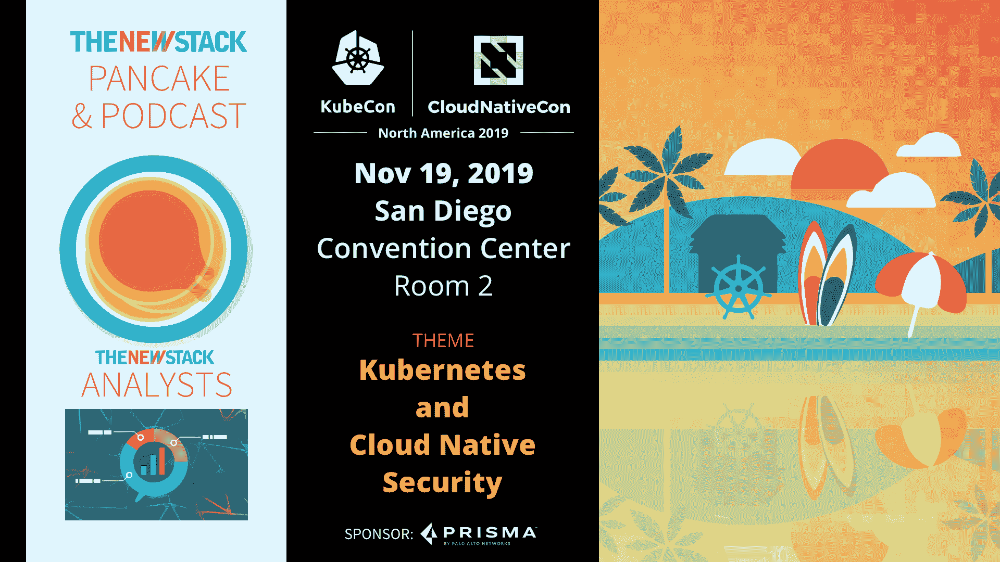

# 现代应用程序开发的基本要素

> 原文：<https://thenewstack.io/the-essential-elements-of-modern-application-development/>

[KubeCon + CloudNativeCon](https://events19.linuxfoundation.org/events/kubecon-cloudnativecon-north-america-2019/) 赞助了这篇文章，期待 [KubeCon + CloudNativeCon NA](https://events.linuxfoundation.org/events/kubecon-cloudnativecon-north-america-2019/) 于 11 月 18-21 日在圣地亚哥举办。

 [戴维·巴特勒

David 是 Docker 的产品营销总监，专注于分布式应用程序开发和治理以及开发人员工具。在加入 Docker 之前，他曾在领先的数据科学、数字体验、分析和云应用平台软件公司领导产品营销战略和营销团队。](https://www.linkedin.com/in/davidpbutler1/) 

到目前为止，大多数组织至少在某种程度上已经意识到各行各业的企业是如何通过软件定义他们的产品的。通过应用程序交付，该软件的功能集必须快速迭代，以跟上用户需求不断发展的趋势。这些迭代的速度正迅速成为竞争的必要条件。如果一个企业不能快速应对变化，它将无法生存。

对于设计和架构现代应用程序的开发人员来说，现实是这些应用程序不是由技术驱动的；它们由用户的旅程驱动。在整个过程中优雅地处理需求和变化是现代应用程序的一项重要任务。

那么，是什么让应用变得现代呢？要回答这个问题，我们首先要问应用程序的“期望状态”是什么样子的。对于大多数业务服务，这包括通过各种终端设备(移动和固定边缘设备)在全球范围内接触分散的用户群。

可靠地预测增长和需求甚至旅程是困难的，但是将这样的需求转化为受治理的和适应性强的应用程序架构甚至更难，尤其是如果它的规模特征是僵化的或者局限于早期假设的话。

快速而经济地处理需求变化的能力，使得足迹的弹性成为一级架构需求。随着应用程序的业务重要性的增长，其服务级别要求的程度很可能也会随着时间的推移而相应地发生变化。

如果我们同意变化是持续的和必不可少的，那么对于必须跟上变化步伐的现代应用程序来说，其架构或物理足迹没有确定的最终状态。两者都在不断发展，因为业务驱动的需求需要额外的功能，以支持在软件中定义和交付新的业务服务。

因此，期望的状态不是达到有限特征集的固定交付点。理想状态是能够持续交付新功能，对业务和用户的中断最小甚至没有。

## 自动化应用程序开发生命周期

应用程序开发的实用方法是从小处着手，提供一些功能，作为可以独立构建、治理和管理的软件服务，但在运行时协作执行应用程序。随着时间的推移，这些服务可以与后续服务一起利用，以满足新的业务驱动的需求。

大规模工程需要自动化的应用程序生命周期，其中的功能可以通过当前和新的服务作为一个连续的管道来开发和交付。对于由作为容器运行的微服务组成的应用程序来说，自动化生命周期的好处很多。随着应用程序的范围随着新服务的加入而扩大，开发人员需要一个自动化的过程来独立地构建、测试和交付这些服务。

## 现代应用程序开发技巧

应用程序在不断发展，给组织留下了要么适应要么半途而废的最后通牒。应用的范围正在不断扩大，从传统和棕色地带到云原生和微服务，随着这种扩大，资源变得越来越分散。正是这些分布式应用将推动商业的未来。但首先，公司必须熟悉如何以统一和可重复的方式构建、管理和保护这些应用，无论是内部、混合、多云还是边缘应用。

这里有三个技巧可以帮助指导开发过程:

*   现代化您的应用程序 —开始现代化过程的一个快速方法是将您的应用程序容器化。容器有助于实现微服务，因为它使得获取应用程序的独立功能并将其用作构建块变得更加容易。通过将棕地或绿地应用容器化，开发人员为微服务架构铺平了道路，并创造了一种更简单的方式来构建、共享和运行分布式多服务应用。容器化从根本上意味着给应用程序带来可移植性、可伸缩性和可共享性的好处。
*   **灌输更好的协作** —随着微服务成为企业内的一种常见做法，不再是一个团队负责一个给定的应用程序。单个应用程序现在通常需要多个不同开发团队的协作，而这些团队需要一个清晰、统一的工作流程来加快开发和交付，同时确保整体安全性。统一的端到端平台改善了协作，提供了更好的控制，并确保了整个应用程序生命周期的安全性。
*   **简化开发流程** —企业迫切需要能够将现代应用程序的复杂性抽象化的解决方案。开发人员需要一种方法来轻松捆绑构成这些现代应用程序的分布式服务和资源(由多个容器和不同的配置格式和操作参数组成)，以便它们可以在任何地方轻松共享、安装和运行。

## 前进的道路

掌握现代应用程序开发并非易事。公司拥有成千上万的应用程序并不罕见，这些应用程序组合不仅数量在增长，而且复杂性也在增加。再加上需要从现有的应用程序中获取更多的价值，同时能够拥抱未来的技术(如无服务器平台、服务网格或其他更新的替代技术)，这一挑战只会变得更加艰巨。幸运的是，这并不像最初看起来那么困难。随着容器化、协作和简化，对于正在开发现代应用程序并需要降低复杂性和处理持续变化的公司来说，有一条前进的道路。

通过 Pixabay 的特征图像。

<svg xmlns:xlink="http://www.w3.org/1999/xlink" viewBox="0 0 68 31" version="1.1"><title>Group</title> <desc>Created with Sketch.</desc></svg>