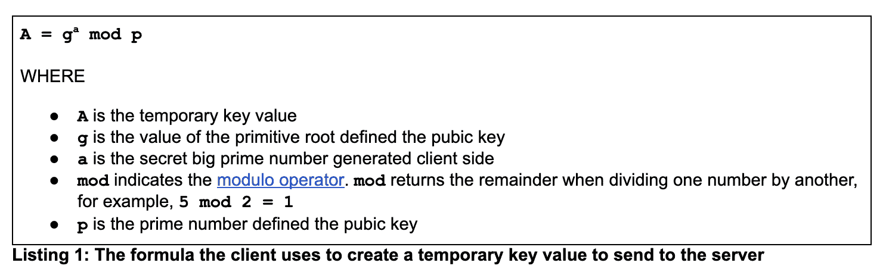
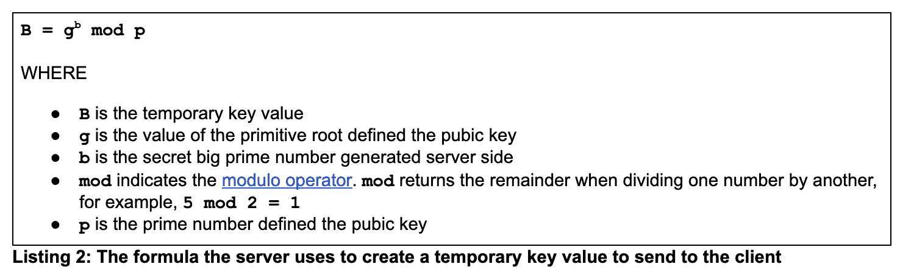
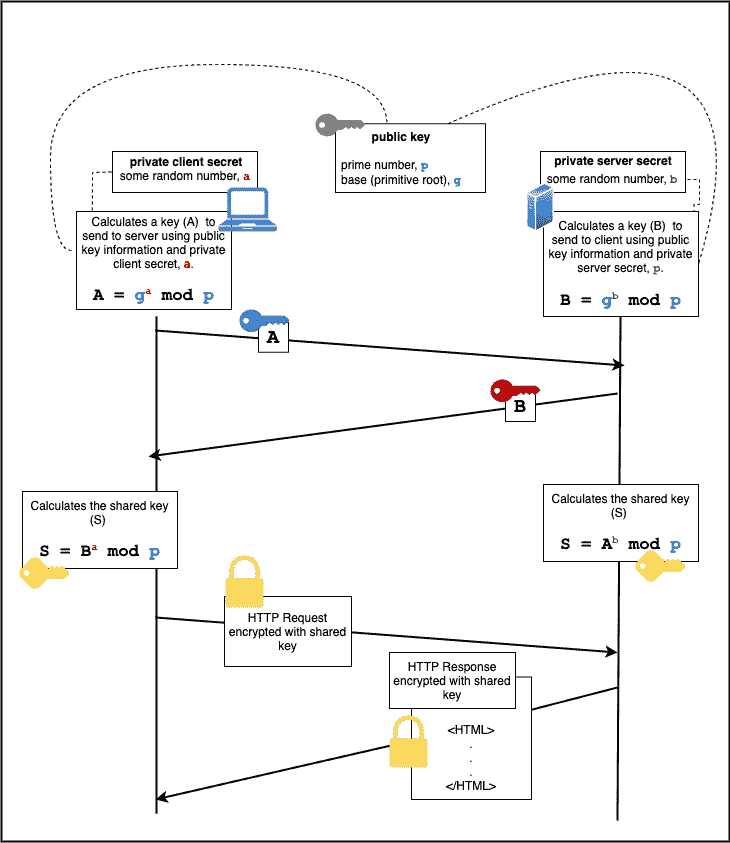
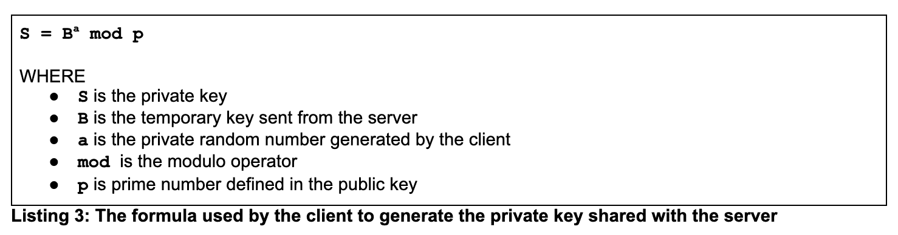
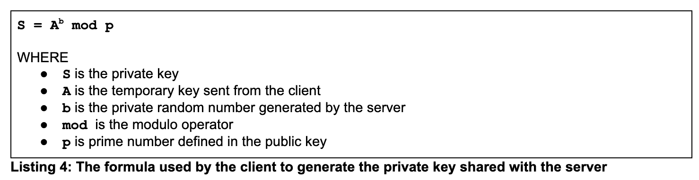
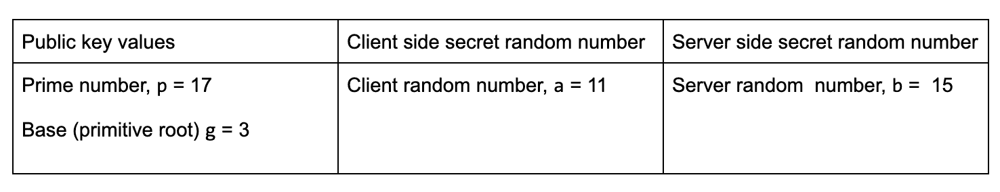
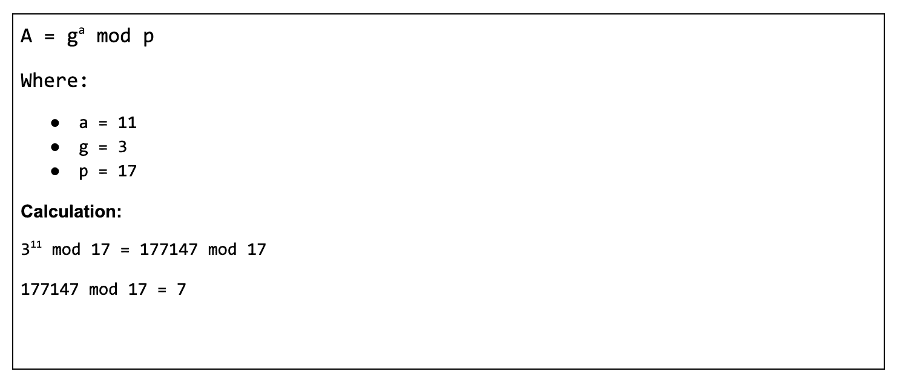
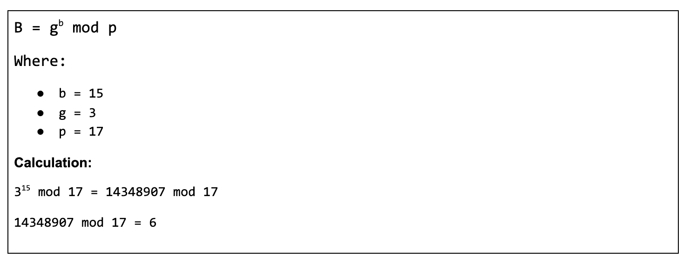
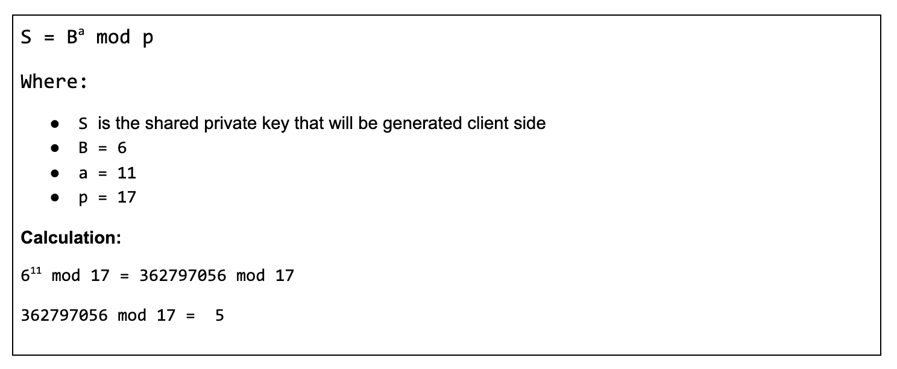
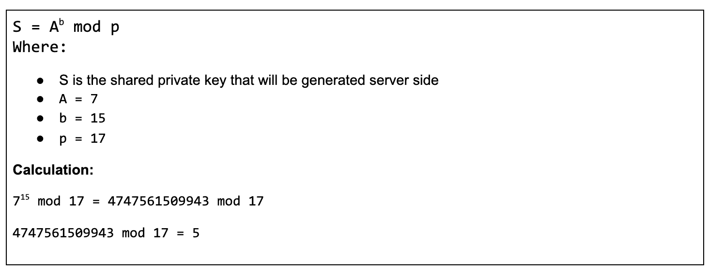

# 在 TLS 1.3 下使用临时密钥的要点

> 原文：<https://thenewstack.io/the-essentials-of-using-an-ephemeral-key-under-tls-1-3/>

 [鲍勃·雷瑟曼

鲍勃是一名软件开发人员、系统架构师、行业分析师和技术作家/记者。他精通各种编程语言和开发框架。他目前的重点是微服务应用开发和面向微服务的应用架构。](https://www.linkedin.com/in/bobreselman/) 

只要有互联网，就有安全威胁。幸运的是，好人已经能够想出办法来应对越来越多的危险。但这是有性价比的。在引入传输层安全性(TLS) 1.3 之前，在浏览器和网站之间做一些像“Hello World”这样简单的事情需要大量的请求和响应往返才能建立安全连接。

自从 1995 年 Netscape 发布安全套接字层(SSL)以来，安全协议已经发生了很大的变化。不幸的是，SSL 有一些重大的安全漏洞，导致美国政府在 2014 年限制其在交换 HIPAA 数据和敏感政府信息的网站上的使用。相反，[政府强制](https://nvlpubs.nist.gov/nistpubs/SpecialPublications/NIST.SP.800-52r1.pdf)使用下一代安全协议传输层安全(TLS)。

TLS 解决了 SSL 中的安全漏洞，但是 TLS 1.3 之前的版本仍然存在扩展握手带来的性能问题。在 TLS 1.2 中，连接握手至少需要两次请求-响应交换，才能向服务器验证客户端。

今天，TLS 1.3 已经将密钥创建握手简化为一次请求和响应往返。这一次往返使得客户机和服务器共享相同的加密密钥成为可能。但是加密密钥从来不会在互联网上传播。相反，密钥是在客户机和服务器上同时独立创建的，使用一种称为 Diffie-Hellman 密钥交换的技术。密钥是“及时”创建的用于描述该过程的术语称为临时密钥交换。

本文的目的是分享在 TLS 1.3 下使用临时密钥交换的细节。我将详细介绍 Diffie-Hellman 的机制。这里涉及到几个数学公式，我会一一介绍。此外，为了更加清晰，我添加了一个额外的附录，将实际数字插入到 Diffie-Hellman 公式中。您可以在本附录中看到实际的计算及其结果。

在我们深入研究之前，请注意 Diffie-Hellman 密钥交换确实存在一些安全漏洞。我将在文章的最后讨论这些漏洞。然而，尽管有缺点，Diffie-Hellman 以一种值得注意的方式实现了数据加密。与公钥/私钥加密固有的客户端和服务器之间的公钥交换不同，在 Diffie-Hellman 下，用于加密的密钥交换从不通过互联网传输。该技术的细节将在接下来的章节中揭示。

## 了解 TLS 1.3 握手和密钥创建

如上所述，TLS 1.3 加密数据的方法之一是使客户端和服务器都能够使用相同的私钥加密数据。但是这个私钥从来不会在互联网上交换。它的工作方式是客户端和服务器都创建自己的密钥值。客户端具有唯一的密钥值。服务器有一个唯一的密钥值。客户端和服务器将使用它们各自的秘密密钥值以及双方都知道的公共密钥来创建临时对称密钥。

这个公钥由一个非常大的质数 p 和基值 g 组成，基值 g 是一个原始根。[本原根](https://en.wikipedia.org/wiki/Primitive_root_modulo_n)的概念来自于[模运算](https://www.khanacademy.org/computing/computer-science/cryptography/modarithmetic/a/what-is-modular-arithmetic)领域。本原根是一个特殊的整数，它与一个数除以另一个数时的余数有关。(原始根并不是一个特别复杂的概念，但是理解它确实需要一些时间——时间，很遗憾，这超出了本文的范围。)关于同时使用大素数和本原根作为公钥，需要理解的重要事情是，它创建了一种数学关系，非常适合 Diffie-Hellman 密钥交换技术。

在进一步讨论暂时密钥加密的细节之前，让我们停下来做一个简短的回顾。

现在，当需要使用短暂的对称密钥进行安全数据交换时，客户端和服务器都将独立创建一个特殊的密钥值。这个密钥值是一个特定于每一方的随机数。此外，客户机和服务器将共享一个公钥，该公钥由一个非常大的质数和一个原始根数组成。公钥暴露在因特网上并不特别麻烦，因为，听起来很奇怪，它的值一方面只在客户端的独特隐私中有用，另一方面在服务器的独特隐私中有用。

现在让我们转到客户端，检查密钥的创建。

在客户端，客户端将应用公钥中定义的素数和原始根以及私有的随机数值，使用特殊的数学公式创建密钥。下面的清单 1 显示了用于创建密钥值的公式，密钥值由变量 **A** 表示。

【T2

然后，客户端将该数字发送给服务器。

在服务器端，服务器像客户机一样执行公式，在这种情况下，创建一个密钥 **B** 。但是服务器将使用它的私有随机数 **b** ，如清单 2 所示。

服务器将把号码 **B** 发送给客户端。

现在的情况是，服务器有客户端的临时值 **A** ，客户端有服务器的临时值 **B** 。下面的图 1 说明了密钥生成和交换背后的动态过程。(该图还显示了对称私钥是如何生成的。但是，我们不要想得太多。)

图 1:在 Diffie-Hellman 数据加密下，客户机和服务器都使用一个从不交换的私钥。

在密钥交换发生后，客户端和服务器都将生成共享的私钥，双方都将使用该私钥来加密和解密数据。

客户端和服务器都使用的另一个公式有助于生成共享私钥。下面的清单 3 显示了客户机创建私钥时使用的公式。

下面的清单 4 显示了服务器用来创建共享私钥的公式。

客户机执行上面清单 3 所示的公式和服务器执行上面清单 4 所示的公式的结果是，它们最终将拥有相同的私钥。因此，客户端和服务器现在都能够使用对称密钥交换加密数据。

(如果您想更详细地了解 Diffie-Hellman 和临时密钥的机制，请查看本文末尾提供的附录。它演示了在 Diffie-Hellman 下使用实数创建对称私钥。)

短暂的对称密钥加密在某种程度上几乎是神奇的。没有完全相同的公钥或私钥会在互联网上传播。

为了让黑客创建私钥，他们必须获得由客户端生成的私有随机数和由服务器生成的私有随机数。这意味着在数据交换时，实际上要侵入客户机和服务器。或者，黑客需要通过反复试验来找出在客户机和服务器上用作密钥值的非常大的随机数。

## 没有完美的加密技术

当然，正如我们在网络安全的现实世界中所了解到的，如果一个黑客有足够的时间和金钱，那么真的没有什么是不可能的。主要是因为它依赖于随机使用一个大的质数，Diffie-Hellman 是那些有时间、专业知识和资源来破解密码的邪恶分子可以劫持的技术之一。

关于黑客 Diffie-Hellman，需要理解的重要一点是，这种性质的坏人在民族国家层面工作，这是网络战发生的地方。打破 Diffie-Hellman 需要工业实力资源。这通常不是一个无聊的青少年可以做的课后恶作剧。

然而，历史表明，无论我们认为加密技术有多完美，总会有新的威胁出现。即使是广泛用作 Diffie-Hellman 替代方案的 RSA 加密方法也存在漏洞。在撰写本文时，业内许多人建议将 Diffie-Hellman 的使用转换为[椭圆曲线 Diffie-Hellman](https://www.ecdhe.com/) 或[完全散列 MQV](https://www.fhmqv.com/) 。然而，这些替代品也不是防黑客的。尽管看起来令人不快，但有时“真的很好”是我们所能得到的，不管我们多么渴望完美。

## 把所有的放在一起

在本文中，我相当深入地介绍了 TLS 1.3 仅使用一个请求/响应对实现短暂对称密钥加密的方式。请注意，虽然加密技术很重要，但数据交换安全只是其中的一部分。TLS 支持许多加密协议。然后是 TLS 证书的问题，以及各种浏览器和互联网服务器的支持。

TLS 1.3 是一个非常大的话题。但是，希望本文讨论的单次往返握手和短暂会话密钥的优点将有助于阐明 TLS 1.3 协议的大部分内容。

## 示例:使用实数生成临时密钥

下面是生成在客户机和服务器之间共享的对称密钥的演示，如上面的图 3 所示。该示例使用实数代替变量占位符。 

### 客户端生成的密钥被发送到服务器

### 服务器端生成发送给客户端的密钥

### 客户端生成共享私钥

### 服务器生成共享私钥

注意，客户端和服务器相互独立生成的密钥的值是 **5** 。因此，5 是共享私钥的值，它将用于加密和解密 internet 上客户端和服务器之间交换的数据。

为了了解有关安全开发实践的更多信息，Linux 基础培训和认证与开源安全基金会(OpenSSF)合作，提供了一个免费的三个在线培训课程系列，涵盖安全软件开发:[需求、设计和重用(LFD104x)](https://training.linuxfoundation.org/training/secure-software-development-requirements-design-and-reuse-lfd104/) 、[实现(LFD105x)](https://training.linuxfoundation.org/training/secure-software-development-implementation-lfd105/) 和[验证和更多专业主题(LFD106x)](https://training.linuxfoundation.org/training/secure-software-development-verification-and-more-specialized-topics-lfd106/) 。

<svg xmlns:xlink="http://www.w3.org/1999/xlink" viewBox="0 0 68 31" version="1.1"><title>Group</title> <desc>Created with Sketch.</desc></svg>