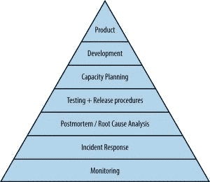

# 现场可靠性工程师的发展

> 原文：<https://thenewstack.io/the-evolution-of-the-site-reliability-engineer-sre/>

[现场可靠性工程师的演变](https://thenewstack.simplecast.com/episodes/the-evolution-of-the-site-reliability-engineer)

在这一集的 [The New Stack Makers](https://thenewstack.io/podcasts/makers) 播客中，我们与两位 DigitalOcean 校友和 [SREcon 2020 Americas](https://www.usenix.org/srecon) 会议的联合主席在一起，他们经历了两次截然不同的旅程，成为技术网站可靠性工程师中最受欢迎的角色之一。顾名思义，SRE 就是关注组织中最重要系统的可靠性的人。

谷歌在 2003 年创造了“网站可靠性工程师”这个词，但它肯定已经以不同的形式存在了几十年，例如灾难恢复和生产测试人员，因为工程师们总是试图保持医疗保健和金融等基本服务在线。随着我们转向云原生模式，需要这些工程师从事生产和运营工作，重点关注自动化和可观察性，对 SRE 的需求也在不断增长。随着系统变得越来越分散，这个角色已经从仅仅支撑一个整体的正常运行时间演变为一个关系经纪人，他对整个组织的系统有看法，有解决问题的诀窍，并且热爱度量标准。

Emil Stolarsky 是一名前端基础设施工程师，他为 Shopify 构建了可脚本化的负载平衡器，为 DigitalOcean 构建了内部 Kubernetes 平台，目前正在撰写一本关于[企业 SRE 角色如何适应小型组织](https://incidentlabs.io/book/)的书。 [Tammy Bütow](https://twitter.com/tammybutow) 十多年前开始在银行业进行灾难恢复测试，然后去了 Digital Ocean 从事事故响应工作，之后加入 Dropbox 担任 SRE 的正式职位。最后，在 2017 年，她加入了[混沌即服务小精灵](http://gremlin.com)担任其负责人 SRE。

对于 Bütow 来说，SRE 关注的是您的系统及其数据的可靠性和耐用性。这个角色专注于那些系统中最重要的部分，当它们崩溃时，每个人-从事件管理到业务管理到开发人员到客户支持到实际客户-都会感到痛苦。Stolarsky 补充说，SRE 将可靠性视为一个需要特别关注、工具、实践和目标的一流特性。

斯托尔斯基指出[谷歌的服务可靠性层级](https://landing.google.com/sre/sre-book/chapters/part3/)很好地概括了这一角色，并且很好地形象化了客人们所说的最重要的话:“服务可靠性人员是可以在整个公司工作的人。”这有助于适应与大多数工程职位不同的文化，SRE 是一个擅长沟通和区分优先次序的人——并且沟通这些优先次序。但是你仍然需要技术来支持这些关系。

也许你可以称站点可靠性工程为 DevOps 运动的一个分支。这绝对是通常的 sysadmin 服务管理方法的替代方法，这种方法将开发和运营视为两个不同的团队。sre 跨越了有望消失的障碍的两边，因为工程师有一半的时间花在运营上。

我们的客人说，不同之处在于，SRE 专注于公司能够可靠地为客户提供的外部价值，而 DevOps 则更多地关注内部增长速度。然而，这两种角色都有共同的原则，如持续学习和接受失败，减少孤岛以提高透明度和分担责任，以及自动化以加速创新。DevOps 和 SRE 都与业务层面的目标紧密相关。

从某些方面来说，SRE 自本世纪初就已经存在，但它的需求肯定在增长，而且似乎也在民主化，越来越多的人开始认为自己已经在这样做了。Stolarsky 说，这是因为任何规模的组织都可以从遵循 SRE 最佳实践和服务水平目标中受益。

当然更多的组织需要更多的 SREs！请收听本播客，了解更多关于 SRE 最佳实践的信息，以及成为一名最佳实践者需要具备的条件。

### 在这个版本中:

*   [1:58:](https://thenewstack.simplecast.com/episodes/the-evolution-of-the-site-reliability-engineer?t=1:58) 小公司和大公司 SRE 的区别。
*   [6:58:](https://thenewstack.simplecast.com/episodes/the-evolution-of-the-site-reliability-engineer?t=6:58) 如何定义 SRE，为什么公司需要它。
*   [10:14:](https://thenewstack.simplecast.com/episodes/the-evolution-of-the-site-reliability-engineer?t=10:14)SRE 和德沃普斯的区别。
*   [14:14:](https://thenewstack.simplecast.com/episodes/the-evolution-of-the-site-reliability-engineer?t=14:14) 任何公司都需要的基本 SRE 角色。
*   [17:27:](https://thenewstack.simplecast.com/episodes/the-evolution-of-the-site-reliability-engineer?t=17:27) 推荐工装。
*   [23:54:](https://thenewstack.simplecast.com/episodes/the-evolution-of-the-site-reliability-engineer?t=23:54)SRE 的多元化，并讨论 2020 年 SRECon Americas

### 本集提到的工具:

<svg xmlns:xlink="http://www.w3.org/1999/xlink" viewBox="0 0 68 31" version="1.1"><title>Group</title> <desc>Created with Sketch.</desc></svg>