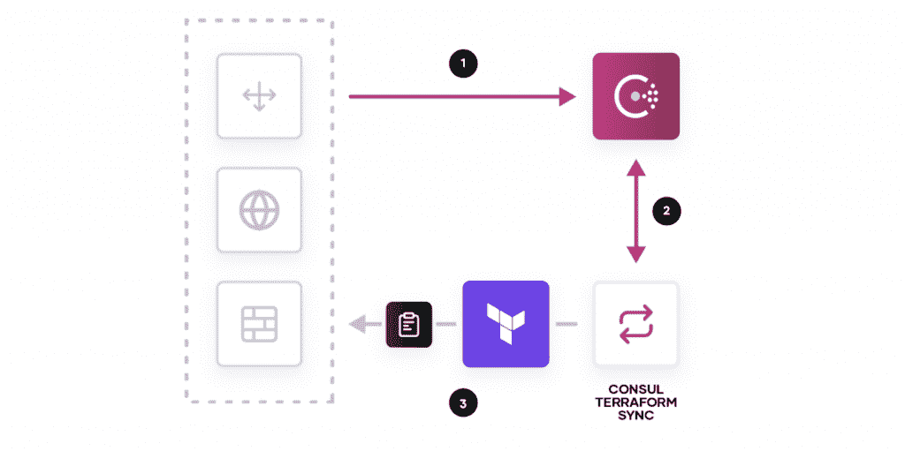

# 向基于服务的网络发展

> 原文：<https://thenewstack.io/the-evolution-to-service-based-networking/>

乍一看，云时代已经从根本上改变了我们思考网络的方式，这一点似乎很清楚。我们现在在定义的边界之外运营，网络可以跨越多个数据中心或云。但是，与一切都存在于内部数据中心的时代相比，网络真的改变了那么多吗？

 [彼得·麦卡伦

Peter 是位于旧金山的 hashi corp Consul 的高级产品营销经理。如果他没有研究发现和管理微服务的最佳方式，或者谈论基于云的网络，你可能会发现他在户外发现了真正的云。](https://www.linkedin.com/in/petercmccarron/) 

毕竟，这仍然是关于建立一致的连接和实施安全策略。那么，为什么当谈到云时，一切都显得如此不同和复杂呢？

为了更好地了解现代网络的发展，重要的是后退一步，确定定义这些变化的核心工作流，包括:

*   发现服务
*   保护网络
*   自动化网络任务
*   控制访问

在本文中，我们将逐一介绍这些工作流，并讨论如何将它们结合起来，以实现基于服务的现代网络解决方案。由于我在 HashiCorp 工作，我将使用[hashi corp consult](https://github.com/hashicorp/consul#consul--)——一个开源工具——来获取上下文、示例和参考资料。当然，也有其他解决方案可以用来实现类似的结果，但我最熟悉的是 Consul。

## 服务发现

公平地说，应用程序或服务身份并不是一个新概念。网络专业人士总是希望知道在给定网络上运行的应用和服务，它们位于哪里，以及它们是否可达。新的变化是对这些环境的改变的频率急剧增加。对连续交付模型和微服务的推动造成了手动跟踪形式的瓶颈。使用电子表格或[配置管理数据库(CMDB)](https://en.wikipedia.org/wiki/Configuration_management_database) 工具来跟踪 IP 地址并不能真正扩展到云环境，那么网络运营商应该怎么做呢？

进入服务发现的概念。服务发现只是自动识别网络上正在运行的程序，知道它的位置以及它是否可以实时到达。

对这种自动化的需求导致了 Consul 或 Zookeeper 等服务发现工具的产生。当 2014 年首次推出 [Consul 时，它的核心功能是作为一个动态服务注册中心——本质上是一个跟踪应用程序的目录。使用这种注册中心，用户可以将自动化脚本与应用程序部署打包在一起，以便在这些目录中自动注册应用程序，从而创建应用程序信息的单一来源。](https://www.hashicorp.com/blog/consul-announcement)

随着应用交付的发展，Kubernetes、Mesos 和 Docker Swarm 等编排器集成了发现功能，以减少对这些手动脚本的需求。虽然这很好，但这对网络的发展意味着什么呢？实际上，很多。

网络仍然需要基于服务身份，因为这是协调器跟踪事物的方式，但是从静态的基于 IP 的网络到这些服务发现功能提供的基于服务的网络解决方案的转变可能是对网络最有影响的变化，使应用程序身份成为网络策略的基础。

## 对安全的影响

网络向基于服务身份的网络需求的转变也会对其他工作流产生级联效应。首先，也可以说是最重要的，是安全问题。虽然服务发现可以解决更动态地跟踪更改的问题，但它不能帮助您对这些应用程序应用一致的安全策略。

正如我前面提到的，加强安全性和对敏感数据的访问是一个核心的网络需求。我们采用防火墙和负载平衡器的原因是为了帮助确保只有正确的服务被授权访问网络。如果您依靠 IP 地址来跟踪网络上正在运行的内容，这种方法非常有效。但是现在我们使用服务身份来代替，我们该做些什么呢？

简短的回答？基于服务身份而不是 IP 地址创建安全策略。如果您知道应用程序的身份，难道不应该能够围绕这些身份创建实施机制吗？不幸的是，传统的网络安全策略并不真正支持这种模式。这种方法迫使开发团队依赖基于票证的系统，并给操作人员和开发人员都带来了瓶颈和挫折。幸运的是，有两种方法可以应对这一挑战:消除操作员的手动任务，并将安全策略从第 3 层转移到第 7 层。

## 消除基于票证的瓶颈

让我们从消除手动任务开始。为了理解这是如何工作的，看一下另一个现代化的工作流是有帮助的:基础设施供应。HashiCorp Terraform 和 CloudFormation 等工具旨在消除手动配置基础设施的过程。当我们谈论安全自动化时，关注解决方案的未来状态可能很有诱惑力，但这意味着公司准备完全放弃他们现有的环境和投资。

这可能并不总是一个好主意。

在基于服务的网络环境中，一切都是为了建立深度安全。防火墙解决方案仍然在现代数据中心发挥着重要作用，但这并不意味着更新和策略实施不能自动化。只是防火墙策略更改应该基于事件而不是票据来触发。因为我们保持服务变更的动态记录，所以将这些变更视为具有需要执行的后续任务的事件是有意义的。你可能听说过这个概念被称为配置管理或第二天管理，这就是 Consul-Terraform-Sync 等工具的设计目的。

## 将安全策略从第 3 层移动到第 7 层

然而，随着用户将服务推进到更新的基于云的环境中，他们可能会寻求摆脱一些现有的基础设施，并探索其他安全方法，即将安全策略从第 3 层迁移到第 7 层。本质上，这意味着:

*   基于服务身份实施流量管理策略
*   要求相互认证
*   加密传输中的通信

如果这些方法听起来很熟悉，那是因为[这正是服务网格所做的](https://www.consul.io/docs/intro/usecases/what-is-a-service-mesh)。这可能解释了为什么我们看到了新的服务网格产品的爆炸式增长。服务网格也正在成为在网络层构建零信任安全的常见模式，这意味着网络内部的流量在默认情况下是不可信的，并且必须验证到服务的每个连接。

有关服务网格的更多信息，请参见新堆栈中的以下文章:

## 实现自动化

基于服务的网络环境的下一个核心工作流是实现自动化。现代基础设施中的一个流行主题是能够创建用于在云中构建可重复环境的模板，也称为[基础设施即代码](https://www.hashicorp.com/resources/what-is-infrastructure-as-code)。然而，这一概念已经超出了云计算资源的范畴。如今，你可以通过平台提供商做任何事情，从[订购披萨](https://github.com/ndmckinley/terraform-provider-dominos)到[创建 Spotify 播放列表](https://learn.hashicorp.com/tutorials/terraform/spotify-playlist)。

但这真的是自动化吗？将环境模板化并使其可重复是很好的，但是有人最终处于另一端，仍然触发了变化。持续管理呢？前面提到的第二天的故事呢？因为应用程序会根据组织的需要不断添加或删除，所以现代网络就是对给定环境的持续管理。我们如何在基于服务的网络故事中应用这种持续的自动化？

我们有几个选项，它们与上面安全部分概述的解决方案相对应。首先，您可以将自动化原则应用于用于管理服务间连接的关键网络硬件。在更传统的环境中，您可能会依赖应用交付控制器(ADC)之类的东西来管理服务交互的规则。然而，这些系统依赖于 IP 地址，并且通常是手动配置的。您可以使用供应工具，但该解决方案只是改变了您应用更改的方式；它不会删除实际的交互部分。

相反，目标应该是尝试使用一个随着服务变化而动态变化的系统。毕竟，您正在跟踪应用程序的添加或删除，为什么这些事件不能使用已经注册的新服务信息来触发配置更改呢？在 HashiCorp，我们将这一概念描述为网络基础设施自动化(that Consul 和 Terraform(也是开源的)可以通过合作实现这一点。

此外，随着组织转向更新的环境，他们通常希望应用流量管理策略或基于身份自动连接服务。理想情况下，您应该设置规则来说明允许哪些服务相互通信。不管每个服务部署了多少个实例，它们都将遵循由服务标识定义的相同规则。听起来熟悉吗？这是应该的，因为这又是一个服务网格可以帮助的事情。

在这一点上，你可能想知道为什么我没有说服务网格解决了一切。这是因为服务网格只是更广泛的解决方案的一部分。向基于服务的网络的转变是服务网格运作的核心，但是服务网格并不适用于所有环境。为了概述工作流的真正解决方案，我们必须探索基于服务的网络适用的所有环境和应用类型，而不仅仅是微服务和容器。

## 控制网络访问

既然我们已经涵盖了以动态方式发现服务、应用基于身份和事件的安全策略以及将自动化集成到我们的网络解决方案中的需求，那么还剩下什么呢？如果最终用户和客户端不能真正访问网络或运行在网络上的服务，这些事情都没有意义。

回想一下过去使用 ADC 和防火墙管理访问的方式，我们很快就会遇到之前发现的同样的扩展和瓶颈问题。此外，一旦您将网络策略转变为基于服务的网络解决方案，维护传统的网络技术实际上会阻碍实现一致性的能力。理想情况下，您希望应用与管理东西向(服务到服务)流量相同的基于服务的流量管理解决方案来管理南北向(入口/出口)流量。

阅读本文的 Kubernetes 用户可能会认为，对于这个挑战已经有了一个解决方案:入口控制器。一般价值主张是，入口控制器允许访问 Kubernetes 集群，能够应用某些流量管理功能和安全协议。好处是这些控制器被视为 Kubernetes 环境的一部分，因此知道集群中的其他服务。然而，这些入口控制器并不总是像用户期望的那样动态。通常，它们需要更长的部署周期来增加给定群集中的副本数量。

为了应对这一动态挑战，Kubernetes 社区引入了[网关 API 规范](https://gateway-api.sigs.k8s.io/)来增强目前由 ingress 解决方案支持的内容。网关 API 规范允许对网关服务、路由进行更加动态的管理，并且与服务网格更加一致。这就是为什么我们构建了[领事 API 网关](https://www.consul.io/docs/api-gateway)作为 Kubernetes 网关 API 规范的实现。这使得用户能够为所有流量管理和对服务网格的访问创建一致的控制平面。

如果您不熟悉 Kubernete Gateway API 规范，它允许用户将一个专用的网关 pod 部署到一个集群中，然后通过一个定制的资源定义动态地应用路由。使用这个模型，Kubernetes 用户可以根据需要在集群中部署多个版本的网关，并对每个网关实例应用特定的路由策略或监听器协议。当与服务网格相结合时，用户可以使用单一解决方案控制南北向和东西向流量的流量策略，并且全部基于服务身份。

当然，典型的企业环境不仅仅包括 Kubernetes。除了 Kubernetes，我们需要将这些相同的政策和实践应用到所有环境中。容器可以由多个协调器运行，有些应用程序永远不会被容器化。我们仍然需要一个中央控制平台来管理基于服务身份的网络访问。这样做可以在云和非云环境中实现一致性。

## 结论

正如我们所见，在应对现代网络挑战时，用户需要解决四个关键工作流:发现服务、保护网络、自动化网络任务和控制访问。这四个工作流构成了基于服务的网络的核心原则。

重要的是要记住，行业向基于服务的网络的转变经历了多年的发展。这就是服务网络解决方案不断实现新功能的原因。然而，即使网络在继续发展，核心目标仍然是:从基于 IP 的网络转向基于服务的网络。接受这一变化可使网络与现代应用交付实践的速度相匹配，而不会影响网络部署和管理方式或安全策略的一致性。

<svg xmlns:xlink="http://www.w3.org/1999/xlink" viewBox="0 0 68 31" version="1.1"><title>Group</title> <desc>Created with Sketch.</desc></svg>