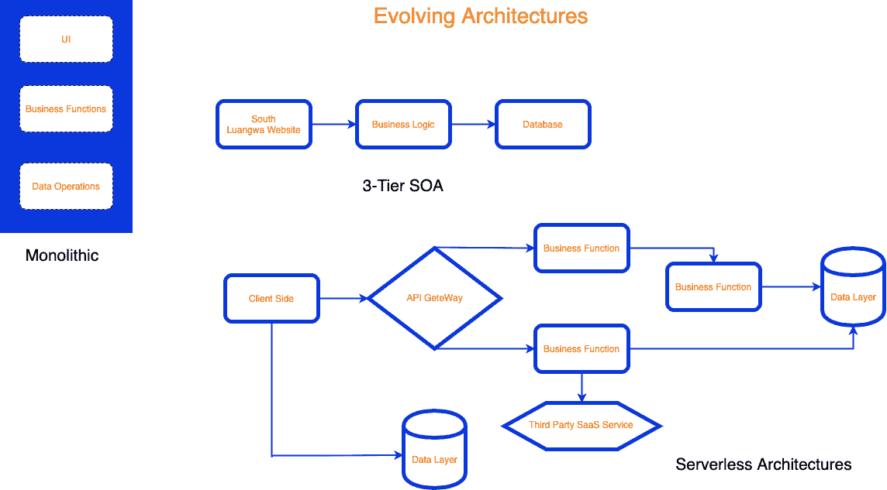

# 开发人员和调试的进化故事

> 原文：<https://thenewstack.io/the-evolutionary-tale-of-developers-and-debugging/>

当世界在 20 世纪 40 年代经历混乱的时候，开发者正在迈出他们的第一步。这是开发人员的故事，他们经常隐居，很难理解。我们旨在探索开发人员是如何随着时间的推移而进化的，以及他们是如何通过调试成为他们最强大的生存武器的。

## 黑暗时代

我们无畏的开发者的故事开始于早期，那时计算机还在世界上萌芽，以普通人无法理解的大型机械机器的形式出现。根据计算机的定义，这个故事可以追溯到人类早期。(然而，出于本文的目的，我们将根据我们的定义范围，将宾夕法尼亚大学创建并于 1946 年推出的 [ENIAC](https://www.youtube.com/watch?v=k4oGI_dNaPc) 视为第一台数字计算机。)

可以预料，与我们现在考虑的调试相比，那时调试 ENIAC 是一种完全不同的体验。为了把我们从类似于 ENIAC 计算机的机械怪兽带到我们现在都熟悉的优雅的代码行，必须发生大量的进化。所以很自然地，在整个进化过程中调试也发生了变化，尤其是当开发人员意识到调试工具类似于火——在可怕的环境中提供必要的保护。

因此，为了方便起见，我们将跳过这部分历史，进入调试历史的下一个重要时刻:日志和断点。

## 当开发者发明了日志

 [萨尔吉尔·优素福

Sarjeel 是 Atlassian 的产品经理，负责引导 Atlassian 工具在其功能集中促进 DevOps 功能。](https://www.linkedin.com/in/syedsarj/) 

日志允许开发人员在代码执行中感兴趣的地方打印语句。这提供了在复杂系统中跟踪代码执行的能力，尽管很粗糙。它允许用户跟踪预先配置的警告、错误，并简单地跟踪执行流程。最后，开发人员对他们的软件系统的状态有了第一次了解。通过在本地文件或远程日志服务器中显示这些日志，开发人员已经达到了一个关键点，即推进他的调试实践以减轻构建软件系统的任务。

日志记录的长期好处保证了这个概念在快节奏的软件领域中的长久性。在不中断代码执行的情况下提供见解的能力是一个主要的好处。此外，日志也将自己转变为现在所谓的跟踪，以便更好地与分布式系统和云原生微服务配合使用。通过跟踪，开发人员可以利用基于日志的洞察力来调试复杂的分布式系统和在云运动的狂热中捕获的软件。在这个软件的新时代，日志无疑已经证明了自己是开发人员的朋友。

然而，也有不利之处变得难以忍受，尤其是在规模上。首先，日志语句会导致大量的噪音，使它们难以使用。这些日志语句必须打印出来，因此会使打印出来的文件变得混乱。因此，即使对于那些配置日志的人来说，调试也会变得非常困难。

另一个陷阱是伐木成本。因为这些日志必须在某个地方打印出来，所以存储日志的成本很容易超过日志记录的好处。如果我们不小心我们正在打印的东西，这尤其是真实的。[大卫·德·保利斯](https://www.linkedin.com/in/davide-de-paolis-98ab9815/)，[古德游戏工作室](https://www.goodgamestudios.com/)，[的技术负责人最近分析了](https://dev.to/dvddpl/watch-out-your-cloudwatch-logs-or-it-could-be-expensive-438b)AWS cloud watch 日志的成本，以强调避免成本失控的最佳实践。他发现，如果开发人员要打印他们认为有用的每一条日志语句，他们可能会招致令人痛苦的 AWS 账单。

因此，日志记录是至关重要的，但是开发人员受到他们可用资源的限制，并且必须执行平衡行为。

## 调试器革命

随着软件开发的发展，我们看到了调试工具的诞生。这些调试器带来了著名的断点，允许开发人员获得他们系统的快照视图。开发人员现在可以执行他们的代码库到一个特定的点，然后暂停执行。这种暂停状态允许开发人员以 IDE(集成开发环境)及其集成调试器工具很好地呈现的方式调查他们系统的状态。

对于软件开发来说，调试工具是革命性的，尤其是在与 IDE 集成时。现在，几乎没有一个现代软件是在不使用调试工具的情况下开发的。然而，我们已经到达了我们的时间线上的一个点，对于我们今天的开发者来说，即使是这个非凡的成就也变得过时了。

这是因为软件系统现在正在利用云计算和分布式系统的进步。因此，我们看到调试工具中的断点根本无法填补调试方法中的缺口。一个问题是，当使用断点时，代码库需要在调试模式下运行。因此，考虑到多线程、分布式服务和在云原生环境中对远程服务的依赖性以及多服务架构，我们实际上并没有复制我们系统的实际状态。

因此，考虑到技术和软件的新时代，我们看到了重新定义调试实践以更好地适应新世界的趋势。

## 新世界，新的调试策略

当开发人员现在开始她的新世界之旅时，很明显，传统的日志记录和断点将不足以保护她免受即将到来的危险。因此，我们已经看到了一些新概念的形成，比如不间断断点，其目的是结合日志记录和断点的优点。

封装在调试器新时代中的不间断断点，允许开发人员调试他们的代码，而不必忍受系统中的任何中断。这意味着这些工具允许开发人员在真实环境中执行调试。此外，通过跟踪日志的组合，这些调试器还克服了云计算和分布式系统兴起带来的困难。

这些新工具与早期的工具形成了鲜明的对比。当时，在远程环境中一步一步调试简直是一个梦想。Lambda 函数和 Kubernetes 等技术的诞生让那些考虑调试的人感到害怕。然而，开发人员不必再害怕这些技术，因为一个新的调试时代正在到来，以解决新世界的问题:远程调试。

利用不间断断点的远程调试允许开发人员在任何环境下运行的代码库中的任何一行设置非侵入式断点。这将允许远程调试器捕获所有重要的信息，例如在不间断断点处包含变量状态的消息和快照。更好的是，开发人员将获得所有这些洞察力，而不必中断他的系统流程。

## 结论:你好新世界

开发人员进入新世界的旅程才刚刚开始，远程调试和不中断断点等概念仍在不断发展，以满足新时代的确切需求。幸运的是，这些开发人员并不孤单，因为像桑德拉这样的公司正在提供远程调试解决方案来帮助开发人员进步。桑德拉的解决方案甚至被更恰当地命名为[桑德拉助手](https://www.thundra.io/sidekick)，为开发者在这个旅程中提供急需的助手。

随着软件实践和我们向世界发布系统的方式的发展，支持实践也在发展。开发人员已经见证了调试工具在这一永恒的发展过程中的突破，其中每个阶段都伴随着一种新形式的调试工具或概念。随着云计算和分布式系统的兴起，我们也看到了远程调试的兴起，第三方工具供应商也注意到了这一点。当我们经历这个新时代时，我们只能想象下一个工具时代会是什么样子。我们只知道，开发者永无止境的旅程，一路上点缀着许多成果。

<svg xmlns:xlink="http://www.w3.org/1999/xlink" viewBox="0 0 68 31" version="1.1"><title>Group</title> <desc>Created with Sketch.</desc></svg>