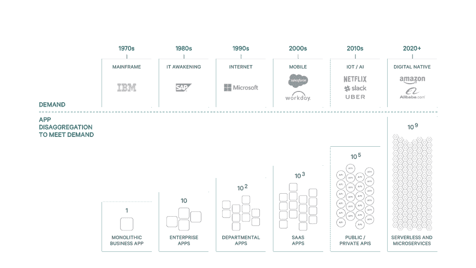
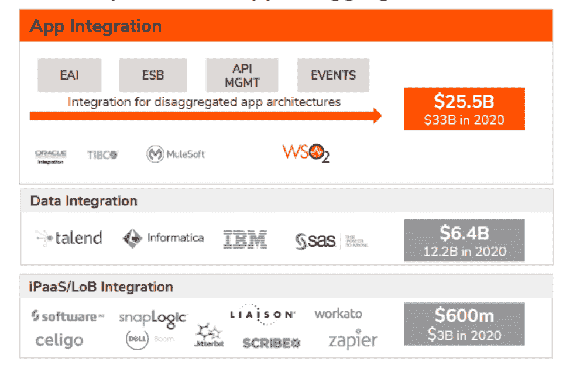

# 爆炸式端点问题:为什么一切都必须成为 API

> 原文：<https://thenewstack.io/the-exploding-endpoint-problem-why-everything-must-become-an-api/>

 [泰勒·朱厄尔，WSO2 首席执行官

泰勒是最大的开源集成提供商 WSO2 的首席执行官，也是 Toba Capital 的合伙人。他创建并运营了云 DevOps 公司 Codenvy，该公司于 2017 年被红帽收购。作为风险投资人、天使投资人和董事会成员，他带领 DevOps 公司获得了 1 亿美元的投资，包括 WSO2、Cloudant(被 IBM 收购)、Sauce Labs、Sourcegraph、ZeroTurnaround(被 Rogewave 收购)、InfoQ 和 AppHarbor(被微软收购)。此前，Tyler 曾在 Oracle、Quest、MySQL 和 BEA 公司工作，并撰写了三本关于 Java 的书籍。](https://wso2.com/) 

未来的消费者将期望使用放在口袋里的设备，以一顿饭的价格按需获取所有人类知识和服务。这需要一种可以将任何东西连接到任何东西的数字体验，并不断适应不断变化的数据和服务。

很简单，每个未来的应用程序可能都需要一种方法来*编程世界，*一种连接、访问和控制地球上每个数字和物理资产的方法。

没有人能想象下一个数字体验会是什么。但是为了让它存在，未来的程序员将需要安全地访问世界上的数据和系统。我们必须让每种形式的数字资产都变得可编程，将一切都转化为应用编程接口(API)。一切都必须——也将会——成为 API。

这里有一些我们必须解决的问题:

1.  大规模:有数十亿数字资产:传统应用、SaaS 应用、API、SDK、物联网设备、数据库和身份。然而，这些资产中的大部分还不可访问，也不可编程。
2.  数据多样性:我们[每天产生 2.5 万亿字节的新数据](http://www.iflscience.com/technology/how-much-data-does-the-world-generate-every-minute/)，并且这一速度正以指数级增长。这些数据中的大部分都是静态的，动态应用程序无法访问，最多只能微弱地访问，响应时间不太适合按需反应。
3.  不幸的异构性:API 的发现、访问、接口和格式没有标准化，导致编程语言、框架和开发人员消费模型(如容器和无服务器)的碎片化，以此来处理复杂性。难怪 70%的 It 经理在他们的组织中存在 IT 技能缺口。
4.  令人眼花缭乱的需求:随着记录系统的数字化成为世界未来的竞争优势，使用预计将大幅增加(见安德森的*软件正在吞噬世界*)。全球互联网用户同比增长 10%，超过 35 亿(来源:玛丽·米克尔 2017 年互联网趋势报告)，消费者使用量稳步增长，平均消费者每天在线花费 5.6 小时(来源:eMarketer 2008-2016)。

当其他人可以通过网络访问 API 时，它们就变成了一个*端点*。无论是数据、应用还是无服务器功能，一切都在成为可编程的端点。

我们已经有数十亿个端点，并且增长是指数级的。20 年后，全球将有 1 亿程序员；结合供应商提供的可以在单个请求的持续时间内按需创建 API 的产品，这将我们推向一种模式，在这种模式中，无数的微端点被部署为日常活动的一部分。当开发人员可以定期创建 API 并以最低的成本按需操作它们时，通过拆分任务来创建更多端点的动机会导致端点爆炸。

> 在不到 20 年的时间里，全球可编程端点将从数十亿增长到超过 1 万亿。我们正面临爆炸式的端点问题。

## 几乎所有的企业都会感到痛苦

我们编写的未来应用程序将越来越多地跨这些不同的(有时是短暂的)端点进行编程。端点之间的弹性通信是集成的原则。这并不容易。挑战包括财务补偿(对于构建端点的人)、事务管理和事件排序(端点之间)、断路器(管理端点使用)、服务发现和协议处理(新端点)以及服务中介(跨端点系统)。这些是每个软件项目在利用甚至几个端点时都必须解决的难题。

如今，很少有人致力于标准化端点的管理方式。相反，API 集成市场正在分裂，产生的集成问题将比今天程序员所经历的问题大一个数量级。

这种爆炸式的端点问题增加了企业的挑战，这些企业正在努力跟上业务线需求、供应商集成、市场智能、来自 M&A 的系统集成以及锁定资产的启用，因为它们正在努力成为一个数字化的原生组织，并实现安德森的软件吞噬世界的愿景。

这种疼痛的主要原因包括:

1.  大多数企业数字资产仍然是不可访问的，被捆绑到大型单片应用程序中，并且还没有被转换成可编程的端点。
2.  受物联网设备多样性、每个定制应用程序都有独特的 API 以及 NoSQL 运动支持数据模式多样性的推动，要转换为端点的资产类型已经支离破碎。
3.  承诺解决方案的集成供应商没有考虑到问题的多样性、动态性和异构性——最终交付的集成产品缺乏弹性，也不容易被替代。
4.  数字资产治理是静态驱动的，而不是围绕实时监控设计的，这确保了变更控制变得不受欢迎且成本高昂。总是比瞬息万变的现实落后多步。
5.  将任务分割成许多微端点正在引领行业走向跨云集成的兴起:需要在跨越多个端点的网络上编写弹性事务。有数百种编程框架可以简化这个问题，但所有的解决方案仍然需要定制逻辑、隐藏的边缘情况和痛苦的调试时间。
6.  服务台和监控驱动的 SLA 降低了它们的调试价值，因为 IT 了解到观察静止的数字资产无法查明根本原因。随着应用性能管理(APM)供应商竞相用全栈、动态事务可观察性取代监控，人们正在进行反思。

## 不断增长的需求正在导致分解

很少再考虑构建大型整体应用程序，因为它们被广泛认为是脆弱的、高维护性的，并且容易出现可伸缩性问题。相反，巨大的客户需求导致了谷歌、优步和亚马逊等公司的崛起，这些公司转而构建了分散的组件化系统，以满足客户需求。

这是我们五十年来看到的趋势的延续。包括微服务、无服务器和 API 在内的大规模分解方法正在成为软件设计的标准。现在人们普遍认为，应用分解是保持快速市场灵活性和无限可伸缩性的唯一方法。事实上，开发人员正在通过 API 优先来接受这种分解，企业每 18 个月就会将内部端点数量增加一倍。

## 集成突然成为最热门的市场

应用程序集成市场规模巨大，每年销售的软件和服务价值近 250 亿美元。随着分解架构推动可编程端点的增加，集成将成为每个组织和每个开发人员的问题。

在 Salesforce 今年早些时候以 65 亿美元的高价收购 Mulesoft 后，Gartner 的副总裁兼研究员 Massimo Pezzini 说:“集成，据说是 IT 界最不酷的东西，最终却成了最热门的东西！”

## 开源解决方案对于集成分散的架构至关重要

随着集成终端的日益多样化，开源软件和供应商是确保技术跟上市场需求的唯一可行方法。

封闭源代码、开放核心和 iPaaS 供应商没有准备好迎接这一挑战。端点的协议、数据格式和 API 变化如此频繁，以至于只有通过开源提供的社区、协作和共享方法才能满足集成商的未来需求。

开源帮助客户和社区贡献者更深入地参与——并最终最大化集成解决方案和整体价值。开源可以更具反应性，允许快速引入新技术，以连接更多不同的数字资产，从而接触到更多的开发人员。

<svg xmlns:xlink="http://www.w3.org/1999/xlink" viewBox="0 0 68 31" version="1.1"><title>Group</title> <desc>Created with Sketch.</desc></svg>