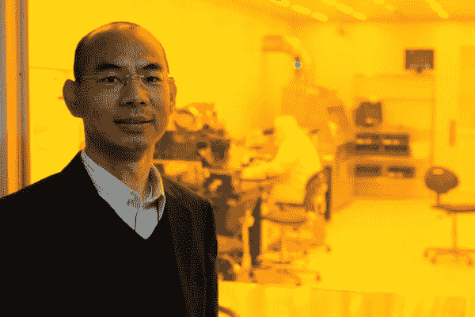
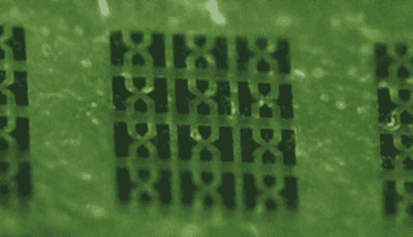
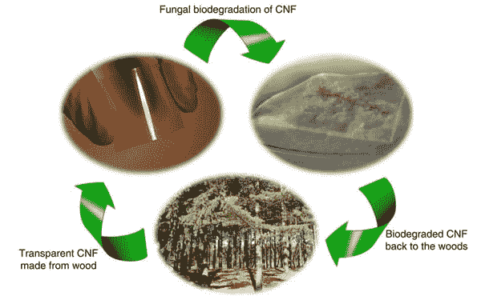

# 用于可生物降解微芯片的纳米纤维的遥远世界

> 原文：<https://thenewstack.io/the-far-out-world-of-nanofibril-for-biodegradable-microchips/>

电子垃圾是世界范围内日益严重的问题。可生物降解的微芯片和电子设备能解决问题吗？

许多消费电子产品——从智能手机到笔记本电脑——在设计时都考虑到了[计划淘汰](https://en.wikipedia.org/wiki/Planned_obsolescence)。它缩短了更换周期，当与巧妙的营销技巧相结合时，将消费者置于持续的仓鼠轮上，渴望几个月后就会过时的最新产品——这似乎是一个无休止的循环，也方便地增加了制造商的利润。

但是对环境的损害更加严重:根据 T2 电子产品回收联盟的统计，每年全球产生 5000 万吨电子垃圾，用毒素和重金属污染土壤和水。电子垃圾回收行业仍然远非高效，预计[情况会变得更糟](http://www.treehugger.com/clean-technology/were-losing-war-against-e-waste-new-report-says.html)之后才会好转。来自工业化国家的电子垃圾也被非法倾倒在发展中国家，在这些国家，电子产品回收通常以非正式和不受监管的方式存在。

## 纤维素纳米纤维拯救世界

这是一场看不见、想不到的灾难——尽管如此，它仍在发生。为了减缓这种环境和公共健康的灾难，威斯康星大学的科学家与美国农业部森林产品实验室合作，正在开发一种基于木材的半导体材料。是的，木材——或者更准确地说，纳米纤维素。研究人员没有使用不可生物降解的石油化学材料，而是研究了使用生物基、可生物降解和柔性纤维素纳米纤维纸来制造微芯片的可行性，这种微芯片有朝一日可以给土壤施肥。电气工程教授马振强领导的这项研究发表在上周的《自然》杂志上，他解释说，在目前的微芯片中，非生物降解材料的使用效率很低:

> 在典型的半导体电子芯片中，有源区包括顶部薄层，并且仅是芯片的一小部分，而支撑芯片的底部衬底由超过 99%的半导体材料组成。在用于无线功能的微波芯片中，除了底部衬底的浪费之外，只有极小部分的横向芯片面积用于所需的有源晶体管/二极管，其余的仅用于承载其它无源元件。

一种更环保的微芯片将由纤维素纳米纤维(CNF)制成，这是一种由纤维素纤维组成的纳米材料(T4)。在这个尺度上，这种大量存在的有机聚合物非常坚固、柔韧和透明，表现出甚至是“假塑性”的特性。然而，纤维素对水分和膨胀很敏感，但这个问题可以通过额外的涂层来解决，[研究的合著者蔡志勇说:](http://www.eurekalert.org/pub_releases/2015-05/uow-ccl052615.php)“通过在 CNF 表面涂上环氧树脂涂层，我们解决了表面光滑和防潮的问题。”

这篇论文描述了这些可生物降解的微芯片是如何制造的:“完全成型的电子设备可以在密集阵列格式的牺牲材料上制造，其中每个微型设备可以被释放并转移印刷到任何类型的基底上，包括可生物降解的柔性基底。”

## 快速且“像肥料一样安全”

几年来，研究人员一直在寻找传统半导体材料的替代品，但与易受水和溶剂影响的合成聚合物和丝绸相比，CNF 尤其有前途。此外，用制造的有机电子器件比其他替代品的性能好得多，马表示:“还有其他有机电子器件，但没有一种能与这种芯片(能够)的运行速度相匹配。”此外，CNF 可以被真菌分解，并且是生物兼容的，这意味着它可以与活组织密切接触，这意味着 CNF 材料也可以应用于医疗行业。

但最重要的是，CNF 作为半导体材料的实施将减少致癌物质砷化镓(GaAs)在电子产品中的使用。“不可能找到砷化镓的替代品，”该论文的作者之一、博士生 Yei Hwan Jung 说。“但我们已经把[CNF]半导体做得很薄，其用量达到了饮用水所需的 EPA 标准。”

尽管可生物降解的微芯片有明显的优势，但制造商仍需要一些时间来整合新的、可持续的材料，如 CNF。但是一个没有电子垃圾的未来是值得的，马断言:“(CNF)芯片现在非常安全，你可以把它们放在森林里，真菌会降解它。它们会变得像肥料一样安全。”

请点击“[自然](http://www.nature.com/ncomms/2015/150526/ncomms8170/full/ncomms8170.html#close) *阅读更多内容*

图片:[威斯康星大学](http://www.wisc.edu/search/?cx=001601028090761970182%3A2g0iwqsnk2m&cof=FORID%3A10&q=biodegradable+microchips&search_button=Go%21)。

<svg xmlns:xlink="http://www.w3.org/1999/xlink" viewBox="0 0 68 31" version="1.1"><title>Group</title> <desc>Created with Sketch.</desc></svg>