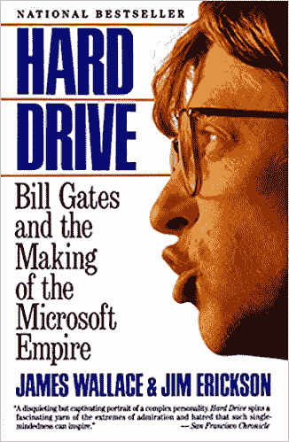

# 最快的编程语言？《戴夫的车库》寻找答案

> 原文：<https://thenewstack.io/the-fastest-programming-language-daves-garage-seeks-the-answer/>

退休的微软工程师 T2 的戴夫·普卢默的 T4 YouTube 频道 T5 吸引了 134000 名用户。现在，他正在用它在编程语言之间上演一场面对面的竞赛，以决定哪种语言最快。

他得到了 GitHub 上超过 100 名贡献者的社区[和一个核心团队的帮助，该团队创建了 Docker 容器来为每个测试提供合适的环境。](https://github.com/PlummersSoftwareLLC/Primes#readme)

7 月，Plummer 发布了一个视频，拉开了比赛的序幕。他承诺，在未来几周内，他的视频将分享同一程序在 45 种不同编程语言中的 100 种不同实现的比较，这是“一场软件飙车盛会……一场无拘无束、疯狂的质数生成皇家战役。”他承诺这些视频将涵盖“从 Ada 到 Zig 以及介于两者之间的所有语言”

[https://www.youtube.com/embed/tQtFdsEcK_s?feature=oembed](https://www.youtube.com/embed/tQtFdsEcK_s?feature=oembed)

视频

开球视频声称，比赛将包括从 Rust、C 和 Assembly 等高性能语言到 F#等“珍奇”语言，Lisp 和 Prolog 等“古怪”语言，以及 Bash 和 PowerShell 之间备受期待的对决。但它也给观众一个有趣的机会，仅仅是看到 45 种不同的语言，以及每种语言如何处理算法，展示每种语言自己的语法和数据声明结构。

或者，正如 Plummer 所说，“一次快速旅行，在那里你对每一种语言的了解足以成为危险——或者在鸡尾酒会上娱乐。”

## 那一次比尔·盖茨举办了一个家庭聚会

Plummer 的 YouTube 频道提供了一个折衷的视频组合，记录了从他用廉价的 [ESP32 微控制器](https://en.wikipedia.org/wiki/ESP32)和 Arduino 控制的 led 灯进行的实验到“[如何在停电的情况下制作最好的咖啡](https://www.youtube.com/watch?v=mAviU7frxog)”和“[我爸爸的第一辆新车 50 岁了](https://www.youtube.com/watch?v=oXdOJ8_iKPs)！”

但是他在过去两年上传的 140 个视频也包括了他在微软工作时的回忆。(比如一个[的](https://www.youtube.com/watch?v=4UduzUmetP4)[系列](https://www.youtube.com/watch?v=f8VBOiPV-_M)视频标题为“[Windows 任务管理器的秘史](https://www.youtube.com/watch?v=CyJw2MumgTQ)或者一个标题为“[的视频那次比尔盖茨有一个家庭聚会](https://www.youtube.com/watch?v=RBFdLwbzmB8)。))

在[的一个视频](https://youtu.be/a9ZADRy5W0c)中，Plummer 追溯得更远，回忆起在 20 世纪 90 年代早期，他是如何给 [Linus Torvalds](https://thenewstack.io/linus-torvalds-on-why-open-source-solves-the-biggest-problems/) 发电子邮件，对 [Linux](https://training.linuxfoundation.org/training/course-catalog/?utm_content=logo-sponsorpage&utm_source=thenewstack&utm_medium=website&utm_campaign=platform) 早期源代码中的一些句柄泄漏进行修复的。在另一个视频中，Plummer 说他后来在读了《硬盘:比尔·盖茨和微软帝国的形成》这本书后，受到启发申请了微软的实习机会，并最终从事 MS-DOS 工作

但是在 Plummer 的第一个展示编程语言速度测试的视频背后有一个特别怀旧的故事。早在四月份的时候，Plummer 就有了将 C 与 C++和 Python 进行比较的想法。(剧透警报:C++赢了)。Plummer 使用的特定测试受到了他九年级计算机科学老师的回忆的启发——“时髦的数学老师和愚蠢的计算机爱好者的完美结合”——他巧妙地将一些家庭作业变成了一场比赛。

“这在某种程度上是天才的，因为这一标准不再是某种随意的等级，而是你周围的同龄人，”Plummer 说。"你能写出比其他孩子的代码运行得更快的代码吗？"

他被一个同学惊呆了，他使用一台 20 世纪 80 年代早期的 Commodore 计算机，在不到 10 秒的时间内识别出了所有 1000 以下的质数(另一个同学用了 6 秒)，这一经历教会了他优化算法的重要性。

近 40 年后，Plummer 重现了这一测试——古希腊素数搜索算法，被称为厄拉多塞的[筛——作为测试三种现代编程语言速度的一种方式。(但这一次，识别出了所有高达*100 万的质数。*)“在五秒钟内尽可能多做几次，然后报告平均每秒的通过次数。”](https://en.wikipedia.org/wiki/Sieve_of_Eratosthenes)

Plummer 的视频出人意料地大受欢迎(迄今为止，它已经被观看了近 30 万次)。很快，观众也为自己的参与感到惊讶。他已经将他的三个测试上传到了 GitHub 库——“突然，人们开始添加*和其他*实现。很快我们就有了令人印象深刻的语言列表和非常快速的实现。”最终提交了一打又一打的测试。

在他的视频中通读了这个列表，Plummer 说“我不知道 OCaml 实际上是什么，但它看起来有点酷。”

[https://www.youtube.com/embed/D3h62rgewZM?feature=oembed](https://www.youtube.com/embed/D3h62rgewZM?feature=oembed)

视频

## 呼叫帮助

普卢默困惑地说，最快语言竞赛的想法是“自己发起的”。他在网上看到了所有的热情，“我不知道该怎么办。因为我几乎不懂 [GitHub](https://github.com) 。”(当他离开微软时，他们仍在使用[源代码库](https://devblogs.microsoft.com/oldnewthing/20180122-00/?p=97855)进行版本控制 Perforce 的授权分支。)

他发布了求救信号。“‘如果有人真的很了解 GitHub，并且想玩，请告诉我。你可以拥有整个项目。只是——请把它从我这里拿走，”"

几乎奇迹般地，一个自发的社区开始形成。有人站了出来——普卢默称之为“一个叫罗尔夫的荷兰人”，很快罗尔夫就有了自己的帮手。(或者，正如视频主持人所说，“很快，他的船上又多了两个同胞，都铎和罗格……他们真的很棒。”)他们甚至为其他语言贡献了自己的实现，包括汇编语言。

“我很感激社区里的每一个人，尤其是这三个人，”Plummer 在视频中说道。在撰写本文时，GitHub 上的项目知识库显示了来自 108 个不同贡献者的令人印象深刻的 665 次提交(还有另外 16 次拉请求)

还有更多。“每种语言都有自己的 Docker 容器，代表该语言的构建环境，”Plummer 说。一个方便的构建脚本自动设置所有的环境——以及它们的测试——然后生成一个漂亮的图表显示结果。

在后面的视频中，Plummer 详细解释了为什么这很有帮助。“我不知道你怎么想，但我的机器上没有准备好的 COBOL 或 Fortran 编译器，更不用说 V 或 Zig 了。”

这一切都被捆绑到一个叫做 PrimeView web 应用程序的东西中(它允许查看、过滤和排序生成的结果)，与 [Readme](https://github.com/PlummersSoftwareLLC/Primes/blob/drag-race/README.md) 文件中提到的“Dave 的基准机器”一起工作

## 巡回 40 多种语言

Plummer 给这个项目带来的最大的东西可能是他真正的热情。他在一个视频中解释道:“我一生都在操作系统上，但完全是在汇编、C 和 C++上。”。“虽然我在娱乐上也能流利地使用 C#，并对 Python 有所涉猎，但仅此而已。因此，有机会用 40 多种不同的语言进行巡演实在是太好了，不能错过。”

这种热情足以团结所有撰稿人的努力。他现在鼓励想参与开源贡献的人加入算法的微调。他对不同编程语言的爱好者也有类似的信息:如果他们不喜欢自己语言在测试中的表现，那就改进代码！“拿出你的编辑器，去 GitHub，继续努力，直到你的代码比我的代码快——或者比实现它的任何人的代码都快。”

他开玩笑地激发他们的竞争本能——就像他九年级的计算机老师一样。他在记录比赛大结局的视频中向所有人承诺，在最终获胜者加冕之前还有时间:“这样，你可以改善任何你不满意的事情，为 PowerShell 或任何你真正热爱的事情赢得救赎。”

但是这次经历似乎也改变了他。在视频的结尾，这位前微软工程师发表了一份声明，这份声明将温暖开源开发者的心。

“我现在对 GitHub 和开源运动有了很好的体验，以至于——我以前有一个商业项目，我打算用它发布一些商业产品……

“但我打算把它放在 GitHub 上，制作几个视频，让人们用它来跑步。”

* * *

## WebReduce

<svg xmlns:xlink="http://www.w3.org/1999/xlink" viewBox="0 0 68 31" version="1.1"><title>Group</title> <desc>Created with Sketch.</desc></svg>