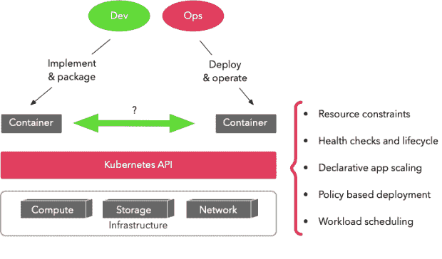
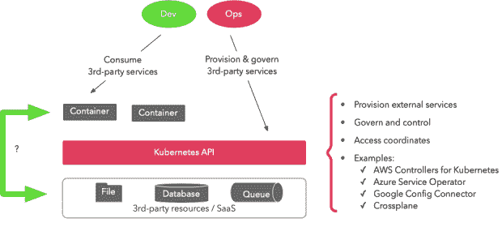
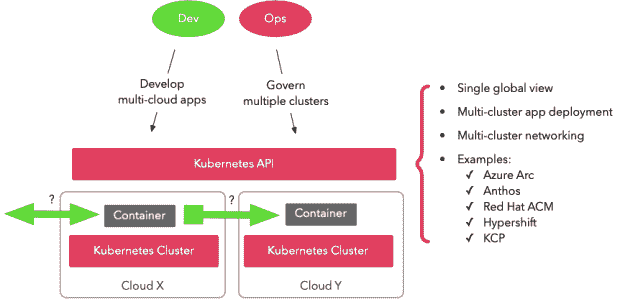
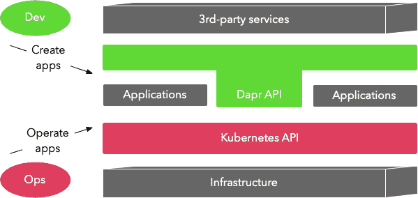

# 蜜蜂的飞轮效应

> 原文：<https://thenewstack.io/the-flywheel-effect-of-kubernetes-apis/>

Kubernetes 是用不同语言编写的、来自不同业务领域的应用程序保持理想状态的事实上的标准。但是 Kubernetes 的采用还远远没有结束，它的飞轮效应只是在加速并扩展到新的领域。

Kubernetes 正在转变为统一的声明式 API 和协调机制，不仅用于管理集群上的应用程序，还用于管理集群外的远程资源和多云部署。受 Kubernetes 的启发，并基于多语言、异构应用程序和多云的相同云原生原则， [Dapr](http://dapr.io/) 项目通过提高开发人员的生产力来补充 Kubernetes，就像 Kubernetes 提高运营团队的生产力一样。

在本文中，我们将探索类似 Kubernetes 的声明性 API 和补充性开发工具(如 Dapr)正在流行并成为主流的新领域。

## 容器管理 API

微服务部署成就了今天的 Kubernetes。Kubernetes 引入了一系列 API 和保证(有些是显式的，有些是隐式的),作为高速创建分布式应用程序的开发人员和保持这些应用程序高速运行的运营团队的共同原则。

这些公理作为推理应用程序如何在任何基础设施上部署和运行并保持所需状态的前提。这份合同是由什么组成的？它是与应用和平台相关的生命周期 API 和保证的组合，例如:

*   具有资源约束的基于容器的应用打包
*   健康检查和应用程序生命周期策略
*   针对无状态、有状态或基于作业的工作负载轻松扩展应用程序
*   失败保存推出和回滚的声明性部署策略
*   基于策略和依赖关系的自动应用放置等。

本质上，Kubernetes 通过在应用程序和底层基础设施之间提供一个标准接口，隐藏基础设施的形状，使其不可靠性对应用程序无关紧要，从而加速了分布式应用程序架构的采用。

Kubernetes APIs 作为基础设施抽象

虽然这增强了运营团队大规模管理高度分布式应用程序的能力，但它没有为创建此类应用程序的开发人员提供相同的收益。事实上，分布式架构增加了开发人员必须处理的意外复杂性，而不是专注于实现应用程序业务逻辑。Kubernetes 本身并没有提供一个统一的声明式 API 和一个可移植的实现来隐藏网络的复杂性和谬误。这是留给开发者和其他项目去解决的领域。

我们在本节中描述的内容并不新鲜，但这是一个重要的认识，它将帮助我们了解 Kubernetes API 还在哪些地方传播，哪些地方落后了。让我们讨论下一个关注的领域。

## 第三方服务管理 API

Kubernetes API 提供了一个标准接口，用于管理任何公共云或私有云上的计算、网络和存储。但云计算不仅仅是原始的基础设施，如今大型云提供商和较小的专业 SaaS 提供商提供更高级别的服务，如数据库、缓存、键值存储、文件桶、消息队列、流处理器等。

这些特定于供应商的服务托管在远程云网络上，并通过专门的 API 进行访问。这是一个很有吸引力的产品，因为这种服务可以快速供应、轻松扩展和即时更新。与传统模式相比，这种模式减少了安装和配置所花费的时间，其租赁的多租户特性提供了更低的成本。这些优势使得第三方服务成为许多运行在 Kubernetes 上的应用程序的强制性依赖。

使用第三方服务的一个挑战是这些服务的生命周期管理因供应商而异。不同的云供应商对其服务的供应和管理有不同的控制平面 API。即使您提供相同类型和完全相同的软件(如 PostgreSQL server 版)，Amazon Web Services (AWS)和 Google Cloud Platform (GCP)、Azure 和其他软件之间的 API 和语义也会有所不同。

不仅如此，这些服务的供应、治理、访问和持续管理将与您在 Kubernetes 上管理应用程序的方式大相径庭，导致工具、实践和工作更加复杂和重复。

如果这些来自不同底层提供者的高级服务可以通过相同的 Kubernetes APIs 交付，并且具有与运行在 Kubernetes 本身上的容器相同的一致性级别，会怎么样？如果可以用相同的 Kubernetes 声明性方法和控制循环机制来完成呢？这将允许重用 Kubernetes 的语义、API、工具和实践来管理外部资源，就像它们是 Kubernetes 上的容器一样。这正是我们眼前正在进行的项目，例如:

这些项目使用 Kubernetes 自定义资源定义(CRDs)作为描述云服务和这些服务治理的协调模式的新兴统一标准。这使得运营能够与 Kubernetes 上运行的应用程序一致地管理所有外部资源，并使用 Kubernetes 资源公开服务端点和秘密。

第三方服务编排的 Kubernetes APIs

虽然这种方法使运营团队能够从丰富的 Kubernetes 工具和实践生态系统中受益，但它不能为必须使用这些服务的开发人员提供同样的好处。开发人员仍然必须使用具有不同质量和语言语义的库和框架来与无数的第三方服务进行交互。当第三方库发生变化时，开发人员需要修补和升级他们的应用程序。

当与来自不同提供商的类似第三方服务进行交互时，追求一致性、重用和最佳实践是技术领导者的责任。这里列出的项目将帮助运营团队管理这些外部服务，但不是必须使用这些服务的开发人员。这不是一个很好的云原生开发者体验，是吗？

## 多集群管理 API

拥有多个云部署，无论是公共云还是私有云，在企业中越来越普遍。这有时是故意的，是由特定云服务的需求、规模或隔离需求驱动的，或者是由于收购或影子 IT 造成的意外。不管原因是什么，如今，多云复杂性是许多组织不得不面对的丑陋现实。

与 multicloud 类似，运行多个 Kubernetes 集群也并不稀奇。多集群 Kubernetes 架构的一大驱动力是对工作负载隔离的需求。来自同一组织的团队可能需要空间来试验 CRD 和操作符。

Kubernetes 基于名称空间的隔离机制在这些场景中是不够的，特别是随着 CRD 和操作符的普及，它们是集群范围的实体，需要集群级别的访问。所有这些都是供应新的 Kubernetes 集群的原因，不久之后，运营团队就会发现自己要应付多个 Kubernetes 集群。

有许多新兴项目使用 Kubernetes API 来管理多个其他 Kubernetes 集群和应用程序工作负载。一些比较著名的项目和托管服务包括:

这些项目在它们可以管理的支持的集群类型以及您可以使用它们做什么方面有所不同。但是一般来说，它们为管理多个 Kubernetes 集群提供了端到端的可见性和控制。这通常包括部署应用程序，确保跨数据中心、边缘和多云环境的安全性和合规性。

Kubernetes APIs 作为多集群抽象

这使得运营部门可以从单一控制台管理多个 Kubernetes 集群，就好像它们是一个 Kubernetes 集群一样。这意味着同一个应用程序不仅可以部署到同一个 Kubernetes 集群内的多个区域，还可以部署到不同地区甚至不同云提供商的多个 Kubernetes 集群。这可能是由应用程序的全球部署需求、迁移和现代化原因或时间紧迫的灾难恢复程序所驱动的。

然而，要做到这一点，光靠 Kubernetes 是不够的。编写应用程序本身时也必须考虑到多云。如果应用程序是用一个云提供商的客户端库实现和打包的，那么在另一个云提供商上运行它会限制它的可移植性。

如果您已经将业务逻辑与云服务的底层特性结合起来，那么在您可以在另一个云上运行应用程序之前，可能需要进行大量的重写。本质上，要创建可移植的多云和多集群应用程序，并跨云重用工具、实践和模式，还需要在开发时应用相同的云原生操作原则。也就是说，使用云原生工具和自动化，抽象出任何语言和第三方应用依赖和工具。

## 中间的空白

上述基于 Kubernetes 的 API 趋势带来了运营工具和实践的一致性和重用，提高了运营团队的效率。但是它们不能在同一层次上解决开发人员的需求。例如:

*   Kubernetes 帮助运营团队保持大量容器运行，但它不能帮助开发人员使用他们选择的语言和框架实现可靠的服务交互。
*   Kubernetes 帮助运营部门统一供应和管理第三方资源，但它并没有帮助使用各种不同语言的不同库的开发人员以统一的方式消费这些第三方服务。
*   Kubernetes 有助于在多个集群中部署容器，但它无助于创建独立于云服务语义和集成模式的可移植多云应用程序。

在应用程序的业务逻辑和其他系统之间有一个空白空间，留给开发人员来填充。它通常充满了只有嵌入到应用程序中的少数编程语言或框架才能使用的云前原生技术。

将这种专注于单一语言或单一云的云前原生技术与基于语言和云可移植性、声明性 API、可插拔性和重用原则构建的类似 Kubernetes 的技术相结合，会导致技术阻抗不匹配和不必要的开发工作。

与运营团队从 Kubernetes 中获益的方式类似，我们需要声明性能力、可重用模式和可移植实现来帮助开发人员以云原生方式创建分布式应用程序。

Dapr 项目受到容器的可移植性和声明性 Kubernetes API 的影响。它为应用程序创建者提供了可移植的、多语言的、API 驱动的分布式系统原语，如第三方服务连接器、可移植弹性策略和多语言可观察性。

Dapr APIs 帮助实现分布式应用程序，Kubernetes APIs 帮助操作它们

Dapr 使开发人员更容易构建有弹性、无状态和有状态的分布式应用程序，让他们专注于编写业务逻辑，而不是解决分布式系统的挑战。它提高了开发人员的生产力，就像 Kubernetes 提高运营团队的生产力一样。

Dapr 用于创建应用程序，就像 Kubernetes 用于操作应用程序一样。它的灵感来自 Kubernetes，但其使命是填补 Kubernetes 留下的空白。如果您想了解更多关于 Dapr 的信息，并了解我们如何在您的 Kubernetes 集群上安全可靠地运行 Dapr，请预订 Diagrid Conductor 服务的[免费试用](https://www.diagrid.io/conductor)。

随着软件栈越来越深，变化的速度越来越快，大代码的时代正在到来。我们需要新的范例、模式和工具来帮助运营和开发团队理解这种日益增长的复杂性。

Kubernetes 的声明式 API 和控制循环机制在推理和管理分布式系统方面掀起了新的思维浪潮和变革浪潮，无论它们是在集群上、集群外还是在多个集群上。在这个旅程中，Kubernetes 飞轮已经超出了集装箱。Kubernetes 不再是一个容器管弦乐队。Kubernetes 是一个全局资源管理 API，无论这些资源是本地容器、远程集群还是其他第三方服务。

<svg xmlns:xlink="http://www.w3.org/1999/xlink" viewBox="0 0 68 31" version="1.1"><title>Group</title> <desc>Created with Sketch.</desc></svg>