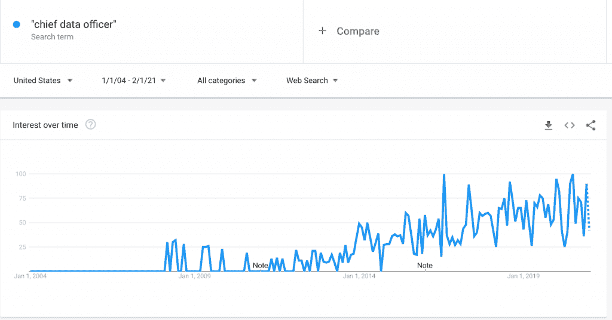

# 数据工程的未来

> 原文：<https://thenewstack.io/the-future-of-data-engineering/>

[Soumyadeb Mitra](https://www.linkedin.com/in/soumyadeb-mitra/)

[Soumyadeb 是 RudderStack 的创始人兼 CEO。此前，他是 Mariana(被 8x8 收购)的联合创始人兼首席技术官，Mariana 是一款 martech 工具，用于在 ML 和 NLP 的帮助下开展超定向营销活动。](https://www.linkedin.com/in/soumyadeb-mitra/)

在我们之前的文章“数据工程大趋势:简史”中，我们回顾了数据工程的历史。具体来说，我们研究了 IT 组织是如何从 20 年前所有重要数据的保管者转变为被其他团队视为阻碍者的。现任雪花公司首席执行官的弗兰克·斯洛特曼直言不讳地描述了这种动态:“IT 领导让我厌烦。”不过，这种情绪正在发生变化，尤其是在过去五年里，尽管并非每家公司都感受到了这种吸引力。

但是未来 5 到 10 年呢？随着数据工程的大趋势影响到各行各业的公司，在数据领域，特别是数据工程师的角色，会有什么样的大变化？

通过谷歌趋势

## 数据角色将获得董事会席位

数据工程领域肯定会发生变化，但在未来 10 年内，将对组织产生重大影响的一个趋势将是*数据主管*不断增长的价值和责任。

 [埃里克·多兹

Eric 在 RudderStack 领导客户成功并支持增长团队。他长期帮助公司构建客户数据堆栈，并使用他们的数据来发展。](https://www.linkedin.com/in/ericdodds/) 

过去，许多特定于数据的角色是按部门划分的:分析主管、数据科学主管、数据工程主管等。不过，越来越多特定于数据的角色正在进入高管层，并出现在董事会中。在过去的五年里，首席数据官一词变得流行起来。在 LinkedIn 上搜索这个词会产生超过 10，000 个结果(如果我们包括变化的话，结果会更多)。

领导和领导做出的决定塑造了组织。随着我们在董事会中看到越来越多的数据角色，数据功能(和数据本身)将越来越成为一等公民和所有决策中的关键考虑因素；虽然在过去它很重要但并不关键，但现在它被视为现代组织的一项必要业务职能。

最终，这将塑造围绕数据的组织。数据工程和相关职能将被战略性地定位为加速公司内发生的一切(相对于响应“内部客户”的请求)，目标是利用数据作为关键的竞争优势。

> 随着数据科学和数据基础设施之间的界限变得模糊，数据/ML 工程职位将取代数据科学职位，成为最受欢迎的职位。

最近的一个博客和黑客新闻帖子，“[我们不需要数据科学家，我们需要数据工程师](https://www.mihaileric.com/posts/we-need-data-engineers-not-data-scientists/)，”强调了数据工程再次变得很酷的事实。如果利用得当，没有人会否认数据科学的力量，但公司正在意识到，更紧迫的需求是解决围绕收集、清理、存储和分析数据的更基本的问题，然后才能对数据做任何事情。

事实上，随着数据科学变得越来越普遍，对数据工程的需求将显著增加，无论是规模还是速度。在最近的 [Data Stack Show 播客节目](https://datastackshow.com/podcast/20-transforming-the-real-estate-market-with-predictive-analytics-with-arian-osman-from-homesnap/)中，一位主持人问 [Homesnap](https://www.homesnap.com/) 的高级数据科学家 Arian Osman，他们需要对用于建立模型的数据做多少工作。他对强大的数据工程功能的兴奋是显而易见的:

*“大部分工作都是由数据工程团队完成的……谢天谢地，我什么都不用碰。当我第一次在 Homesnap 开始工作时，我查看了数据库，我感到非常惊讶。我的意思是，我只是对数据库的架构和使用的标准化以及使用的分区感到惊讶。因此，在获取数据并尽可能清理数据方面，Homesnap 有一个很棒的团队。”*

先进的公司可能需要数据科学-重机器学习(ML)以及数据科学和工程之间的紧密结合。然而，退一步说，许多公司和商业应用的现实是，他们只需要基本的机器学习，而不是高级神经网络之类的东西。开发人员和工程师可以掌握基本的机器学习技能，我们已经看到这种变化开始随着“ML 工程”角色的兴起而发生——在这些角色中，人们擅长设计 ML 算法，并在真实数据上训练他们，并将他们部署到生产中。

数据工程/数据科学角色这一趋势背后的潜在技术力量是数据基础设施和数据科学之间的界限变得模糊。一段时间以来，由于上面提到的卫生需求，数据科学家从事数据工程工作是很常见的，但我们越来越多地看到基础设施方面的流程和技术提供数据科学和 ML 产品( [Pachyderm](https://www.pachyderm.com/) 是“数据科学作为基础设施”的一个例子)。

## 为每个团队提供专门的数据工程支持

如上所述，数据和数据函数将成为一等公民。在企业的组织和日常运营中，我们已经看到了集中式数据工程团队的开始。他们向组织的其他部分提供数据产品和服务。

然而，最先进的公司正在超越共享服务中心的概念，并主动为各个团队创建专用资源。这将术语“数据驱动”带到了另一个层次。像 [Mattermost](https://mattermost.com/) 这样的公司的团队不再使用数据来以更快的速度和更大的影响执行现有任务，而是与数据工程合作*设计和重建*计划、策略、系统和流程。

团队不再问“我们如何使用数据来做得更好”，而是与数据工程合作来问“我们的数据和数据系统如何塑造我们思考解决这个问题的方式。”

在未来 10 年，这种战略合作将成为商业运作和组织结构的标准。

## 越来越多的“独角兽”解决数据问题

随着大趋势的到来，软件行业将会挺身而出(一如既往)。当我们想到独角兽时，脑海中浮现的例子是 Databricks 和 Snowflake 这样的公司，它们已经建立了数十亿美元的业务，解决数据处理和存储方面的难题。

在过去的五年中，随着新生的数据工程大趋势开始成为主流，我们已经看到了第一批独角兽，他们是该领域的早期推动者。像 Segment(被 Twilio 以 32 亿美元收购)和 FiveTran(估值 10 亿美元，还在增长)这样的公司已经围绕数据收集建立了庞大的业务。其他公司如 DBT 或 Looker(通过 LookML)围绕数据处理建立了重要的业务。

在接下来的 10 年里，数据领域的公司数量只会加速增长，以应对本文前面所有观点所产生的巨大需求。

## 移动数据的技术将变得商品化

对于今天的许多公司来说，移动数据仍然是一个不小的问题；这就是为什么上面提到的公司能够建立起价值数十亿美元的企业。尽管如此，他们取得了不到 10%的市场渗透率！

如今，许多公司不得不在建设管道方面做出某种牺牲，如果他们自己建设，这是在内部消耗成本，还是在供应商选择、新技术等过程中导航。不过，在 10 年内，甚至更短的时间内，将会有标准的剧本、工具和架构来构建和连接公司内部的数据管道。

除了大规模采用，成本和竞争也将推动商品化。首先，移动数据的硬成本正在降低。其次，越来越多的公司正在转向“自有数据”基础架构，这样他们可以减少数据孤岛的数量，并降低跨多个供应商存储数据副本的成本。

竞争会降低公司为解决一个难题而收取的额外费用。以前，将数据从 X 移动到 Y 非常困难，并且没有太多选择，因此企业愿意支付更多费用来解决这一难题。然而，越来越多的选择，这些选择将变得更具成本效益。

企业不再购买单点解决方案来解决尖锐的痛点，而是将解决这些痛点作为构建数据管道和数据堆栈的标准部分。

## 实时(和接近实时)的基础设施将成为标准

尽管在客户数据平台和客户数据管道领域有很多供应商，但实际上很少有供应商能够实现开箱即用的实时用例。

客户数据平台通常擅长于客户档案和客户旅程活动之类的事情，而不是将数据输入系统的管道。另一方面，客户数据管道是一项需要大规模构建和商业化的重要技术(还记得上面提到的市值十亿美元的企业，它们只获得了 10%的市场渗透率)。

由于实时管道仍处于萌芽状态，许多公司都建立了自己的解决方案，这需要投入大量精力来开发和维护。

然而，在未来 10 年，随着越来越多的公司进入客户数据基础设施市场，并在现代云技术上构建他们的产品，实时管道将被大多数公司使用，实时个性化等困难的挑战将成为交钥匙工程。

> 数据工程师和重视数据的企业前景看好。

这些趋势对数据工程师和雇佣他们的公司来说都是好消息。随着数据在企业内部变得越来越有价值，并且技术使得曾经具有挑战性的问题变得容易解决，数据工程师将能够花更多的时间来增加战略价值，而不是试图让数据和管道工作。

对于企业来说也是如此，曾经花费在构建和维护客户数据基础架构上的资源将集中在构建更好的产品和服务上。

<svg xmlns:xlink="http://www.w3.org/1999/xlink" viewBox="0 0 68 31" version="1.1"><title>Group</title> <desc>Created with Sketch.</desc></svg>