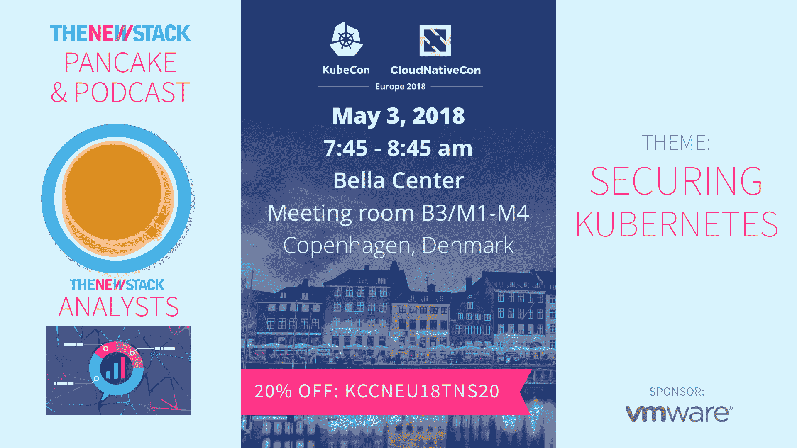

# Kubernetes 的未来是无服务器的

> 原文：<https://thenewstack.io/the-future-of-kubernetes-is-serverless/>

 [Brendan Burns，微软

杰出工程师 Brendan Burns 是 Kubernetes 的联合创始人，现在是微软的杰出工程师，领导 Azure 容器服务(AKS)、Azure 容器实例、Azure 云外壳和 Azure 资源管理器的开发工作。他和家人住在华盛顿州西雅图。](https://azure.microsoft.com/en-us/?v=17.14) 

从容器革命开始，有两件事变得很清楚:首先，技术堆栈中各层的分离产生了一个清晰的、有原则的概念分层，具有明确的契约、所有权和责任。其次，这些层的引入使开发人员能够将他们的注意力完全集中在对他们重要的事情上——应用程序。

公平地说，这种情况以前发生过，第一代平台即服务(PaaS)的目标就是让开发者能够采用“无服务器”架构。问题是，正如许多第一波产品的情况一样，太多重叠的概念被混合到一个单一的整体产品中。在大多数第一代 PaaS 的情况下，开发者体验、无服务器和定价模型(基于请求)都混合在一个不可分割的整体中。因此，可能想要采用无服务器，但可能不是开发者体验(例如，特定编程语言)或想要更具成本效益的大型应用定价模型的用户，也被迫放弃无服务器计算。

容器的发展改变了这一切，将开发人员的体验从无服务器运行时中分离出来。因此，去年无服务器容器基础设施的发展就不足为奇了。去年 7 月，Azure 发布了 Azure Container Instances，这是主要公共云中的第一个无服务器容器产品，尽管公平地说，hyper.sh 的人已经在市场上了。看到用户对无服务器基础设施的浓厚兴趣，其他公共云跟随 Azure 的脚步，六个月后在 re:Invent 2017 上宣布了 Fargate，我相信无服务器容器基础设施在所有公共云中可用只是时间问题。

随着我们向前发展，越来越清楚的是(至少对我来说)，未来将是容器化的，这些容器将运行在无服务器的基础设施上。

在这种情况下，显而易见的问题是:“在这个没有服务器的未来，编排会变成什么样？”

Kubernetes 是一项技术，旨在提供运行容器的无服务器体验。但事实是，在低层次上，Kubernetes 架构本身深深地意识到单个机器，并且从调度器到控制器管理器的组件假定 Kubernetes 中的容器位于对 Kubernetes 可见的机器上。

像 Azure 容器实例这样的无服务器容器基础设施是原始基础设施。虽然这是轻松运行一些容器的好方法，但是构建复杂的系统需要开发一个 orchestrator 来引入更高级的概念，如服务、部署、秘密等。

对于这些无服务器平台，开发一个全新的 orchestrator 可能很有吸引力，但事实是，世界正在围绕 Kubernetes orchestration API 进行整合，与现有 Kubernetes 工具无缝集成的价值非常有吸引力。此外，在可预见的未来，我预计大多数人的 Kubernetes 集群将是专用机器和无服务器容器基础设施的混合体。专用机器将用于相对静态使用的稳定状态服务，或专用硬件，如 FPGAs 或 GPU，而无服务器容器将用于突发或瞬时工作负载。

## 虚拟 Kubelet 结合了 Kubernetes 和无服务器容器

Kubernetes 社区面临的有趣问题是如何将无服务器容器基础设施与更高级的 Kubernetes 概念相集成。最近，开源虚拟 kubelet 项目的开发已经在 Kubernetes 节点和调度特殊兴趣组(SIGs)中率先推进了这一讨论。

虚拟 kubelet 项目的核心是在无服务器容器和 Kubernetes API 之间架起一座桥梁。从它的名字就可以看出，虚拟 kubelet 是 Kubernetes kubelet 守护进程的替代实现，它将一个虚拟节点投射到 Kubernetes 集群中。这个虚拟节点代表无服务器容器基础设施，使 Kubernetes 调度程序意识到它可以将容器调度到无服务器容器 API 上。

当虚拟 kubelet 启动时，它向 Kubernetes API 服务器注册自己，并立即启动与 Kubernetes API 服务器的心跳协议，以便它添加到 Kubernetes 的虚拟节点看起来是健康的。最初有一个标准的 Kubernetes 集群，集群中有三个实际节点。然后，我们开始在这个集群中运行虚拟 kubelet 作为一个容器，第四个节点被添加到集群中。第四个节点是虚拟节点，代表无服务器容器基础设施。当然，这个节点实际上是一个相当特殊的节点，因为它代表了在像 Azure Container 实例这样的无服务器基础设施上运行容器的无限能力。

考虑到在无服务器基础设施上运行的容器和在 Kubernetes 的机器上运行的容器在价格和特性上的差异，虚拟 kubelet 要求用户必须明确选择在新的虚拟节点上运行容器。为了实现这一点，虚拟的库伯莱特使用了库伯内特关于污染和宽容的概念。添加虚拟节点时，虚拟节点会被标记上一个 Kubernetes 污点，以防止任意的 pod 被调度到虚拟节点上。只有当一个 pod 表明它愿意容忍这种无服务器污染时，它才会被考虑调度到虚拟节点上。

一旦 pod 被调度到无服务器虚拟节点上，虚拟 kubelet 就会注意到这一点，并开始在无服务器基础设施中实际创建容器。一旦在无服务器基础设施中成功创建了 Pod，虚拟 kubelet 还负责向 Kubernetes API 服务器报告健康和状态信息，以便所有的 API 和工具都能按预期工作。

Kubernetes 和无服务器容器基础设施的结合在现实世界中有各种批量或突发工作负载的用例。例如，正在进行图像处理的客户可以快速启动大量容器来处理最近上传到共享存储的图像，几秒钟之内，他们就可以从没有基础架构发展到拥有数百个容器来处理图像，并且在处理完成后，他们可以立即回到无需支付容量费用的状态。这与运行在虚拟机上的 Kubernetes 集群形成了鲜明的对比，在 Kubernetes 集群中，无论虚拟机是否在使用，运行虚拟机的成本都是恒定的。同时，可以使用标准的 Kubernetes 概念(如可以调度所有这些图像处理容器的 Job 对象)来实现图像处理的实际编排。

## 使 Kubernetes 与无服务器容器兼容

看到虚拟 kubelet 项目在整个云行业发展壮大，从初创公司到公共云的众多不同合作伙伴都加入进来，为将无服务器容器与 Kubernetes 结合起来的愿景做出贡献，这真是令人兴奋。

当然，这并非一帆风顺。随着我们对这种集成的探索，很明显，将 Kubernetes 与无服务器容器基础设施结合起来意味着什么，这方面存在重大挑战和未决问题。虽然 Kubernetes 为其用户提供了一个面向容器的 API，但是当您查看这个 API 是如何实现的细节时，您会发现它显然是建立在一个概念之上的，即这些容器下面有机器。当然，有了像 Azure Container Instances 这样的无服务器容器基础设施，这些机器就不再存在了，这导致了与现有 Kubernetes 基础设施的一些冲突。

举一个非常简单的例子，我们最初在部署虚拟 kubelet 时注意到的一件事是，带有外部负载平衡器的 Kubernetes 服务在部署了虚拟 kubelet 的集群中无法正常运行。当我们检查情况时，原因变得显而易见。负责创建和维护云负载平衡器的 Kubernetes 控制器管理器试图向云负载平衡器注册虚拟节点。然而，这个节点并不真正存在，因此无法添加到负载平衡器，这导致了阻止创建负载平衡器的错误。在 Kubernetes 1.9 中，我们添加了标志，这样就可以从 Kubernetes 创建的负载平衡器中显式地阻止一个节点，这样我们就能够解决这个特殊的问题，但是一般的风格会让您了解 Kubernetes 的一些部分是如何与每个容器下面都有实际的机器这一想法结合在一起的。

当您考虑 Kubernetes 调度程序时，会出现一个更重要的问题。Kubernetes 调度器被构建为相信每个单独的节点都是一个故障域，因此将容器分布在多个不同的节点上是一件好事。当每个节点都是物理机或虚拟机时，这是一件好事，因为每个节点都可能发生故障或死机，从而破坏该节点上的所有容器。然而，有了虚拟的 kubelet，这就不再是真的了。无服务器容器基础设施本身是容错的，并且建立在许多不同的机器之上。因此，虽然将来自同一应用程序的多个容器调度到物理或虚拟机上可能不安全，但是将来自同一应用程序的多个容器调度到单个无服务器虚拟节点上是非常安全的。有了无服务器容器和虚拟 kubelet，节点不再是一个故障单元。这种不协调和许多类似的调度问题仍然是非常开放的问题，需要加以解决。

## Kubernetes 和无服务器的未来

Kubernetes 旨在为开发人员提供一个干净的、面向应用的 API，使他们能够忘记机器和机器管理的细节。但事实是，在 API 的外表下，机器仍然存在。无服务器容器基础设施的发展使人们开始完全忘记机器，但要成功地将无服务器容器用于更大规模的应用程序，就需要开发一个编制器。因此，Kubernetes 编排层和无服务器容器基础设施的集成对于 Kubernetes 和无服务器基础设施的未来成功至关重要。

随着我们走向未来，我完全相信未来的 Kubernetes 集群将包含运行在专用机器上的混合容器，以及突入无服务器基础设施。但是，虽然未来的目的地在我的脑海中是清晰的，但我们如何到达那里的路径和细节仍有待确定。我真的很高兴能与 Kubernetes 社区公开讨论这个问题。如果你有兴趣参与，请加入我们的虚拟 kubelet github 项目，或者加入邮件列表或 SIG-Node 和 SIG-Scheduling 会议。我真的很兴奋能够一起构建新一代的容器编排。为我们集装箱化、无服务器的未来干杯！

*Brendan Burns 和数千名其他与会者在参加 2018 年 5 月 2 日至 4 日在丹麦哥本哈根举行的 [KubeCon + CloudNativeCon EU](https://events.linuxfoundation.org/events/kubecon-cloudnativecon-europe-2018/attend/register/) 会议期间，讨论了各种 Kubernetes、无服务器和其他开源云原生主题。*

<svg xmlns:xlink="http://www.w3.org/1999/xlink" viewBox="0 0 68 31" version="1.1"><title>Group</title> <desc>Created with Sketch.</desc></svg>