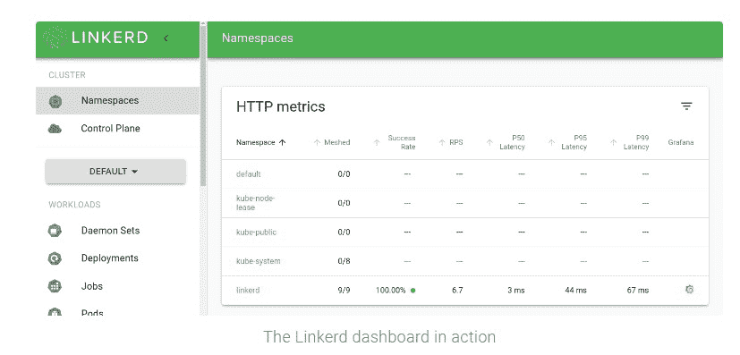
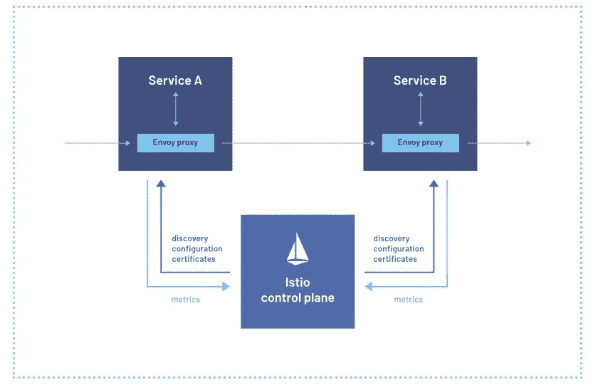

# 网关 API 处于服务网格战争的前线

> 原文：<https://thenewstack.io/the-gateway-api-is-in-the-firing-line-of-the-service-mesh-wars/>

领先的服务网格供应商似乎倾向于使用 [Kubernetes 网关 API](https://gateway-api.sigs.k8s.io/) ，用一个可以通过服务网格共享的管理 Kubernetes 节点和集群的 API 来取代 Ingress。虽然 Gateway API 的设计目的是——像 service mesh 一样——用于除 Kubernetes 之外的基础设施管理，但它是专门为 Kubernetes 配置的，由 Kubernetes 的创建者 Google 创建。

Salt Security 的现场首席技术官 [Nick Rago](https://www.linkedin.com/in/nirago/) 告诉新堆栈:“总的来说，如果为 Kubernetes 实施网关 API 解决了基础设施提供商、平台管理员和开发人员之间目前存在的任何运营摩擦，并可以缓解开发人员在如何部署南北 API 和服务方面的任何摩擦，我认为评估这种变化将会是什么样子是有意义的。”。随着网关 API 规范的成熟和网关控制器提供商对更多规范的支持，这将使组织处于有利地位，减少对供应商或平台特定的注释知识和用法的需求。

## 争议

从这个意义上来说，这在某种程度上解释了为什么像 Linkerd，Istio，特别是 Google 这样的项目会把它作为依赖它的标准 API 来提供。尽管推动组织使用网关 API 并不是没有争议的。

也就是说，Linkerd 8 月份发布的 [Linkerd 2.12](https://linkerd.io/2.12/getting-started/) 被 bubby CEO[威廉·摩根](https://www.linkedin.com/in/wmorgan/)描述为“采用网关 API 作为核心配置机制的第一步。”然而，Morgan 对一般标准以及导致供应商锁定和其他问题的风险保持谨慎和警惕(正如他在下面大声表达的那样)。

对标准的谨慎并非没有道理，因为它们可能适合也可能不适合某些用例，这通常取决于项目的成熟度。

“标准可能是礼物，也可能是诅咒，这取决于基础领域/产品的生命周期阶段。大使实验室开发者关系负责人丹尼尔·布莱恩特告诉新的堆栈。“我相信 Kubernetes 入口和网络是一个经过充分探索和理解的标准领域，可以为支持额外的创新增加很多价值。这就是为什么我们不仅看到像使者-入口和轮廓这样的入口项目采用网关 API 规范，而且还看到像 Linkerd 和 Istio 这样的服务网格产品。”

不用说，就标准而言，Google 显然支持网关 API。在一封电子邮件回复中，谷歌云首席工程师 [Louis Ryan](https://www.linkedin.com/in/louis-ryan-2a8408/) 在被提示解释为什么 Linkerd、Istio 等项目，尤其是谷歌支持网关 API 时，提供了这一点:

“Kubernetes 已经证明自己是一个有效的 API 标准化中心，拥有广泛的跨行业参与和支持。网关 API 已经从中受益，因此，对于各种流量管理用例来说，它是一个设计非常好的解决方案；入口、出口和集群内，”Ryan 写道。“将网关 API 应用于网格流量管理是非常自然的下一步，应该会通过创建一个全面、社区驱动和持久的标准来让用户受益。”

Istio 指导委员会决定将其服务网格项目作为与[云本地计算基金会(CNCF)](https://thenewstack.io/future-cloud-native-computing-foundation/) 的孵化项目，部分是为了改善 Istio 通过网关 API 与 Kubernetes 的集成(以及与 gRPC 的无代理网格和特使的集成)。网关 API 也被视为可行的入口替代品。

“向 CNCF 捐赠这个项目让我们确信 Istio 状态良好，这不是一个谷歌项目，而是一个社区项目，” [Idit Levine，](https://www.linkedin.com/in/iditlevine/)solo . io 的创始人兼首席执行官——Istio 的主要工具提供商——告诉 New Stack。

Istio 此举是在 IBM(谷歌和汽车共享提供商 Lyft 的原始创建者之一)和其他社区成员对该项目的治理表示担忧之后，特别是谷歌倡导在 2020 年为该项目创建开放使用共享区(OUC)。

在 Linkerd 的情况下，Linkerd 2.12 提供了支持 Kubernetes 网关 API 的第一步，Linkerd 首席执行官威廉·摩根说。虽然网关 API 最初被设计为 Kubernetes 中长期存在的入口资源的更丰富、更灵活的替代方案，但它“为描述服务网格流量提供了一个伟大的基础，并允许 Linkerd 将其添加的配置机器保持在最低水平，”摩根在一篇博客文章中写道。

“Linkerd 的网关 API 的价值在于它已经存在于用户群中，因为它是 Kubernetes 的一部分。因此，在某种程度上，Linkerd 可以建立在网关 API 之上，这减少了我们需要引入的新配置机制的数量，”Morgan 告诉新堆栈“减少配置是我们的使命的一部分，以提供服务网格的所有优势，而没有该领域其他项目的复杂性。"

Bryant 说，网关 API 规范承诺的可移植性“对运营商和平台工程师很有吸引力”。“虽然他们中的许多人会长期选择服务网格，但使用网关 API 确实能够在一个组织内部署的所有服务网格之间实现标准化配置，并且如果需要的话，还可以交换实现(尽管我确信这不是一项容易的任务)，”Bryant 说。

然而，Linkerd 也只提供了网关 API 的部分实现(如 HTTPRoute 之类的 CRD)来配置 Linkerd 的基于路由的策略。这种方法允许 Linkerd 开始使用网关 API 类型，而无需实现规范中“对 Linkerd 没有意义”的部分，Morgan 在一篇博客文章中写道。随着网关 API 的发展以更好地适应 Linkerd 的需求，Linkerd 的目的是以一种最大限度减少用户摩擦的方式切换到源类型。

“我认为最大的担忧是网关 API 被一个特定的项目或公司所利用，并停止服务于整个社区的需求。Morgan 告诉 The New Stack 说:“虽然今天的 Gateway API 对于 ingress 用例来说已经相当完整和稳定，但让它适应服务网格仍是一项持续的工作(“GAMMA 计划”)，这个过程还有很大的发展空间。“特别是，今天 Gateway API 的许多参与者都来自 Google，从事 Istio 的工作；如果 GW API 以特定于 Istio 的方式开发，那么它实际上并不能帮助最终用户，因为我们的项目(如 Linkerd)最终只会开发他们自己的 API，而不会遵循对他们没有意义的东西。(我们用 SMI 看到了这一点。)"

## 要走的路

与此同时，Linkerd 只提供网关 API 的一部分，以符合服务网格提供商的愿景，保持服务网格体验“轻便简单”，[企业管理协会(EMA)](https://www.enterprisemanagement.com/) 的分析师 [Torsten Volk](https://www.linkedin.com/in/torstenvolk) 告诉新的堆栈，“他们不会希望采用任何会给他们的用户群带来管理开销或可能会引入网络延迟的东西，这会夺走他们的高性能声明，”Volk 说。“他们甚至在自己的网站上做广告，‘尽可能少用 YAML 和 CRD’，这意味着他们会想要严格评估他们可能需要提供的任何高级功能，以完全支持网关 API。这将冲淡作为 Linkerd 区别于 Istio 的关键优势的简单性和性能。”

当然，Istio 和 Linkerd 代表了竞争性的服务网格替代方案。对于一些服务网格用户来说，Istio 是 GKE 服务网格的选择，因此，如果 GKE 的支持是至关重要的，Istio“可能是正确的选择，”Volk 说。“然而，大多数其他代理、入口控制器和服务网格平台的供应商也表示他们在未来的某个时候支持网关 API，”Volk 说。因此，最明智的做法可能是相信您选择的供应商最终会支持网关 API 标准的关键要素

Bryant 指出，HashiCorp、Kong、Ambassador 和其他人都支持 API 网关。Bryant 说:“大多数 Kubernetes API 网关提供商已经为网关 API 规范提供了某种程度的支持。“使者入口和大使边缘栈都提供这种类型的支持已经有一段时间了，这将在未来继续发展。”

Bryant 说，大使实验室还与其他创始贡献者合作进行[特使网关](https://thenewstack.io/envoy-gateway-offers-to-standardize-kubernetes-ingress/)项目，该项目将成为 Kubernetes 网关 API 规范的参考实现。其中包括 Tetrate、VMware、Fidelity 等。“我们的目标是在标准化的 K8s API 网关实现上进行合作，我们都可以在此基础上进行构建和创新，”Bryant 说。

<svg xmlns:xlink="http://www.w3.org/1999/xlink" viewBox="0 0 68 31" version="1.1"><title>Group</title> <desc>Created with Sketch.</desc></svg>