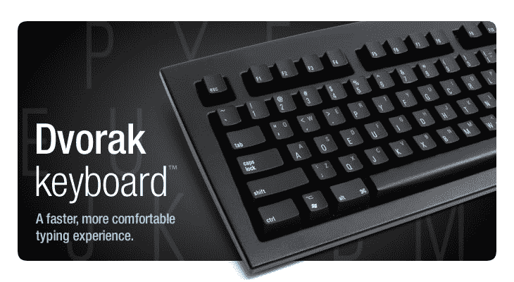
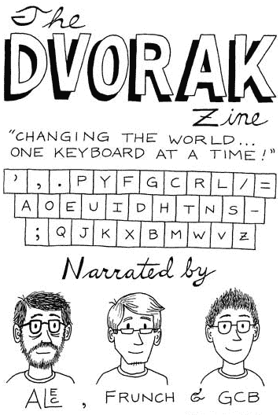

# 使用备用键盘布局的极客

> 原文：<https://thenewstack.io/the-geeks-who-use-alternate-keyboard-layouts/>

当你观察程序员的生活时，你会发现他们在键盘上花了很多时间。但是有成千上万的人已经放弃了传统的“Qwerty”布局，正在寻找更好的东西。

一家名为 Matias 的加拿大公司销售“不到 1000 个”已经预先配置在 Dvorak 布局中的物理键盘

五月，BBC 注意到德沃夏克的布局“[有一个追随者](http://www.bbc.com/capital/story/20180521-why-we-cant-give-up-this-odd-way-of-typing)。史蒂夫·沃兹尼亚克喜欢德沃夏克的布局。它被世界上最快的打字员使用(据吉尼斯世界纪录报道)。“Qwerty 是一堆 19 世纪的垃圾，你不应该用它，”亚历克·朗斯特里斯说，他是[一个德沃夏克键盘爱好者杂志](http://www.dvzine.org/zine/index.html)的联合创始人，他补充说，“这对你的手不好。”

“他最终放弃了传播这个消息，”BBC 指出，“因为他发现做一个技术预言家很累，永远在网上论坛上大喊大叫。”

但是 Frederik Dudzik 这个月在他的软件开发博客上重新开始了对话。它的标题？"[不要用 Dvorak](https://dudzik.co/digress-into-development/don-t-learn-dvorak/) 。"

五年前，Dudzik 改用了另一种“Dvorak”布局，他说自己花了整整两个月的时间才适应新布局，这很难。“学习新的布局是我迄今为止最沮丧的经历之一。多年来在 QWERTY 键盘上通过触摸打字建立起来的肌肉记忆意味着，在学习阶段，我会不断地按错键。我的大脑不喜欢这种感觉——我想这是中风患者在重新学习一项基本技能时的感受。”

此外，“这让我意识到你使用别人电脑的频率。”一旦你训练自己用右手输入 U 键，当你使用一个隐藏在你左手下的键盘时，总会感到震惊。

但最糟糕的是，切换到德沃夏克的布局似乎并没有从根本上改善他的生活。"我没有注意到打字速度是我编程的一个限制因素."他承认，这可能有助于对抗重复性压力损伤——至少因为在学习新布局的两个月里，你打字会慢一些。

亚利桑那州的科技极客 Joel Hans [周三写了一篇反驳 Dudzik](https://blog.ssdnodes.com/blog/do-learn-colemak/) 的文章，指出“我很惊讶我完全不同意他的观点，我的经历如此不同。”

八年前，他改用了另一种键盘布局 Colemak，称之为“最奇怪、最难解释，也可能是我电脑生涯中最有成效的改变”。非常值得学习曲线。此外，这也是证明你书呆子气的一个好方法——至少如果这是你担心的问题的话。”

他不记得他为什么这么做了——他也不会说他现在打字更快了，“但是我感觉更舒服了。”他称赞 Colemak 用更常用的字母填充“home 行”(在你的手指下)，并补充说“使用 Caps Lock 作为退格键是一种启示。”但即使是他也遇到了一个常见的问题。当他坐下来参加 GRE 考试时——这是他申请研究生院的一个重要部分——他意识到他必须在 QWERTY 键盘上回答一个作文问题。“暗示恐慌、沮丧、大量的搜寻和寻找，以及一篇糟糕的论文。最后，我还是考上了我梦想中的学校，所以，灾难避免了。”

他承认“QWERTY 健忘是学习 Colemak 的最大缺点”，但由于这种情况很少发生，“损害是有限的。”

他给读者提供了最后一点建议。“享受这一旅程吧，希望这是一种奇怪而令人惊讶的舒适方式，让您的计算变得更好。”

但是讨论并没有就此结束。本周早些时候，Dudzik 发现他的文章在黑客新闻上引发了[一场大讨论，吸引了超过 140 条评论。Dan Fabulich 是一家撰写互动小说的公司的创始人之一，他写道](https://news.ycombinator.com/item?id=18035045)[他 99%的时间都在使用 Dvorak](https://news.ycombinator.com/item?id=18035151)。“我还能使用 QWERTY，比我学习德沃夏克之前慢了一些，但不会太多。”

另一位用户抱怨说，德沃夏克的布局没有消除重复性压力伤害的问题。“我真的只是移动了问题，而不是解决它(主要是我的右手小指)，”Whereoscope 的联合创始人詹姆斯·格雷戈里说，这是一款让父母跟踪他们孩子的智能手机应用程序。但是格雷戈里没有切换回 Qwerty，而是尝试了另一种替代键盘布局——Colemak——并报告说它“改变了生活”

另一位评论者对此表示赞同。“我坚信，人们归因于德沃夏克的任何差异或收获都归因于*最终学会了如何正确打字。他们确信德沃夏克不再符合人体工程学。*

发明 Colemak 布局的 Shai Coleman 估计有 10 万人在使用它。但他向 BBC 承认，“对大多数人来说，转换成本实际上不值得。”Shai 同意，当你必须使用别人的电脑时，更容易知道钥匙在哪里，老式的 Qwerty 在智能手机上仍然比 Colemak 好用。

黑客新闻上的许多其他评论者分享了他们自己的经历，创造了一个关于替代键盘布局利弊的自发座谈会。我数了一下，有 40 多个不同的用户说他们尝试过使用 Dvorak。其中 35 人仍在使用它——至少有 3 人已经使用了 20 多年，还有几个人已经使用了至少 10 年。

一位评论者甚至发帖称，他们一生都在使用德沃夏克的布局，而*从未*学会如何在 QWERTY 键盘上打字。“虽然我的打字速度高于平均水平，但并没有高到我可以自信地相信使用了 Dvorak，而且在任何情况下，我都没有发现打字速度对编程效率有任何显著影响。”

然而，与这位作者的经历相反，我很少需要在别人的计算机上认真打字，因此，我在除了我自己的机器之外的任何机器前成为一个笨拙得可笑的双指打字员的事实，只不过是我的同事们偶尔的娱乐来源

但是也有七个评论者说他们尝试过德沃夏克的布局，但是最终放弃了，换回了 QWERTY。有人记得在大学里学过 Dvorak，但抱怨说“在工作电脑上，其他人应该被允许并能够在你的机器上做一些小操作，这太麻烦了。

“我要补充的是，最初的学习阶段令人恼火，但最重要的是，这是一个相当有趣的挑战。”

其他人甚至在高中就开始使用 Dvorak 尽管他们最终停止了使用，因为其他机器设置了 QWERTY 布局。“使用德沃夏克可以成为一个话题的开端。你会从合适的人那里获得很多书呆子气，但其他人会给你更多怪异的眼神。”

这是一个与其他评论相呼应的主题——其中一个评论称切换回非德沃夏克键盘的困难是“一个阻碍。”

但对某些人来说，这实际上是一种优势。一位评论者记得一个恶作剧者在工作中试图搞乱他的机器——只是被德沃夏克的按键布局阻止了。另一名用户补充道:“这也让你更难通过回头查看来获取密码。”。另一位德沃夏克用户也认为非标准键盘布局是“一个很好的安全设备”

其他几个人报告说，他们能够很容易地在 Dvorak 和 Qwerty 之间切换，使它们实际上成为双语键盘布局。

那么科学是怎么说的呢？英国广播公司引用了“在 20 世纪 30 年代到 70 年代之间，至少有半打科学实验使用了人类对象。”共识？德沃夏克*比*快——尽管在某些情况下只快了很小的百分比。“总务管理局的评估可能是最严厉的。它建议，如果一个企业或政府部门对一名员工进行德沃夏克培训，他们将在五周内每个工作日缺勤四个小时。最终，他们也不会更快。”

黑客新闻上的另外 10 名评论者说他们正在使用 Colemak——尽管其他一些人分享了糟糕的经历。

这不仅仅是个人喜好的问题。我很惊讶有多少评论者说他们已经尝试过替代键盘布局，通过减少手指的工作量来避免重复性压力伤害。甚至还有另一种叫做[腕骨](http://mkweb.bcgsc.ca/carpalx/)的替代布局——这不是唯一一种提供更好未来的键盘布局。

然后是马丁·克日温斯基的版面 TNWMLC，BBC 将其描述为“纯粹的打字折磨”。它把所有五个元音放在最下面一行。它优先考虑字母 z 的单词，而普通的字母组合需要认真的手指练习。Krzywinski 在温哥华不列颠哥伦比亚癌症机构从事科学数据可视化工作，他计算出这比 QWERTY 键盘要难 87%。

看起来我们生活在一个成千上万的人勇敢地尝试寻找更好的做事方法的世界里。但不是每个人都成功了。

一位评论者回忆道:“肯定只有我一个人，但当我试图学习德沃夏克时，我真的感到恶心。”。

"从来没有因为做这么简单/困难的事情而感到如此恶心."

* * *

## WebReduce

<svg xmlns:xlink="http://www.w3.org/1999/xlink" viewBox="0 0 68 31" version="1.1"><title>Group</title> <desc>Created with Sketch.</desc></svg>