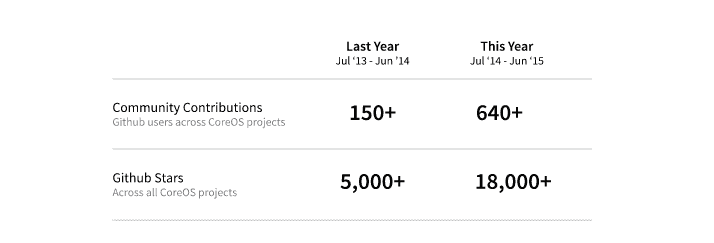

# 围棋界可以庆祝，但它需要一个行为准则

> 原文：<https://thenewstack.io/the-go-community-can-celebrate-but-it-needs-a-code-of-conduct/>

丹佛现在是夏天，一直在下雨，天空是灰色的。这很奇怪，但没有我的家乡波特兰奇怪，那里至少六个星期没有下雨了。但是我跑题了。

这是 GopherCon，有一些值得庆祝的理由。CoreOS 正在庆祝它的第二个生日，GopherCon 在丹佛会议中心，比去年大得多，当时它在丹佛万豪酒店楼下的会议室里举行了有史以来第一次 700 人的会议。

一些需要关注 CoreOS 的原因:它们是容器生态系统中的主要参与者，从 Docker 开始获得一些真正的牵引力的时候就开始了。从那以后，Docker 运行得很快，CoreOS 也为自己赢得了可以说是领先的轻量级操作系统的名声。可能有人会反对这种说法，但毫无疑问，它改变了我们对操作系统的看法。

以下是他们本周发布的内容:

【T2

那 GopherCon 呢？这说明了 Go 的发展势头，它因其简单性和试图让开发者的生活更简单而受到重视。

谷歌的 Russ Cox 在开幕主题演讲中说，Go 是一种先于我们现在称之为“云”的编程语言。考虑到这一点，Go 受欢迎有两个原因:它是开源的，它适合云软件——它是为基础设施设计的。没什么新鲜的，对吧？除了现在考虑一下有多少公司建立在 Go 上或者在它上面有大量投资。名单很长。

那么 Go 是如何成长的呢？主要是通过它的使用，正如 Ian Eyberg 上周为新堆栈所写的:

Docker 目前在 GitHub 上拥有超过 22，000 颗星星。这让多少潜在的围棋开发者面临风险？Kubernetes 只是比主要的 Go 语言 repo 本身少了几百颗星。

当 Docker 的某个用户需要修补某个东西，或者修复某个 bug，或者定制代码时，会发生什么呢？他们必须写 Go。这正是围棋的传播方式。

但是你如何吸引这个更大的社区呢？这似乎是围棋界的下一个重大挑战。Cox 讨论了开源社区及其生硬的风格。他提供了自己的电子邮件风格轶事，他被告知是错误的。

社区需要的是一份行为规范的说明书。 Cox 表示，现在正在努力制定一套行为准则，该准则可能会借鉴 Django 社区的做法。

关于行为准则的讨论将于本周在 GopherCon 进行。周五的黑客马拉松将会是一个焦点。与此同时，这是一个燃烧着的社区。如果它不能吸引技术世界迫切需要的庞大、多样化的社区，它唯一的放缓就会到来。

CoreOS 和 Docker 是新堆栈的赞助商。

<svg xmlns:xlink="http://www.w3.org/1999/xlink" viewBox="0 0 68 31" version="1.1"><title>Group</title> <desc>Created with Sketch.</desc></svg>