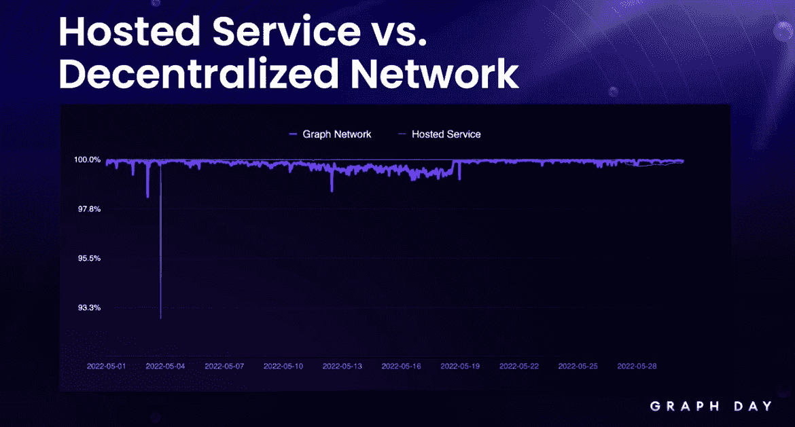
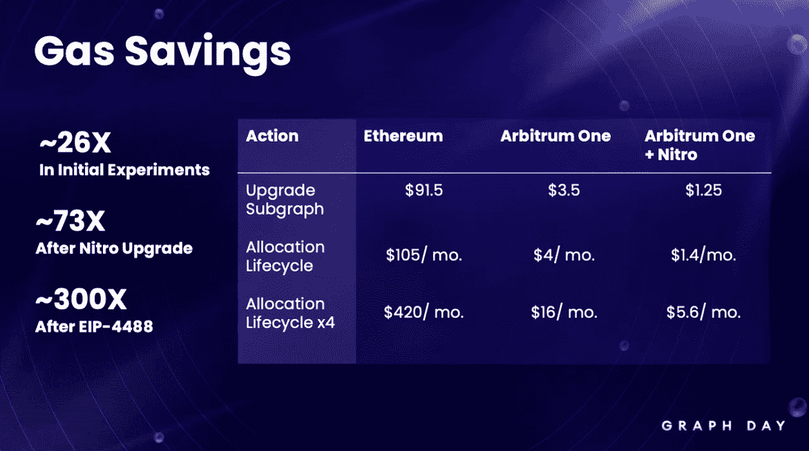
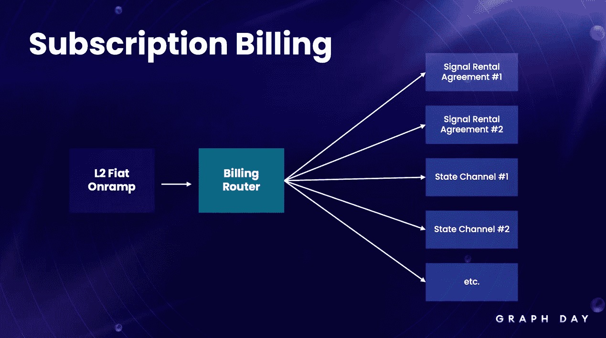

# 该图清理了其 Web3 基础设施中的复杂性

> 原文：<https://thenewstack.io/the-graph-cleans-up-complexity-in-its-web3-infrastructure/>

上周在三藩市举行的 Graph Day，由 [Edge & Node](https://edgeandnode.com/) 举办，包括许多旨在让使用[Graph Protocol](https://thegraph.com/en/)的开发者受益的公告，该协议是用于查询 Web3 网络的索引协议。这是来自该事件的消息，它将影响开发人员，他们正在创建称为子图的开放 API，并在项目中利用图协议。

## 日落图表的托管服务

Edge & Node 最初在 2019 年的第一个图形日推出了托管服务。在完全分散的索引和查询服务增加的同时，它总是旨在作为支持开发人员的临时解决方案。

在他的主题演讲中， [Yaniv Tal，](https://mobile.twitter.com/yanivgraph)The Graph 的联合创始人兼 Edge & Node 的首席执行官，宣布托管服务将在 2023 年 Q1 奥运会前完全淘汰。在随后的演示中，Edge & Node 的研究和产品主管 Brandon Ramirez 在屏幕上展示了下面的图表，显示这两种服务都非常接近我们对 web 服务的预期。

Ramirez 说:“甚至在 Edge & Node 托管服务出现严重中断的时候，分散式网络也变得更加强大。”这应该为开发人员树立信心，让他们知道去中心化已经准备好完全支持他们的工作流。这让我们看到了下一个公告…

## 提议扩展到第 2 层扩展

Ramirez 在台上介绍了一项关于支持区块链二层仲裁机构图形网络交易的机构群体投票提案。该提案的一个关键动机是降低索引器、策展人和委托人角色的交易成本。

正如你在下面的图表中所看到的，从[以太坊](https://thenewstack.io/as-blockchain-hype-fades-developers-give-ethereum-a-serious-look/)迁移到 Arbitrum One 的成本预计会大幅降低。升级子图的估计基于每月两次更新子图，今天的成本约为 91.50 美元，而在第 2 层解决方案中，同样的两次更新成本降至 3.50 美元。

分配生命周期是在一段固定时间内运行索引器的成本，这也导致了大量的成本节约。

理论上，这应该转化为相同频率的子图更新的较低成本，或者因为成本较低而有机会进行更频繁的更新。如果社区同意这个提议，下一步将是在第二层推出一个 Devnet，允许测试图表管理、分配和费用结算。

虽然我们已经看到许多 dApp 和 NFT 项目在第 2 层解决方案上展开，但 Graph 是基础设施协议最早采用第 2 层技术的公司之一。你可以在[图形论坛](https://forum.thegraph.com/)上查看 GIP 提案。

## 改进的开发人员体验

在演讲的最后，Ramirez 谈到了改善图形用户体验。

“对我们来说，”他说，“开发人员的体验始于 Subgraph Studio，在那里我们为您提供用于 API 密钥管理、偏好设置的 subgraph developer tools，[并且]我们有 Subgraph Studio 沙箱，您可以在其中部署子图并与之交互，而无需获得 GRT 或与区块链交互。但我们在前端能做的是有限的。”

这些限制的一部分是开发人员需要与多条结合曲线进行交互，这可能会由于矿工最大开采价值(MEV)而产生价格滑动的问题。菲利普·黛安[对此有很好的解释，](https://pdaian.com/blog/mev-wat-do/)和 [GIP-0025](https://forum.thegraph.com/t/gip-0025-principal-protected-bonding-curves/3162) 很好地解释了图表是如何处理这些成本波动的。

最好不要将计费视为开发人员体验的一项功能，但我们大多数人至少对基础设施服务(如 [Amazon Web Services](https://aws.amazon.com/?utm_content=inline-mention) 处理计费的方式有些熟悉。Web3 世界有着各种各样的代币和浮动的费用结构，这使得事情变得更加复杂。

Ramirez 承认这一点，并强调了一种消除这种复杂性的新方法，这表明图形作为服务提供商正在走向成熟。您可以从下图中看到，该图添加了一个计费路由器，它清除了一些复杂性，并使开发人员感到困惑。

所有这些声明都很好地表明了 Graph 正在成为一个成熟的基础设施解决方案。迁移到完全分散的网络应该能够建立网络弹性。支持第二层交易的提议肯定会降低成本，并可能为无法证明以太坊经济合理性的小型 dApps 创造机会。

虽然围绕成本和账单的问题从来都不性感，但当它们更可预测时，它们确实更容易让财务团队加入进来。你可以在 YouTube 上完整观看 Graph Day。

<svg xmlns:xlink="http://www.w3.org/1999/xlink" viewBox="0 0 68 31" version="1.1"><title>Group</title> <desc>Created with Sketch.</desc></svg>