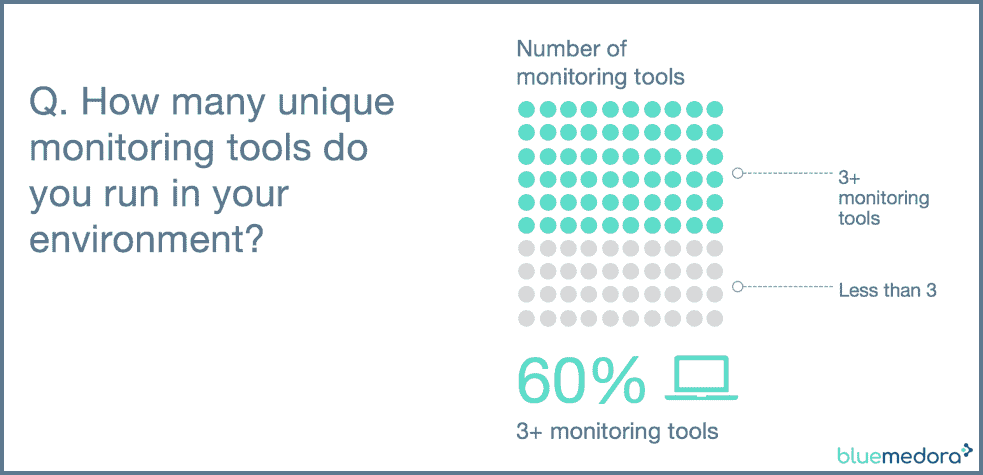
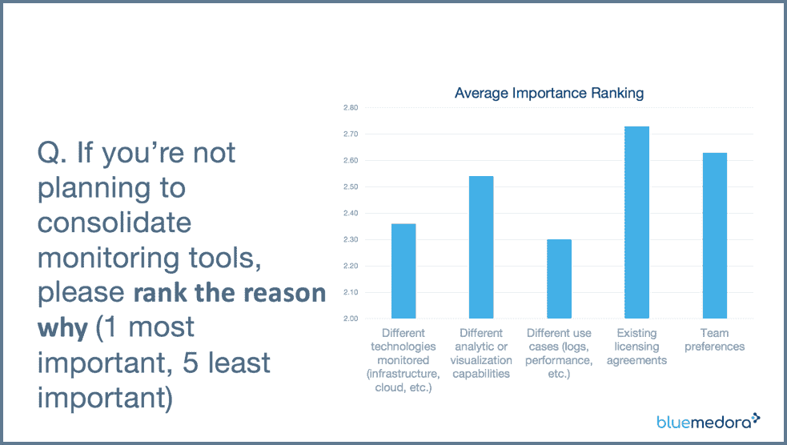
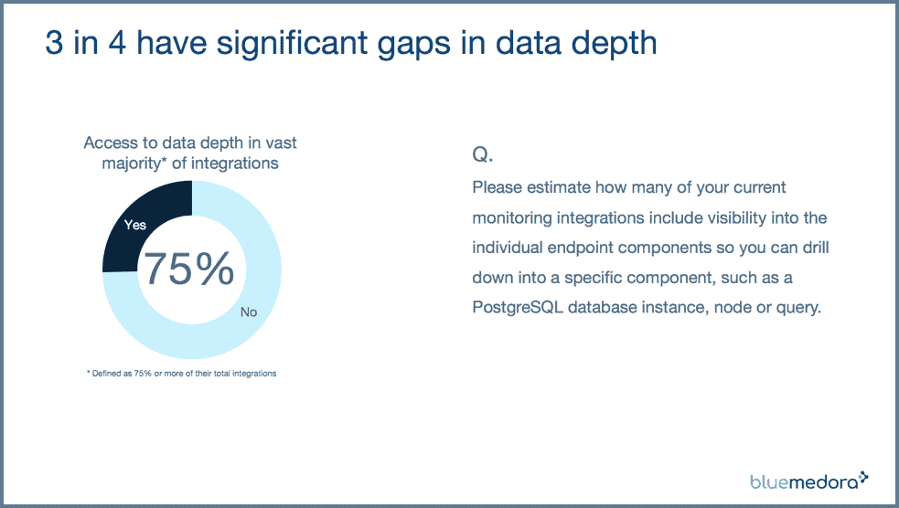
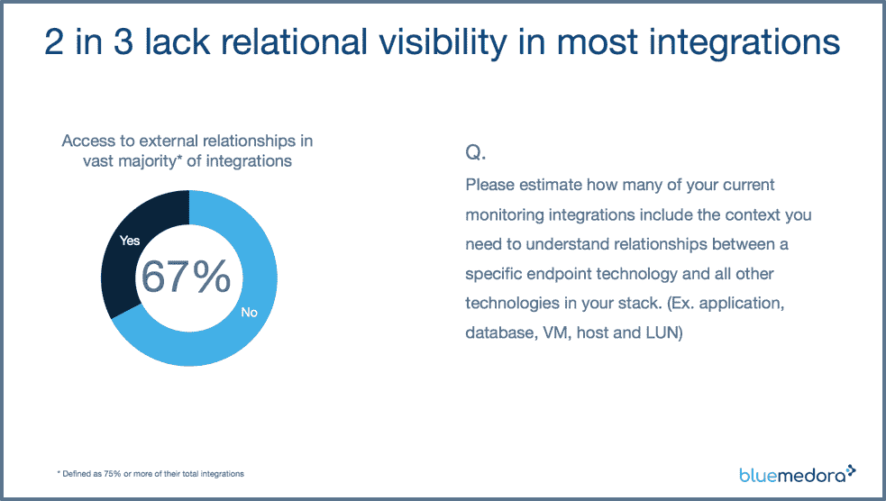

# 工具和可观察性之间的巨大差距

> 原文：<https://thenewstack.io/the-great-gap-between-tools-and-observability/>

[Blue Medora](https://bluemedora.com/) 赞助本帖。

 [莫莉亚·弗雷德里克森

莫莉亚负责 IT 监控集成领导者 Blue Medora 的营销项目。这包括客户和市场研究计划，以捕捉客户的声音并预测不断变化的需求。](https://bluemedora.com/) 

在 2018 年 6 月对 VMware 用户组社区中 400 多名 IT 专业人员的调查中，Blue Medora 仔细研究了各种指标收集策略如何影响 IT 成功。我们的第一个问题是“我们离可观测性有多近？”

调查结果显示了添加工具和提高可观察性之间惊人的潜在脱节。一旦您看到不同数据收集策略的成功/失败及其对总体 IT 成果的影响，这种趋势会变得更加明显。我们还发现，数据收集对于监控领域至关重要。

在监控讨论中，可观察性被抛来抛去，但是它的定义并不广为人知。系统工程师兼作家[辛迪·斯里德哈兰](https://medium.com/@copyconstruct/monitoring-and-observability-8417d1952e1c)在一篇关于媒体的[文章中提供了迄今为止最清晰的定义之一。她描述了 observability(监控的超集)如何将警报/可视化、分布式系统跟踪基础架构和日志聚合/分析结合起来，以更好地了解 IT 系统的运行状况。](https://medium.com/@copyconstruct/monitoring-and-observability-8417d1952e1c)

我们希望测试由[维度数据流](https://bluemedora.com/dimensional-data-making-the-leap-from-monitoring-to-observing/)提供的增加的访问、数据深度和上下文是否会对可观察性和其他 IT 成果产生积极影响。维度数据是指由监控集成即服务(MIaaS)提供的实时指标流。

### 单一窗口搜索可能会转移到“第一个”窗口

60%的受访者运行三个或更多的监控平台，这可能不会让你感到惊讶。对我们来说，与我们经常从客户那里听到的五六个相比，这个数字似乎有点保守。让我们感到惊讶的是，许多组织似乎认为这种工具泛滥的现象会持续下去。与许多技术实践一样，整合多年来一直是监控领域的一个永恒主题。

图 1:根据我们的调查，410 名受访者中有 248 人运行三种或更多的监控工具。

整合当然没有消失。毕竟，一半的受访者表示他们正在试图整合——或许仍在寻找难以捉摸的“监控真相的单一来源”，但其他人没有减少监控工具数量的近期计划。

为什么团队选择这种多平台方法？对于我们调查的那些人来说，有各种各样的原因。突出的两项是受监控的不同技术(云、基础设施、数据库等。)和不同的监控用例(性能监控、日志分析等。).

图 2:受访者出于多种原因计划保留多种监控工具。

这些原因表明，对于这些工具来说，监控工具和数据收集之间并没有太大的差距。它表明，如果受访者能够访问其堆栈中所有技术的所有指标类型，他们就没有太多理由继续使用多种监控解决方案，或者至少他们可以根据团队的需求专注于选择最佳的分析或可视化引擎。

### 更多的工具并不一定能提升我们的可观察性

Sridharan 认为，可观察性提供了对系统行为和丰富背景的高度精细的洞察。我们的调查受访者表示，尽管他们已经有了所有的工具，但他们中的大多数人在数据的粒度和上下文方面仍然存在差距。

事实上，75%的调查受访者表示，他们在绝大多数监控集成(这是一个宽泛的术语，用于描述 API 连接、插件和脚本的任何组合，用于收集监控工具的指标)中缺乏所需的深度(在本次调查中定义为组件级数据解析)。

图 3:调查反馈表明大多数人(410 个回答者中的 305 个)在可观察性的两个关键特征之一的粒度上有严重的差距。

当谈到可观察性的第二个特征，即环境时，调查结果并不乐观。超过三分之二的受访者没有访问关键上下文的权限，在本次调查中，关键上下文定义为对其堆栈各层之间关系的可见性。这意味着他们中的大多数人都是在竖井中查看指标。在瀑布情况下，如果没有上下文，从症状中分离根本原因会非常耗时。

图 4:大多数受访者(410 人中的 276 人)报告说，他们的监控集成缺乏背景。上下文是可观察性的一个关键特征。

### 您的度量收集策略对可观察性很重要

正如我们上面所讨论的，结果指出了添加监控工具和提高可观察性之间的系统性差距。在我的下一篇文章中，我将更深入地研究这些相同的调查结果，并进一步检查正确的度量收集策略和实现可观察性之间的相关性。

通过 Pixabay 的特征图像。

<svg xmlns:xlink="http://www.w3.org/1999/xlink" viewBox="0 0 68 31" version="1.1"><title>Group</title> <desc>Created with Sketch.</desc></svg>