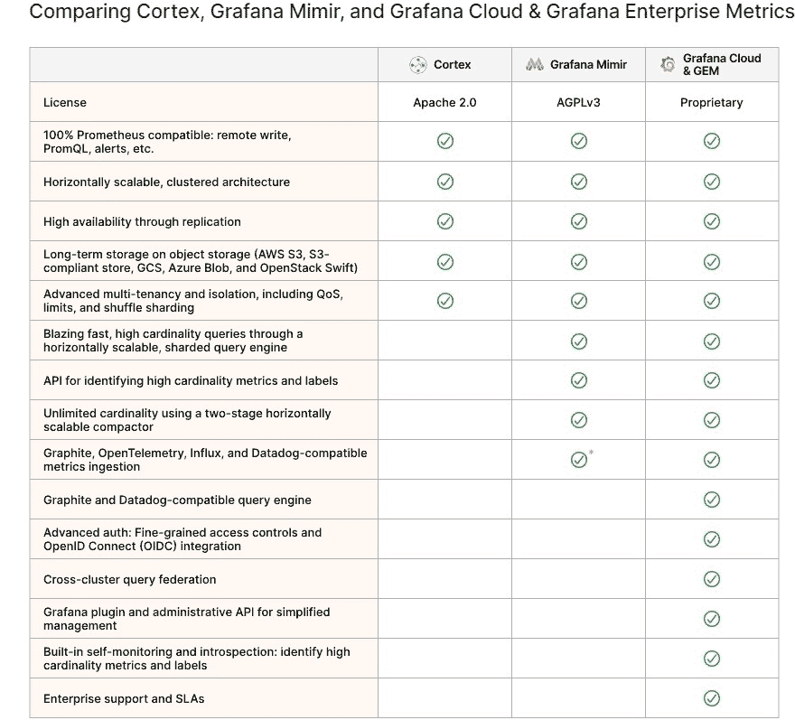
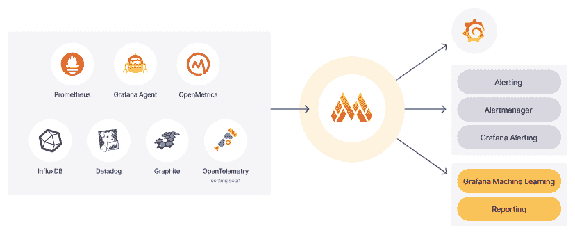

# 伟大的格拉夫纳·米伊美和皮质分裂了

> 原文：<https://thenewstack.io/the-great-grafana-mimir-and-cortex-split/>

Grafana Labs 的 [【米伊美】](https://github.com/grafana/mimir) 三月份的发布引发了一场讨论，讨论为什么 Grafana 决定放弃对 [Cortex](https://thenewstack.io/grafana-nixes-cortex-support-for-amazon-managed-prometheus/) 的支持，并推出一种替代方案，在时间序列数据库上可视化普罗米修斯的指标。有些猜测是没有根据的，因为 Grafana 实验室担心亚马逊网络服务(AWS)会做出类似弹性搜索的举动，并为 Grafana 的客户创建一个分叉的竞争版本，所以据称 Grafana 实验室撤回了支持。还有一些关于大脑皮层和米伊美在功能上重叠程度的不确定性。

发布几个月之后，有必要澄清一下为什么米伊美和 [大脑皮层](https://cortexmetrics.io/) 现在是非常不同的动物，以及 Grafana 如何信守其承诺，进一步区分米伊美，正如 Grafana 高管所称的“Grafana 后端指标”，并具有被大肆吹捧的将 [扩展到 10 亿指标的能力。](https://grafana.com/blog/2022/04/08/how-we-scaled-our-new-prometheus-tsdb-grafana-mimir-to-1-billion-active-series/)

“我们从 Cortex 中去掉了这么多旧东西:我们拆掉了完整的传统存储引擎，重新设计了完整的配置。我们还设置了许多新的默认设置，以便于操作和加快速度，“Grafana Labs 的社区主任和 CNCF 标签观察主席告诉新堆栈。“所以，我们在可用性上投入了大量的时间——你可以在你的笔记本电脑上运行一个二进制版本，然后你就有了一个完全运行的米伊美，”只用了几分钟。”

## 共享基础

这并不是说米伊美不再与 Cortex 共享其基础代码。Cortex 旨在帮助扩展和改进 Prometheus for metrics 的使用，最初作为 SaaS 产品，在 2018 年被 CNCF 接受为沙盒项目，然后在 2020 年成为一个孵化项目，因为 Grafana 的著名仪表板以及 Loki 和 Tempo 的受欢迎程度越来越高。

Grafana Labs 成为 Cortex 项目的最大贡献者，这一事实最终引发了一些担忧，即一些云供应商如何能够从 Cortex 中获得商业利益，而不对该项目做出同样多的贡献。Grafana Labs 也开始向 Grafana Enterprise Metrics[【GEM】](https://grafana.com/products/enterprise/metrics/?pg=blog&plcmt=body-txt)贡献更多资源，将资源从开源的 Cortex 转移出去。然后决定一个新项目——米伊美——将成为 Grafana Labs 的度量开源项目，并且它将共享 GEM 的功能。Grafana 实验室也认为米伊美拥有比 Cortex 更严格的许可证是明智的。

“我们最终把越来越多的代码放到了闭源部分——我们不喜欢这样，”H 阿特曼说 。“我们相信开源，开源第一。”

由此产生的 AGPLv3 许可随后被用于米伊美，而不是 Cortex 的 Apache2 许可。许可机制的改变也是为了鼓励更多的贡献或米伊美用户以比 Cortex 用户更强大的方式做出贡献。(Grafana、Tempo 和 Loki 也使用 AGPLv3 许可证。)

在一篇 [的博客文章中，](https://thenewstack.io/grafana-nixes-cortex-support-for-amazon-managed-prometheus/)[Tom Wilkie](https://www.linkedin.com/in/tomwilkie/?originalSubdomain=uk)Grafana Labs 的产品副总裁，同时也是 Prometheus 的维护者和[Loki 和 Cortex](https://github.com/cortexlabs/cortex) 的共同创造者，他写道:“米伊美将我们在 Cortex 中构建的最好的东西与我们为大规模运行 GEM 和 Grafana Cloud 而开发的功能相结合，所有这些都是在 AGPLv3 许可下进行的米伊美包含了以前的商业特性，包括使用水平可伸缩的‘分离’压缩器的无限基数，以及通过分片查询引擎的超高速高基数查询。”

此处列出了米伊美、Cortex 和 GEM 之间的共享功能:

## 大位移

 **

Grafana 在 3 月份发布时承诺的一项米伊美功能是将其覆盖范围扩展到普罗米修斯指标之外，以包括来自influence、Graphite 和 Datadog 的指标。为此， Grafana 实验室已经开始为米伊美开源三个写代理，用于来自 Graphite、Datadog 和 InfluxDB 的度量(米伊美已经“原生地”支持 OpenTelemetry，Hartmann 说)。“ 这些代理在开源项目中被贴上标签，允许使用现有的监控基础设施快速简单地获取指标，并为米伊美从任何系统获取指标奠定了基础，”[Grafana Labs 的高级软件工程师 Alex Greenbank、](https://www.linkedin.com/in/alex-greenbank-52763468/?originalSubdomain=uk) 在一篇 [博客文章中写道。](https://grafana.com/blog/2022/07/25/new-in-grafana-mimir-ingest-graphite-datadog-influx-and-prometheus-metrics-into-a-single-storage-backend/#grafana-mimir-proxies-how-they-work)

从 Prometheus、Grafana Agent、OpenMetrics、InfluxDB、Datadog 和 Graphite 获取指标的能力源自写代理如何允许从 Graphite 和 Datadog 以及通过流入线路协议获取指标。“通过添加代理作为收集代理的附加端点，任何指标都将被转换为普罗米修斯时间序列，并以普罗米修斯远程写入格式发送，以存储在米伊美内，”格林银行写道。

<svg xmlns:xlink="http://www.w3.org/1999/xlink" viewBox="0 0 68 31" version="1.1"><title>Group</title> <desc>Created with Sketch.</desc></svg>**