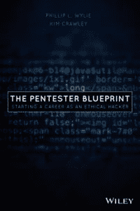
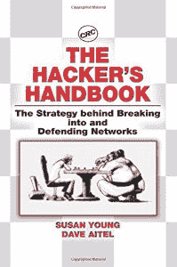

# 安全大辩论:打补丁没用吗？

> 原文：<https://thenewstack.io/the-great-security-debate-is-patching-useless/>

“我已经在这个游戏中很长时间了，”安全专家戴夫·艾特尔说，他提出了一个反直觉的论点，即修补易受攻击的软件是无用的。他说，打补丁“让你感觉良好，让供应商看起来不错，让保险公司相信你在做尽职调查——但这并不过分有用。”

艾特尔站在了 4 月份举行的“ [Hack at the Harbor](https://hackattheharbor.com/) ”自由网络会议辩论的一边。

乍一看，修补易受攻击的软件似乎是一个好主意，因为其他人会允许攻击者进入系统。正如 event show notes 所断言的，“有人说，如果你能做一件事，而且只能做一件事，那就是修补修补修补，并投资于修补管理解决方案。”

但是“其他人说它远没有人们想象的那么有用，”该项目还指出。

网络安全公司 CyCognito 的经理/技术宣传员 Phillip Wylie 同意打补丁*并非*无用。此前，他是美国银行的高级云渗透测试员，曾在大型银行和电信公司担任类似的网络安全职位。Wylie 也是 Pentester blue print:Starting a Career as a Ethical Hacker 的合著者——因此，他带着现实世界专业知识的有益帮助进入了辩论。

但 Aitel 在网络安全方面有着自己悠久的传奇历史。《悉尼先驱晨报》2005 年的一篇简介指出，艾特尔 18 岁时靠奖学金作为一名计算机科学家在美国国家安全局工作。

据《先驱报》报道，艾特尔随后加入了一家安全公司(后被赛门铁克收购)，然后在纽约创立了自己的安全公司 Immunity。Aitel 现在是信息安全研究和工程公司 Cordyceps Systems 的合伙人，领导着一个机器学习/数据科学团队。艾特尔还与人合著了一本安全书籍:*黑客手册:入侵和防御网络背后的策略*

于是大辩论开始了…

[https://www.youtube.com/embed/6Xuy90hW7jc?feature=oembed](https://www.youtube.com/embed/6Xuy90hW7jc?feature=oembed)

视频

## 打补丁是在毒害我们吗？

为了反对打补丁，艾特尔引用了 2021 年发现的 VPN 漏洞。除了打补丁，艾特尔认为完全重新安装受影响的 VPN 设备是必要的，以移除任何已经留下的危险的访问授权 rootkits 重新安装，他开玩笑说，“我们知道你们都没有这样做。”那么那些已经被偷走的密码或密钥呢？

“修补那个设备——并让它重新上线——给了你一种极度虚假的安全感，”他说。

概述了这种情况后，艾特尔接着嘲笑了“漏洞管理”这个短语的奥威尔性质，说作为一个实际的概念，它是错误的。“它欺骗了我们，让我们认为存在一个漏洞窗口，如果攻击者在此期间无法利用我们，我们就没事。”

相反，Aitel 建议将不够安全的设备和系统放在一种“惩罚箱”中——卸载并从可利用的位置移除。“漏洞应该告诉你的是，一个非常特殊的软件没有强大到足以暴露。”但很快就清楚了，艾特尔的批评更进了一步。“我想说，打补丁基本上是无害的，但事实并非如此。我们对补丁作为安全工具的依赖已经毒害了我们……”

“对于一个给定的 PHP 内容管理服务器，有没有一些补丁会让你觉得它现在暴露的漏洞对你来说是没问题的？面向互联网的服务器？对于*客户数据*？不应该有！”艾特尔引用对 Outlook Web Access 的其他担忧，批评“微软股东希望你相信的信息:一旦打了补丁，它就又安全了。”

后来，艾特尔更加强调了这一点，称之为“不幸的是，我们陷入了这样一种想法，即我们都是无助的，只有微软才能从天堂给我们带来保护我们系统的甘露”——特别是在一个有其他缓解措施的世界里(包括 [0patch](https://0patch.com/) 的快速“微修补”服务)。事实上，安全研究人员 Maddie Stone 指出，在 2020 年，每四个零日中就有一个“如果进行更彻底的调查和修补工作，就有可能避免

“换句话说，”艾特尔认为，“打补丁只是警告攻击者有坏代码。它也应该提醒你。

“获胜的唯一途径是选择正确的平台。不要使用 PHP——直接说不。不要使用 Microsoft Exchange。选择安全而非修补。”

## 当补丁不是无用的时候

Phillip Wylie 自己的开场陈述以一个他进行的渗透测试的故事开始，该测试发现了一个低风险漏洞。在 90 天后的第二次测试中，同样的漏洞仍然没有打补丁——而且这个漏洞已经变得更容易被利用了。“有人可能已经利用该漏洞实际破坏了他们的企业！该漏洞与补丁相关，已通过补丁修复。”

Wylie 似乎认为，仅仅这一点就足以说明修补的必要性。他同意你不应该依赖补丁来解决所有问题,“这是整个计划的一部分。您需要确保使用防火墙、终端保护…所以只是一种分层的方法。但我肯定地认为，通过修补系统，你排除了某种程度的攻击者。”怀利认为，在网上展示一个不如其他目标吸引人的目标总是好的，“补丁是其中的一部分……”

“即使有一些最好的安全措施，你也可能无法防止民族国家的攻击——但你能排除的人越多越好。”

Wylie 看到了一个简单得多的问题:那些公司在意识到漏洞后并没有修补它们。“有时人们将安全性视为合规性的一个复选框，而实际上并不关心安全性！我认为这需要改变。”

但是当然，这么说也就是说你对修补的信念仍然没有动摇…

## 向风车倾斜

随着两位演讲者的互动，在线观众想知道哪种立场会占上风。

Aitel 指出，目前需要大量的补丁，尤其是对于拥有各种系统的大型企业。“这使得整个职业领域都脱离了漏洞管理，”艾特尔说，他苦笑着抱怨说，“这就好像你在简历上写你是一名专业的风车倾斜专家。我们知道工作永远不会结束，我们知道工作做得很差——不管你做得多好。”

艾特尔的结论？这甚至不是一份值得做的工作。

但艾特尔认为，问题甚至比这更大，因为“脆弱性分类被打破了。”如果我们知道我们永远无法真正赶上——那还有什么意义呢？

艾特尔在后来的辩论中强调了这一点。“攻击者可以读取 git 提交消息。他们总是比您的安全团队打补丁更快，因为他们比安全供应商打补丁更快。我们在 log4j 中看到了这一点，我们将在其他所有产品中看到这一点。”他甚至补充了这个可怕的预测。“太阳风只是一个开始。未来 5 到 10 年，供应链会把我们生吞活剥！如果我们认为*打补丁*就是答案，我们还不如……放弃回家。”

后来艾特尔甚至指出[臭名昭著的网络安全管理软件产品漏洞](https://thenewstack.io/solarwinds-the-worlds-biggest-security-failure-and-open-sources-better-answer/) *是*的更新——所以“保护补丁本身是一个我们还没有解决的问题。”

Wylie 反驳说，修补仍然可以是多管齐下的方法的一个组成部分——还问，有什么替代方法？“如果我们放弃所有这些事情而不去做，那我们还有什么保障？这些事情中的一些可能不是最终/全部，也许补丁程序管理不能保护我们。但我认为这只是一个必要过程的一部分……”

两人努力寻找共同点。Aitel 和 Wylie 同意不断发现尚未修补的“零日攻击”——Aitel 指出，这些攻击可被最令人担忧的攻击者利用。但是艾特尔提出了一个尖锐的问题:那么在一个不断有新的可利用漏洞的世界里打补丁的目的是什么？Wylie 不得不承认修补——甚至渗透测试——不能解决一个如此新的漏洞，以至于它的存在尚不为人所知。

另一方面，Aitel 承认 Wylie 推荐的攻击面管理“非常有价值。我认为那是我们大脑需要去的地方。我想这就是你排除人的方法。

“我不认为你通过打补丁来排除人。我认为你通过一开始就不脆弱来排除他们，”他说。

## 调查显示

Aitel 认为，最好的第一步是减少攻击面——了解什么是不安全的，什么是暴露的。Wylie 同意了——建议进行漏洞扫描和资产检查，以及使用防火墙和执行配置检查。但是 Wylie 仍然认为这是他喜欢的分层方法的一部分——包括修补——并且几次尖锐地重申了他的信念。“在我看来，你不能什么都不做…我不得不认为打补丁会有帮助…”至少作为一个更大的安全工具套件的一部分。

“我认为每样东西都有它的位置。我们只需要确保一切就绪。首先确保一切都是安全的，而不仅仅是依赖终端保护。你必须确保你着眼于整体安全。”

怀利似乎很困惑。他同意 Aitel 所说的一些内容，但“我只是不能同意完全不打补丁…根据我过去在 IT 和其他领域的工作经验，必须针对这些东西打补丁，以及它会对公司产生多大影响-完全放弃打补丁有点难！”

在辩论结束时，举行了投票，56%的投票者最终同意怀利的观点:修补*并非*无用。

但仍有 44%的观众不同意。

* * *

# WebReduce

<svg xmlns:xlink="http://www.w3.org/1999/xlink" viewBox="0 0 68 31" version="1.1"><title>Group</title> <desc>Created with Sketch.</desc></svg>