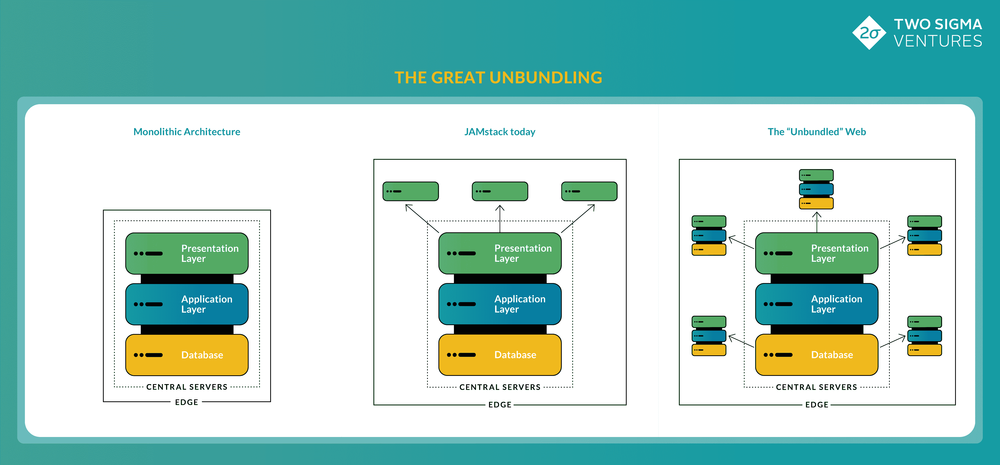
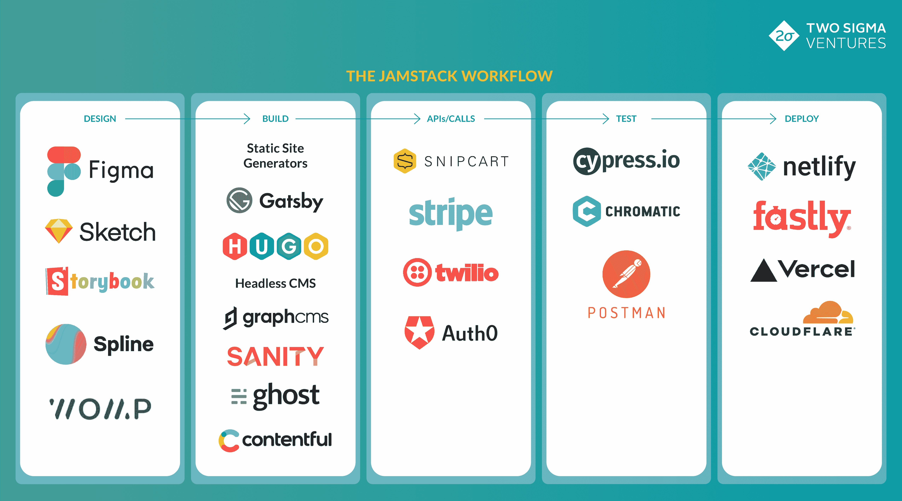

# 伟大的拆分:JAMstack 和网络的未来

> 原文：<https://thenewstack.io/the-great-unbundling-jamstack-and-the-future-of-the-web/>

 [安迪·康潘

安迪于 2017 年加入两家适马风险投资公司，常驻纽约。他主要投资于企业软件、网络安全和区块链。十多年来，安迪一直是纽约早期科技生态系统的一部分，担任运营者、顾问和投资者。在加入 Two 适马之前，安迪是 ff Venture Capital 的投资者，他投资了一些初创公司，这些公司在机器人和机器学习等领域建立了创新技术。](https://twosigmaventures.com/our-team/profile/andy-kangpan/) 

当今软件开发界最令人兴奋的趋势之一是众所周知的 JAMstack。这个术语最初是由 Netlify 的联合创始人 Mathias Biilmann 创造的，字面上代表 **J** avaScript、 **A** PIs 和 **M** arkup，但它已经成为现代 web 开发的同义词。谈到 JAMstack，您实际上指出了开发社区中许多重叠的趋势，包括(但不限于):

*   为开发人员抽象后端复杂性的基础设施
*   API 供应商的大量增加
*   通过 CDNs 将计算推进到边缘
*   JavaScript 在前端开发者中的主导地位
*   静态站点生成器的兴起，以及构建时 web 应用程序的创建

由于 JAMstack 是一个非常广泛的话题，因此很难正确定义。虽然许多人在过去讨论过 JAMstack 的兴起，但我们希望对底层技术和趋势提供一个清晰的解释，为什么我们认为它们很重要，以及我们认为这将走向何方。

## 什么是 JAMstack？

 [维奈·艾扬格

Vinay 于 2020 年加入了两家适马风险投资公司，总部位于旧金山。他专注于企业软件、机器学习、市场和基础设施的投资。Vinay 的背景是技术专家和建筑工人。他多年来一直担任研究员、工程师和软件企业家，最近是 Bessemer Venture Partners 的投资者，在那里他获得并领导了几项早期和成长期投资。Vinay 获得了哈佛大学的计算机科学和经济学学士学位。](https://twosigmaventures.com/our-team/profile/vinay-iyengar/) 

JAMstack 是一种理念、方法和工具集，用于构建比用传统整体 web 架构构建的应用程序更快、更安全、更可伸缩的 web 应用程序。

JAMstack 背后的理念很简单，但是非常强大，包括两个主要概念。首先是解耦的概念，它在应用程序的前端和后端之间画了一条硬线。通过这样做，前端开发人员可以主要关注他们产品的表示层，而不是后端服务器逻辑。其次，是预渲染的概念。其思想是在构建过程中将整个前端加载到静态页面中，然后可以在用户请求时直接从内容交付网络(CDN)而不是原始 web 服务器提供服务。

JAMstack 实际上也是一种构建方法。其核心是一种使用 Javascript (React 是最流行的框架，但 JS 生态系统变化很快)、第三方 API 和标记(即通过站点生成器提供的预呈现 HTML)在 web 上创建产品的方法。还有许多其他最佳实践通常与“JAMstack”网站相关，比如在 CDN 上运行，以及使用更现代的构建工具和工作流。

最后，出现了一组工具，它们专门(但不排他地)迎合了开发人员在构建 web 应用程序时对这些原则和方法的考虑。你可以把这个非详尽的市场地图想象成一个工作流程，从网站的概念到它出现在最终用户面前:

## 为什么人们对 JAMstack 感到兴奋？

JAMstack 运动是软件世界中少有的显著改善开发人员和最终用户体验的转变之一。当采用 JAMstack 原则时，组织可以提高开发人员的工作效率，增加站点的可靠性和安全性，并创建更具性能和个性化的用户体验。

简而言之，JAMstack 消除了开发人员周围的显著噪音，这些噪音会将他们的注意力从构建核心产品上转移开。基于 JAMstack 的开发人员可以将更多的时间放在构建引人注目的用户体验上，而不是花在实现这种体验的复杂性上。他们花更少的时间学习和维护后端服务器逻辑，并确保应用程序随着用户流量而扩展。这最终增加了开发周期，并允许组织更快地向客户交付更好的体验。

JAMstack 站点也更加可靠和安全。由于这些网站将其前端和后端分离，开发人员不再需要担心监控后端服务器，因为 API 提供商和 CDN 提供商会处理必要的供应，以确保网站随着用户流量而扩展。此外，网站不再依赖像 Drupal 或 WordPress 这样的中央 CMS，它们经常是恶意黑客的目标。最后，因为这些站点是使用第三方 API 服务的集合而不是一个整体构建的，所以更容易识别问题并调试它们。

从性能角度来看，在 JAMstack 范式中构建的 web 体验为最终用户提供了更快的加载时间。当内容被预先呈现并缓存在 CDN 上时，它消除了用户请求返回中央服务器、处理请求并发回数据的需要。它几乎是即时交付给用户的，消除了体验中的显著延迟。我们已经看到了许多例子，其中转移到 JAMstack 可以将站点性能提高 10 倍之多。

## 这是要去哪里？(对网络未来的一些预测)

JAMstack 只是开发人员在 web 上构建方式的巨大转变的开始。我们相信这一趋势的演变将会产生深远的影响，下面我们将详细介绍其中的一些影响。

1.  **每一个 SaaS 应用程序和现代网站都将使用 JAMstack 框架构建** —虽然今天的许多用例都是围绕电子商务和静态内容，如博客和营销文案，但我们认为 JAMstack 的长期优势将使这一框架成为所有类型的网络体验(静态或动态)的基础。此外，JAMstack 支持“一次构建，随处部署”的方法，允许将出色的用户体验直接交付给最终用户，无论他们是在笔记本电脑、移动设备上，还是在 Peloton 自行车上。
2.  **JAMstack 相关工具和服务的市场将在未来五年内超过 1000 亿美元**——考虑到消费者和企业的广泛使用案例，我们认为 jam stack 相关工具和服务的市场将使已经庞大的 1000 亿美元[虚拟主机](https://financesonline.com/30-essential-web-hosting-statistics-2019-analysis-of-trends-data-and-market-share/)市场相形见绌。在这个领域将会有几个令人兴奋的 10 亿美元以上的公司，无论是新的主机提供商、无头 CMS 还是 API 供应商。我们已经看到 Netlify、Contentful 和 Vercel 中出现了一些潜在的问题。
3.  **“全栈”开发人员将慢慢从企业中消失**——前端和后端的分离为开发人员提供 web 体验时需要关注的事情划定了清晰的界限。出于需要，前端开发人员除了跟上快速发展的前端技术之外，通常还需要学习复杂的后端逻辑。JAMstack 消除了对这种“全套”专业知识的需求，并将使前端开发人员能够专注于他们最擅长的领域。
4.  **开发团队将更频繁地围绕前端和后端逻辑来组织，而不是产品和微服务** —根据定义，单一产品架构需要前端和后端开发人员之间的协作。因此，工程团队在历史上是以“垂直整合”的方式或由特定的产品团队来组织的。然而，我们与工程领导者的对话表明，使用基于 JAMstack 的方法，结合基于微服务的架构的兴起，前端和后端开发人员能够更容易地独立工作。因此，我们相信工程组织结构将开始以类似的方式分离，团队越来越专注于前端或后端逻辑。
5.  **JAMstack 将有助于开创沉浸式内容的新黄金时代**——随着构建复杂、高性能的 web 应用程序的复杂性被抽象化，内容和功能将成为开发者关注的关键组件，以区分他们构建的体验。我们已经看到设计更好的网络体验，过去一年我们与设计师的对话表明，3D 内容将在互联网上变得无处不在。简单浏览苹果网站[就会发现没有一张 2D 的照片。我们相信这是未来很多网站的发展方向。此外，我们对](https://www.apple.com/) [WebGPU](https://gpuweb.github.io/gpuweb/) 的潜力感到兴奋，这是一种类似 WebAssembly 的未来 web 标准，它将在 web 上实现更丰富、更动态的 3D 内容。在更遥远的未来，我们预计 AR 内容也将变得更加普遍，这将再次通过我们今天看到的 JAMstack 构建块来实现。
6.  **网络将变得完全“非绑定”** —除了纯粹的市场规模，JAMstack 趋势让我们兴奋的是，它代表了更广泛的网络“非绑定”。我们今天看到的第一波浪潮是，网络的“表示层”正在被缓存并分发到边缘。随着时间的推移，我们预计这种趋势将渗透到比表示层更深的地方，达到应用程序逻辑和核心基础设施。随着时间的推移，我们相信所有现代软件将开始作为全球分布式服务运行。整个体系越来越接近终端用户，终结了漫长的集中式计算服务时代，实现了更丰富、更快速、更安全的体验。

总的来说，我们对 JAMstack 将为开发者和消费者带来的所有可能性感到兴奋。虽然我们仍处于技术和框架被采用的早期阶段，但我们有信心它会带来更快、更安全、更吸引人的网络体验。如果你是这个领域的创业者，我们很乐意与你交谈。

<svg xmlns:xlink="http://www.w3.org/1999/xlink" viewBox="0 0 68 31" version="1.1"><title>Group</title> <desc>Created with Sketch.</desc></svg>