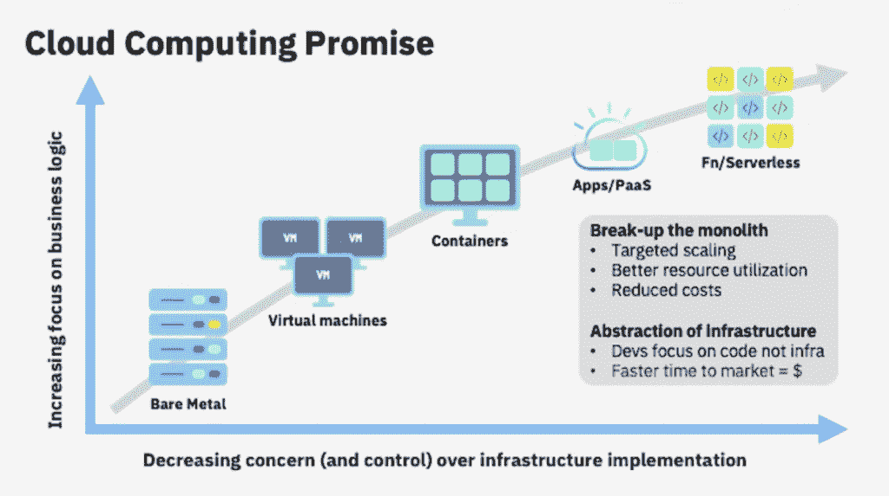
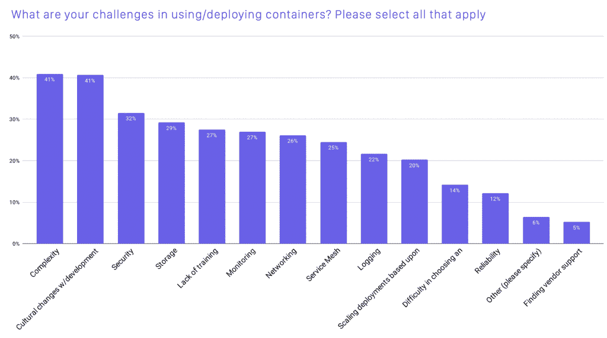
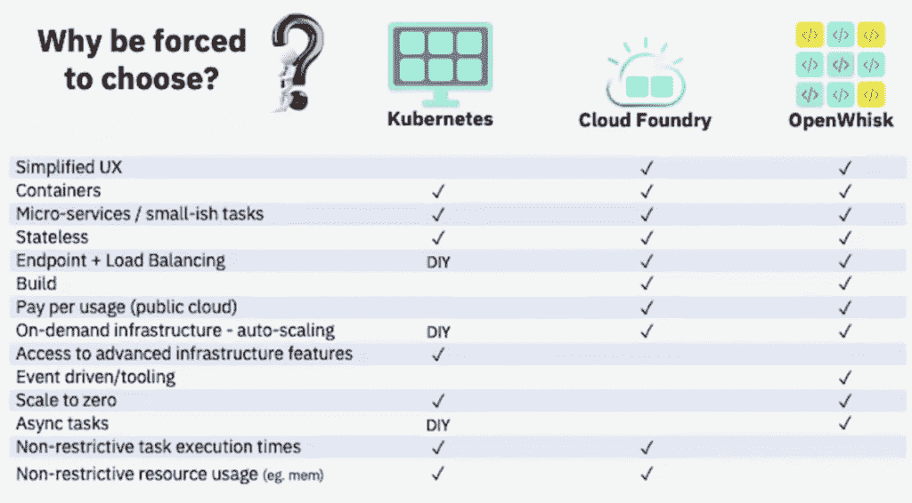
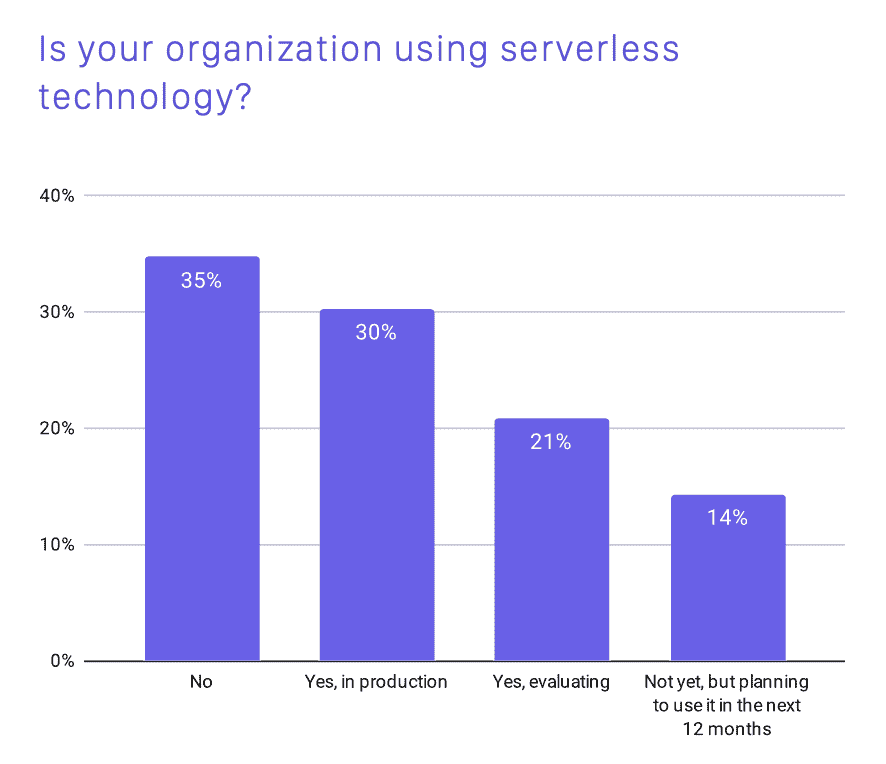

# Kubernetes 日益增长的复杂性——以及如何解决这个问题

> 原文：<https://thenewstack.io/the-growing-complexity-of-kubernetes-and-whats-being-done-to-fix-it/>

[Honeycomb](https://www.honeycomb.io/) 正在赞助新 Stack 对 Kubecon+CloudNativeCon 北美 2020 的报道。

在本周的一次 [KubeCon + CloudNativeCon](https://events.linuxfoundation.org/kubecon-cloudnativecon-north-america/) 演讲中，IBM Cloud 的 [Doug Davis](https://www.linkedin.com/in/doug-davis-05b9ba6/) 问道:云计算的前景怎么样了？他解释说，对开发人员的承诺是“基础设施的复杂性将从我们身上抽象出来，我们可以专注于真正重要的东西……我们应用程序中的代码。”但是云计算并没有完全实现这个承诺。正如 Davis 在他的演讲中所展示的，云原生技术已经变得过于复杂——尤其是对开发者而言。

来源:Doug Davis，IBM Cloud

虽然 Kubernetes(最突出的例子)抽象了我们如何管理容器，但 Davis 指出，“在许多情况下，底层基础设施的复杂性不仅仍然可见，而且就在你的面前。”"

有趣的是，云计算原生计算基金会(CNCF)最新发布的 2020 年调查结果[显示了同样的担忧。“今年，复杂性与开发团队的文化变化一起成为使用和部署容器的最大挑战，”报告指出。](https://www.cncf.io/wp-content/uploads/2020/11/CNCF_Survey_Report_2020.pdf)

资料来源:CNCF

鉴于容器现在几乎普遍用于 it 部门(“容器在生产中的使用已经从去年的 84%增加到 92%，从我们 2016 年的第一次调查增加了 300%，”CNCF 报告称)，IT 部门认为容器太复杂是一个很大的问题。特别是因为，正如 Doug Davis 在他的 KubeCon 演讲中指出的那样，云计算早期的一大卖点是它会让事情变得简单得多。那么，为什么它似乎做了相反的事情呢？

## 比较容器解决方案

Davis 使用了 [Kubernetes](https://kubernetes.io/) (容器)、 [Cloud Foundry](https://www.cloudfoundry.org/) (平台即服务，又称 PaaS)和 [Apache OpenWhisk](https://openwhisk.apache.org/) (一个开源的无服务器平台)的例子来比较和对比基于容器的云平台的特性。例如，虽然 Cloud Foundry 和 OpenWhisk 在这个比较矩阵中有一个“简化的 UX”，但 Kubernetes 没有。

来源:Doug Davis，IBM Cloud

Davis 比较 Kubernetes 和 Cloud Foundry 的评论在容器技术复杂性的利弊方面特别有启发性。他首先列举了 Cloud Foundry 的许多好处:它非常易于开发人员使用，它为您完成构建，并且“推送-部署模型非常棒。”但是对于开发者来说，这是一个权衡。

“你得不到的是[……]对高级功能的必要访问，”Davis 解释道。“在许多情况下，他们试图对你隐瞒——因为这就是问题的关键，对吗？他们希望你专注于:只要给我们你的源代码，我们会为你托管它。”

与 Kubernetes 的权衡有点不同。这可能是一个非常强大的平台，具有许多高级功能，但实现或管理这些功能并不容易。正如戴维斯所说，这些高级功能“要么缺失，要么你必须自己去做。”他列举了端点管理、获取容器映像和负载平衡等例子。

Davis 的观点是，虽然 Kubernetes 确实抽象了基础设施，但它仍然向您公开了基础设施。即使您插入第三方工具来管理某个特性，也会增加运行 Kubernetes 的整体工作的复杂性。

## Kubernetes 不是最终游戏

 [理查德·麦克马努斯

Richard 是 New Stack 的高级编辑，每周撰写一篇专栏文章，探讨云计算原生互联网的未来。此前，他在 2003 年创立了读写网，并将其打造为全球最具影响力的科技新闻和分析网站之一。](https://twitter.com/ricmac) 

戴维斯在演讲的后面提出了一个非常有趣的观点，也许云原生社区有时会忘记:“Kubernetes 不是这里的最终目标。”

“从技术角度来看，这可能是游戏的终结，至少在今天是这样，”他继续说道，“但就我们应该向用户展示什么而言，这还不是游戏的终结。”

然后他谈到了 Knative T1，这是一个无服务器平台，戴维斯将其描述为“Kubernetes 之上的简化用户体验”由于戴维斯本人在 Knative 项目上工作，他对它非常熟悉。他解释说，Knative 的目标是自动管理“我称之为现代或高级(Kubernetes)的功能，这样我就不用自己管理这些东西了。”

换句话说，Knative 不会向您展示这些高级功能——用戴维斯令人难忘的话来说，这都是“在幕后”完成的。

回到 2020 年 CNCF 调查，我认为另一个有趣的趋势说明了需要被掩盖的复杂性主题:[无服务器](https://thenewstack.io/category/serverless/)。51%的调查受访者现在正在使用无服务器，无论是在生产中(30%)还是在评估中(21%)。这一总数字为 51%，高于 2019 年的 41%，因此无服务器作为一种趋势继续上升。

资料来源:CNCF

60%使用无服务器的受访者仅使用“托管”解决方案，另有 22%的受访者同时使用托管解决方案和 Knative 等“可安装”解决方案。排名靠前的托管无服务器平台是 AWS Lambda (57%)、Google Cloud Functions (27%)和 Azure Functions (24%)。

另一个趋势，在 CNCF 的调查中没有提到，但在我今年的写作中已经成为一个越来越多的主题，那就是无服务器现在已经超越了功能即服务(FaaS)。AWS Lambda 基本上是一个 FaaS 平台，这意味着它是为无状态应用程序设计的。但是更新的项目，比如 Lightbend 的 Cloudstate，正试图将无服务器体验引入有状态应用。

类似地，Doug Davis 指出 Knative 开始关注更广泛的用例。他说，Knative 一直“专注于低延迟应用”，这意味着“它不一定能很好地处理需要三个小时运行的请求。”但他说，这个框架是用来把 Knative 作为“通向更大成就的垫脚石”

## 应对复杂性的后续步骤

Davis 最后讨论了他的雇主 IBM Cloud 的一个新项目，他说这可能是降低 Kubernetes 复杂性的下一步。 [Code Engine](https://cloud.ibm.com/docs/codeengine?topic=codeengine-about) 构建于 Kubernetes 之上，被[定位为“一个完全管理的无服务器平台，运行你的容器化工作负载。”Davis 解释说,“代码引擎的主要目的是让你的开发人员回到编码上，而不是管理基础设施。”](https://www.ibm.com/cloud/blog/announcements/ibm-cloud-code-engine)

Code Engine 目前处于免费测试期，但 Davis 表示，一旦离开测试期，IBM Cloud 打算将其作为托管服务进行收费。

更广泛地说，戴维斯呼吁云原生社区做更多的工作来解决复杂性。他建议减少专有基础设施和“更有创意的项目”，在基础设施项目上加强合作，并重新关注可用性。

他还建议最终用户应该“抵制”云原生社区，并“要求更低的复杂性”，并且最终用户不应该害怕“要求更多*开发*和更少*运营*。”

Cloud Native Computing Foundation 和 Cloud Foundry 是新堆栈的赞助商。

通过 Pixabay 的特征图像。

<svg xmlns:xlink="http://www.w3.org/1999/xlink" viewBox="0 0 68 31" version="1.1"><title>Group</title> <desc>Created with Sketch.</desc></svg>