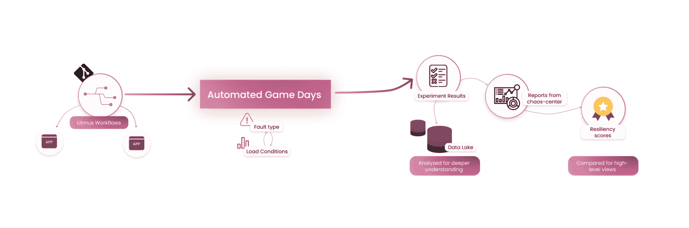

# HaloDoc 混沌工程之旅

> 原文：<https://thenewstack.io/the-halodoc-chaos-engineering-journey/>

 [马尼瓦南·钱德拉塞卡兰

马尼瓦南是 HaloDoc 的 DevOps 工程经理。](https://www.halodoc.com) 

HaloDoc 是印度尼西亚最受欢迎的全方位医疗保健应用程序。作为一家成立于 2016 年的快速发展的初创公司，我们的使命是在印度尼西亚简化并带来优质的医疗保健。我们与 100 多个城市的 4000 多家药店合作，将药品送到人们的家门口。最近，我们推出了与 500 多家医院合作的高级预约服务，允许患者在我们的应用程序中预约医生。

快速阅读此简介将会让您对我们服务的关键任务性质有所了解。

## 背景:HaloDoc 的服务基础设施

该平台由跨混合基础设施元素托管的几个微服务组成，主要在托管的 Kubernetes 云上，具有复杂设计的通信框架。我们还利用 RDS、Lambda 和 S3 等 AWS 云服务，并使用一套重要的开源工具，特别是来自云计算原生计算基金会的工具，来支持核心服务。

作为 HaloDoc 网站可靠性工程(SRE)的架构师和经理，确保这些服务的顺利运行是我的核心职责。在这篇文章中，我想提供一个快速的快照，说明我们为什么以及如何使用混沌工程作为保持弹性的手段之一。

## 可靠性挑战

在操作如此大规模和频繁变动的平台时(更新的服务非常频繁地出现)，人们必然会遇到一些紧张的情况。我们有几个新增加的服务宕机的事件，尽管立即得到了缓解，但还是引起了我们团队的关注。在我们拥有的这种依赖关系的系统中，有必要在一系列故障场景中测试和度量服务可用性。这需要在上线前完成，偶尔在上线后完成，尽管是以一种更可控的方式。测试和测量将通过全面的自动化测试套件和定期性能测试/分析来补充完善的 QA，从而使平台更加健壮。

令人鼓舞的领导团队、灵活的工程团队和强大的可观察性基础设施使我们能够在没有太多文化摩擦的情况下开始混沌工程的实践。

## 选择混沌平台

为了与我们的开源文化和从属关系保持一致，大约在 2021 年 1 月，我们开始寻找符合以下标准的开源混沌工程解决方案:

*   **Kubernetes native**:halo doc 使用 Kubernetes 作为大部分业务服务的底层平台，包括托管工具，用于操作和管理我们整个集群的可观测性。我们需要一个可以在基于 ARM64 (AWS-Gravitron)的 Kubernetes 上部署和管理的混沌工具，以及用 Kubernetes 的语言——资源 YAML——表达混沌测试的能力。
*   **具有可扩展性的多种故障类型**:考虑到微服务跨越多个框架和语言(Java、Python、C++、Golang)，有必要让它们经受各种服务级别的故障。除此之外，基础设施的混合性质(各种 AWS 服务)以及针对非 Kubernetes 实体(如云实例、磁盘等)的能力。，变得清晰。此外，我们正在寻找一个混沌平台，它可以帮助应用程序开发人员构建他们自己的错误，将它们集成到套件中，并以类似于本机错误的方式编排它们。
*   **混沌场景定义**:我们需要一种方法来定义一个成熟的场景，根据用例，将错误与一些自定义验证结合起来，因为混沌测试预计会在初始实验/建立测试拟合后以自动化的方式运行。HaloDoc 还在其测试环境中使用各种映射到微服务系列的合成负载工具，我们希望将其作为 chaos 实验的一部分，以使其更有效并获得更大的信心。
*   **安全特性**:halo doc 的分级环境是多用户共享环境，由专门的服务所有者和 SRE 团队访问，应用程序经常升级。我们需要一个工具，能够隔离各个团队的混乱视图，并对可能的爆炸半径进行管理控制。这与运行第三方容器的标准安全考虑结合在一起。
*   **可观察性挂钩**:作为一个在可观察性上投入巨大的组织，既用于监控应用/基础设施行为(堆栈包括 New Relic、Prometheus、Grafana、ElasticSearch 等。，)以及报告和分析(我们使用 Allure 进行测试报告，使用 Lighthouse 进行服务分析)，我们希望 chaos framework 能够为我们提供足够的数据，以记录日志、指标和事件。
*   **社区支持**:在选择开源解决方案时，一个重要的考虑因素是，我们正在寻找一个强大的工具社区，该社区拥有平易近人的维护人员，他们可以在我们的问题和改进中找到原因，同时为像我们这样的用户提供一个友好的环境。

我们最终选定了 LitmusChaos，它在很大程度上满足了我们所寻找的标准，同时有一个路线图和发布节奏，与我们的需求和步伐保持一致。它也有一些其他有趣的功能，我们已经开始使用，如 GitOps 支持。我们最终为更好的用户体验(Litmus dashboard)和提高平台的安全性做出了贡献。

## 我们今天如何实践混沌

我们最初在 Litmus 上的努力包括手动创建 ChaosEngine 定制资源，以应用程序单元为目标来验证行为。这本身证明了开发环境中一些有趣的应用程序行为是有益的。最终，使用 Litmus 的 probe 特性进行了正确的验证，并组合在一起形成了可以通过编程调用的混沌工作流资源。

如今，这些存储在专用 git 存储库中的混沌工作流通过订阅机制映射到各自的应用服务，并在应用升级时通过驻留在临时集群上的 Litmus 事件跟踪器服务触发。有趣的是，我们很快了解到，作为持续部署的一部分，自动化混乱似乎是生态系统中正在兴起的一种趋势，并且我们不是唯一有这种想法的人。

虽然在筹备阶段的混沌实验被用作部署到生产中的门控机制，但 HaloDoc 的团队坚信在生产中测试的优点。我们使用 Litmus 的计划混乱功能在生产环境中进行“自动化游戏日”，并根据使用和流量模式设计故障类型和负载条件之间的映射。

这些实验的结果被输入到一个数据湖中，供开发团队进行进一步分析，而来自 chaos center(Litmus 的控制平面组件)的报告，尤其是那些围绕场景弹性得分比较的报告，也可用于高级视图。

参与创建/维护和跟踪 staging 上的混沌测试的人员主要是属于不同垂直行业的开发人员和扩展技术团队，而游戏日则完全由 SRE 团队的成员执行。

集群上 chaos 微服务的升级与其他工具的升级方式基本相同，应用程序在 GitLab 管道中接受标准扫描和检查。

## 弹性工程关键绩效指标

由于我们的混沌之旅还处于起步阶段，评价标准还没有完全具体化。话虽如此，努力一定要有分寸，才能产生合适的收益！这里有一些我们正在关注的重要的顶级指标，其中一些已经显示了正确的曲线/趋势，因为我们的 chaos 实践已经开始。

*   MTTR:许多应用服务已经被配置为自我修复，但是恢复的时间告诉我们这种机制的效率。使用本地 Litmus 探测器和自定义检查，对所有目标微服务(测试中的应用程序或 Litmus 术语中的 AUT)进行跟踪。
*   **错误预算**:作为一家快节奏的初创公司，几乎每天都有产品升级，我们需要承担风险。在计算错误预算时，考虑了失败判决的混沌实验结果，后者在不同的服务级别被跟踪。
*   **SLOs** :伴随实验的稳态假设可能直接与服务水平目标相关，或者对其有贡献。SLO 被跟踪以进行维护，而失败的程度通过工作流特性增加。
*   **票证/中断**:提交的中断警报和事故票证是另一个业务级别的指标，正在被跟踪以衡量混乱实践的有效性。

## 当前影响和展望

到目前为止，混沌工程在两方面都有帮助:验证预期行为和学习新行为。展望未来，我们希望增加更多针对系统行为不同方面的场景。我们预计 chaos 实践和文化将会变得更加强大，在各个垂直领域分配专用资源。

从技术角度来看，我们正在与 Litmus 团队合作，共同改进认证(G Suite 集成)和秘密管理机制(Vault ),以扩大平台在组织中的覆盖范围。

<svg xmlns:xlink="http://www.w3.org/1999/xlink" viewBox="0 0 68 31" version="1.1"><title>Group</title> <desc>Created with Sketch.</desc></svg>