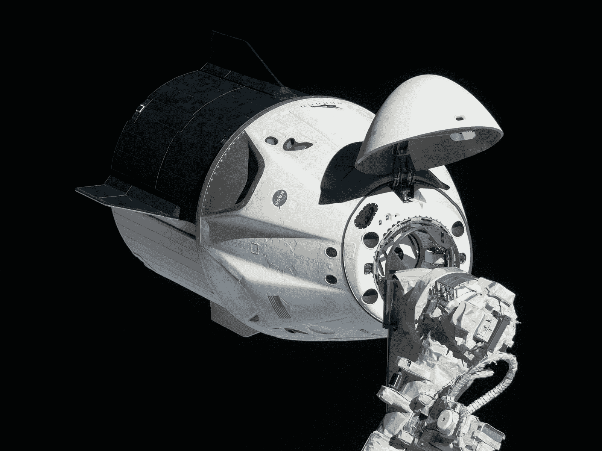

# 太空中使用的硬件和软件

> 原文：<https://thenewstack.io/the-hardware-and-software-used-in-space/>

人类最伟大的成就之一就是探索我们头顶的宇宙，将我们的技术推向极限，完成令人振奋的科学壮举。下面我们来看一下这项任务的硬件和软件，以及构建和维护将在高辐射零重力环境中运行的任务关键型操作系统所涉及的特殊考虑因素。

## SpaceX 的龙 2 和 Starlink

今年 5 月，SpaceX 公司的可重复使用火箭猎鹰 9 号(Falcon 9)发射了载有货物的小龙太空舱，这次搭载了两名美国国家航空航天局(NASA)宇航员前往国际空间站，他们在那里呆了两个月，然后安全返回地球。6 月，ZDNet 打趣道，发射火箭是“由液态氧、火箭级煤油、[和 Linux](https://www.zdnet.com/article/from-earth-to-orbit-with-linux-and-spacex/) 驱动的。”

“像超级计算机、物联网设备和许多关键任务设备一样，猎鹰 9 号使用 Linux 飞行。”

但不一定是标准发行版。相反，火箭的机载操作系统使用“一个运行在三个普通双核 x86 处理器上的精简版 Linux”，它控制火箭的引擎和飞行路径导向网格鳍。每个处理器运行一个独立版本的飞行软件——用 C/C++编写——“如果有任何分歧，决策将被放弃，过程将重新开始。”

六月，龙胶囊的软件开发者[在 Reddit](https://old.reddit.com/r/spacex/comments/gxb7j1/we_are_the_spacex_software_team_ask_us_anything/) 上回答问题，解释说“我们不使用任何第三方发行版，而是维护我们自己的内核和相关工具的副本。”尽管他们称之为“基本上未经修改”，但他们显然必须为 SpaceX 的硬件添加定制驱动程序。杰夫·德克斯特(Jeff Dexter)负责龙的飞行软件和网络安全，[补充道](https://old.reddit.com/r/spacex/comments/gxb7j1/we_are_the_spacex_software_team_ask_us_anything/ft5zuxa/)对于猎鹰 9 号火箭和龙太空舱，“我们使用 C++用于所有的车辆控制系统，Python 用于工具、测试和自动化，Javascript/HTML/CSS 用于我们的显示。”

马特·蒙森(Matt Monson)——他从 Dragon 项目转到 SpaceX 的卫星互联网服务 Starlink——发布说 Starlink 使用了许多专用集成电路(ASICs)，他们也对 Linux 有丰富的经验。“对于 Starlink 上的某些级别的 scope，每次发射 60 颗卫星包含 4000 多台 Linux 计算机。目前，星座在太空中有超过 30，000 个 Linux 节点(和超过 6，000 个微控制器)。

“由于我们与 Falcon 和 Dragon 共享许多 Linux 平台基础设施，他们可以受益于我们 180 多年的在轨测试时间。”

## 在太空站上

ZDNet 讽刺道，龙太空舱使用 Linux 证明了“企鹅可以飞，背后有足够的火箭动力。”ZDNet 还报道称，龙的触摸屏界面是用 Chromium 和 JavaScript 渲染的(尽管也有物理航天器控制仪器，以防触摸屏界面出现问题)。

但他们也指出，实际的国际空间站本身运行于 20 世纪 80 年代末的 20 MHz 英特尔 80386SX CPUs，尽管宇航员使用笔记本电脑作为远程终端“进行日常工作”2017 年，HPE 报道称，空间站的宇航员将运行 Debian、Scientific Linux 和 Windows 7 [的 ThinkPad T61p 替换为类似的 HP ZBook 15s](https://www.hpe.com/us/en/insights/articles/the-space-station-gets-a-new-supercomputer-1708.html) ，其中一些现在升级到了 Windows 10。TechRepublic 报道称，美国宇航局[在空间站](https://www.techrepublic.com/article/from-windows-10-linux-ipads-iphones-to-hololens-the-tech-space-station-astronauts-use/)的笔记本电脑比他们需要的多 20%——多余的作为备用。或者，正如 ZDNet 所说，“它们是预计会失败的普通笔记本电脑。事实上，国际空间站上有 100 多台笔记本电脑，其中大部分都报废了。”

TechRepublic 打趣道:“在表面上竞争的技术也只是船上使用的不同系统的熔炉的一部分。”在 2016 年的一篇文章中，该网站指出，美国国家航空航天局将 Linux 系统用于“航空电子设备，这是保持空间站在轨道上和空气可呼吸的关键系统”，而 Windows 机器提供“一般支持，扮演的角色包括存放手册和程序时间表，运行办公软件，以及提供与家庭的所有重要联系，支持通过电子邮件和最近的视频聊天进行通信。”

Windows 机器也用于播放音乐和电影，国际空间站计算机资源经理斯蒂芬·亨特告诉 TechRepublic，宇航员更熟悉这个操作系统。

[https://www.youtube.com/embed/KaOC9danxNo?feature=oembed](https://www.youtube.com/embed/KaOC9danxNo?feature=oembed)

视频

文章解释说，空间站上运行着几十台笔记本电脑，用于从展示手册到视力检查的各种用途。它列出了美国宇航局的宇航员在国际空间站上使用的硬件，IBM ThinkPads，运行 Windows 95 和“早期 Linux”大多数系统升级都是在地球上“远程”进行的，最终让位于联想 ThinkPads。

也有 iPhone 和 Android 手机——一些手机用于遥控简单的实验性无人机。也有 iPad——英国宇航员蒂姆·皮克使用 iPad 应用程序远程跟随伦敦马拉松[——以及微软 Surface Pro 3 平板电脑，其中一个被用作生物 DNA 测序仪。空间站上的宇航员甚至测试了微软 HoloLens。](https://www.youtube.com/watch?v=MMuibwPqqgg)

[https://www.youtube.com/embed/MMuibwPqqgg?feature=oembed](https://www.youtube.com/embed/MMuibwPqqgg?feature=oembed)

视频

## 下架和离开地球

ZDNet 指出，由于太空中较高的辐射水平(以及宇宙射线)，芯片需要多年的设计工作和测试。它们要经过一个被称为辐射加固的严格过程，包括增加冗余电路，甚至设计带有特殊绝缘衬底的半导体晶片。2017 年，美国宇航局和 HPE 合作进行了一项为期一年的联合实验，在空间站上测试了现成的超级计算机硬件，以确定它是否足以在太阳耀斑等辐射危险期间降低速度。

“如果我们怀疑某个组件超出了参数，我们就会进入安全模式，”HPE 的美洲 HPC 技术官 Mark Fernandez 在 HPE 的博客文章中解释道。“我们保持安全空闲配置，以度过这段时间。一旦该事件过去，我们将执行运行状况检查，以确保在恢复运营之前一切正常。”

VentureBeat 报道称，使用的系统是阿波罗 pc40 服务器，拥有多达四个英伟达特斯拉图形处理单元，必须通过超过 146 项安全和认证测试。HPE 自豪地称之为他们的“云上”服务。它的操作系统？红帽企业版 Linux 6.8。

结果呢？根据 Fernandez 的一篇博客文章,[在接下来的一年中没有出现任何问题。"说我们欣喜若狂是一种保守的说法。"](https://www.hpe.com/us/en/newsroom/blog-post/2018/07/spaceborne-computer-still-flying-high-one-year-later.html)

该系统被命名为空间搭载。“随着太空飞船在与地球上完全不同的条件下运行了近一年，我们想知道，下一步我们能给太空带来什么？国际空间站上的私有云将智能带到太空的边缘？”费尔南德斯写道。

## 等等

在本月的 Ars Technica 节目中，华沙的科学/技术作家亚采克·克里科对[多年来用于外星任务的其他操作系统](https://arstechnica.com/features/2020/10/the-space-operating-systems-booting-up-where-no-one-has-gone-before/)进行了更广泛的观察。它的标题？"肯定不是 Windows 95:什么操作系统让东西在太空中运行？"

Krywko 指出，NASA 在 20 世纪 60 年代的任务软件是为每个任务定制的。但是 1994 年的克莱曼婷任务改变了这一点，该任务在测试传感器和航天器组件的同时观察了月球和一颗近地小行星。在随后的许多任务中，美国宇航局开始使用 WindRiver 专有的 VxWorks 操作系统，Krywko 说，该系统有一个微内核管理所有的硬件/应用程序交互，仔细跟踪每个任务的状态和对资源的访问。

欧空局飞行软件系统部门的负责人玛丽亚·赫内克告诉 Ars，他们在他们的[哥白尼卫星计划](https://sentinel.esa.int/web/sentinel/missions/sentinel-1)(2014 年首次发射)中也使用了 VxWorks 操作系统，但后来改用了开源和高度可定制的实时执行多处理器系统操作系统(最初由美国军方开发，用于发射导弹)。Krywko 指出，美国宇航局也使用了这种操作系统，并补充说“这两种主要的飞行操作系统甚至在同一艘航天器上并行运行，管理不同的仪器。”

这些操作系统可能是任务关键型的。Krywko 指出，今年 2 月，欧洲航天局发射了一颗绕太阳运行 7 年的卫星。它的轨道将比水星更靠近太阳——水星的温度高达 450 摄氏度，或 842 华氏度——这需要控制其隔热罩位置的软件快速做出决定。"否则，太阳轨道飞行器就要被烧焦了."

Krywko 还研究了 SpaceChain OS，这是一个在太空中产生多个比特币节点的项目，也得到了欧洲航天局的投资。比特币核心开发者 Jeff Garzik 告诉他，比特币基于开源内核 Sylix，比 Linux 内核小五倍，中国已将其用于太空和军事应用。

有各种各样的航天器，也有各种各样的技术被部署。一个科技网站甚至开玩笑说，美国宇航局历史性的新视野号太空探测器——它在飞往太阳系边缘的途中飞过冥王星——是由 PlayStation 提供动力的“[”，因为它是由抗辐射的基于 MIPS 的 mongose-V CPU 运行的，“直接来自 MIPS r 3000[一种 32 位工作站和控制台处理器]，它为最初的索尼 PlayStation 提供动力。”](https://www.extremetech.com/extreme/197612-nasas-new-horizons-space-probe-powered-by-playstation)

它的操作系统是[Mentor Graphics Nucleus PLUS](https://www.designworldonline.com/mips-in-space-inside-nasas-new-horizons-mission-to-pluto/)，它至今仍在运行——距离地球超过 40 亿英里。

* * *

## WebReduce

<svg xmlns:xlink="http://www.w3.org/1999/xlink" viewBox="0 0 68 31" version="1.1"><title>Group</title> <desc>Created with Sketch.</desc></svg>