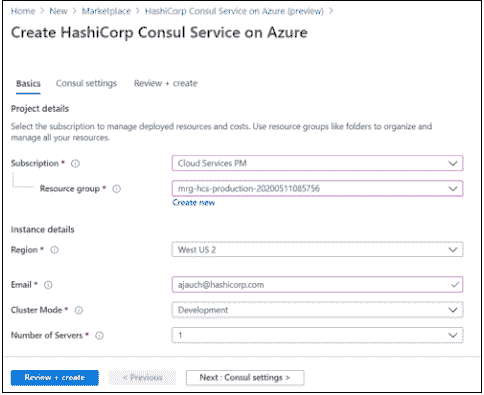

# 哈希公司咨询服务来到微软 Azure

> 原文：<https://thenewstack.io/the-hashicorp-consul-service-comes-to-microsoft-azure/>

面向微软 Azure 云平台的[hashi corp consult Service](https://www.consul.io/)(HCS)服务网格软件的发布，代表了 [HashiCorp](https://www.hashicorp.com/) 扩大其云托管服务范围的最新举措。

微软 Azure 上的 HCS GA 版本是 HashiCorp 的第一个托管服务网格，允许开发人员和运营团队更轻松地依靠 Consul 服务网格在 Azure 上部署应用程序和管理网络，以及下面描述的其他功能。

例如，运营团队现在可以利用 Consul 在 Azure 上运行的功能和开发集群。当然，HCS 也支持 Azure 上的生产集群。

在最近发布了 [HashiCorp 云平台(HCP)](https://thenewstack.io/hashicorp-cloud-platform-unifies-the-hashicorp-portfolio-for-seamless-multicloud-use/) 并扩展了其 Consul 网络控制平面的功能之后，HashiCorp 的联合创始人兼首席技术官 [Armon Dadgar](https://www.linkedin.com/in/armon-dadgar) 表示，Azure HCS 的发布是 HashiCorp 向更具管理服务的业务模式转变的一部分。

“我们正在从桌面软件供应商转变为更多的云软件供应商，”Dadgar 说。

Dadgar 说，HashiCorp 选择 Azure 是因为 HashiCorp 和微软倾向于关注的客户组织类型有很多重叠。

此次发布还旨在满足企业的需求，这些企业正在将更多资源转移到云，并越来越依赖第三方提供的服务模式来管理运营。

“我认为有一个实际的现实，多年来意味着企业正处于过渡时期，即‘太好了，我们正在步入云，但我们仍然对我们购买它、拥有它、运营它的运营模式感到舒适，’”dad gar 说。“我认为在过去几年中，我们已经看到了这种转变，所以现在即使是世界上最大的企业也在问‘嘿，你能为我们管理 Consul 吗？’"

组织也越来越多地寻找在云上运行的开源工具和平台的托管服务。

微软公司副总裁布伦丹·伯恩斯(Brendan Burns)说:“开源软件真的有爆炸性的增长，比如 Consul 和 Vault 以及所有这些伟大的服务，但是在云中没有可用服务的地方，人们自己在运行这些服务。”。“我认为这是导致这种转变的原因，‘哦，我喜欢人工智能作为一种服务的事实，我喜欢领事和金库’，然后他们可以依赖 HashiCorp 来完成这一点。”

HashiCorp 在 Azure 上说:

*   将 Consul 控制面板的供应、管理和升级任务卸载给 HashiCorp。
*   自动利用网络和安全最佳实践。
*   分多步实施服务注册、服务发现和服务网格。
*   支持跨所有 Azure 服务(包括 AKS、虚拟机和 Azure PaaS 服务)的统一服务联网方法。
*   提供服务发现和健康检查服务，以定位和监控在其他环境中运行的服务。

亚马逊网络服务公司(AWS)和 HashiCorp 是新堆栈的赞助商。

通过 Pixabay 的特征图像。

<svg xmlns:xlink="http://www.w3.org/1999/xlink" viewBox="0 0 68 31" version="1.1"><title>Group</title> <desc>Created with Sketch.</desc></svg>