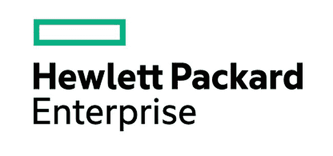
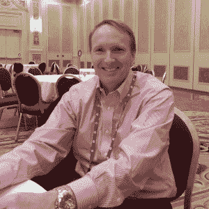

# 惠普企业标志是一个关于 DevOps 和青春与年龄悖论的故事

> 原文：<https://thenewstack.io/the-hewlett-packard-enterprise-logo-is-a-story-about-devops-and-the-paradox-of-youth-and-age/>

昨天在惠普探索大会上，首席执行官梅格·惠特曼介绍了惠普企业，这是惠普拆分为两家公司的结果。惠普公司代表系统和打印机集团。惠普企业(HPE)面向企业 IT 业务，其中包括惠普 Helion，这是一个基于云计算的应用开发平台。

在她的主题演讲中，她解释了新 HPE 对市场和公司方法的反映。该标志是一个简单的绿色矩形和新公司的名称，白色背景，黑色无衬线字体。惠特曼说，它应该代表简单，反映了公司的过去，也可以说是一扇通向未来的窗户。这是为了配合首席执行官梅格·惠特曼关于惠普关注“创意”和创意经济的讨论。在她的主题演讲中，她重点介绍了 Vimeo 和优步等新公司。她提到了优步以及它是如何扰乱出租车行业的。她警告说，所有行业的公司都可能被那些知道如何从想法到价值的创业公司所击败。

她说这是从传统到新 IT 的转变。应用和数据无处不在。惠特曼谈到了公司如何使用任意数量的服务来推动业务发展。成功取决于一家公司适应和扩展的速度，这样它们才不会像出租车公司那样陷入困境，因为它们面临着像优步这样开发和运营软件的公司的效率问题。

## 这对惠普企业意味着什么？

那么，这种从观念到价值的转变对 HPE 意味着什么呢？你会听到 HPE 高管更多地谈论开发者、 [DevOps](https://thenewstack.io/category/devops/) 运动，以及该公司如何看待分析及其在运营中的工作方式。我采访了惠普软件公司产品营销副总裁罗伊·里塔勒，他谈到了客户现在是如何接受自动化的。随着这一自动化运动的加速，惠普正在开发 DevOps 产品集，正如我们昨天所写的 [LeanFT](https://thenewstack.io/hp-embraces-rivals-in-bid-for-hybrid-cloud-business-developer-love/) 的发布所示。

[罗伊·里塔勒，惠普:自动化就是信仰](https://thenewstack.simplecast.com/episodes/roy-ritthaler-hp-automating-is-believing)

这是一种悖论。一些年轻的公司有很多资金来建立新的技术栈。他们的成功鼓舞了他们，并利用老公司没有的新模式进行扩张。一些成熟的公司和客户正在使用分析技术从整体应用中获取价值。还有像惠普这样的成熟技术公司面临的矛盾。他们的客户刚刚开始适应新的技术生态系统。对这些客户来说，互联网规模的公司是模型，是象征。顾客们没有准备好，也没有努力成为优步或维密欧。

这使得像 HPE 这样的公司处于某种三角关系中。互联网规模的公司有这样的想法，他们将软件转化为软件，使用来自各种 API 端点的服务快速扩展，以创造让人们乐于使用服务的体验。你是否曾经使用过 Lyft，并对下车而不与司机进行交易感到如此高兴？客户想要改变，但不是超级快。HPE 不得不适应和调整他们的步伐，以适应他们必须跟上的互联网规模的公司和想要改变但又拥有日常业务所依赖的现有系统和软件的客户。

惠普正在通过运营分析等努力实现变革。例如，Ritthaler 的小组使用 Hadoop 和其他方法收集数据。他们开发了自己的平台，名为[按需避风港](http://www8.hp.com/us/en/software-solutions/big-data-platform-haven/features.html)。他们已经学会通过 [Vertica](http://www.vertica.com/about/) 和通过 Autonomy 及其 API 服务提供的 API 应用数据分析。Vertica 是一个 SQL 分析平台，Autonomy 具有从非结构化数据、视频和音频中收集数据的搜索功能。在至少一个用例中，通过 Autonomy 收集的数据与来自应用程序和设备数据的社交搜索情绪一起使用。然后，它可以为开发人员确定性能和其他指标。

ritt haler 说，运营团队就是一切关于分析的团队。“我们正在用机器人代替人，”这是他的小组谈论的一个信息。人们在操作中被机器人取代，这在许多方面是当前市场变化的核心。自动化现在比以往任何时候都更被接受，但编排仍然是概念性的，全面的转变尚未到来。

你在惠普看到的是 DevOps 如何推动公司变革。虽然 Ritthaler 的团队正在使用分析平台来推动运营变革，但它也在为自己的内部客户提供指导，无论他们是那些使用 Docker 构建云原生应用的客户，还是那些试图从虚拟化环境中获取更多价值的客户。

这再次反映了这种三角情景。一方面，世界各地的优步积极进取，建立分析仪表板，使他们的服务更加高效。惠普希望提供服务，为客户提供工具，帮助他们用机器人代替人。但是他们也只能如此咄咄逼人。顾客还没有准备好接受太多的变化。

开始一场关于容器以及它们如何作为流程的对话，会更接近优步和其他互联网规模的公司所开发的这种想法和估值的概念。这些公司拥有不变的基础设施、持续集成服务和自己的平台，可以收集数据并通过分析服务进行过滤。

关于客户以及他们如何学会将想法转化为价值的问题也与 HPE 有关。答案就在你从运营管理中看到的努力和与开发者更紧密合作的努力中。这些公司进行估值的速度有多快是个大问题。惠普之舟花了一段时间才改变航向。但是转动它是最难的部分。他们必须考虑如何开放平台，建立由分析驱动的数据业务。他们正在到达那里。但是他们也必须考虑更加开放他们的平台。如果他们能做到这一点，那么历史告诉我们，开发人员将更容易接受惠普，将其视为进步和创新公司生态系统的一部分。

<svg xmlns:xlink="http://www.w3.org/1999/xlink" viewBox="0 0 68 31" version="1.1"><title>Group</title> <desc>Created with Sketch.</desc></svg>