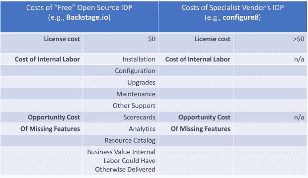

# “免费”内部开发者门户的隐性成本

> 原文：<https://thenewstack.io/the-hidden-costs-of-free-internal-developer-portals/>

您已经听说了内部开发人员门户提供的显著优势。IDPs 可以帮助您的工程团队提高速度和可靠性，并通过在一个自助式位置组织有关您的应用、服务、环境、云和团队的所有重要信息来提升开发人员体验。

IDP 还使您的工程领导能够衡量和管理计划，以提高对架构和运营标准、安全和法规要求的遵从性。它们甚至可以作为您的运营团队的中央资源目录，因此他们不再需要通过笨重的云控制台遍历多个云、帐户和可用性区域来查找基本资源信息。

现在您可能想知道:我们应该实现哪种类型的内部开发人员门户？我们应该尝试专业供应商还是使用 Spotify 的 Backstage 开源项目这样的免费解决方案？

这些都是合理的问题。如果可以部署免费的替代工具，为什么还要花钱购买开发工具呢？正如我们将在下面说明的，免费 IDP 方法的成本比你想象的要高得多。

## **两类“自由”境内流离失所者**

## **1。开源模式(Spotify 的后台)**

市场上最常见的免费 IDP 是 Backstage.io，这是一个由 Spotify 开发的平台，用于帮助其自己的工程计划，后来提供给开源社区，最终被云原生计算基金会接受。

虽然 Backstage 在技术上是免费的，从某种意义上说，您不会向供应商支付使用该工具的席位或许可证，但您需要明白，无论是从绝对意义上还是相对于您的替代方案来说，它都会产生大量成本。几个例子:

### **你们队的时间**

后台需要大量的内部工程投资来建立和维护项目。

### **难以设置**

**安装:**尽管是 CNCF 的产品，Backstage 并不提供预建的 Docker 容器。安装需要 Node.js 和 Yarn，并且根据您现有的技术，可能需要额外的人员来构建 IDP 并保持其运行。

Backstage 是一个基于代码的产品，需要通过编辑源文件和 YAML 文件进行大量定制。没有单击甚至多次单击的安装过程。您几乎肯定需要一个相当大的专门团队来维护系统并保持应用程序最新。

**数据集成:**此外，要从像 Backstage 这样的目录中发掘价值，您必须将正确的信息放入其中。这是通过由第三方编写的插件实现的。因此，不同插件的材料质量各不相同，查看插件的 GitHub 库并决定是否值得安装完全取决于您。

例如，Backstage Kubernetes 插件支持原生 K8s，并提供关于状态、错误、接近自动缩放限制和容器重启的有用细节。但没有 Azure Kubernetes 服务(AKS)或亚马逊弹性 Kubernetes 服务(EKS)的插件，谷歌 Kubernetes 引擎(GKE)插件仅限于使用和成本监控。

另外，插件有不同的实现深度。例如，有些会启用搜索，有些不会，你不会知道，直到你阅读代码，看看你到底得到了插件的深度能力。如果存在的话，文档可能会很少。

配置插件将数据带入 Backstage 为您的团队增加了一层额外的工作。每个插件都需要配置，而不是由领先的专业供应商提供的单击集成。Backstage 确实有一些云资源的插件，但数量非常有限，您必须为每个云服务配置一个插件，而不是为所有云资源进行一次单击集成。(AWS Lambda 和 AWS Proton 每个都需要自己的插件，具有单独的配置，而一键 AWS 集成涵盖了几十种云资源类型。)

**配置搜索:**对于几乎每个企业来说，像 Backstage 这样的解决方案的核心价值主张包括使用户能够通过 UI 中的简单搜索来发现服务和其他资产。Backstage 提供了一个搜索模块，但是你必须有时间、人员和金钱来投入使用它。该项目将所有的用例都集中在搜索实体上，没有一个用例涵盖实体之间的关系，这暗示了 Backstage 的局限性。

### **维修费用**

维护像 Backstage 这样的开源解决方案需要您的团队持续投入时间和资源——您的公司将从改进您的产品和向您的客户交付价值中转移时间和资源。

CloudSmith 的一篇文章指出，内部管理自己的后台平台的组织可能会花费多达 [30%的时间来升级他们的后台实例](https://cloudsmith.com/blog/oss-commercial/)。

后台也缺乏数据完整性的解决方案。因此，当企业工具链中的数据发生变化时，Backstage 中的目录条目会变得陈旧，直到服务所有者独立地认识到漂移已经发生并手动更新他们的 YAML 文件。

*   ### **机会成本的缺失特征**

Backstage 普遍缺乏基础设施意识，其收集和显示数据的联合方法不仅损害了搜索功能。它还限制了平台支持关键用例(如资源目录)和提供有用分析的能力。Backstage 缺乏其付费竞争对手所拥有的目录内容的全面性和灵活的分析。

Backstage 确实提供了见解，但你被锁定在它的预装技术健康和成本工具中，他们报告的数据仅限于插件开发者决定提供的内容。

许多这些限制来自后台的架构。它充当现有服务和工具的抽象层。它读取描述您的基础架构的 YAML 文件和提要，但是它几乎没有查询和报告功能。它只是显示一个描述您的资产的联合提要。

这严重限制了 Backstage 让用户回答问题和构建有用分析的能力，甚至在某些情况下限制了核心目录的效用。(想象一下，如果在进行故障排除时，您没有一个时间序列数据库来方便地观察更改历史。)

因此，您的组织很可能无法从替代解决方案中获得商业价值。您应该仔细评估与可靠性措施、架构合规性、补救安全漏洞、控制云成本和其他支持场景相关的分析和记分卡方案的业务价值，以及您在后台开箱即可完成的工作。与领先的专业供应商所能提供的相比，由于后台的限制，您的组织可能会损失大量投资回报。

**底线:**采用后台项目的组织可能会放弃他们原本可以通过可用替代方案创造的物质价值。与付费替代方案相比，不利的投资回报率体现在三个方面:

*   支持后台的全部内部人力投资成本超过了特殊供应商解决方案的成本。
*   内部团队时间的机会成本(他们通过关注客户和构建内部工具所能创造的商业价值)。
*   释放有意义的商业价值的场景的机会成本，你的公司可以通过专业的解决方案而不是后台来实现。

**关于后台托管提供商的一个旁注:**后台托管可以部分缓解一定的内部成本(以及机会成本)；但是，您仍然应该考虑来自资源目录、分析、记分卡、搜索和专业供应商提供的其他重要场景的增量业务价值。

此外，后台主机提供商可能资源有限，因此他们可能不愿意立即应用更新和/或可能通过预先安排的承诺来分配支持资源。因此，你可能会面临最低成本，而不是保持尽可能低的成本。当心不透明的定价！

我们的建议:不要相信我们的话。自己做研究。在使用 Backtage.io 的企业中找到一个工程领导者，如果可能的话，找到另一个其公司已经从后台迁移到最佳 IDP 的工程领导者。让他们告诉你免费模式的真实成本和使用专用工具的好处。然后使用一个类似下面的评估框架来了解你稀缺的内部资源的最高投资回报在哪里。

## 2.Bundleware 模型(付费工具的免费附件)

捆绑产品是另一个最近推出的免费内部开发人员门户。软件供应商在邻近市场销售工具，并在捆绑包中提供自己的专有 IDP。

对于捆绑的 IDP，成本可能会更高，因为这些工具可能缺少您期望从开发人员门户获得的更多关键功能。

### **功能缺失的成本**

从定义上来说，SaaS 公司核心产品的捆绑开发门户是由不专门从事 IDP 的公司建立和支持的。这意味着这些产品今天可能缺乏关键功能，将来不会面临同样的创新压力。

潜在缺失功能的示例:

*   记分卡和分析
*   仅微服务目录与具有环境和资源意识的通用目录
*   支持的工具链集成缺乏广度和深度
*   对应用工程师、开发人员、工程经理和架构师的关键场景提供有限支持

您应该量化重要功能差距的商业价值，以确保您和您的利益相关者理解您将为获得免费工具而交换的每个工程师的商业价值。放弃的价值包括缺失的功能为您的企业创造的价值，以及任何部分解决方案的直接成本和机会成本。

是的，它是“免费的”，但是在这个例子中，该供应商的捆绑 IDP 显然不能很好地服务于其企业客户。

省钱小贴士:和你的 bundleware 供应商的产品协商折扣。

专业的 IDP 供应商通常提供透明的定价。能够有效满足您组织需求的专业供应商解决方案的成本代表了您的捆绑软件供应商希望您通过采用他们的解决方案并允许他们维持其核心产品的定价来抵消的预期成本。

通过对供应商的核心产品要求相当于专业供应商内部开发人员门户费用的折扣，扭转局面。通过这样做，您将实现三个有价值的目标:

*   您将获得一个专门构建的 IDP 工具，该工具将为您的运营增值，并提供您想要的所有投资回报。
*   您可以在 bundleware 的核心产品上省钱。
*   您避免了部署免费但劣质(正如我们在此展示的那样，可能成本高昂)的捆绑 IDP 的诱人陷阱，该 IDP 无法提供您期望的价值。

**底线:**通过选择同类最佳的工具并与捆绑软件提供商协商折扣，您可能会获得丰厚的投资回报。

因此，这就是你的双管齐下的成功战略:[投资领先的、专门构建的 IDP](https://www.configure8.io) ，然后利用你的捆绑软件供应商对其 IDP 价值的声明，为他们的核心软件解决方案争取更有利的条款。

<svg xmlns:xlink="http://www.w3.org/1999/xlink" viewBox="0 0 68 31" version="1.1"><title>Group</title> <desc>Created with Sketch.</desc></svg>