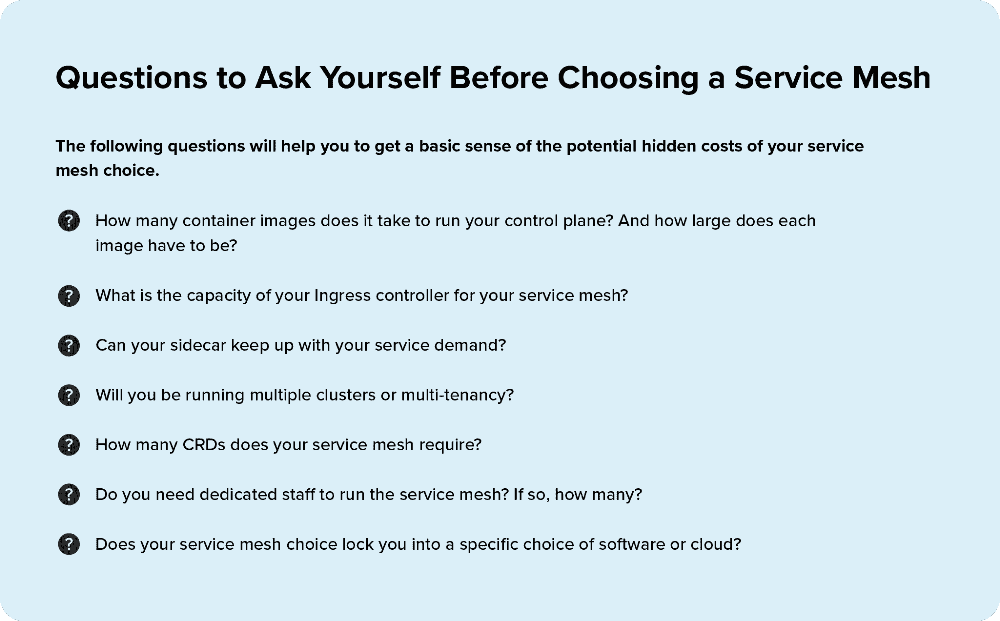

# 服务网格的隐性成本

> 原文：<https://thenewstack.io/the-hidden-costs-of-service-meshes/>

 [艾伦·墨菲

艾伦是 F5 Networks NGINX 服务网格的高级产品经理。](https://www.linkedin.com/in/malanmurphy/) 

是时候了:你知道你需要一个[服务网](https://www.nginx.com/resources/glossary/service-mesh/)。您有数不清的[微服务](https://www.nginx.com/resources/glossary/microservices/)并计划以[云原生](https://twitter.com/VBarraquito/status/1438199319648157704)方式构建，保护您集群内的所有流量——棒极了。市场上有很多服务网格，其中大部分是免费的。你想要满足你需求的最好的。

那么，这个奇妙的免费服务网要花你多少钱？答案远比你想象的复杂。就像云和基础设施即服务世界中的许多事情一样，添加新工具通常会增加复杂性和成本，即使工具本身是免费的。此外，服务网格的部署和运营成本可能是隐藏的，一旦您已经超出了淘汰和更换的范围，账单就会膨胀。

许多意外通货膨胀的例子是存在的。首先，如果每个新的 [sidecar](https://www.nginx.com/resources/glossary/sidecar/) 注入对控制平面中 CPU 需求的影响超过 1 倍，这是一个常见的服务网格问题，随着您添加新服务，成本会迅速上升，因为每个新服务都需要单独的 sidecar。或者，假设您需要维护与运行在集群之外的整体应用程序的 API 连接。如果您的服务网格没有这种能力，那么您可能需要在服务网格之上保留一个单独的 API 网关。仅此一项就可能使您的成本、管理时间和风险翻倍。如果您的应用程序管理和控制的任何部分都依赖于用户数据报协议(UDP)会怎样？不幸的是，大多数服务网格不支持这一点。您可能不得不重构您的应用程序并切换控制方法，以将其硬塞进服务网格中——这又是一个价格标签。

## 选择服务网格之前要问的问题

显而易见的第一个问题是:“我需要一个服务网格吗？”在许多情况下，当您只有少量的微服务需要管理或者没有明确的安全需求(如端到端加密)时，服务网格可能是多余的，也是不必要的。(如果您不确定自己是否准备好了服务网格，请阅读[如何选择服务网格](https://www.nginx.com/blog/how-to-choose-a-service-mesh/)中的六点准备清单。)

让我们假设您已经跨过了这个门槛，并且确定，是的，您确实需要并且想要一个服务网格。首先，在你沿着这条路走得太远之前，你应该读一读来自服务网格战场的[警示故事，当时 HelloFresh 的团队开始了他们自己的部署之旅。](https://engineering.hellofresh.com/everything-we-learned-running-istio-in-production-part-2-ff4c26844bfb)

“在过去几个月与 Istio 合作的过程中，我们发现即使是小型的 Istio 全球配置也会对上游的其他地方产生重大的连锁效应。在一个实例中，一个小的全局配置更改导致 Istio Pilot 将新配置推送到…1，000 多个连接的 Istio 代理。当代理加载这个配置时，每个代理比平常多消耗大约 75mb 的内存。虽然 75mb 听起来不多，但当您在同一个工作节点上有几十个连接的 istio-proxy 时，这种急剧的临时峰值导致我们的一些 Kubernetes 工作节点缺乏可用内存，从而影响了节点上运行的 pods。幸运的是，我们在部署到实际环境之前发现了这一点。”

HelloFresh 的整篇文章很值得一读。然而，这是一年多以前的事了，Kubernetes 和 Istio 还在继续定期改进，所以这些技术问题今天可能更容易解决。关键要点是:他们的服务网格选择具有真正的成本影响，无论是在数据和 CPU 使用、工作区和额外的计算基础架构方面，还是仅仅在故障排除和修复所花费的时间方面。对 HelloFresh 来说，一个合理的问题是:“您是否需要您的服务网格来管理您在任何地方的所有服务，如果不需要，您所经历的一些挑战是否可以通过更有选择性地使用您的服务网格足迹来缓解？”

您可以通过询问以下一系列问题来评估您自己的服务网格选项的潜在隐藏成本:

**1。运行您的控制平面需要多少个容器映像？每幅图像必须有多大？**

控制平面是不可协商的；你需要它来运行一个服务网络。但是，控制平面架构可能会产生重大影响，特别是运行控制平面所需的容器映像的数量和大小。为什么这很重要？

*   **Number** :所需容器映像的数量直接关系到网格想要获得多少集群的所有权，这又直接决定了成本。
*   **尺寸**:简单来说，容器越大，你需要投入的资源就越多。

另一项成本可能是维持应用程序所需的服务级别所需的 CPU 类型。我们通常不会考虑微服务的节点大小或类型，但 Kubernetes 集群中的重量级应用程序需要更多的计算资源，就像在云中或裸机上一样。对于开发环境，中间层 CPU 可能就足够了。对于真正的生产甚至高可用性环境，您可能需要顶层 CPU。

请记住，您的服务网格最终运行在硬件或虚拟硬件上，容器映像决定了该硬件的需求。

**2。对于您的服务网格，您的入口控制器的容量是多少？**

[入口控制器](https://www.nginx.com/resources/glossary/kubernetes-ingress-controller)通常用于 Kubernetes 集群的前端，以监管、管理和调整入口和出口(南北)流量。尽管像服务网格一样，入口控制器并不都是平等的。像传统的数据中心负载平衡器一样，一些入口控制器具有较低的连接或每秒请求容量，这意味着更频繁地将入口控制器容器以较低的阈值转入自动扩展。Autoscale 是 cloud native 的“碎玻璃”,它也可以打碎银行。

是的，Kubernetes 被明确设计为自动扩展服务网格，但这应该是最后的手段。有了自动缩放，您可能会定期为点云定价付出高昂的代价。这些成本很快就会增加。当然，您可以切换到更高容量的入口控制器。请务必考虑这一限制；虽然有些服务网格彼此紧密集成，但并非所有服务网格都支持所有入口控制器，或者它们集成的方式可能会增加不必要的延迟。

**3。你的边车能跟上你的服务需求吗？**

事物越是变化，就越是一成不变。很讽刺，不是吗？在旧的云中应用程序的世界，甚至是单一的应用程序，代理的速度直接影响你的应用程序架构。具有较低容量和可扩展性的较慢的代理可能意味着您需要部署更多的代理。快速且可扩展的代理过去是，现在仍然是高性能、低延迟应用的最佳选择。在 Kubernetes，边车包含代理。

一些 sidecars 是用不是为网络或超高性能应用交付和流量管理而设计的语言编写的，所以在性能能力上有很大的差异，加上在某些流量阈值处翻倒的倾向。在其他情况下，编写 sidecar 的团队可能没有太多经验来创建防弹代理，以处理网络规模的流量和荒谬的需求高峰。边车的性能越差，你就需要越多的边车和服务来应对交通高峰和一般负载。

你也可能为一个苦苦挣扎的代理支付比预期更多的钱，这可能会停止交通，但仍然在你的 Kubernetes 仪表盘上显示工作正常。挣扎中的代理可能会额外引入尾部延迟，这在平均值中不会显示出来，但会导致客户不高兴。

有关数据平面如何影响服务网格性能的更多信息，请阅读[您的数据平面不是商品](https://thenewstack.io/your-data-plane-is-not-a-commodity/)。

**4。您将运行多个集群还是多租户？**

多个集群可以非常快地累加起来，每个集群每小时的最低费用。如果您正在运行许多服务，但希望不同的团队保持对其服务的控制，那么多个集群将会使您倾家荡产。

也就是说，多租户(将资源隔离在更大的集群中)有其自身的挑战。将更多的应用程序和开发团队放入一个集群表面上看起来确实更便宜，因为它允许您更好地优化存储和 CPU 的使用。尽管多租户会给你的 [DevOps](https://www.nginx.com/resources/glossary/devops/) 和 DevSecOps 团队带来沉重的负担，以及迫使他们创建和维护额外功能的额外复杂性。例如，对于多租户，在建立基于角色的访问控制(RBACs)时，您可能需要在命名空间级别创建租户之间的分段。然后，您必须考虑如果一个团队对网络、安全或其他配置进行更改，从而使所有应用程序暴露在可能导致整个集群崩溃的威胁之下，您将面临的潜在风险。

**5。您的服务网格需要多少个 CRD？**

用 Kubernetes 的话说，CRD 是“定制资源定义”在这个集群和服务网格的世界中，资源是 Kubernetes API 中的一个端点，它允许您存储一个 API 对象。默认的 Kubernetes 安装中包含了许多资源，但是 Kubernetes 还允许您创建 CRD 来实现更多的自定义或定制功能。

大多数服务网格需要在您的 Kubernetes 环境中创建一些 CRD，以挂钩到您的集群并交付功能。然而，太多的 CRD 就像太多的代码。每个 CRD 包含一个 API 路径，指向 API 的每个版本。如果一个服务网格需要许多 CRD，这可能会迅速产生级联复杂性。因为 CRD 的数量通常与服务网格实现的功能数量成正比，所以更多的 CRD 可以转化为更具挑战性的配置，通常是针对未使用的功能，以及服务网格及其服务的应用程序的维护。

**6。您是否需要专门的人员来运行服务网格？如果有，有多少人？**

如上所述，复杂性需要更多的管理和对工具的更多关注。需要一个专门的工作人员，其主要工作是保持您的服务网络平稳运行，这可能是一个危险信号。考虑到优秀的[平台运营](https://thenewstack.io/platform-ops-the-next-frontier-for-operations-teams/)和 DevOps 人才的成本，你马上就会在预算中增加一笔六位数的费用。这也违背了 Kubernetes 和服务网格“左移”给应用程序团队和服务所有者更多控制他们命运的整个想法。最后，它表明您的服务网格选择是复杂的、脆弱的，并且可能成为单点故障。

**7。您的服务网格选择是否将您锁定在软件或云的特定选择上？**

但是等等:Kubernetes 的全部目的是允许您将容器化的应用程序迁移到任何环境中，对吗？唉，对于 Kubernetes 图层而言，这可能比服务网格更真实。每个拥有 Kubernetes 服务的云都有一些依赖关系，这使得在服务之间移动应用程序有些困难。不幸的是，服务网格层的依赖性往往更不宽容，并且经常带有很重的观点:如何与集群集成，或者不集成；对整个集群拥有多少所有权；是否使用新的 Kubernetes 工具进行重复性的功能等。

虽然大多数主要的服务网格都遵循被称为 SMI spec 的[服务网格接口](https://smi-spec.io/)标准，但是不同的云在如何以及应该如何针对扩展、安全工具和解决方案以及可观察性的处理进行调整方面存在差异。例如，一些服务网格具有非常深的可观察性挂钩，这需要大量的配置，甚至需要更改数据模式才能有效地移植到其他云。一个好的实践是，尝试对服务网格选择中可能遇到的所有类型的锁定和可移植性挑战进行编目。理想情况下，挑战越少，你能保留的选择就越多。如果你真的需要在一个或多个云中进行大规模扩展，你应该意识到你将在成本和灵活性上付出的代价**。**

## 结论:了解隐性成本

以上一切都取决于您的特定服务网格计划和应用程序的需求。对于大多数团队来说，在部署到生产中之前广泛地测试驱动服务网格是一个不错的主意，因为提前花一些时间来定义您希望通过您的服务网格选择来解决的用例。虽然这是一个理想化的工作流，但是存在十几个服务网格，对它们进行测试可能会花费大量时间，因此没有必要尝试一个您永远不会使用的附加功能。提前询问您的服务网格问题。

对您正在考虑的顶级服务网格做一个信封背面的成本效益练习可以提供令人大开眼界的见解。你的财务、运营、人力资源和管理团队以后会感谢你的。

<svg xmlns:xlink="http://www.w3.org/1999/xlink" viewBox="0 0 68 31" version="1.1"><title>Group</title> <desc>Created with Sketch.</desc></svg>