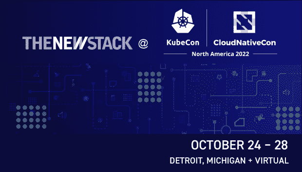

# 基于 K8s 的 DIY 内部软件分发的隐痛

> 原文：<https://thenewstack.io/the-hidden-pain-of-diy-on-premises-k8s-based-software-distribution/>

这是十月份 KubeCon + CloudNativeCon 系列文章的一部分。

让我们探索一下公司试图构建自己的软件分发工具的经验。这一假设场景基于一家软件即服务(SaaS)公司和/或一家传统内部部署软件公司首次在云中向客户 Kubernetes (K8s)环境交付其应用。你就当是很多人经历的合成吧。我们希望你不要犯同样的错误！

## **希望与痛苦的时间线**

**第 0 天** —销售或产品团队问一些听起来很简单的工程问题:“我们能否将我们的 SaaS 应用程序交付到我们客户的自托管 [Kubernetes 环境](https://thenewstack.io/kubernetes-just-has-to-get-easier-for-developers/)？”或者“既然我们已经实现了应用程序的现代化和容器化，我们能否将它分发到云中由客户管理的集群？”无论哪种方式，他们真正想说的是，“我们的潜在客户一直要求我们这样做，而我们每次说‘不’的时候都会把钱留在桌子上。”

第一天有多难？首席工程师花了几个周末的时间研究出了一个粗略的解决方案，非常兴奋地想做一些新的东西。重构应用程序以在任何 AWS 或客户托管的环境中工作似乎相当简单，对吗？也许我们可以利用地形。

**第 30 天** —现场工程师将应用交付给他们的第一个[客户托管的 K8s 集群](https://thenewstack.io/is-kubernetes-adoption-slowing/)运行在 AWS 虚拟私有云(VPC)上。)概念验证(POC)安装并不像希望的那样顺利，但是经过几次工程升级和客户的耐心等待，他们最终部署了应用程序。击掌！

**第 45 天** —首席工程师已经对新的“内部”K8s 安装程序进行了一些更新和更改，以使其能够工作。生产安装是在不同的环境中启动的，但是它的工作方式不同，没有人知道为什么。越来越多的工程时间花在客户的 Zoom 上，客户的挫折感在稳步增长。其他现代化、创新和/或积压工作开始优先考虑，这个项目开始看起来比预期复杂得多。销售团队对他们的客户有点紧张，并升级到管理层。

**第 60 天** —这个项目不再有趣，继续耗费时间和人力。一些公司的 Terraform 脚本没有通过 T2 的安全审查。首席工程师要求经理尽快让他们离开，因为他们快累垮了。该公司不想停止该项目，因为产品和销售已接近关闭该客户。有数量惊人的内部部署和基于 K8s 集群的机会正在酝酿之中，在当前的经济形势下，销售副总裁不想放弃任何收入。工程负责人不情愿地指派更多工程师从事内部安装程序项目，推迟了其他计划中的应用程序功能和创新的时间表。

**第 180 天**——在过去的四个月里发生了很多事情。新客户正在运行安装程序，但是每个客户都有稍微不同的环境和安装要求。几个例子:

*   第一个客户接受了基于 Ubuntu 的安装程序，而下一个客户想要一个 RHEL 的安装程序。因此，该团队花了两周时间构建第二个包，并设计了 CI/CD 管道，以便与基于 Ubuntu 的包并行构建和测试。
*   两个政府和金融服务客户需要气隙安装器。工程师们认为，在其他事情都在进行的情况下，这太费力了。这对于最初推动这一想法的收入流来说是一个巨大的打击。

**第 270 天** —内部 K8s 安装计划时断时续，成败参半。更多的问题不断出现。安装成功率徘徊在 50%左右，其中一半的尝试安装以客户厌倦并失去信任而告终。其他客户和潜在客户不断要求使用它，许多大客户现在都部署了它，因此似乎不可能回头了，但是泥潭越陷越深:

*   一个客户遇到了一些常见的漏洞和暴露(CVEs)，这阻碍了安装，这是一个所有人都在甲板上深夜争夺修补漏洞，让一切再次稳定。
*   一些客户现在已经(自动)升级了他们的 Linux 操作系统，不幸的是，这破坏了应用程序包，需要返工和更新安装程序。看起来这至少每个季度会发生一次。
*   神秘的存储和网络故障需要在数周内进行超过 10 小时的实际故障排除。
*   第一个安装的客户还没有升级他们的安装程序，并由于未打补丁的错误而面临风险，这些错误在新版本中很久以前就已修复。由于第一个版本没有考虑自助升级途径，工程师们又花了 10 多个小时帮助客户手动迁移到该工具的最新版本。
*   尽管管理层努力将其他团队成员引入到项目中，但构建 v1 的首席工程师仍然不断地被拉进内部安装支持升级。
*   一个最终客户修改了 Ubuntu 的基本映像，更改了所有默认网络接口的名称。更神秘的网络问题导致问题，直到这种变化被发现。
*   在客户自带 Kubernetes 集群的环境中，团队会遇到 10 种不同风格的 Kubernetes 入口，需要得到应用程序配置的支持。每一个都需要几个小时来修复，并占用了其他工程工作的时间。
*   一些最终客户需要企业长期支持(LTS)版本，这造成了内部混乱和更多的救火工作。有必要在 Kubernetes 上雇佣和培训大量的支持工程师，或者直接升级为工程师。

第 360 天 —一年后，恼怒又疲惫的工程团队召开了另一次全体会议，重新设置并决定该做什么。每个人都害怕在内部安装团队中进行轮换；有些人主动寻求离队。一些经验丰富的工程师长期留在团队中，因为他们明白，如果没有他们，一个重要的收入来源将岌岌可危。工程和产品领导同意不强调新特性工作，给团队三个月 50%的时间来投资安装工具。在此期间，工程部门同意花费大量时间开发越来越多的客户要求的气隙安装器。团队为他们想要的一切制定了一个愿望清单:

*   在所有支持的环境中为应用程序的所有版本设置 CI/CD 和自动化测试。
*   将用于收集诊断信息的难以维护的 bash 脚本转换成可以随安装程序一起交付的 CLI 工具。整合到一个框架中，使现场工程师能够为收集的信息列表做出贡献。延伸目标:将用于分析这些日志包中常见错误的内部脚本打包到一个工具中，最终客户可以在自己的环境中运行该工具。
*   设计使得团队可以集中在一个架构和安装方法上，解决方案架构师与客户一起工作，不需要为特定的客户环境编写一堆奇怪的定制配置。
*   让客户选择使用外部数据库，而不是使用嵌入在应用程序中的数据存储。这应该有助于解决存储和网络中的一些灾难性故障。
*   提供将在大多数客户环境中工作的快照和恢复功能，相信这将包括 SSH 文件传输协议(SFTP)、网络文件系统(NFS)、存储区域网络(SAN)以及其他功能。与产品团队和几个关键客户一起做一些发现，以确定它的范围。
*   自动扫描所有代码中的 CVE，并强制执行一个策略，在没有修补所有有可用修补程序的 CVE 的情况下，不发布一个版本。
*   投入时间，确保开发人员在本地环境中的构建/测试过程可以从 10 多分钟缩短到 30 秒以下。
*   在操作系统版本、Kubernetes 版本、插件、云提供商和其他维度的快速增长的多维支持矩阵上，对所有安装程序版本进行自动化测试。
*   为产品团队建立一个特定的“责任区域”,以确保他们能够在新版本操作系统发布后的 30 天内提供支持
*   采取放弃旧版本的积极策略，以减少需要维护和修补的东西的总数。

**第 390 天** —团队在进步，连打造 v1 的首席工程师都重新投入了。有了一些改进，势头也在增强，但仍有许多工作要做。知识最渊博的人仍然会卷入许多现有客户和新客户的支持升级。

**第 480 天**——三个月的冲刺现在已经延伸到六个月。一半的团队仍然在改进内部安装的构建/测试/分发/支持平台，应用程序功能开发仍然跟不上步伐。关于气隙安装器的工作甚至还没有达到原型阶段。由于一半的后端团队专注于基础设施风格的任务，负责 SaaS 应用程序或其他现代化工作的前端工程师一直没有事情可做。幻想破灭并彻底筋疲力尽后，构建了安装程序 v1 且对项目了解最深的两位工程师离开，加入了由前同事创办的小型创业公司。这进一步阻碍了团队的发展。

有些人可能会读到这里，并得出结论，向客户管理的内部 K8s 和私有云环境分发软件根本不值得。但是 80%的软件支出仍然花在非纯 SaaS 的应用程序上，大多数组织现在希望应用程序是 K8s 友好的。出于安全性、合规性、性能和成本方面的原因，我们看到了一种隐约可见的应用程序从云中飞回来的趋势。必须有一个更好的方法来解决上述困难的问题，并仍然增加您的潜在市场！

<svg xmlns:xlink="http://www.w3.org/1999/xlink" viewBox="0 0 68 31" version="1.1"><title>Group</title> <desc>Created with Sketch.</desc></svg>