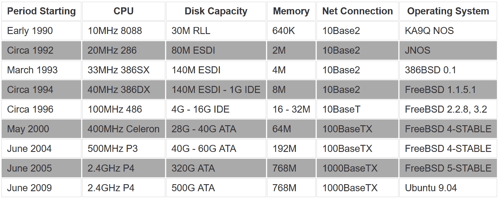
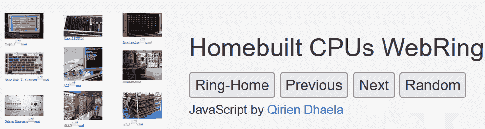
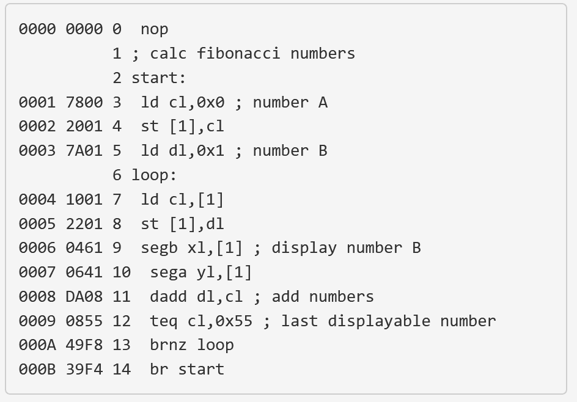

# 构建自己的 CPU 的爱好者

> 原文：<https://thenewstack.io/the-hobbyists-who-build-their-own-cpus/>

沃伦·图米参与了一些令人着迷的计算机项目。2016 年的一篇博客文章描述了“[让 PDP-7 Unix 起死回生](https://minnie.tuhs.org/Blog/2016_02_28_pdp7_unix_to_life_pt1.html)”和另一篇关于“[启动 Unix 遗产协会](https://minnie.tuhs.org/Blog/2015_12_14_why_start_tuhs.html)”的文章

这些帖子本身是 1994 年网络服务器[不可思议之旅](https://minnie.tuhs.org/Blog/2015_12_12_minnie_64bit.html)的一部分——该服务器之前拥有一个只能通过 FTP 访问的文件库。它的内容一直保存到 2022 年，托管在一个宽敞的虚拟机上的云中。

迁移到云之后，Toomey 写道，“考虑到它不是真实的，试图找出如何描述新硬件是没有意义的”

现在图米参与了另一项非凡的任务。他维护着一个来自网络的网页目录，[每一页都展示了不同的自制 CPU](https://www.homebrewcpuring.org/ringhome.html) 。

总共有 85 个不同的网页，共同形成了一个世界上最雄心勃勃的修补匠的秘密社会。

这些网页都被组合成了家庭电脑网络环，其中每个网页都与系列中的另一个网页相连，形成了一种网页链接列表。在谷歌出现之前,“webring”曾经是一种收集主题相似的网站的方式。通常他们会围绕某个特定的主题形成有凝聚力的社区。

Toomey 维护着主目录，提供一个缩略图图标直接指向 85 页中的每一页。

家用电脑网络也是如此，每一页都代表着某人心爱的个人项目——以及一个鼓舞人心的决心故事。

## 环游世界的戒指

网络社区仍在增长。回到 2018 年，只有 48 名成员，所以在过去的四年里几乎翻了一番。虽然 WebRing 的主页似乎位于澳大利亚，但它列出了来自世界各地的页面，并且处于各种不同的完成状态。

例如， [RISC relay CPU](http://www.enscope.nl/rrc/) 页面(最后一次更新于 2018 年)对自制算术/逻辑单元和注册卡进行了测试，并将其描述为“[焊接问题](http://www.enscope.nl/rrc/?b=1&s=1&b=1&r=0&s=2)但它已经能够在其四个 8 位寄存器上运行“真正的程序”。怎么会？通过使用 Raspberry Pi 板，它可以将汇编语言程序的二进制版本下载到自制 CPU 的闪存中。

数据只有 4 位宽，但足以制作一个令人印象深刻的视频，展示这个奇妙的装置计算高达 89 的斐波那契数。(之后程序重新开始计算。)

[https://www.youtube.com/embed/AWnqgxcXRxo?feature=oembed](https://www.youtube.com/embed/AWnqgxcXRxo?feature=oembed)

视频

虽然该项目位于荷兰，但以真正的 webring 方式，它链接到了遥远的其他项目，包括家酿 CPUs WebRing 创始人大卫·布鲁克斯的网站。布鲁克斯自己在澳大利亚的网站亲切地描述了“[我在 1976 年建造的全 TTL 机器](http://members.iinet.net.au/~daveb/simplex/simplex.html)”——将访问者带回到更久远的历史。

“这一切都始于 1968 年，当时我在威尔士北部的班戈上大学……学生们在卡片或五轨纸带上打出自己的程序(通常用 Algol 语言),然后提交给操作员。这激起了我对计算机的兴趣。当我离开大学时，我失去了使用电脑的机会，并逐渐产生了建立自己的电脑的想法……”

半个多世纪前，自制计算机的零件很难得到，但布鲁克斯毫不气馁，组装了“一些 20 世纪 60 年代初损坏的硬件”，包括一台旧的 IBM 大型机的逻辑板，后来在伦敦的剩余商店中找到了逻辑模块。

最终增加了一个输入输出装置——“一台二战剩余电传打字机”，后来一个自制的盒子自豪地安装在成品周围。

当然，布鲁克斯的页面链接到了另一个自制计算机的网站——这是一个在法国的网站，分享了一个用现场可编程门阵列制作的自制 CPU [的细节。](https://hackaday.io/project/18206-a2z-computer)

## 创造奇迹

退休软件工程师[比尔·布兹比](https://www.linkedin.com/in/bill-buzbee-13563222)的[网站](http://www.homebrewcpu.com/)描述了一台自制的计算机，由 200 个 TTL 芯片组成——所有这些芯片都用数千根单独包裹的电线小心翼翼地连接起来。

“我的妻子和孩子可能不会对我的指令集设计印象深刻，但所有这些电线至少应该得到他们的某种反应，”该网站解释说。

大约在 2004 年，就在旧金山南部半月湾的家中，Buzbee 多年的努力发展成了自己的补锅匠精神纪念碑。安装 Minix 2 操作系统后，Buzbee 可以在他自制的计算机上运行数百个程序，同时甚至支持多用户和多任务处理。

它现在兼作 web 服务器——同时也是 telnet 服务器，托管经典的 Unix shell 游戏，如 Adventure、Eliza、Conway's Game of Life 和 Hunt the Wumpus。

Buzbee 给他的作品起的名字？*魔法-1。*

很快，这给 Buzbee 带来了一群粉丝。成千上万的人远程登录了 Magic-1。仅在 2004 年和 2007 年夏天之间，他们就留下了 1388 条留言。"

他们来自世界各地——来自奥地利、新西兰和路易斯安那州的拉斐特，都从 Buzbee 自己寻求学习中获得了灵感。

Buzbee 在网站上写道:“最终，我想要一台我完全理解的工作、有用的机器。”

"哦，它必须有一个真正的前面板，有很多很多很酷的闪光灯."

这是一个终极的业余爱好项目，Buzbee 在追求自己的软件工程师职业生涯的同时，投入了“零星的时间”。

什么样的人会自己造电脑？Buzbee 拥有计算机科学硕士学位，从 Transmeta 的高级软件工程师到惠普实验室的高级研究科学家。

2008 年，Buzbee [成为谷歌](http://www.homebrewcpu.com/about_me.htm)的一名软件工程师，帮助 Android 团队开发 Dalvik JIT 编译器，2018 年，他成为脸书的一名软件工程师。

但是这个业余爱好者的项目似乎同样有意义。在传记网页[的结尾](http://www.homebrewcpu.com/about_me.htm)，Buzbee 惊叹于他的自制电脑“比我想象的一个愚蠢的书呆子爱好项目得到的关注要多得多。

“这也让我最终打动了十几岁的女儿。不是为了做我自己的电脑，而是为了得到一篇关于我的杂志文章，”他写道，指的是他如何成为 2005 年夏季刊 *ExtremeTech 杂志* 的“特色极客”[。](http://www.homebrewcpu.com/buzbee_interview.pdf)

跟随 webring 的链接，故事不断出现，一页接一页，每一个都提供了一个坚定的爱好者的近乎神奇的故事，他们通过挖掘自己的创造力储备，召集了自己的硬件。

该网站的官方章程解释说，webring 对“任何具有自制 CPU 的计算机项目”开放。这可以是现场可编程门阵列(或 FPGA)，或使用[晶体管-晶体管逻辑](https://en.wikipedia.org/wiki/Transistor%E2%80%93transistor_logic) (TTL)的芯片——只要它不是商店购买的现成 CPU。

webring 的官方章程以讽刺的口吻询问是否有人愿意贡献一个用真空管建造的设计作为结尾。

<svg xmlns:xlink="http://www.w3.org/1999/xlink" viewBox="0 0 68 31" version="1.1"><title>Group</title> <desc>Created with Sketch.</desc></svg>