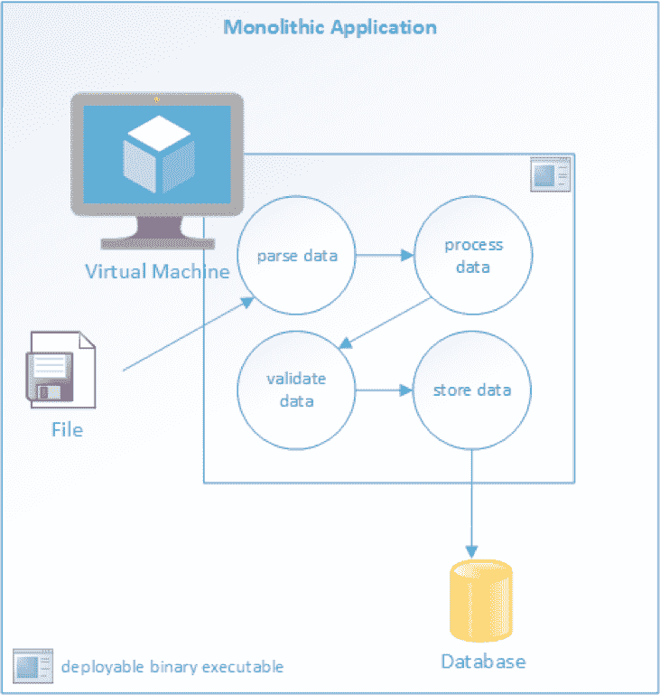
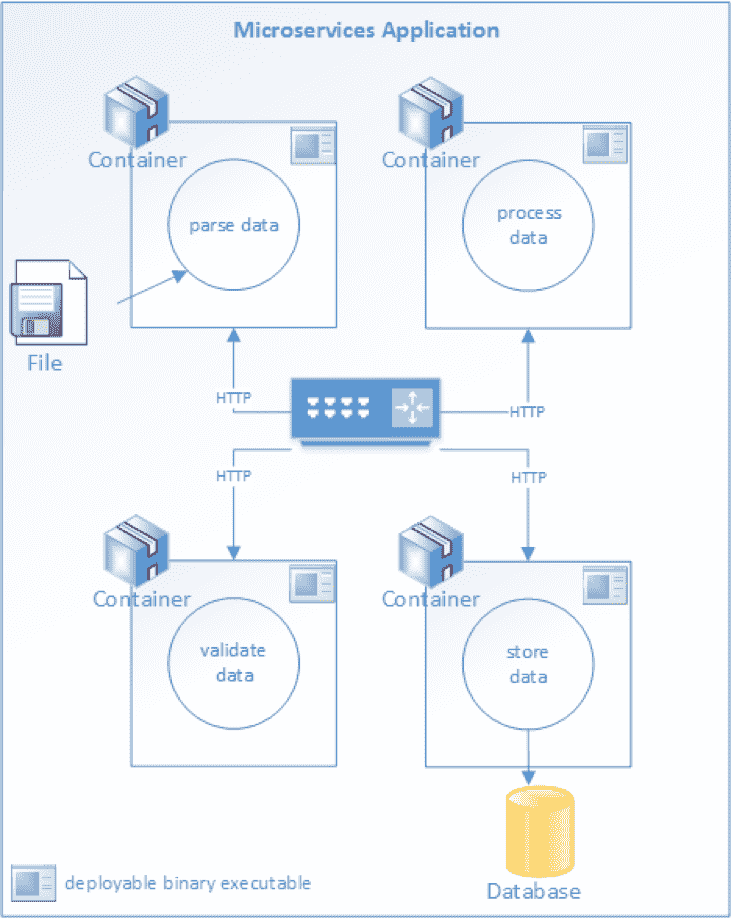

# 监控微服务的方式、原因和内容

> 原文：<https://thenewstack.io/the-hows-whys-and-whats-of-monitoring-microservices/>

戴夫·斯维斯基

戴夫·斯维斯基是 Raygun.com 的技术人员作家，这是一个软件智能平台，帮助开发团队为用户创造无错误的体验。作为一名经验丰富的软件开发人员和 TOGAF 认证的企业架构师，Dave 将 DevOps 作为他工作的核心部分。

监控仍然是管理任何 IT 系统的关键部分，而与[监控微服务](https://thenewstack.io/category/monitoring/)相关的挑战尤其独特。一个例子是，作为单个可执行文件或库部署的传统整体式系统与使用微服务架构部署的系统相比，具有不同的故障点和依赖性。

了解监控的一般情况以及它与微服务应用有何不同非常重要。基于微服务的应用具有不同的、更密集的监控要求。应用于流程的业务逻辑，例如贷款申请；分布在许多独立的服务中。这样，在整个过程中跟踪应用程序需要关联来自所有这些不同服务的数据。

与微服务的方式和原因相关的一些基本概念包括:

*   为什么要监控系统？
*   监控微服务与监控单片应用程序有何不同？
*   监控时应该收集哪些数据？
*   有哪些工具可用于发布、收集和存储监测数据？

## 为什么要监控您的微服务？

使用微服务架构开发的应用程序需要被监控的原因与任何其他类型的分布式系统一样:也就是说，所有系统最终都会失败。

失败是监控重要的最明显的原因，但不是唯一的原因。系统性能不是二进制的；系统不仅仅是“上升”或“下降”复杂系统，甚至是整体系统，都可能在影响性能的降级状态下运行。这些降级状态通常预示着即将发生的故障。监控系统的行为可以在全面故障发生之前向操作员发出降级状态警报。

内部提供的服务或向外部客户提供的服务通常是根据服务级别协议提供的。例如，如果没有监控，就不可能知道 SLA 是否被遵守，或者被违反。

[监控系统](https://thenewstack.io/category/monitoring/)随着时间的推移，会产生有价值的数据，这些数据可用于提高服务绩效。可以分析故障和性能数据来寻找系统故障的模式，这些模式可以与事件相关联。例如，考虑这样一种情况，数据表明，总系统故障的 25%发生在新部署的一个小时内。因此，这将是一个强有力的指标，表明部署过程需要关注和改进。

鉴于其在 it 运营中的重要性，应用性能监控(APM)本身就是一个市场。例如，Gartner 为 APM 工具发布了一份魔力象限(MQ)报告。也有许多开源和商业软件工具可用，如 [Raygun 的 APM](https://raygun.com/platform/apm) 平台。这些工具用于发布、收集和存储指标数据。

存储层是专门为处理[时序数据](https://en.wikipedia.org/wiki/Time_series)而设计的。

Raygun 提供的崩溃报告工具，是一个更窄的性能监控领域。它主要用于收集关于已处理和未处理异常的数据。异常跟踪和报告被报告和记录到与其他日志记录数据相同的事件流中。

这些系统作为维护弹性和可用系统的资源是不可或缺的。开发团队可以使用这些数据来理解他们的应用程序如何“在野外”运行运营团队可以收集大量数据用于取证和分析目的。应用性能管理(APM)工具的警报功能可以实时筛选数据，过滤掉除最重要事件之外的所有事件。这些重要事件可以通过仪表盘、电子邮件、Slack 和移动应用程序作为警报发出。

## 微服务与整体服务不同

监控基于微服务架构的应用程序与监控单一应用程序在本质上是不同的。整体式应用程序通常部署为单个可执行文件或二进制库。

### 整体应用架构

微服务应用被部署为一系列独立的服务。每个服务都有特定的功能要执行，并且必须与其他服务通信来完成一个“工作单元”在微服务架构中，复杂的工作流通过一系列微服务进行编排。每个服务可以通过依赖关系进行通信。这可能是磁盘、数据库或其他服务。服务和依赖资源之间的每个交互都是潜在的故障点。

依赖关系的失败，甚至只是性能下降，都会对整体吞吐量产生上游影响。及早发现这些问题以防止系统退化或失败是很重要的。

一个健壮的微服务架构会在开发和运营环境中考虑并解决这些问题。开发团队可以在设计时将工具集成到系统中，因为他们编写的应用程序可以在粒度级别上报告他们的行为。运营团队必须构建和支持基础设施，以收集应用程序和平台报告的数据。这些平台收集和存储的数据用于短期紧急情况，如警报。长期使用包括数据挖掘和分析，作为一种寻找模式的方法。可以对这些模式进行分析，以找到并防止常见的故障模式。

## 监控微服务:测量什么

监控是一个报告、收集和存储数据的过程。首先要问的问题是，哪些数据是有用的。大型分布式系统每天处理大量数据，可能会在短时间内生成数十亿字节的关于其行为的新元数据。

如何在噪音中找到信号？每个应用都有与监控相关的独特需求。有几个你想要记录的通用指标。它们包括:

### 应用指标

这些指标专门与您的应用程序相关。如果您的应用程序接受用户注册，一个标准的度量标准可能是在最后一个小时内有多少人成功完成了注册。税务准备系统可能会记录特定于上下文的事件，如表单验证。这些顶级数据对于开发团队和组织理解系统的功能行为非常有用。如果峰值容量表单验证通常每小时发生 1，000 次，而在过去的两个小时内吞吐量突然下降到 500 次，那么这种异常可能表明存在问题。

### 平台指标

这些指标报告了基础设施的具体细节。例子包括:

*   前十个最常执行的数据库查询的总平均执行时间；
*   最快的平均执行时间为 10 %;
*   平均执行时间最慢的百分之十；
*   服务每分钟接收的请求数；
*   每个服务端点的平均响应时间；
*   每项服务的成功/失败比率。

总的来说，这些指标提供了一个仪表板，可用于了解低级系统性能和行为。理想情况下，这些指标会提醒您性能下降，这可能会影响整体吞吐量，或者导致系统范围的故障。以这种方式使用低级数据来预测和预防更大范围的故障是很重要的。

Raygun APM 平台提供了一个仪表盘，可以显示这些类型的指标以及与整体系统性能相关的其他指标。

### 系统事件

外力无时无刻不在作用于系统。最常见、也可能是最具破坏性的是新部署。操作人员知道新代码部署和系统故障之间有很强的相关性。鉴于这一现实，在应用程序记录的时序数据中包含这些部署的日志以及其他指标是很有意义的。扩展事件、配置更新和其他操作更改也是相关的，应该记录下来。记录这些事件还可以将它们与系统行为联系起来。

## 微服务监控最佳实践

微服务应用程序的“如何”监控与任何其他分布式系统没有太大的不同，尽管有一些独特的要求。我们可以从[十二因素 App](https://12factor.net/) 方法中寻求一些指导。

十二因素方法包括将[日志](https://12factor.net/logs)视为事件流。推荐的架构模式要求应用程序和日志关注点之间的松散耦合。

在他对 12 因素应用程序的描述中，[亚当·威金斯写道](https://12factor.net/logs):

*“一个 12 因素的应用从不关心它的输出流的路由或存储。它不应试图写入或管理日志文件。相反，每个正在运行的进程都将其事件流无缓冲地写入' stdout '在本地开发期间，开发人员将在其终端的前台查看该流，以观察应用程序的行为。”*

这种模式将生成日志数据与收集和存储数据分离开来。运营团队可以独立于应用程序的设计，自由地解决收集和存储问题。这是几种方法中的一种；一些开发团队更喜欢使用插装技术而不是“stdout”，比如插装库，来完成这项工作。正确的选择取决于所讨论的应用程序架构。

从应用程序和平台收集数据是一种被动的监控形式。我们可以使用“健康检查”作为定期测试服务的主动方法。

简单的健康检查可能只返回一个固定值。虽然这并不能证明服务完全正常，但这是一种快速有效的确认基本功能的方法。如果服务从根本上配置错误，它很可能无法通过简单的健康检查测试。可以安排运行状况检查来定期测试服务，并在仪表板上报告它们的状态。

健康检查可能比仅仅返回一个固定的字符串更复杂。端到端检查可以测试服务和依赖的下游服务之间的交互。通过执行一些用于处理“真实”工作的逻辑，这些类型的检查可以进行更彻底的测试。

运营团队可以建立持续集成和部署管道，并在最后的部署后步骤中进行一次或多次健康检查。如果运行状况检查失败，部署系统可以发出警报，如果需要，还可以回滚部署。运行状况检查对于微服务应用程序尤其有用，因为与整体应用程序相比，通常有更多独立运行的服务。

## 监控工具

监控技术和工具分为两大类:库和平台。有些工具两者都有，提供了一个收集平台和一个检测代码的库。

库在应用程序开发过程中被合并到应用程序中。大多数流行的语言框架，比如 Java。网、围棋等；包括用于通过网络写入数据流的资源。这些资源可用于日志记录和监控。付费和开源第三方库也可用于增强指标报告。例子包括开源库，如。NET 和用于 Java 的 [SPF4J](http://www.spf4j.org/) 。

监控平台主要侧重于收集和分析从运行它们的应用程序、操作系统和网络平台收集的数据。以下是一些可作为微服务监控平台一部分的工具示例:

*   [Raygun APM](https://raygun.com/platform/apm) : Raygun 的 APM 平台是一个完整系统的另一个例子，它提供了仪器和收集器流程，以及一个可视化度量数据的仪表板。Raygun APM 支持. NET. Java 和 Ruby 支持正在开发中。
*   Zipkin : Zipkin 是一个开源的追踪系统，专门用来追踪微服务之间的调用。它对于分析延迟问题特别有用。Zipkin 既包括工具库，也包括收集和存储跟踪数据的收集器进程。
*   阿帕奇卡夫卡:卡夫卡是一个流处理系统。它使用一种“发布/订阅”方法来读写逻辑“流”中的数据，这在概念上类似于 RabbitMQ 之类的消息传递系统。Kafka 可以与 Zipkin 等其他工具相结合，为传输和存储指标数据提供一个健壮的解决方案。
*   [格拉法纳](https://grafana.com/):所有这些工具收集的数据都没有多大用处，除非能够被解释和分析。为此，Grafana 是一个基于 web 的可视化工具，用于构建可视化仪表板。
*   [普罗米修斯](https://prometheus.io/):普罗米修斯是一款开源监控解决方案，最初由 SoundCloud 开发。它被广泛用于存储和查询“时序数据”，即描述一段时间内的行为的数据。Prometheus 通常与其他工具(尤其是 Grafana)结合使用，以可视化时间序列数据并提供仪表板。

## 结论

应该从应用程序生命周期的一开始就考虑监控需求。系统监控需要开发和运营两方面的贡献。这是任何分布式系统操作支持的关键部分。微服务架构甚至比典型的单片应用程序更加分散。他们需要更多的实时关注和主动监控。

收集相关数据和分析收集到的数据同样重要。开发人员应该对应用程序进行检测，以报告特定于应用程序的事件。运营团队不仅要从应用程序中收集数据，还要从支持平台和部署系统中收集数据。开源和付费解决方案可用于支持监控事件的发布和存储。这些数据对于支持具有弹性、可靠性和可用性的分布式系统至关重要。

<svg xmlns:xlink="http://www.w3.org/1999/xlink" viewBox="0 0 68 31" version="1.1"><title>Group</title> <desc>Created with Sketch.</desc></svg>