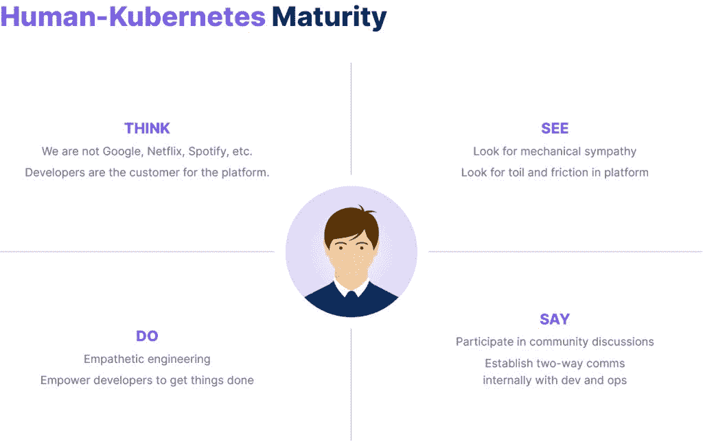

# 人类-库伯奈特人的成熟曲线

> 原文：<https://thenewstack.io/the-human-kubernetes-maturity-curve/>

这是由三部分组成的系列的第三部分。下面是 *零件* [*一个*](https://thenewstack.io/the-cloud-native-paved-path-developer-experience/) *和* [*两个*](https://thenewstack.io/taming-the-cloud-centralizing-the-developer-experience/) *。*

 [丹尼尔·布赖恩特

丹尼尔是大使实验室(前身为 Datawire)的开发者关系总监。Daniel 是 Java 冠军，TechBeacon DevOps 100 的影响者，他为几个开源项目做出了贡献。](https://www.linkedin.com/in/danielbryantuk/) 

如果被问到，对许多人来说，一旦他们采用了 Kubernetes，他们就已经完成了云原生的艰苦工作，这似乎是一个合乎逻辑的答案。他们已经走上了云原生开发的道路，并开始了竞赛。也许他们已经考虑并降低了云原生开发人员体验的内在复杂性，并将技术与他们的业务目标相匹配。但是也有可能一个关键的，也可以说是最重要的组成部分没有被考虑到:人的方面。

在这个由三部分组成的文章系列的第一部分和第二部分中，我讨论了开发人员控制平台如何成为“驯服云”的一种方式，为开发人员提供生产力支持的抽象并支持业务目标。但是如果开发者不把他们的人类情感带到开发中，任何平台都不会成功。推而广之，我们的云本地专家小组认为，更好的开发人员和开发人员体验源于人的因素——同理心、理解和成为社区的一部分。

## 同情 99%的人的日常现实

云原生软件[有时令人眼花缭乱的特性掩盖了大多数开发者的日常现实。许多开发人员(“99%”)深陷于为关键用例构建软件，不能轻易地从遗留平台和工具中转移出来。出于多种原因，从稳定性到合规性，再到数据隐私保护，他们不能在没有经过充分考虑和论证的情况下，放弃在生产中运行良好且最能满足最终用户需求的产品。毕竟，并不是每个组织都是 FAANG——这是五家科技公司脸书、亚马逊、苹果、网飞和 Alphabet(谷歌)的缩写——它们也不应该渴望成为 FAANG。](https://future.a16z.com/software-development-building-for-99-developers/)

也就是说，同样重要的是要注意，仅仅因为云原生开发碰巧引起了*热议*，并不意味着 99%的人以某种方式采用它是不现实或不可能的。各种类型和规模的许多公司，例如 [Zipcar](https://www.getambassador.io/developer-control-plane/dcp-insights-bo-daley/) 和[退伍军人联合家庭贷款](https://www.getambassador.io/developer-control-plane/developer-control-planes-a-platform-builders-point-of-view/)，已经将云原生开发引入到他们的关键任务工作中。

最终，它是关于什么对组织及其用例起作用，什么对组织及其开发人员是舒适的，以及确保最佳的最终用户体验。理解并接受并非每个组织都需要 Kubernetes 或微服务架构，这需要对开发人员在任何工作环境下的同情心有一个基线。

## 发展机械同情心

“理解”是整个发展领域的一个关键词，尤其是在人类-库伯内特成熟曲线中。首先，理解云原生开发并不适合所有人。第二，用相关知识武装云原生开发者，他们需要理解大局，而不一定要采取行动。

[“机械同情”，一个归功于马丁·汤普森](https://mechanical-sympathy.blogspot.com/2011/07/why-mechanical-sympathy.html)的术语，适用于这种情况:开发人员越了解硬件、基础设施和事物如何运行，不管他们是否必须交付和运行他们编码的软件，他们就越擅长编码和避免问题。

正如 OpenCredo 的首席执行官/首席技术官 Nicki Watt 所解释的那样，“也许比真正被授权并负责端到端运行软件的[更重要的是理解](https://www.getambassador.io/developer-control-plane/dcp-insights-nicki-watt/)。也就是说，开发人员应该掌握多种技能，并确切地了解他们正在做什么，即使他们不负责运行它…在许多组织中，让开发人员深入了解分布式应用程序如何工作以及分布式系统中固有的常见挑战，可以为组织和整个团队(开发人员、SRE、运营团队等)提供更多的价值。)"

## 变得更人性化

支撑理解的不仅仅是机械的同情和理解事物是如何机械运作的。

正如谷歌的 Kelsey Hightower 所分享的，这是非常人性化的，“如果你非常擅长人性化的一面，我想你最终会写出更好的软件。”

Hightower 强调了他所谓的“[移情工程](https://www.getambassador.io/developer-control-plane/dcp-insights-kelsey-hightower/)”，这意味着在高层次上，工程师需要使用他们自己的产品来了解用户的体验，并使其更加可靠。用户会用这个软件做什么，如果他们不能让它做他们想做的事情——实现一个特定的目标或任务——软件需要改变。

将同理心嵌入软件开发的最快、最直接的方法是从人的角度舒适地看待事物，深入研究客户服务和用户体验，包括预开发研究和同行评审。

正如 Hightower 所说，“曾经有一段时间，作为一名开发人员，你可以不使用自己的产品就走得很远，但是现在已经不行了。一旦你体验了一个让你思考的应用程序，‘哇，有人在创建它的时候考虑了我会如何使用它；它是直观的，无摩擦的，'你开始看到端到端移情工程和那种感觉没有人在开发的任何一点上尝试过的开发之间的差异。”

## 参与 Kubernetes 社区

一旦你扩展到技术和工具之外，进入个人同理心和人性，当考虑 Kubernetes 社区时，成熟度曲线达到新的高度。该社区推动并定义了原生云，根据社区成员的说法，最深刻的理解来自于与其中其他人的联系。

云原生计算基金会的前生态系统倡导者 Katie Gamanji 解释说:“任何试图了解云原生是什么以及如何利用它的人都可以在社区中找到答案。一旦你进入这个领域，我认为了解你的家人、你正在使用的项目的维护者，甚至成为贡献者之一是非常重要的。社区就在那里；试着伸出手。[技术是伟大的，但围绕云原生的社区才是真正伟大的](https://www.getambassador.io/developer-control-plane/dcp-insights-katie-gamanji/)

## 总结:人类-库伯奈特人的成熟曲线

开发者和他们开发的最终用户都是人。忽视代码背后的人性会阻碍一个组织的成功和成熟。不同角色的云原生领导者一致认为，开发人员(及其终端产品)从编码前与用户的实际交流中受益。

同样的，[开发者对使用没有咨询过他们的开发者平台不感兴趣](https://www.reddit.com/r/devops/comments/stuep4/weve_spent_months_building_this_platform_devs/)，终端用户也不会对不考虑他们需求的应用做出积极的回应。

引入倾听、同理心和开发者经验的交流是 human-Kubernetes 成熟的真正标志。

<svg xmlns:xlink="http://www.w3.org/1999/xlink" viewBox="0 0 68 31" version="1.1"><title>Group</title> <desc>Created with Sketch.</desc></svg>