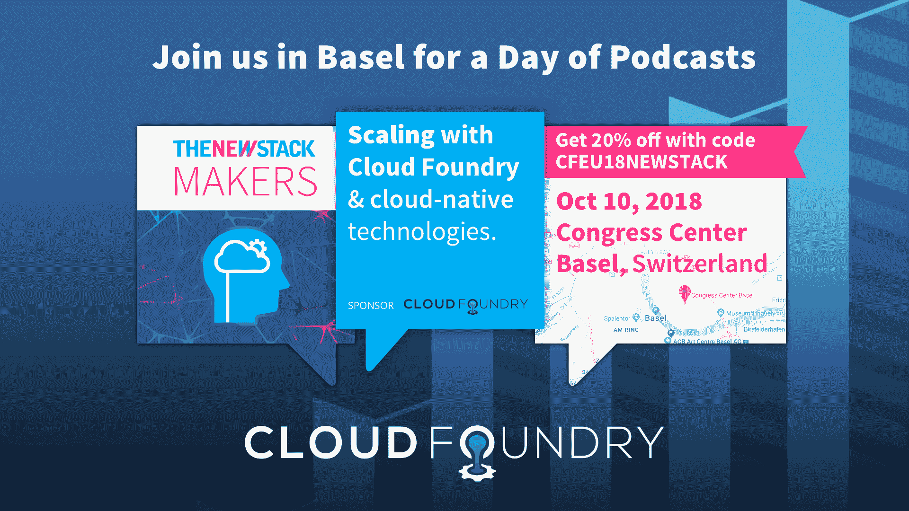

# 数字化转型的人性一面:7 条建议和 3 个陷阱

> 原文：<https://thenewstack.io/the-human-side-of-digital-transformation-7-recommendations-and-3-pitfalls/>

[云代工厂](https://www.cloudfoundry.org/)赞助本帖。

*以下是云铸造基金会(Cloud Foundry Foundation)关于数字化转型的系列文章中的第一篇，为即将在 T4 举行的[云铸造峰会做准备。](https://www.cloudfoundry.org/event/eusummit2018/)*

不久前，企业领导人反复问道:“数字化转型到底是什么，它将为我的企业带来什么？”今天，我们更有可能听到“我们如何规划一条道路？”

我们的答案是:通往数字化的道路不仅仅是选择云应用平台。相反，数字化本质上是一场人类之旅。它是关于培养一种心态、流程、组织和文化，鼓励不断创新，以满足不断变化的客户期望和业务目标。

在这个由两部分组成的博客系列中，我们将分享获得数字权利的七条准则。请继续阅读前三篇。

## 1.始于终:知道自己想要什么

 [布莱恩·罗奇

Brian 是 Cogni zant 数字业务部门的产品和战略副总裁。在这个职位上，他帮助定义和执行组织的产品战略，特别关注构建云原生应用程序，帮助客户加速向云的过渡，并重新定义他们的竞争优势。Brian 在该行业有 20 多年的经验。在加入 Cognizant 之前，他在戴尔 EMC 的 CTO 办公室担任领导职务，并且是 Cloud Foundry 董事会成员。他带领许多团队采用了 DevOps，并热衷于构建诞生在云中的应用程序。](https://www.linkedin.com/in/brianroche/) 

常见的数字目标包括:

*   卓越的客户体验:例如，通过个性化的产品和服务推荐，或基于实时内容和情感分析的联络中心个性化交互，获得竞争优势；
*   更有效的团队互动:DevOps 就是将开发和运营结合在一起——首先是交流和共享上下文，然后是自动化。自动化移交简化了产品交付。它还将用户反馈带入开发周期，因此您可以验证您正在构建用户想要的东西。
*   用软件区分硬件或服务:每个公司都在成为软件公司。汽车制造商为安全和预防性维护开发软件；金融服务公司凭借优雅的移动应用脱颖而出；招聘机构使用人工智能在数千人中快速确定最佳候选人。

无论你的目标是什么，你都需要把人、技术和过程结合起来，更快地发布更好的软件。执行速度是数字经济中的一个关键区别，所以要以天为单位，而不是以周或月为单位。通过创建一个最小可行产品(MVP ),然后迭代来实现。

## 2.坚持不懈地将开发工作集中在能够产生收入的地方

经验法则:软件离你的用户(客户或合作伙伴)越近，就越值得你花时间去创新和投资。如果一个 IT 项目不能让你的公司在市场上脱颖而出，那就放弃它。需要电子邮件服务器吗？使用云提供商。云管理工具？不要重新发明轮子:与 PaaS 提供商合作。后台软件？去找 SaaS。将您的开发资源仅分配给那些将带来价值或增加收入的应用程序。要更新您的其他应用程序，请考虑使用系统集成商。

永远记住:钱比人便宜。

## 3.雇佣或培训合适的人才

 [Chip Childers

Chip Childers 在大规模计算和开源软件领域已经工作了 20 年。他在 2015 年联合创立了 Cloud Foundry Foundation，并担任 Apache Cloudstack 的第一任副总裁，这是一个他在 SunGard 领导企业云服务时帮助推动的平台，然后担任 Cumulogic 的产品战略副总裁。在 SunGard 之前，他领导了包括 IRS.gov、USMint.gov、美林和 SEI Investments 在内的组织的任务关键型应用程序的重建工作。Chip 是 OSCON、LinuxCon North America、LC Japan、LC EU、ApacheCon、O ' Reilly Software Architecture Conference 等活动的资深演讲者。在他的空闲时间，芯片喜欢与他的黑色实验室远足，驾驶双体船和太阳鱼，并试图跟上他的小女儿。](https://www.cloudfoundry.org/) 

数字化需要两种人才。一类是可以在 DevOps 环境下工作的人。另一类是能够带领员工踏上数字化之旅的人——最初是小团队，后来是大规模团队。(有关这方面的更多信息，请阅读数字认知博客“[重塑人才获取 DevOps 风格。](https://digitally.cognizant.com/reinventing-talent-acquisition-devops-style-seven-ways-become-destination-company-codex3787/)))

这些人很少见。他们可以也将会选择工作地点。为了与亚马逊和脸书这样的“目的地公司”竞争，发展一个世界级的人才获取组织。让人才获取和保留成为核心竞争力。一些必备条件包括:

*   知道在哪里可以找到具有合适技能或合适资质的人；
*   从第一次接触开始，为候选人创造类似礼宾的体验。目标是让他们感到受欢迎和受重视；
*   在第一次接触后不久就报价。有才华的人不会待很久。一个迅速的邀请——我们的目标是从第一次接触开始不超过两周——给你一个招聘优势，并向对方传递一个你重视他们的信息；
*   培养一种文化，让新员工容易融入他们的新团队，采用 DevOps 的工作方式，并感觉与公司的大局有联系，这样他们就会想留下来。

在我们的下一篇文章中，我们将分享更多正确使用数字的技巧——以及三个要避免的常见陷阱。

请于下周四查看第二篇关于数字化转型的 Cloud Foundry 帖子。瑞士巴塞尔云铸造峰会将于 10 月 10 日至 11 日举行。

【T2

通过 Pixabay 的特征图像。

<svg xmlns:xlink="http://www.w3.org/1999/xlink" viewBox="0 0 68 31" version="1.1"><title>Group</title> <desc>Created with Sketch.</desc></svg>