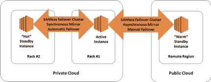

# 实现高可用性的混合云

> 原文：<https://thenewstack.io/the-hybrid-cloud-for-high-availability/>

出于各种原因，私有云仍然是许多应用程序的最佳选择，而公共云对于其他人来说已经成为更具成本效益的选择。这种分离已经导致(有意或无意地)绝大多数组织现在拥有混合云。但是，有许多不同的方法来利用混合云环境中提供的多功能性和灵活性，尤其是在不同应用程序需要不同的高可用性和灾难恢复保护时。

本文从高可用性(HA)和灾难恢复(DR)的角度研究了混合云，并提供了一些避免潜在陷阱的实用建议。

## 云中的买者自慎

 [大卫·伯明罕

David Bermingham 是 SIOS 技术公司的技术布道者。他是技术社区公认的高可用性专家，并在过去八年中荣幸地当选为微软 MVP:六年当选为集群 MVP，两年当选为云和数据中心管理 MVP。David 拥有多项技术认证，并拥有三十多年的 IT 经验，包括在金融、医疗保健和教育领域。](https://us.sios.com/) 

由云服务提供商(CSP)实施的电信级基础设施为公共云提供了远优于单个企业的弹性。每个数据中心内的冗余，每个地区和全球多个地区的多个数据中心，为云提供了前所未有的多功能性、可扩展性和可靠性。但是故障可能并且确实会发生，对于没有采取特殊措施来确保高可用性的客户来说，其中一些故障会导致应用程序级别的停机。

尽管所有 CSP 对“停机时间”的定义都有所不同，但都排除了应用程序级停机时间的某些原因。实际上，服务级别协议(SLA)仅保证物理服务器或虚拟机(VM)的“拨号音”等效，或者具体来说，如果两个或更多实例跨不同的可用性区域部署，则至少一个实例将连接到外部网络。

以下是 SLA 中排除的一些常见停机原因的几个示例:

*   客户的软件或第三方软件或技术，包括应用软件(如 SQL Server 或 SAP)。)
*   错误的输入或指令，或任何需要时的不作为(包括凡人不可避免的错误)。)
*   超出 CSP 合理控制的因素(例如运营商网络中断。)

当然，通信服务提供商排除这些和其他他们无法控制的停机原因是合理的。但是，如果 It 专业人员将这些排除作为不为关键应用程序提供足够的 HA 和/或 DR 保护的借口，那将是不负责任的。

## 适应高可用性和灾难恢复之间的差异

正确利用云的弹性基础架构需要了解“故障”和“灾难”之间的一些重要差异，因为这些差异会对 HA 和 DR 配置产生直接影响。故障持续时间短，规模小，影响单个服务器或机架，或者单个数据中心的电源或冷却。灾难具有更持久、更广泛的影响，可能会以阻碍快速恢复的方式影响多个数据中心。

最重要的影响涉及冗余资源(系统、软件和数据)的位置，这些资源可以是本地的(在局域网上),用于从局部故障中恢复。相比之下，从大范围灾难中恢复所需的冗余资源必须跨越一个广域网。

对于需要高事务吞吐量性能的数据库应用程序，跨 LAN 同步复制活动实例数据的能力使备用实例成为“热”实例，并准备好在出现故障时立即接管。这种快速、自动的恢复应该是所有 HA 供应的目标。

在灾难恢复配置中，数据通常是异步复制的，以防止 WAN 延迟对活动实例的吞吐量性能产生负面影响。这意味着对备用实例的更新总是在对活动实例的更新之后进行，从而使备用实例“热”起来，并在使用手动恢复过程时导致不可避免的延迟。

## 云中的高可用性

所有三大电信运营商都在数据中心内部和数据中心之间提供冗余，以适应这些差异。特别令人感兴趣的是名称各异的“可用性区域”,它使得将局域网上可用的同步复制与广域网提供的地理隔离结合起来成为可能。这些区域位于独立的数据中心内，这些数据中心通过低延迟、高吞吐量的网络相互连接，以便于同步数据复制。由于延迟约为 1 毫秒，使用多区域配置已成为 HA 的最佳实践。

在 Windows Server 上运行应用程序的 IT 部门长期依赖 Windows Server 故障转移群集(WSFC)来提供高可用性。但 WSFC 需要存储区域网络(SAN)或其他形式的共享存储，这在公共云中是不可用的。微软在 Windows Server 2016 data center Edition 和 SQL Server 2016 中通过引入 Storage Spaces Direct 解决了这一问题。但是 S2D 有其自身的局限性；最明显的是无法跨越多个可用性区域，这使得它不适合 HA 需求。

云中共享存储的缺乏导致了能够在私有、公共和混合云环境中运行的专门构建的故障转移集群解决方案的出现。这些与应用程序无关的解决方案有助于实时数据复制和连续监控，能够检测应用程序或数据库级别的故障，从而填补了通信服务提供商 SLA 中“拨号音”性质的空白。适用于 Windows Server 的版本通常与 WSFC 无缝集成，而适用于 Linux 的版本提供了自己的无 San 故障转移群集功能。这两个版本通常都可以为不同的应用程序配置不同的故障切换/回切策略。

有关无 San 故障转移集群的更多信息，请参见[确保 Amazon Web Services 上 SQL Server 的高可用性](https://thenewstack.io/ensure-high-availability-for-sql-server-on-amazon-web-services/)。虽然本文专门针对 AWS，但是集群的基本操作在 Google 和 Azure 云中是相同的。

值得注意的是，虚拟机管理程序还提供了自己的“高可用性”功能，以便在主机级别合理快速地从故障中恢复。但是它们无法防止虚拟机、其操作系统或在其中运行的应用程序出现故障。就像云本身一样，这些特性只向虚拟机保证“拨号音”。

## 云中的灾难恢复

对于灾难恢复，所有通信服务提供商都有办法跨越多个区域，针对可能影响多个区域的大范围灾难提供保护。其中一些产品属于 DIY(自己动手)灾难恢复类别，由模板、食谱和其他工具指导。DIY 灾难恢复可能能够利用为所有应用程序例行制作的备份和快照。但是备份和快照都不能提供 HA 所需的连续、实时的数据复制。对于数据库，镜像或日志传送都分别提供了数据库或事务日志的最新版本，但这些仍然滞后于活动实例中的数据，因为最佳做法是将备用灾难恢复实例跨 WAN 放置在另一个区域。

微软和亚马逊现在已经分别管理灾难恢复即服务(DRaaS)产品:Azure Site Recovery 和 cloud bearing 灾难恢复。这些服务支持混合云配置，并且价格合理。但是它们不能复制 HA 集群，并且通常具有带宽限制，这可能妨碍它们用于某些应用。

## 混合云中的高可用性和灾难恢复

混合云的一个常见用例是让公共云为在私有云中运行的应用程序提供灾难恢复保护。这种形式的灾难恢复保护非常适合只有一个数据中心的企业，并且可用于所有应用程序，无论它们是否有 HA 保护。在企业数据中心，可以使用 SAN 或其他形式的共享存储，从而支持使用传统的故障转移群集来实现高可用性保护。但是考虑到 SAN 的高成本，许多组织现在选择使用无 SAN 故障转移群集解决方案。

下图显示了为 HA/DR 保护配置混合云的一种可能方式。将无 San 故障转移群集用于 HA 和 DR 还有一个额外的好处，即提供一个简化管理的解决方案。请注意，在企业数据中心使用单独的机架来提供额外的弹性，同时在公共云中使用远程区域来提供更好的保护以应对大范围的灾难。

这种混合 HA/DR 配置非常适合只有一个数据中心的企业。

这种配置也可以与云中的高可用性集群和企业数据中心的灾难恢复实例“互换”。虽然使用云来实现 HA 和 DR 保护也是可能的，甚至是更可取的，但这种混合配置至少为不愿将全部精力投入到云的风险厌恶型高管提供了某种程度的安慰。请注意，当从私有云迁移到公共云时，使用无 San 故障转移群集软件如何轻松地“提升和转移”高可用性配置。

## 对云的信心

由于在全球拥有多个可用性区域，三大电信运营商都拥有能够为企业应用提供电信级 HA/DR 保护的基础设施。有了无 San 故障转移群集解决方案，这种电信级的高可用性并不意味着支付电信级的高成本。由于无 San 故障转移群集软件能够有效且高效地利用云的计算、存储和网络资源，同时易于实施和操作，这些解决方案最大限度地降低了持续成本，从而使强大的 HA 和 DR 保护比以往任何时候都更加经济实惠。

通过 Pixabay 的特征图像。

<svg xmlns:xlink="http://www.w3.org/1999/xlink" viewBox="0 0 68 31" version="1.1"><title>Group</title> <desc>Created with Sketch.</desc></svg>