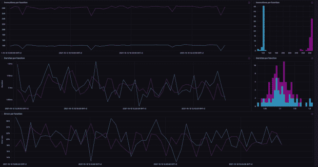

# 时间序列数据的不变性

> 原文：<https://thenewstack.io/the-immutability-of-time-series-data/>

我们不断地穿越时间。你读这句话的时间现在已经永远成为过去，不可改变。这导致了具有时间维度的数据的独特之处:它只能单向流动。[时间序列数据](https://www.influxdata.com/what-is-time-series-data/?utm_source=vendor&utm_medium=referral&utm_campaign=2022-10_spnsr-ctn_immutability-time-series_tns)不同于其他数据有很多原因。它通常数量庞大，需要小心处理才能近乎实时地产生洞察力。这个博客关注的是时间序列数据不可改变、不可改变的本质。

## 过去的就过去了

在我们的世界里，时间是不可变的，也就是说一旦过去，就不能改变，就像编程中不可变的对象。在一个完美的世界里，数据反映了这一点；你不能改变时间序列数据，就像你不能倒转时钟一样。数据应该反映现实，但有时坏的数据点会被写入数据库。坏的数据点也不能反映现实，在这种情况下删除这些点是有意义的。

删除需要小心处理。

1.  您需要一个可以删除点而不移动其他点的数据库。
2.  您可能还需要通过添加迟到点来编辑历史记录。

有一个平衡需要打破，这样你就不会不断地以一种使你的数据失去意义的方式重写过去，但是你仍然可以做出必要的改变来增强时间所呈现的上下文。当决定进行编辑是否有意义时，考虑编辑是否使数据更接近或更远离真实情况。

## 时间不停地流逝

关于时间的另一件事是它永远不会停止。现在总是不断向前发展的。因为时间总是在移动，所以时间序列数据会不断更新。当您想到数据库时，您可能会想到一个存储数据的地方，您可以在那里写入数据，然后在不经常更改数据的情况下读取数据。一个[时间序列数据库](https://www.influxdata.com/time-series-database/?utm_source=vendor&utm_medium=referral&utm_campaign=2022-10_spnsr-ctn_immutability-time-series_tns)不断地被改变和更新，因为时间总是在移动和改变。



您无法以现实中的无限精度收集数据，但是您可以选择对您的应用程序有意义的精度级别。例如，平均值是最常见和最有用的计算方法之一。如果您处理的数据不是时间序列，您可能会计算一个州每平方英里的平均人口数。使用时间序列数据，您可以计算每小时进入建筑物的平均人数。这里的区别在于，在每个时刻，最后一个小时的开始和结束都是变化的。下面是这种计算的一些示例代码:

```
```
from(bucket:  "sample")
    |>  range(start:  2022-01-01,  stop:  2022-01-31)
    |>  filter(fn:  (r)  =>  r["_measurement"]  ==  "foot_traffic")
    |>  aggregateWindow(column:  "number_of_people",every:  1h,  fn:  mean,  createEmpty:  false)
    |>  yield(name:  "running mean")
```

```

当您采用[移动平均线](https://docs.influxdata.com/flux/v0.x/stdlib/universe/movingaverage/?utm_source=vendor&utm_medium=referral&utm_campaign=2022-10_spnsr-ctn_immutability-time-series_tns)时，您会在指定的时间间隔计算一个新的平均线，这样您就可以看到您的计算如何随时间变化，从而产生一个新的时间序列。您需要考虑您的数据集，以了解什么样的间隔有意义。如果您选择的间隔太宽，您会丢失信息和上下文，但是如果您选择的间隔太精确，您会看到没有任何数据点的窗口，并且您的结果会以一种没有意义和没有帮助的方式下降到零。

## 时间的脉络

无论您的数据架构多么接近实时，在收集数据和将数据放入数据库以备查询之间都会有一些微小的延迟。如果您设置了自动查询或处理，这可能会扭曲您的结果。例如，如果您计算前五分钟度量的平均值，则前五分钟到达数据库的数据可能不包括前五分钟在边缘进行的完整测量集。 [InfluxDB](https://www.influxdata.com/the-best-way-to-store-collect-analyze-time-series-data/?utm_source=vendor&utm_medium=referral&utm_campaign=2022-10_spnsr-ctn_immutability-time-series_tns) 让你用[任务偏移](https://youtu.be/SSVz6GtKd7U)来处理这个问题。

[https://www.youtube.com/embed/SSVz6GtKd7U?feature=oembed](https://www.youtube.com/embed/SSVz6GtKd7U?feature=oembed)

视频

您可以安排任务运行这样的计算，同时包括一些额外的缓冲时间，以允许所有数据首先到达数据库。这对于保存收集每个点时的完整上下文非常重要。InfluxData 的开源数据收集代理 Telegraf 也允许补偿。

对数据进行下采样有很多原因。有时，您没有足够的存储空间来存储完整的原始数据集。有时，平均信号会穿透噪音，给你更多有价值的信息。当你取一个平均值时，一些信息丢失了，一些新的信息增加了。平均也不是缩减采样的唯一方式。有时，计算指标超过设定阈值的次数可能比保持数据的形状更有意义。

无论您使用哪种缩减采样方法，您所做的一切都应该是有意识的，这样您就不会丢失您后来意识到很重要的数据。如果缩减采样时不小心，并且没有正确处理所有时间戳，缩减采样可能会扭曲您的时间序列。InfluxDB 旨在使用各种工具和流程处理缩减采样，它在 InfluxDB 云中创建多个数据备份副本，因此您不会意外删除您需要的点。为了保持尽可能多的上下文，InfluxDB 还支持纳秒精度。这里有一些示例代码为[下降采样在通量](https://docs.influxdata.com/influxdb/cloud/process-data/common-tasks/downsample-data/?utm_source=vendor&utm_medium=referral&utm_campaign=2022-10_spnsr-ctn_immutability-time-series_tns) :

```
```
from(bucket:  "sample")
    |>  range(start:  2022-01-01,  stop:  2022-01-31)
    |>  filter(fn:  (r)  =>  r["_measurement"]  ==  "foot_traffic")
    |>  aggregateWindow(column:  "number_of_people",every:  1h,  fn:  mean,  createEmpty:  false)
    |>  to(bucket:  "sample-downsampled")
```

```

当然，时间不是唯一需要考虑的重要环境，时间序列数据也不是唯一重要的数据类型。像客户详细信息、位置或正在使用的机器版本这样的信息不是时间序列数据，但是记录它们是很重要的。幸运的是，InfluxDB 允许您将这些其他类型的数据与时间序列数据结合起来，从而对您的系统和流程产生更深入的见解。

时间是我们现实的基本组成部分之一，了解它的本质有助于您更好地了解世界，并从您的数据中获得更多有用的信息。

<svg xmlns:xlink="http://www.w3.org/1999/xlink" viewBox="0 0 68 31" version="1.1"><title>Group</title> <desc>Created with Sketch.</desc></svg>