# 阻抗不匹配测试:你的数据层是一个复杂的烂摊子吗？

> 原文：<https://thenewstack.io/the-impedance-mismatch-test-is-your-data-layer-a-complex-mess/>

 [Raja Rao

Raja 是一名工程师、开发倡导者和技术作家，在软件行业工作了近 20 年。他现在已经转向成长型营销，主要写数据库和大数据。](https://www.linkedin.com/in/rajaraodv/) 

简单是最复杂的 —达芬奇

大多数信息都是不相关的，大多数努力都被浪费了，但是只有专家知道该忽略什么。”——詹姆斯·清晰·原子的习惯

你有一个奇特的数据管道，有许多不同的系统。它表面上看起来非常复杂，但实际上是引擎盖下的复杂混乱。它可能需要大量的管道工程来连接不同的部分；它可能需要不断的监测；它可能需要一个拥有独特专业知识的大型团队来运行、调试和管理它。您使用的系统越多，复制数据的地方就越多，数据不同步或过时的可能性就越大。此外，由于这些子系统中的每一个都是由不同的公司独立开发的，它们的升级或错误修复可能会破坏您的管道和数据层。

如果你不小心，你可能会以下面的[三分钟视频](https://www.youtube.com/watch?v=y8OnoxKotPQ)中描述的情况结束。我强烈建议你在继续之前先看看。

[https://www.youtube.com/embed/y8OnoxKotPQ?feature=oembed](https://www.youtube.com/embed/y8OnoxKotPQ?feature=oembed)

视频

复杂性的产生是因为即使每个系统表面上看起来很简单，但实际上它们会将以下变量带入您的管道，从而增加复杂性:

1.  协议—系统如何传输数据？(HTTP，TCP，REST，GraphQL，FTP，JDBC)。
2.  数据格式—系统支持什么格式？(二进制，CSV，JSON，Avro)。
3.  数据模式和演变——数据是如何存储的？(表格、流、图形、文档)。
4.  SDK 和 API——系统是否提供必要的 SDK 和 API？
5.  酸和碱——它提供酸或碱的一致性吗？
6.  迁移—系统是否提供了将所有数据移入或移出系统的简单方法？
7.  耐用性——系统在耐用性方面有什么保证？
8.  可用性——系统在可用性方面有什么保证？(99.9%, 99.999%).
9.  可扩展性—它是如何扩展的？
10.  安全性—系统的安全性如何？
11.  性能—系统处理数据的速度有多快？
12.  托管选项—是仅托管还是本地托管还是混合托管？
13.  云—它是否适用于我的云、区域等。？
14.  附加系统—它需要附加系统吗？(比如卡夫卡的动物园管理员)。

数据格式、模式和协议等变量加起来就是所谓的转换开销。性能、耐用性和可伸缩性等其他变量加起来就是所谓的管道开销。综上所述，这些分类导致了所谓的“阻抗不匹配”。如果我们能测量它，我们就能计算复杂性，并利用它来简化我们的系统。我们一会儿会谈到这一点。

现在，你可能会说你的系统虽然看起来很复杂，但实际上是满足你需求的最简单的系统。但是你怎么证明呢？

换句话说，您如何真正衡量和判断您的数据层是真正简单还是复杂？其次，当你添加更多的特性时，你如何估计你的系统是否会保持简单？也就是说，如果您在路线图中添加更多的特性，您是否也需要添加更多的系统？

这就是“阻抗不匹配测试”的由来。不过，我们先来看看什么是阻抗不匹配，然后再讨论测试本身。

## 什么是阻抗不匹配？

该术语起源于电气工程，用来解释电阻抗的不匹配，当能量从 A 点转移到 b 点时会导致能量损失。

简单的说，就是你拥有的和你需要的不匹配。要使用它，你要把你目前拥有的东西转化成你需要的东西。因此，存在不匹配和与修复不匹配相关联的开销。

在我们的例子中，您有某种形式或数量的数据，在我们使用它之前，您需要转换它。这种转换可能会发生多次，甚至可能在其间使用多个系统。

在数据库领域，阻抗不匹配有两个原因:

1.  转换开销:系统处理或存储数据的方式不同于数据的实际样子或您对它的看法。例如:在您的服务器中，您可以灵活地将数据存储在多种数据结构中，例如集合、流、列表、集合、数组等等。它帮助您自然地对数据建模。但是，您需要将这些数据映射到 RDBMS 或 JSON 文档存储中的表中，以便存储它们。然后反过来读取数据。注意，面向对象语言模型和关系表模型之间的特定不匹配被称为“[对象-关系阻抗不匹配。](https://en.wikipedia.org/wiki/Object%E2%80%93relational_impedance_mismatch)
2.  管道开销:您在服务器中处理的数据量和数据类型与您的数据库可以处理的数据量不同。例如:如果您正在处理来自移动设备的数百万个事件，您的典型 RDBMS 或文档存储可能无法存储这些事件，或者提供 API 来轻松地聚集或计算这些事件。所以你需要特殊的流处理系统来处理它，比如 Kafka 或者[Redis Streams](https://bit.ly/2TkPyZN)；此外，可能还有一个数据仓库来存储它。

## 阻抗不匹配测试

测试的目标是测量整个平台的复杂性，以及随着将来添加更多功能，复杂性是增加还是减少。

该测试的工作方式是简单地计算“转换开销”和“管道开销”，使用“阻抗不匹配分数”(IMS)。这将告诉您您的系统相对于其他系统是否已经很复杂，以及随着您添加更多的特性，这种复杂性是否会随着时间的推移而增加。

下面是计算 IMS 的公式:

【T2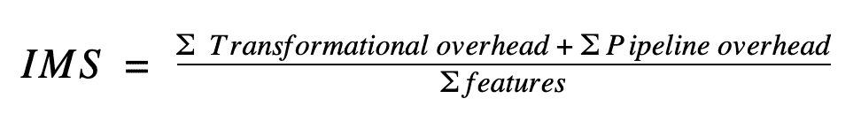

该公式简单地将两种类型的开销相加，然后除以功能的数量。这样，您将获得总开销/特性(即复杂性得分)。

为了更好地理解这一点，让我们比较四种不同的简单数据管道，并计算它们的分数。其次，让我们也想象一下，我们正在分两个阶段构建一个简单的应用程序，这样我们就可以看到随着时间的推移我们添加更多功能时，IMS 分数是如何变化的。

### 阶段 1:构建实时仪表板

假设您收到来自移动设备的数百万次按钮点击事件，如果有任何下降或峰值，您需要一个警报。此外，您正在考虑将这整个事情作为您的大型应用程序的一个特性。

案例 1:假设您刚刚使用 RDBMS 来存储这些事件，尽管这些表可能不合适。

[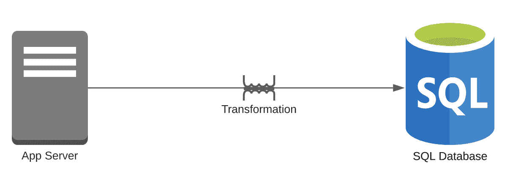](https://cdn.thenewstack.io/media/2021/07/b2943aad-image13.png)

1.  转换开销= 1
    1.  您需要将事件流转换成表。
2.  管道开销= 1
    1.  您的管道中只有一个数据库。
3.  特征数量= 1

**IMS 是 [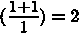](https://cdn.thenewstack.io/media/2021/07/93352f87-image2.png)** 

案例 2:假设您使用 Kafka 处理这些事件，然后将它们存储在 RDBMS 中。

[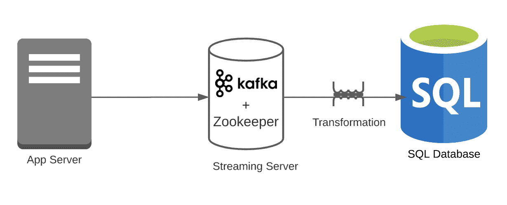](https://cdn.thenewstack.io/media/2021/07/a781834a-image14.png)

1.  转换开销= 1
    1.  卡夫卡可以轻松处理点击流；但是，Kafka 到 RDBMS 是一个开销。
2.  管道开销= 2
    1.  你有两个系统(RDBMS 和 Kafka)。请注意，我们忽略了动物园管理员。
3.  特征数量= 1

**IMS 是 [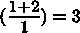](https://cdn.thenewstack.io/media/2021/07/bcbb90e1-image3.png)** 

案例 3:假设您使用 Kafka 处理这些事件，然后将它们存储到 KsqlDB 中

[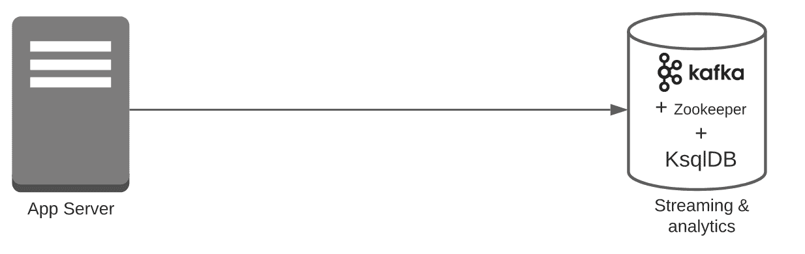](https://cdn.thenewstack.io/media/2021/07/a93a6f00-image17.png)

1.  转换开销= 0
    1.  Kafka 可以轻松处理点击流。
2.  管道开销= 1
    1.  你只有一个系统(Kafka + KSqlDB)。请注意，我们忽略了动物园管理员。
3.  特征数量= 1

**IMS 是 [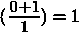](https://cdn.thenewstack.io/media/2021/07/6ba7365c-image4.png)** 

案例 4:假设您使用 [Redis Streams](https://bit.ly/2TkPyZN) 来处理这些事件，然后将它们存储到 RedisTimeseries 中。(两者都是 Redis 的一部分，与 Redis 一起工作)。

[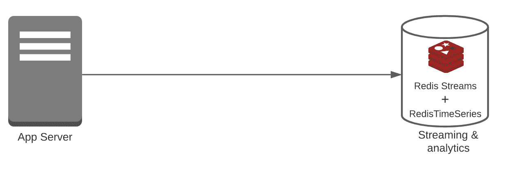](https://cdn.thenewstack.io/media/2021/07/31990c2d-image15.png)

1.  转换开销= 0
    1.  Redis 流可以轻松处理点击流。
2.  管道开销= 1
    1.  您只有一个系统(Redis Streams + RedisTimeSeries)。
3.  特征数量= 1

**IMS 是 ** 

### 第一阶段后的结论:

在本例中，我们比较了四个系统，发现情况 3 或情况 4 最简单，IMS 为 1。在这一点上，它们是相同的，但是当我们添加更多的特性时，它们会保持不变吗？

让我们为我们的系统添加更多的特性，看看 IMS 是如何运行的。

### 阶段 2:使用 IP 白名单构建实时仪表板

假设您正在构建相同的应用程序，但希望确保它们仅来自白名单中的 IP 地址。现在，您正在添加一个新功能。

案例 1:假设您刚刚使用 RDBMS 来存储这些事件，尽管这些表可能不合适，并且他们使用 Redis 或 MemCached 进行 IP 白名单。

[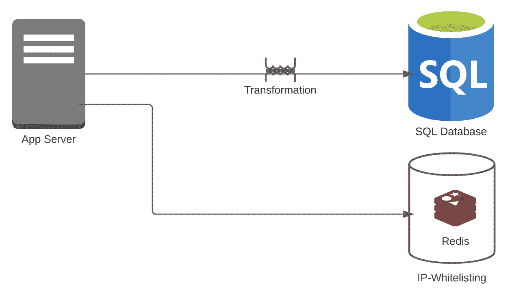](https://cdn.thenewstack.io/media/2021/07/85464842-image16.png)

1.  转换开销= 1
    1.  对于 IP 白名单，不需要做任何改造。但是，您需要将事件流转换成表。
2.  管道开销= 2
    1.  你有 Redis + RDBMS。
3.  特征数量= 2

**所以，IMS 就是 [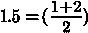](https://cdn.thenewstack.io/media/2021/07/e7582250-image5.png)** 

案例二:假设你用的是 Redis + Kafka + RDBMS。

[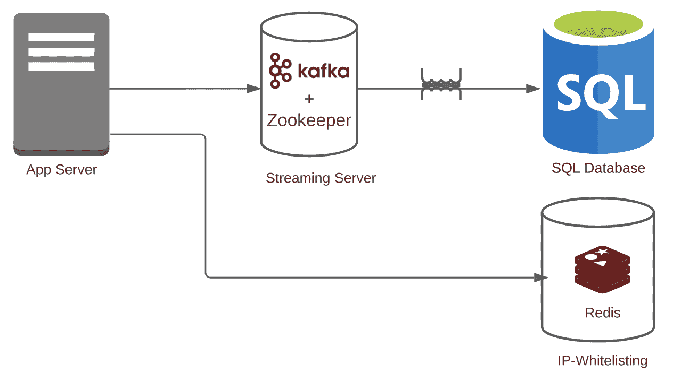](https://cdn.thenewstack.io/media/2021/07/06bb6758-image10.png)

1.  转换开销= 1
    1.  对于 IP 白名单，不需要做任何改造。此外，卡夫卡可以轻松处理流。
2.  管道开销= 3
    1.  你有 Redis + Kafka + RDBMS。注意:我们忽略了卡夫卡也需要动物园管理员。如果加上这个，数字会进一步下降。
3.  特征数量= 2

**所以，IMS 就是 [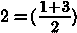](https://cdn.thenewstack.io/media/2021/07/0407f06c-image6.png)** 

案例三:说你用的是 Redis + Kafka + KsqlDB。

1.  转换开销= 0
    1.  对于 IP 白名单，不需要做任何改造。此外，Kafka 和 KsqlDB 可以轻松处理流。
2.  管道开销= 2
    1.  你有 Redis + (Kafka + KsqlDB)。注意:在这种情况下，我们认为 Kafka + KsqlDB 是同一个系统的一部分。
3.  特征数量= 2

[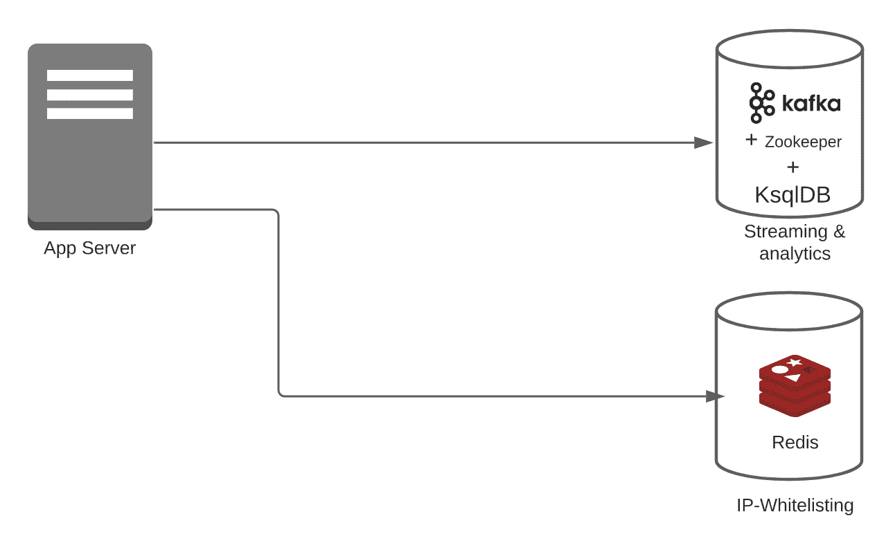](https://cdn.thenewstack.io/media/2021/07/e864e635-image12.png)

**所以，IMS 就是 [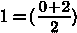](https://cdn.thenewstack.io/media/2021/07/6a451587-image7.png)** 

案例 4:假设你用的是 Redis+Redis Streams+Redis timeseries。

[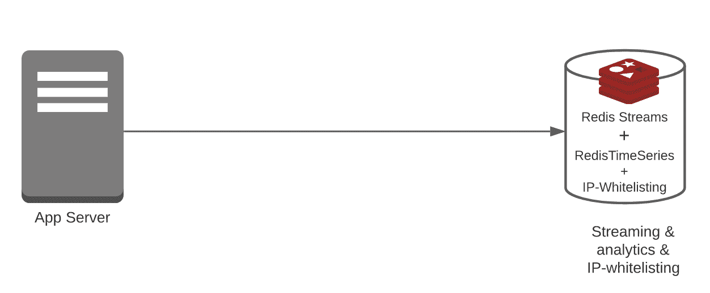](https://cdn.thenewstack.io/media/2021/07/4b962fc8-image9.png)

1.  转换开销= 0
    1.  对于 IP 白名单，您不需要任何转换。此外，Redis 流和 RedisTimeseries 可以轻松处理流和警报。
2.  管道开销= 1
    1.  你有 Redis + Redis 流+ Redis 时间序列。注意:在这种情况下，三者都是同一个系统的一部分。
3.  特征数量= 2

**所以，IMS 就是 [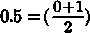](https://cdn.thenewstack.io/media/2021/07/eed1afbf-image8.png)** 

### 第二阶段后的结论:

当我们添加一个额外的功能时，

*   案例 1 在阶段 1 是 2，下降到 1.5。
*   案例 2 在阶段 1 是 3，下降到 2。
*   案例 3 在阶段 1 中处于 1，并且保持在 1。
*   案例 4 在阶段 1 中为 1，下降到 0.5(最佳)

因此，在我们的例子中，案例 4 的 IMS 得分最低，为 1 分，实际上随着我们添加新功能而变得更好，最终得分为 0.5 分。

请注意:如果您添加更多或不同的功能，情况 4 可能不会保持最简单。但这是 IMS 乐谱的想法。简单地列出所有特性，比较不同的架构，看看哪一个最适合您的使用案例。

为了使它更容易使用，我们为您提供了一个计算器，您可以在一个简单的电子表格中实现它来计算 IMS 分数。

## IMS 计算器:

以下是您使用它的方法:

1.  对于每个数据层或数据管道，只需列出:
    1.  您目前拥有的功能。
    2.  路线图中的特性。这很重要，因为您希望确保您的数据层能够继续支持即将推出的功能，而不会产生任何额外的开销。
2.  然后，映射每个特性的转换开销和管道开销。
3.  最后，用所有开销的总和除以特性的数量。
4.  对不同系统的管道重复步骤 2 和 3，进行比较和对比。

**数据管道 1**

**数据管道 2**

## 摘要

很容易忘乎所以，不考虑后果就构建复杂的数据层。IMS 分数是为了帮助你意识到你的决定。

您可以使用 IMS 分数来轻松地比较和对比您的用例的多个系统，并查看哪个系统真正最适合您的功能集。您还可以验证您的系统是否能够支持功能扩展并尽可能保持简单。

永远记住:

*“简单是最复杂的。”* —达芬奇

大多数信息都是不相关的，大多数努力都被浪费了，但是只有专家知道该忽略什么。“——詹姆斯清楚，原子习惯

<svg xmlns:xlink="http://www.w3.org/1999/xlink" viewBox="0 0 68 31" version="1.1"><title>Group</title> <desc>Created with Sketch.</desc></svg>